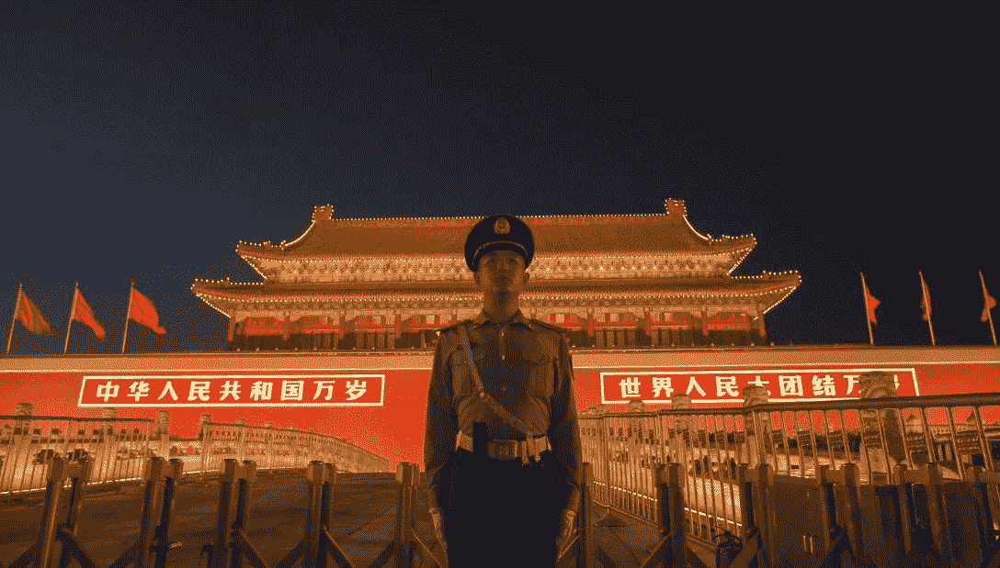
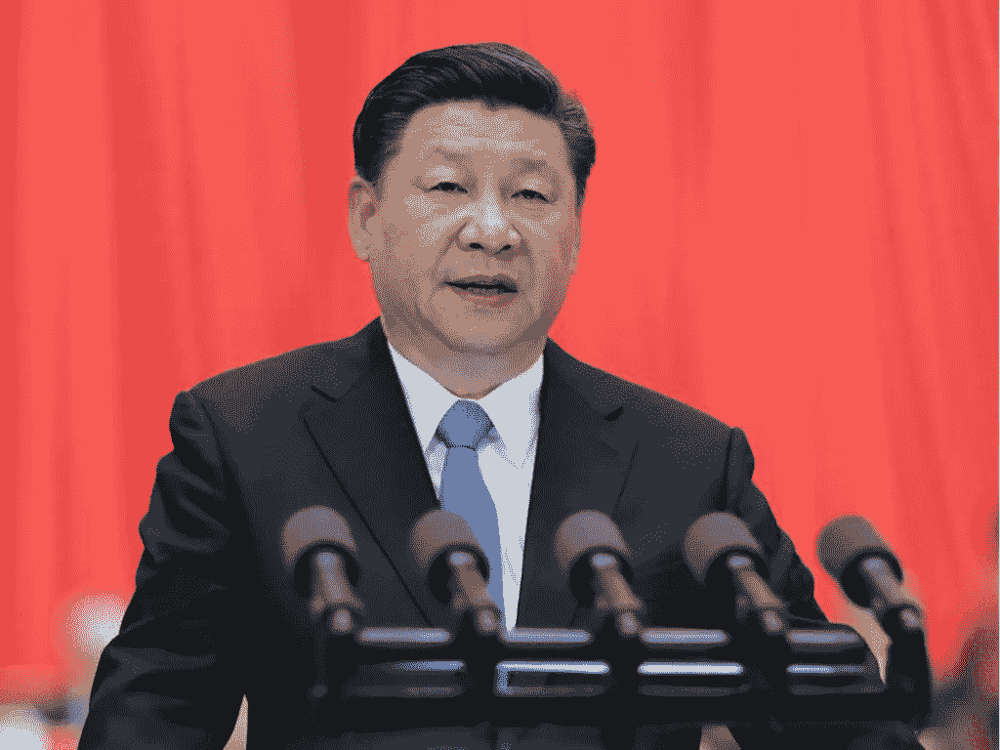
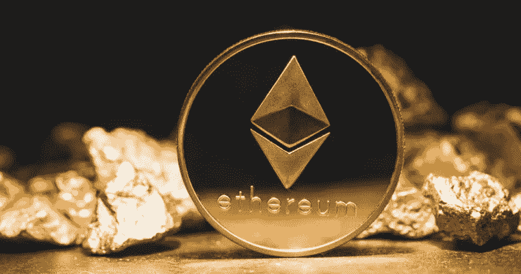

# 中国对密码的爱恨情仇

> 原文：<https://medium.com/coinmonks/chinas-love-hate-relationship-with-crypto-37356f81ff19?source=collection_archive---------1----------------------->

如果你还没有从我的个人资料照片中意识到，我是中国人，汉族人，我的祖先来自珠江三角洲这个伟大的经济引擎。但我出生在中国的南方，准确地说是新加坡，我的祖先会称之为“南光”或“南洋”。我也在南部长大，佛罗里达州的代托纳海滩。准确地说，我的童年有一半在美国度过，另一半在新加坡度过。在远离祖国的地方生活了这么多年，让我对作为一个中国人是什么感觉有了一个独特的视角，更重要的是，对与中国人做生意意味着什么有了一个独特的视角。但我所有的“中国性”从来没有预测到中国法院最近承认以太坊为“财产”的决定。

中国搜索引擎巨头百度(相当于中国的谷歌)最近报道了当地媒体的一则新闻,一家法院承认对一家中国“科技公司”的 20 ETH 投资可以被认定为财产。2017 年 8 月，这笔投资被中国法院视为财产，据推测是对一个 ICO(首次发行硬币)的投资。这笔投资可能是在去年年底中国全面禁止 ico 和加密货币交易所之前启动的。

Your Bitcoin no welcome here. But maybe Ethereum?

位于中国商业之都上海海口区的法院裁定以太坊应作为一般财产受到法律保护。尽管法院承认中国不承认以太坊本身是“货币”，但它仍需要作为“财产”受到普通法的保护。在没有提供例子的情况下，法院大概是在暗示以太坊是一种“不动产”，就像商品一样。但在我们开始将以太坊的小幅提价(撰写本文时为 233.47 美元，上涨约 4.81%)归因于这一决定之前，让我们在走出去开始兑现以太坊包之前，尝试理解中国政府的心态。

**1。我们以前来过这里**

我们不要忘记，不久前，中国当局宣布以太坊是世界上最好的区块链。尽管以太坊形成了 ico 的事实上的加密选择，但这种响亮的支持并没有导致以太坊交易量的显著上升。

然而，当时许多专家认为中国对以太坊的认可是中国取消 ICO 禁令的前兆——这是一厢情愿的缩影。

Chinese President Xi Jinping has been big on blockchain, but bad on Bitcoin.

对任何不熟悉中国或中国历史的人来说，可能很难理解立法措施背后的动机。中国和中国文化有一个威权主义的遗产。也许是我们对长辈或儒家思想的恭敬态度。虽然许多西方人可能会认为这是不民主的，但现实要微妙得多。民主，至少对几十亿中国人来说，取决于你对它的理解。对于数百万脱离贫困的中国人来说，民主就是享受美食、住好房子的自由，而这些在发达的西方国家可能是理所当然的。民主可能是知道犯罪率低，罢工不常见，恐怖主义远离的自由。

在这种背景下，比特币是这种中国政治方式的诅咒，但以太坊或许不是。与比特币不同，以太坊的核心开发者和创始人都是众所周知、广为人知的。他们表现出了与中国当局接触和合作的意愿(只要数一数以太坊联合创始人维塔利克·布特林在中国出现的次数，以及 Twitter 的杰克·多西在中国出现的次数，你就会有所感觉)，中国最终对这种接触给予了回报。北京一直珍视忠诚而非意识形态，为此，比特币背后的赛博朋克运动的无政府主义精神将永远与北京的利益相冲突。不那么以太坊。

**2。那我们该怎么办？**

我们不要忘记，不久前，私有财产在中国是非法的。毛泽东主席的文化大革命的主旨和挡箭牌是剥夺富裕地主和资产阶级成员的财产所有权，并将其重新分配给人民。随着最近的法院裁决(尽管是在地方一级)，中国向前迈出了大胆的一步。承认以太坊为“财产”也许在很多方面比承认[区块链以太坊为世界上最好的](https://www.scmp.com/business/money/article/2146637/ethereum-best-blockchain-project-ahead-bitcoin-according-ratings)更有意义。因为这表明北京可能愿意保护以太坊的合法地位，而有理由相信北京对比特币的态度可能不那么乐观。

Not quite as good as gold, but getting there.

以太坊是超过 90%的 ico(在中国是被禁止的)选择的协议，但却得到了北京的默许，这也应该是一个例证。在中国，没说的话有时比说的话更有说服力。

总而言之，海口法院承认以太币是值得保护的财产，这一点不能孤立地看待，还要考虑到中国对以太币的总体态度，但不一定是对加密货币的总体态度。核心问题是控制和参与。正如我们所看到的，随着谷歌在中国的重新崛起(尽管北京方面有一些限制)，北京方面已经表现出愿意允许进入其庞大的市场，努力参与和了解中国的独特性质——为此，以太坊(除了中国创造的加密货币如 NEO)比其他任何加密技术都走得更远。但我不会在短期内把农场押在这上面。

> [在您的收件箱中直接获得最佳软件交易](https://coincodecap.com/?utm_source=coinmonks)

