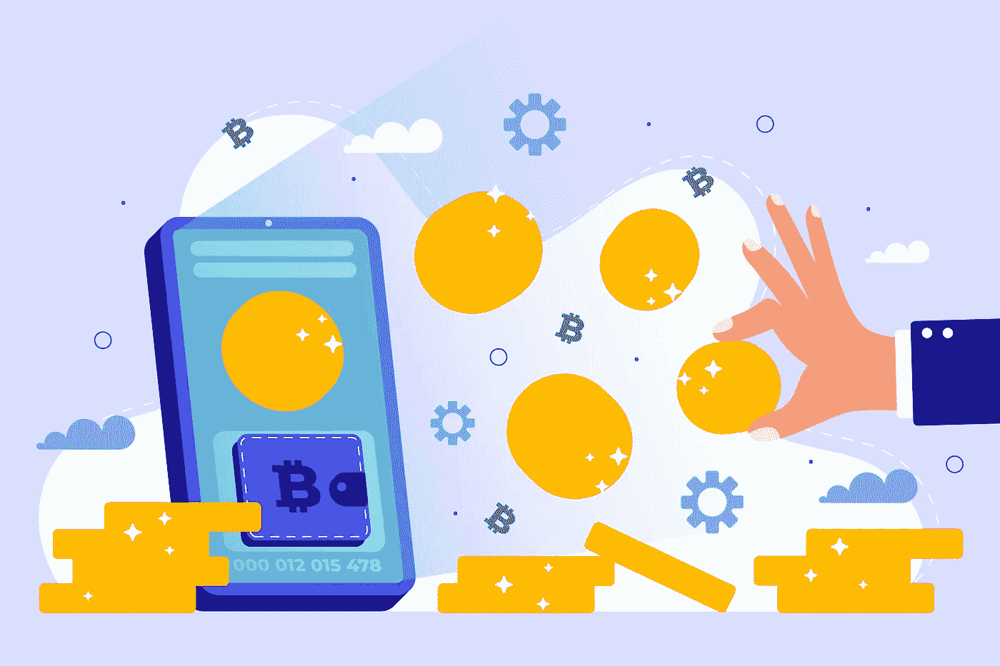

# 选择安全 Defi 钱包

> 原文：<https://medium.com/coinmonks/choose-secure-defi-wallet-a0d1f4ea6174?source=collection_archive---------12----------------------->

Choose Secure Defi Wallet

分散金融(DeFi)被吹捧为加密市场中一种新的中介形式。这个生态系统的关键因素是区块链上新颖的自动协议——以帮助交易、借贷、投资和加密钱包——以及便于资金转移的稳定账户。DeFi 中存在一种权力分散的错觉，认为对治理的渴望使得某种程度的集权化不可避免，而设备的结构元素导致了对权力的认识。

# 什么是 DeFi？

DeFi 是指[去中心化金融](https://cryptoworldfinace.blogspot.com/2021/12/liquidity-pools-in-defi-explained.html)，涵盖了摆脱经济中介的总体思路，并在为[区块链科技](https://cryptoworldfinace.blogspot.com/2021/11/what-is-blockchain-technology.html)提供更大规模的使用实例中收费。

DeFi 是分散金融的简要形式，是一系列商品和简化产品的支配性时期，通过消除所有中介来扰乱经济企业。区块链唤起了这样一种观念，即确保所有交易都保存在分配的分类账的复制品中，保证没有任何人操纵信息。

也许 DeFi 思想快速增长的关键原因是它用于电荷转移以延长到额外复杂的情况。一些最受认可的使用实例包括 stablecoins、开放式借贷平台、产量农业、赌注和分散交易所。对于用户来说，这些目的可以比普通银行提供更多的娱乐费用，并减少贷款的限制。

# 在定义中开始

访问分散的金融商品和产品始于网关，更多时候被认为是 DeFi 钱包。为了帮助顾客获得这些功能，DeFi 钱包是关键。虽然传统上，这些钱包使用起来很复杂，操作起来也很缓慢，但现在它们变得非常简洁，新客户操作起来比以往任何时候都更容易。作为 DeFi 的核心，钱包允许客户进入新的货币商品，作为通往 Web 3.0 的加密货币网关，从而赋予用户资产的自由、透明和所有权。

> 阅读:[区块链技术将革命供应链](https://cryptoworldfinace.blogspot.com/2021/12/blockchain-technology-will-revolution.html)
> 
> [如何开发加密货币钱包](https://cryptoworldfinace.blogspot.com/2021/11/how-to-development-cryptocurrency-wallet.html)
> 
> [defi 中的流动性池解释](https://cryptoworldfinace.blogspot.com/2021/12/liquidity-pools-in-defi-explained.html)

# 什么是 DeFi 钱包？

DeFi 钱包是一种解决方案，让顾客完全掌控自己的财产，是当今最安全的储物策略之一。作为对这一点的承认，DeFi 钱包为顾客提供了一个答案，让能量完全在主人的怀里。这与普通银行形成鲜明对比，普通银行保留对其持有的所有用户财产的管理，并要求消费者验证和不同的相关事实来做到这一点。

DeFi 钱包让 1/3 的人不再需要派对，这种想法也彻底改变了经济产业。看看 DeFi [钱包](https://cryptoworldfinace.blogspot.com/2021/11/how-to-development-cryptocurrency-wallet.html)一般来说，大多数功能与以太坊(ETH)区块链兼容的网络三钱包，尽管这也可能有所不同。

这些钱包的其他相似之处包括它们与 DeFi 功能的兼容性，以及它们作为基于密钥的答案的作用，这要求客户对其非公开密钥的保管负责。DeFi 钱包还具有非托管背景，确保只有钱包所有者有权进入资金。由于这些原因，DeFi 钱包是市场上最安全的选择之一。然而，他们的安全将成为用户的产品，如果他们丢失了他们的登录信息，他们也会发现自己运气不好。

# 考虑 DeFi 钱包中的客户

挑选合适的 DeFi 钱包归结为决定一个答案，有助于适当的财产和商品，同时为用户提供一个最低限度的安全，简单，教育和方便。

各种各样的 DeFi 钱包继续增加，这使得客户更难决定哪一个最适合他们。因此，对顾客来说，在做出选择之前谨慎地权衡他们的选择变得至关重要。其中最重要的问题是钱包支持的物品，因为自然，现在不是每个钱包都有助于消费者寻找持有的资产。

次要考虑归结为对安全性的认识。公司是否采取必要的措施来确保用户的安全？此外，顾客会选择考虑他们希望进入的商品种类；如前所述，虽然一些选项提供了打桩和产量耕作的可及性，但其他选项也可能没有。在回答了这些初步的问题后，应该考虑可用性的问题了。

DeFi 市场的现状是，客户仍然缺乏对行业的了解，如何开始，额外复杂的细节，以及如何使用多资产 LP 令牌，在分散交易(DEX)上操纵交易或导航新的选项和技术。

由于这个原因，新客户将主要希望考虑简单性的查询，即，通过钱包公司建立的系统是否被简化以帮助担心使用这些解决方案的时间、强度和价值的客户。最后，问题归结到舒适性和方便性，客户可以获得进入他们想要成功的重要设备的权利。

# 哪些钱包真的值得考虑？

SafePal 钱包旨在通过整合的仪表板和跨链交换点数来帮助客户在不同的收入机会中下注，从而简化操作。

SafePal 为客户提供了一个答案，它是一个完全非托管的分散式加密资产管理平台。答案包括一个软件程序和硬件钱包，为每个客户提供真实和方便的服务，重点是那些不愿意参加 DeFi 的客户。

SafePal wallet 设计有一个简化的仪表板，可将客户发布到一组 DeFi 池，除非在下注之前必须通过大量 DApps 进行导航。除了赌注之外，SafePal Earn 还提供了该平台的自动复利功能，这将为客户提供额外的零售商现金概率，并从他们所有的加密货币资产中获得被动收益。

有了 [SafePal wallet](https://safepal.io/) ，客户将不再使用集中交易选项或经历广泛的集中账户注册过程。相反，客户可以利用 SafePal 跨链交换功能，使某些基本属性可以毫无问题地进行交换。此外，LP 生成器内置于 SafePal wallet 中，将为最佳池生成重要的令牌。目前，该集团在过去一年取得了无数成就，包括在币安 Launchpad 上推出令牌，以及实现 range one 令牌化硬件钱包功能的答案，每月活跃用户超过 200 万。[阅读更多](https://cryptoworldfinace.blogspot.com/2021/12/choose-secure-defi-wallet.html)。

> 加入 Coinmonks [电报频道](https://t.me/coincodecap)和 [Youtube 频道](https://www.youtube.com/c/coinmonks/videos)了解加密交易和投资

## 另外，阅读

*   [我的加密副本交易经历](/coinmonks/my-experience-with-crypto-copy-trading-d6feb2ce3ac5) | [比特币基地评论](/coinmonks/coinbase-review-6ef4e0f56064)
*   [CoinFLEX 评论](https://blog.coincodecap.com/coinflex-review) | [AEX 交易所评论](https://blog.coincodecap.com/aex-exchange-review) | [UPbit 评论](https://blog.coincodecap.com/upbit-review)
*   [AscendEx 保证金交易](https://blog.coincodecap.com/ascendex-margin-trading) | [Bitfinex 赌注](https://blog.coincodecap.com/bitfinex-staking) | [bitFlyer 审核](https://blog.coincodecap.com/bitflyer-review)
*   [麻雀交换评论](https://blog.coincodecap.com/sparrow-exchange-review) | [纳什交换评论](https://blog.coincodecap.com/nash-exchange-review)
*   [支持卡审核](https://blog.coincodecap.com/uphold-card-review) | [信任钱包 vs MetaMask](https://blog.coincodecap.com/trust-wallet-vs-metamask)
*   [Exness 回顾](https://blog.coincodecap.com/exness-review)|[moon xbt Vs bit get Vs Bingbon](https://blog.coincodecap.com/bingbon-vs-bitget-vs-moonxbt)
*   [如何开始用加密贷款赚取被动收入](https://blog.coincodecap.com/passive-income-crypto-lending)
*   [加密货币储蓄账户](/coinmonks/cryptocurrency-savings-accounts-be3bc0feffbf) | [加密交易机器人](https://blog.coincodecap.com/best-crypto-trading-bots)
*   [BigONE 交易所评论](/coinmonks/bigone-exchange-review-64705d85a1d4) | [CEX。IO 审查](https://blog.coincodecap.com/cex-io-review) | [交换区审查](/coinmonks/swapzone-review-crypto-exchange-data-aggregator-e0ad78e55ed7)
*   [最佳比特币保证金交易](/coinmonks/bitcoin-margin-trading-exchange-bcbfcbf7b8e3) | [比特币保证金交易](https://blog.coincodecap.com/bityard-margin-trading)