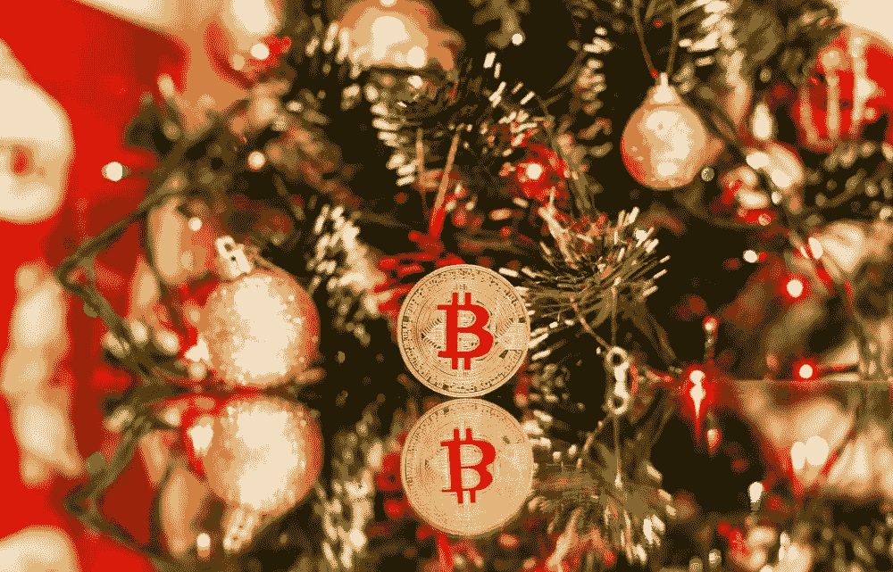
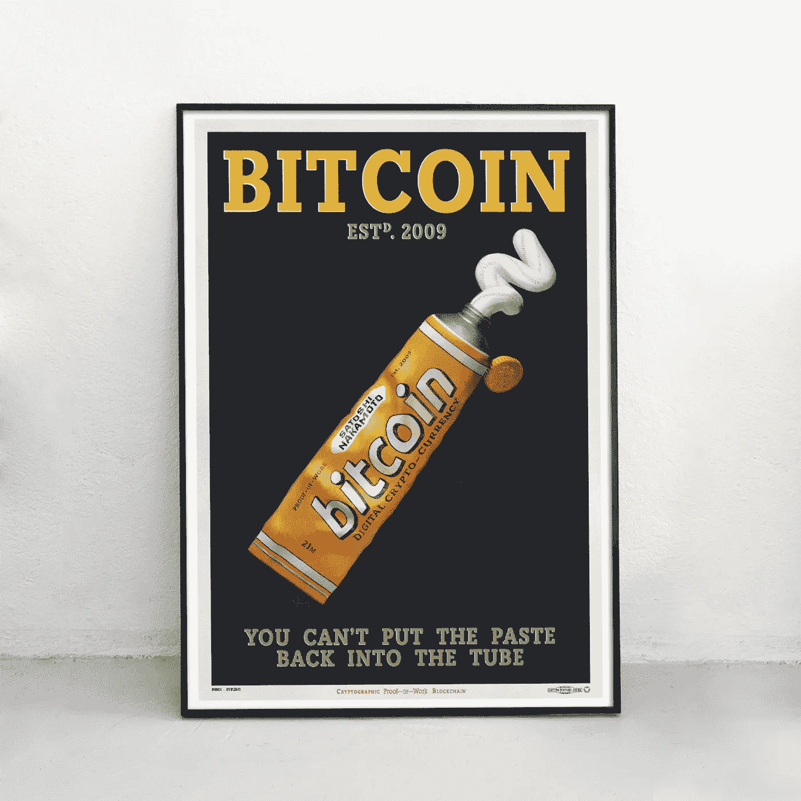
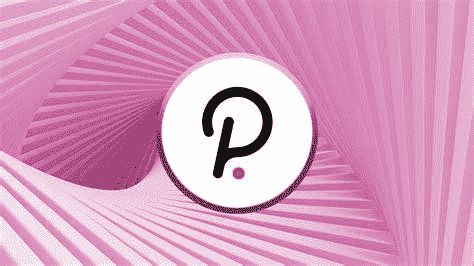

# 圣诞节加密对话|加密市场更新 12.17

> 原文：<https://medium.com/coinmonks/christmas-crypto-conversations-crypto-market-update-12-17-2e5ccad0125a?source=collection_archive---------15----------------------->

## '圣诞对话|市场更新|新闻|新手':加密缩写

# 概观

*   圣诞节加密对话
*   市场更新
*   主要秘密新闻
*   新手每日一课:密码缩写

# 圣诞加密对话

这是隐密体中相对平静的一天。价格动作缓慢，成交量较低。似乎事情在假期变得缓慢，这是每年这个时候的典型现象。人们离开去拜访家人，工作也普遍减少了。贸易商和企业也开始将今年的利润用于纳税或炫耀收益。

这是未来一两周内 crypto 可能发生的最好的事情，它与价格或采用无关。我昨天讨论了价格概率。所有回家过圣诞节的人、举行聚会的高管和所有的朋友聚会，都需要一些有趣的新话题来讨论。我认为今年将会是比特币、加密和像 NFTs 这样的热门话题。

不管是不是在好的方面谈论，重要的是谈话正在进行。下次这位高管在关注美国消费者新闻与商业频道时，比特币价格显示当天上涨了+6%，他会注意到的。一旦母亲听到她的孩子和朋友谈论 NFTs，她就会注意到。当所有的球迷进入前斯台普斯中心，即将成为 Crypto.com 中心，他们会注意到。

人类非常擅长社交。这些关于加密的想法将在主流中迅速传播，一旦新闻网络意识到社交媒体上最热门的话题都与加密有关，他们就会迎合他们的客户。我对假期的希望是，圣诞节的那些小型晚餐讨论提供燃料，帮助推动 crypto 进入充满希望的 2022 年。

# 市场更新

**比特币(BTC)** 下跌 **-1.49%** 并盘整。46.5 千美元显示出支撑的迹象。BTC 将很快接触下降趋势线，然后它将不得不选择突破或继续走低。

Terra (LUNA) 上涨 **3.27%** 继续稳步上行。

在周一推出以太坊桥(Ethereum bridge)之前，和谐一号(Harmony One)股价上涨了 6.32%。所以在接下来的几周里，请密切关注其中一个。

尽管 Parachain 即将推出，Polkadot (DOT) 继续下跌**-4.38%**。

显著的收益者

*   **渴望+33%**
*   **AVAX +10.5%**
*   EWT +6%
*   **CTX +46%**

市场的其余部分是一个相对混杂的大杂烩。

> 比特币恐惧和贪婪指数 23 极度恐惧
> 
> 谷歌趋势 35
> 
> 最大疼痛(12 月 30 日选项)48k

[*如何利用恐惧和贪婪指数进行投资*](/@TraderGabi/when-can-we-start-buying-again-c3ffc2a1cd3b)

# 主要加密新闻 12.17

*   [社交网络 Reddit 宣布将上市，并申请估值 150 亿美元的首次公开募股。](https://www.forbes.com/advisor/investing/reddit-ipo/)此外，Reddit 计划将加密货币纳入其 Karma 投票系统，并已在三个子网站上进行测试。

*   SEC 已经将另外两个比特币现货 ETF 提案推迟了 45 天。这将是美国证交会否决的第三项现货 ETF 提案。然而，来自加密实体和政府官员的压力越来越大，要求允许这种类型的 ETF 进入市场。
*   [金融稳定监督委员会(FSOC)已意识到其年度报告指出，稳定的信贷和赤字对美国金融体系构成越来越大的风险。如果对稳定硬币的管制开始减少，预计分散的稳定硬币需求将会上升。](https://www.coindesk.com/policy/2021/12/17/financial-stability-group-warns-of-stablecoin-defi-risks-in-annual-report/)[这里有一篇关于如何利用这一趋势的往期报道](/@TraderGabi/crypto-market-update-and-trading-digest-11-9-27940a93d95c)(Terra 下)。
*   [见证了萨尔瓦多的成功后，Tron 的创始人 Justin Sun 将离开令牌持有者手中的区块链，专注于拉丁美洲国家的加密合法化](https://www.coindesk.com/business/2021/12/17/justin-sun-is-retiring-from-tron-but-not-crypto/)。
*   [迈克尔·乔丹和他的儿子计划开发一款运动员 NFT 应用程序。](https://thecryptobasic.com/2021/12/17/solana-confirms-michael-jordan-is-launching-app-for-athletes-built-on-solana/)

# 值得注意的事件

Verox (VRX) 将于周一发布 Andriod 应用

和谐一号(ONE) 将于周一推出无信任以太坊桥。这对于第 1 层智能合约平台来说是一个巨大的消息。一个在近期有许多升级计划。

# 新手的每日一课

**流行的加密缩写**

像任何其他社区一样，crypto 也有特定的术语。创建它不是为了让人们感到被忽视，而是为了加强社区联系。我已经在我的时事通讯中提到了一些流行词汇，所以现在是时候向新来者介绍它们的一些含义了。

**HODL**——不是为了守住，而是为了 HODL。意思是不要卖你的密码，但无论如何要卖给 hodl。有传言称，这个词是 2013 年比特币的一名早期开发者在发消息时喝醉了创造的。

**DYOR**——自己做研究。这在时事通讯中用过几次，非常重要。不要完全信任我的时事通讯或 Youtube 的影响者，DYOR。

**FUD**——恐惧、不确定和怀疑。我们都知道新闻从恐惧中获利。如果你养成了紧跟新闻的习惯(我懂了！)你开始看到 FUD 的模式，然后兴高采烈。不要买 FUD 的股票。FUD 并不意味着新闻是不准确的，FUD 只是强调了什么是创造来激起情绪。

FOMO——害怕错过。你所有的朋友都去海滩了，但你必须工作，FOMO！你所有的同事都买柴犬，你害怕不能和他们一起致富，FOMO！FOMO 在这里提醒我们，FOMO 是一种强烈的情感。

**DEFI** —分散金融是任何提供金融服务的分散加密项目。交换、借贷、农场、甚至稳定的货币都是赤字的形式。还有很多。

**DEX** —去中心化交易所。不扶植第三方做中间人的点对点交换。**unis WAP(UNI)**2020 年第一家，现在有一百多家。

**REKT** —失事的简称。得到 REKT 意味着失去大量资金。如果你做的不好，你可以得到 REKT。

你能想到更流行的缩写或术语吗？

*如果您喜欢这份简讯，并认为它值 20 satoshis(0.01 美分)，请按下面的按钮。(最多 50 次！) *

希望每个人都喜欢这份简讯。在外面注意安全！

# 加比

*关注我的* [*推特*](https://twitter.com/TraderGabi) *和* [*中的*](/@TraderGabi) *或者订阅本刊的* [*子栈*](https://tradergabi.substack.com/)

*为了从这份简讯中获益，建议每天阅读，以跟上加密市场的步伐。它将把读者放在消息灵通的 2%的市场参与者中。读者将开始看到对大多数人来说不明显的机会，并将打开更多的机会。时事通讯由许多小时的每日图表研究、链上指标、新闻和发展叙述组成，浓缩为 5 分钟的更新。这是我对一个对我贡献良多的密码社区的贡献。*

> 加入 Coinmonks [电报频道](https://t.me/coincodecap)和 [Youtube 频道](https://www.youtube.com/c/coinmonks/videos)了解加密交易和投资

## 也阅读

 [## 杠杆代币[多头代币]终极指南

### 杠杆化令牌是具有杠杆化风险敞口的 ERC20 令牌，不考虑保证金、要求、管理…

medium.com](/coinmonks/leveraged-token-3f5257808b22)  [## 最佳加密交易所| 2021 年十大加密货币交易所

### 加密货币交易所的加密交易需要了解市场，这可以帮助你获得利润。之前…

blog.coincodecap.com](https://blog.coincodecap.com/crypto-exchange)  [## 2021 年最佳加密交换平台| CoinCodeCap

### 如果我们看看今天的场景，许多加密货币交换平台提供了广泛的功能和深度…

blog.coincodecap.com](https://blog.coincodecap.com/best-swap-platforms)  [## 2021 年最佳加密借贷平台| 6 大比特币借贷平台

### 获得比特币和其他加密货币的最佳贷款利率

medium.com](/coinmonks/top-5-crypto-lending-platforms-in-2020-that-you-need-to-know-a1b675cec3fa)  [## 2021 年 6 大最佳硬件钱包|顶级加密硬件钱包[更新]

### 最好的加密货币硬件钱包是绝对必要的。我们将在 NGRAVE、Ledger Nano X 和…

medium.com](/coinmonks/the-best-cryptocurrency-hardware-wallets-of-2020-e28b1c124069)  [## 2021 年最佳免费加密交易机器人

### 2021 年币安、比特币基地、库币和其他密码交易所的最佳密码交易机器人。四进制，位间隙…

medium.com](/coinmonks/crypto-trading-bot-c2ffce8acb2a)  [## 加密税务软件——五大最佳比特币税务计算器[2021]

### 不管你是刚接触加密还是已经在这个领域呆了一段时间，你都需要交税。

medium.com](/coinmonks/best-crypto-tax-tool-for-my-money-72d4b430816b)  [## Pionex 评论 2021 |免费加密交易机器人和交换

### Pionex 是为交易自动化提供工具的后起之秀。Pionex 上提供了 9 个加密交易机器人…

medium.com](/coinmonks/pionex-review-exchange-with-crypto-trading-bot-1e459d0191ea)  [## 仙境提供了 83，412%的 APY 赌注:仙境是一个骗局吗？CoinCodeCap

### 仙境是雪崩网络的第一个基于时间令牌的分散储备货币协议。一篮子…

blog.coincodecap.com](https://blog.coincodecap.com/wonderland-offers-an-83412-apy-on-staking-is-wonderland-a-scam)