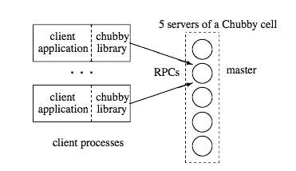
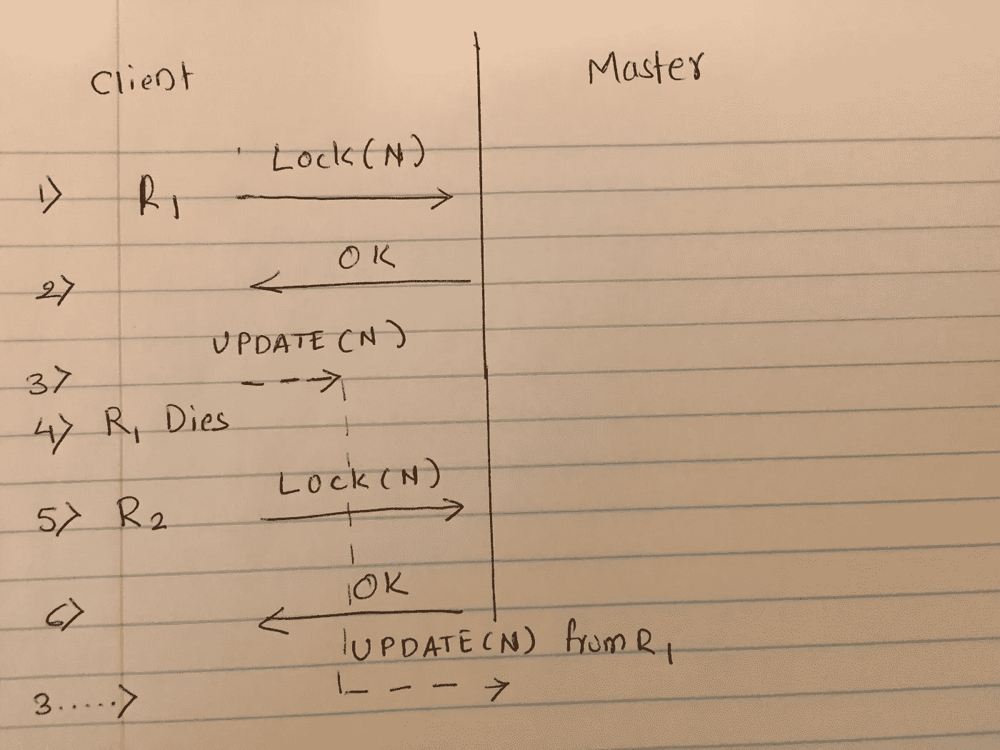

# Chubby:用于分布式协调的锁服务

> 原文：<https://medium.com/coinmonks/chubby-a-centralized-lock-service-for-distributed-applications-390571273052?source=collection_archive---------0----------------------->

## 介绍

在本帖中，我们将介绍谷歌的[小胖锁服务](https://static.googleusercontent.com/media/research.google.com/en//archive/chubby-osdi06.pdf)。本文介绍了一个锁服务，它可以帮助使用锁语义的分布式环境中的协调。Chubby 在 Google 内部被广泛用于各种系统，如 GFS、BigTable。主要目标是提供可靠的锁服务。Chubby 没有针对高性能、频繁锁定的场景进行优化。有成千上万的客户端使用 Chubby，但他们偶尔会使用 Chubby——用于粗粒度锁定。通常，这种粗粒度的锁会被保持几个小时或几天，而不是几秒钟。Chubby 在多个应用程序中的一个典型应用是选举一个主设备——第一个获得锁的设备获胜并成为主设备。

## Paxos 还是锁服务？

如果我们扩展上一节提到的例子，这个特定的问题实际上是一个在分布式系统中建立共识的问题。因此，人们可以通过使用 paxos 来解决这个问题，而不是建立一个集中的锁服务。为了让 paxos 工作，可以构建一个库，所有应用程序都将使用该库来加入共识。以下几点很好地解释了为什么谷歌生态系统选择了锁定服务。

1.  **开发者友好**:一般来说，开发人员在代码中添加锁定语义比基于共识的机制要容易得多。特别是，很多应用程序一开始并不庞大，随着它们变得越来越大，它们会添加代码来建立协调。大多数开发人员也更熟悉锁定语义。
2.  **带数据的事件通知**:在大多数情况下，应用程序需要访问这种分布式环境中的少量数据——这意味着需要以一致的方式写入和读取数据。这非常适合锁定机制。
3.  **应用程序进度**:在类似 paxos 的设置中，您需要启动大多数应用程序才能取得进展。在集中式锁服务模式中，即使只有一个客户机启动，只要它从 Chubby 正确访问锁，它就可以取得进展。

## 设计决策

以下主要设计决策来自上一节提到的主题。

1.  粗粒度锁定—应用程序不需要持续时间更短的锁定。例如，选举主人不是一件经常发生的事情。
2.  除了锁服务之外的小数据存储(小文件操作)能力
3.  允许成千上万的客户观察变化。因此，锁服务需要扩展以处理许多客户端，尽管事务率可能没有那么高。
4.  一种通知机制，通过这种机制，客户端可以知道共享文件中何时发生了更改，例如主文件发生了更改
5.  支持客户端缓存来处理可能想要主动轮询的客户端
6.  强大的缓存保证简化开发人员的使用

## 系统结构

Each client application uses chubby client side library for distributed coordination. Chubby master is elected as a leader among 5 replicas using a consensus protocol like paxos.

系统中有两个主要组件，chubby master 和 chubby client library。每个应用程序都对与 chubby 客户端库的分布式协调链接感兴趣。然后，客户端库代表客户端应用程序执行锁定协议。

主节点:胖胖的主节点由多个副本组成，其中一个副本使用分布式共识协议(如 paxos)被选为主节点。所有副本还会授予主服务器一个租约，在此期间它们不会选举新的主服务器。

一旦选择了主服务器，它就负责将它需要的任何持久状态写入数据库，然后在其他副本服务器上复制这些状态。在向客户端发回确认之前，写入操作需要进行大部分复制。只要租约还没有到期，主设备就可以向客户端提供读取服务，这表明周围没有其他主设备。

如果主节点失败，则再次运行共识协议来选举新的主节点。

**客户端**:一个胖胖的单元为数千个客户端提供服务，因此这些客户端连接到一个主机来满足所有的协调需求。客户端使用 DNS 来查找主服务器。副本通过将客户端重定向到当前主服务器来响应客户端发出的 DNS 查询。一旦客户端找到主服务器，所有请求都会发送到该主服务器。客户端代表应用程序运行锁定协议，并向应用程序通知某些事件，如发生了主服务器故障转移。

## 基于文件接口

Chubby 像 API 一样导出 UNIX 文件系统。文件和目录被称为节点。系统中不允许有链接。节点可以是永久的，也可以是短暂的。短暂节点消失，因为没有使用该节点的客户端消失。文件可以以指示排他性的读/写模式打开。客户端获得给定节点的句柄。每个节点还会分配以下元数据:

1.  实例编号—对于相同的名称，总是增加
2.  内容生成编号—在内容被覆盖时增加
3.  锁生成号—当锁从自由状态转换为持有状态时增加
4.  与传统文件系统一样，节点上也有用于控制访问的 ACL，ACL 数量会随着 ACL 的变化而增加。

还有其他带有客户端使用的句柄的元数据。这主要与新主机看到由以前的主机生成的句柄的情况有关。

## 锁、锁延迟和序列器

客户端可以以写(独占)或读(共享)模式创建节点/文件。所有的锁都是建议性的，即参与实体需要遵循锁协议来访问分布式临界区。锁定文件并不能阻止对文件的自由访问。

分布式系统中锁的问题之一是持有锁的应用程序可能会死亡。想想下面的例子，R1 最终以不一致的方式访问数据。在最后一步(第 6 步之后)，来自 R1 的更新会落到主服务器上，并会破坏数据。R1 当时没有有效的锁，因为它在步骤 4 中死亡，同时，主人将 N 的锁授予了客户 R2。

Update from step 3 B=by R1 arrives at master somewhat late. By that time master has already granted the lock on N to another client R2.

处理这种情况的方法之一是使用锁定延迟。当持有锁的应用程序在不释放锁的情况下死亡时，在一段可配置的时间内，没有其他人获得现已失效的应用程序持有的锁。这就形成了一个简单而有效(但并不完美)的解决方案，客户端可以指定故障应用程序可以持有锁的阈值。

查比提供的另一个可能的解决方案是基于序列器的检查。当客户端获得锁时，它可以向胖主人请求序列器。这是一个字符串，由锁名、锁生成号(每次从自由转换到保持时都会改变)和获取模式组成。该字符串可以传递给需要受保护事务锁的模块。这些模块可以使用定序器来检查锁的有效性，方法是对照胖主人进行检查，或者使用模块的胖缓存。

## 使用事件检测变化

Chubby 还允许发布和订阅机制的一些小方面。chubby 中的文件还允许存储少量数据，这比仅仅指示锁是否被占用更有效。正如我们之前讨论过的，客户有兴趣知道何时选择了新的主锁，或者他们使用的锁的内容何时发生了变化。这是使用在打开文件时注册的事件和回调来实现的。使用以下事件:

1.  文件内容已更改:用于描述给定服务的新位置
2.  添加到目录的子节点:用于描述新副本的添加
3.  胖主人故障转移:用于客户端进入恢复模式
4.  无效句柄:某些通信问题

## 使用 Chubby 选择小学

使用到目前为止所描述的机制，客户端现在可以选择一个主。这很容易做到:

1.  所有想成为主人的实体，尝试以写模式打开一个文件。
2.  其中只有一个获得了写模式访问权限，其他的都失败了。
3.  具有写访问权限的，然后将其标识写入文件
4.  所有其他人都获得了文件修改事件，并且知道了现在的主人。
5.  Primary 使用定序器或基于锁定延迟的机制来确保乱序消息不会导致不一致的访问，并且服务可以确认当前主机的定序器是否有效。

## 缓存和 KeepAlive 调用

客户端保留一个用于读取的缓存，并且始终保持一致。对于写操作，写操作会传播到主节点，直到主节点确认才完成。Master 维护所有客户端的状态信息，因此如果其他人写入同一文件，可能会使客户端的缓存无效。在这种情况下，发出写操作的客户端将被阻止，直到所有无效操作都已发送给其他客户端并得到它们的确认。

客户端对主服务器进行 KeepAlive 调用。在任何时候，对于一个表现良好的客户端，总会有一个未完成的 KeepAlive 调用。基本上，客户端通过发出下一个 KeepAlive 调用来确认主人的响应。服务器可以在以后发送一些信息作为对该调用的响应，例如，无效可以作为对先前 KeepAlive 调用的响应发送给客户端。客户端将看到响应，然后使自己的缓存无效，然后在主机上打开另一个 KeepAlive 调用，以便将来与主机通信。这种机制的另一个优点是不需要在防火墙上打孔。通常允许来自客户端的出站呼叫，并且客户端不需要打开端口并监听主机启动与客户端的连接。

## 会议

我们在最后一节讨论了 KeepAlive RPCs。这些建立了一个客户-主人查比会议。当客户端对主服务器进行 KeepAlive 调用时，主服务器会阻止该调用。然后，Master 还会将租约分配给客户。这个主租约保证主不会单方面终止这个会话。当租约即将到期时，或者如果客户端订阅了某个事件，master 可以使用此阻止的调用将信息发送回。在前一种情况下，主机可以延长租约，或者在后一种情况下，主机可以发送信息，例如哪些文件已经更改。

客户端无法确定主服务器是否还活着，以及客户端拥有的租约是否仍然有效。因此，客户端保持稍微小一点的本地租用超时。如果发生这种超时，而主服务器没有响应，那么客户端不确定主服务器是否还在，它的本地租约是否有效。此时，客户认为其会话处于危险中，并开始宽限期。它还会禁用其缓存。如果客户端在宽限期(45s)内收到主机的回复，则客户端可以再次启用缓存。如果客户端没有收到主机的回复，那么就认为主机不可访问，客户端会将错误返回给应用程序。应用程序从胖乎乎的客户端库中获得关于*危险*和*过期*事件的信息。

## 主故障转移

可能发生的最具破坏性的事件之一是主服务器在相当长的时间内失败，而一段时间后会选出新的主服务器。让我们看看这个序列是怎样的。本地租约超时、危险宽限期在这段时间内在客户端触发。使用该主服务器的所有客户机都需要切换到新的主服务器，而新的主服务器需要使用主服务器用来管理持久状态的复制数据库来重新创建客户机的状态信息。

Master fails. Local lease timeout triggers on the client. Grace period also ends. Clients finally manages to establish a valid KeepAlive session with the master.

让我们从左到右遍历所有垂直倾斜的 KeepAlive 调用。

*   KA1:客户打电话。尚未分配任何租约。主人转让租约 M1。客户目前拥有 C1 租约。
*   KA2:在对 KA1 的响应中，为客户分配了一个较小的本地租赁 C2。Master 还将其租约扩展至 M2。
*   KA3:客户机确认 KA2 并发出需要在主服务器上完成的 RPC 调用。主人接到电话后死亡。因此不能转让新的租约。客户端的 C2 租约到期，客户端库通知应用程序它已进入危险状态。宽限期从客户端开始。
*   KA4:与此同时，一个新的主人会被选出，客户会得到通知。新的主设备收到这个 KA4 消息，并作出回应。Master 还根据以前 master 的租约承诺保守地分配租约 M3——请记住，客户端缓存依赖于此。
*   KA5: Master 不知道这只是一个延迟的数据包，还是客户端试图建立一个新的会话。因为这个主设备使用一个纪元编号，如果它注意到一个旧的纪元编号(客户端发送给主设备),那么该调用实际上不会延长任何一方的租期，并且响应是一个拒绝。
*   KA6:这一个使用由主发送的新纪元编号。所以成功了，但是租约还没有被主服务器延长。
*   KA7:这个允许客户将其本地租约扩展到 C3。现在客户脱离危险，可以退出宽限期。
*   KA8:这又一次保持了与主服务器的会话，我们回到了正常操作。由于所有这些都发生在宽限期结束之前，应用程序没有看到任何错误。如果 KA6 发生在宽限期结束后，应用程序将会看到错误。

当选的新主人会经历一个相当详细的重建过程。这似乎是一个非常棘手的代码。在高层次上:

*   主创建上述纪元编号
*   重建关于客户端租约等的内存状态。通过读取由最后一个主机维护的数据库
*   现在，它不再只拒绝保持活动会话请求。其他的都还在被拒绝。
*   向客户端发送故障转移事件信息。然后，客户端可以使其缓存无效，因为某些事件可能已被错过。
*   在所有客户端确认或超时之后，系统似乎处于稳定状态，所有其他 RPC 都被主服务器允许

## 结论

我发现带有锁定语义的集中式协调服务的想法非常有用。锁定语义似乎简化了分布式环境中应用程序的开发，而不是参与基于共识的机制，因为大多数开发人员对此非常熟悉。此外，服务器和客户端协议通过客户端库和相关回调进行操作的方式，提供了一种从应用程序中抽象复杂协议的良好机制，并允许更容易的集成。

> 加入 Coinmonks [电报频道](https://t.me/coincodecap)和 [Youtube 频道](https://www.youtube.com/c/coinmonks/videos)获取每日[加密新闻](http://coincodecap.com/)

## 另外，阅读

*   [复制交易](/coinmonks/top-10-crypto-copy-trading-platforms-for-beginners-d0c37c7d698c) | [加密税务软件](/coinmonks/crypto-tax-software-ed4b4810e338)
*   [网格交易](https://coincodecap.com/grid-trading) | [加密硬件钱包](/coinmonks/the-best-cryptocurrency-hardware-wallets-of-2020-e28b1c124069)
*   [最佳加密交易所](/coinmonks/crypto-exchange-dd2f9d6f3769) | [印度最佳加密交易所](/coinmonks/bitcoin-exchange-in-india-7f1fe79715c9)
*   [开发人员的最佳加密 API](/coinmonks/best-crypto-apis-for-developers-5efe3a597a9f)
*   [密码电报信号](http://Top 4 Telegram Channels for Crypto Traders) | [密码交易机器人](/coinmonks/crypto-trading-bot-c2ffce8acb2a)
*   最佳[密码借贷平台](/coinmonks/top-5-crypto-lending-platforms-in-2020-that-you-need-to-know-a1b675cec3fa)
*   杠杆代币的终极指南
*   [加密交易的最佳 VPN](https://coincodecap.com/best-vpns-for-crypto-trading)
*   [用于 Huobi 的加密交易信号](https://coincodecap.com/huobi-crypto-trading-signals) | [HitBTC 审查](/coinmonks/hitbtc-review-c5143c5d53c2)
*   [TraderWagon 回顾](https://coincodecap.com/traderwagon-review) | [北海巨妖 vs 双子星 vs BitYard](https://coincodecap.com/kraken-vs-gemini-vs-bityard)
*   [如何在 FTX 交易所交易期货](https://coincodecap.com/ftx-futures-trading)
*   [OKEx vs KuCoin](https://coincodecap.com/okex-kucoin) | [摄氏替代度](https://coincodecap.com/celsius-alternatives) | [如何购买 VeChain](https://coincodecap.com/buy-vechain)
*   [3 commas vs . Pionex vs . crypto hopper](https://coincodecap.com/3commas-vs-pionex-vs-cryptohopper)
*   [如何使用 Cornix 交易机器人](https://coincodecap.com/cornix-trading-bot)
*   [Bitget 回顾](https://coincodecap.com/bitget-review)|[Gemini vs block fi](https://coincodecap.com/gemini-vs-blockfi)cmd |[OKEx 期货交易](https://coincodecap.com/okex-futures-trading)
*   [用信用卡购买密码的 10 个最佳地点](https://coincodecap.com/buy-crypto-with-credit-card)