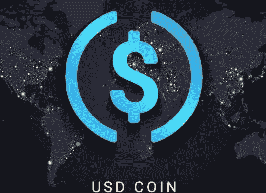
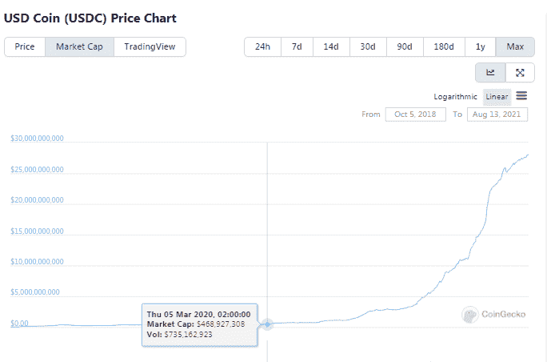
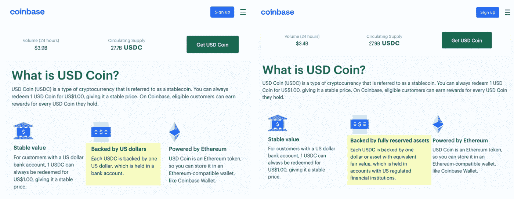
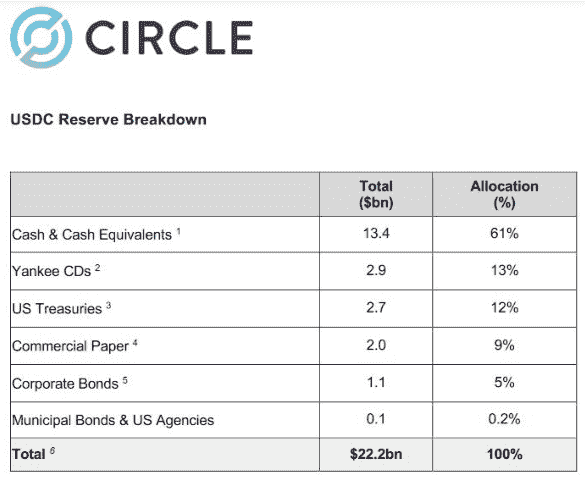

# Circle 的 USDC 提高了透明度

> 原文：<https://medium.com/coinmonks/circles-usdc-delivers-improved-transparency-48f8f3e29594?source=collection_archive---------7----------------------->

*Image From:* [*S*ource](https://news.in-24.com/news/111286.html)

Stablecoins 已经成为加密货币行业的主导力量，交易所的交易量很高，市值也大幅上升，目前总计达到惊人的 1180 亿美元。

最大也是最有争议的稳定币是 USDT 币。就市值而言，它目前在加密指数中排名第三。

USDC 稳定币目前是市值排名第八的加密货币，已经铸造了 280 亿 USDC 代币，并以 1:1 的稳定价格兑换美元。

USDC(或美元硬币)是一种稳定的硬币，由 Circle 与比特币基地合作开发。类似于 Tether 与 Bitfinex 的合作伙伴关系，尽管两家公司背后的人各不相同。《USDC》于 2018 年 10 月宣布上映。公告称，USDC 将获得银行账户中美元的全额支持(1:1)。

> 新 USDC 稳定币完全由美元担保，并由比特币基地和 Circle 作为中心财团的共同创始成员提供支持
> 
> *-来源:* [*比特币基地博客*](https://blog.coinbase.com/coinbase-and-circle-announce-the-launch-of-usdc-a-digital-dollar-2cd6548d237)

# 市值增加

USDC 的发行量增长与 USDT 非常相似，很快它的市值开始呈指数增长，因为在 2020-2021 年的牛市期间，它铸造了 99%的流通硬币。

Image from Coingecko

然而，正如所有人预料的那样，比特币基地不会拥有 280 亿美元的银行账户。随着越来越多的 USDC 进入流通领域，关于 1:1 美元担保的问题也越来越多，最终，比特币基地最近宣布，它没有完全用美元担保，但也使用现金等价物。

比特币基地在其网站上删除了对 USDC 的声明:

> “……由银行账户中的美元支持……”

并替换为:

> “…由完全保留的资产支持…”

*Image Source:* [*Cointelegraph*](https://cointelegraph.com/news/coinbase-removes-backed-by-us-dollars-claim-for-usdc-stablecoin)

虽然 USDC 也是加密分析师的一个担忧，但比特币基地的监管框架比 Bitfinex 更严格。USDC 比 USDT 更透明，但最近的大规模铸币也让人们对其稳定货币的支持产生了怀疑。

## 来自审计机构的七月报告:均富

Source: [Centre.io](https://www.centre.io/hubfs/pdfs/attestation/Grant-Thorton_circle_usdc_reserves_07162021.pdf)

均富 LLP 对 USDC 的支持进行了独立审计。仅仅作为一个名字，它就为泰瑟选择的审计师提供了更好的透明度。

这次审计意义重大，因为它提供了稳定币领域急需的透明度，也许这也是泰瑟应该追求的，而不是使用开曼群岛的小型审计师。

## stable 指责 BTC 操纵价格——“债务交换”

比特币基地/Circle 方法比 Tether/Bitfinex 方法好得多。存在违规行为，USDC 还被指控为 BTC 创造人为的支持条件。然而，如果没有直接的资金机制和圈子网络，这是不可能证明的。

可能问题是这些指控，即使有了泰瑟的例子，也是无法证明的。

这一指控解释如下:

*   USDT 是在没有支持的情况下诞生的
*   被用来购买 BTC，创造了人为的需求
*   后来，当价格高得多的时候，BTC 被卖到 100 美元
*   部分美元被用来支持 USDT。

这是对泰瑟公司和 BTC 市场操纵的主要指控。

这看起来类似于 MtGox 试图管理其因“黑客攻击”而遭受的巨额损失的方式，使用了 Karpeles 所谓的“义务交换”。这两个交易机器人被发现在标准时间进行 BTC 的购买，但没有真正的钱存入关联账户。分析师在 2014 年 MtGox 崩溃后发现了这些机器人。这个交易所的两个账户现在已经不存在了，他们在没有现金余额的情况下买入 BTC。

这也是 USDT 被指控的原因，而且有报道称，在过去的许多时候，Tether 都没有抵押品来支持其在 USDT 发行的债券。此外，最近有很多关于仍未披露的商业票据的新披露的讨论，这种票据用于支持超过一半的流通中的 USDT。

## Circle 正计划成为一家国家银行

喀尔刻也在积极争取获得银行牌照，成为波士顿市的完全储备银行。它要求提供有关流动性和 USDC 支持的信息，因为根据巴塞尔协议 III 的要求，银行环境还包含更严格的监管。

透明度对于 USDC 280 亿美元的资产至关重要。这样的举措也有助于为这种稳定的货币创造更好的法律条款和可持续性。

虽然这仍然是一个问题，为什么这两个合作伙伴误导公众三年，不宣布究竟有多少美元存款可用，以及哪些是支持 USDC 的其余资产。

这一举措与两年前突然宣布 USDT 不仅仅由美元支持，而是由一篮子资产支持的 Tether 非常相似。

# 结论

*Image from* [*Unsplash*](https://unsplash.com/photos/a7Co93j8nBw)

美国金融当局监管并决定。如果 Circle 被允许作为银行机构运营，这对 USDC 也是积极的，并将为这种稳定的货币创造更多的合法性。

Circle 和比特币基地对 USDC 的储备和支持不透明，这是一个缺点。

虽然 Tether 有如此多的违规行为，并因其缺乏透明度而造成混乱，但直到目前，USDC 似乎也有其问题，但程度不同。

另一个重要的事实是，这两种债券都在发行公司的控制之下。

Tether 和 Circle 都下令冻结钱包里的资金。这是大多数稳定银行的一个重要特征，因为他们可以审查交易和控制资金。

它们是中央集权的，并在其主管的控制下运作。这是一种不同的加密货币模型，以及它们所代表的内容。

总体而言，USDC 可能仍然存在问题，尽管它在扩张，但它肯定会面临越来越多的监管审查，但它也提供了来自顶级审计公司(均富)的明确证据。

我们应该认为这是加密货币行业的一个积极事件。

***跟我上:***

*●*[***read cash***](https://read.cash/@Pantera)*●*[***noise cash***](https://noise.cash/u/Pantera99)*●*[***Medium***](/@panterabch)*●*[***蜂巢***](https://hive.blog/@pantera1)*●*

**●*[***Twitter***](https://twitter.com/Panterabch)*●*[***LinkedIn***](https://www.linkedin.com/in/panterabch/)**●*[***Reddit***](https://www.reddit.com/user/PanteraBCH)**

***原发布于*[*https://read . cash*](https://read.cash/@Pantera/usdc-delivers-improved-transparency-d108d01e)*。***

> **加入 [Coinmonks 电报频道](https://t.me/coincodecap)，了解加密交易和投资**

## **另外，阅读**

*   **[OKEx 回顾](/coinmonks/okex-review-6b369304110f) | [Kucoin 交易机器人](/coinmonks/kucoin-trading-bot-automate-your-trades-8cf0ca2138e0) | [期货交易机器人](/coinmonks/futures-trading-bots-5a282ccee3f5)**
*   **[AscendEx Staking](https://blog.coincodecap.com/ascendex-staking)|[Bot Ocean Review](https://blog.coincodecap.com/bot-ocean-review)|[最佳比特币钱包](https://blog.coincodecap.com/bitcoin-wallets-india)**
*   **[霍比审核](https://blog.coincodecap.com/huobi-review) | [OKEx 保证金交易](https://blog.coincodecap.com/okex-margin-trading) | [期货交易](https://blog.coincodecap.com/futures-trading)**
*   **[比特币基地跑马圈地](https://blog.coincodecap.com/coinbase-staking) | [Hotbit 评论](/coinmonks/hotbit-review-cd5bec41dafb) | [KuCoin 评论](https://blog.coincodecap.com/kucoin-review)**
*   **[最佳加密交易信号电报](/coinmonks/best-crypto-signals-telegram-5785cdbc4b2b) | [MoonXBT 评论](/coinmonks/moonxbt-review-6e4ab26d037)**
*   **[Coinswitch 俱吠罗评论](/coinmonks/coinswitch-kuber-review-1a8dc5c7a739) | [电网交易机器人](https://blog.coincodecap.com/grid-trading) | [比特币基地收费](/coinmonks/coinbase-fees-831e77d4f2c5)**
*   **[Bitget 评论](https://blog.coincodecap.com/bitget-review)|[Gemini vs BlockFi](https://blog.coincodecap.com/gemini-vs-blockfi)|[OKEx 期货交易](https://blog.coincodecap.com/okex-futures-trading)**
*   **[OKEx vs KuCoin](https://blog.coincodecap.com/okex-kucoin) | [摄氏替代品](https://blog.coincodecap.com/celsius-alternatives) | [如何购买 VeChain](https://blog.coincodecap.com/buy-vechain)**
*   **[币安期货交易](https://blog.coincodecap.com/binance-futures-trading)|[3 commas vs Mudrex vs eToro](https://blog.coincodecap.com/mudrex-3commas-etoro)**
*   **[如何购买 Monero](https://blog.coincodecap.com/buy-monero) | [IDEX 评论](https://blog.coincodecap.com/idex-review) | [BitKan 交易机器人](https://blog.coincodecap.com/bitkan-trading-bot)**
*   **[币安 vs Bitstamp](https://blog.coincodecap.com/binance-vs-bitstamp) | [比特熊猫 vs 比特币基地 vs Coinsbit](https://blog.coincodecap.com/bitpanda-coinbase-coinsbit)**
*   **[如何购买 Ripple (XRP)](https://blog.coincodecap.com/buy-ripple-india) | [非洲最好的加密交易所](https://blog.coincodecap.com/crypto-exchange-africa)**
*   **[非洲最佳加密交易所](https://blog.coincodecap.com/crypto-exchange-africa) | [胡交易所评论](https://blog.coincodecap.com/hoo-exchange-review)**
*   **[eToro vs robin hood](https://blog.coincodecap.com/etoro-robinhood)|[MoonXBT vs by bit vs Bityard](https://blog.coincodecap.com/bybit-bityard-moonxbt)**
*   **[Stormgain 回顾](https://blog.coincodecap.com/stormgain-review) | [Bexplus 回顾](https://blog.coincodecap.com/bexplus-review) | [币安 vs Bittrex](https://blog.coincodecap.com/binance-vs-bittrex)**