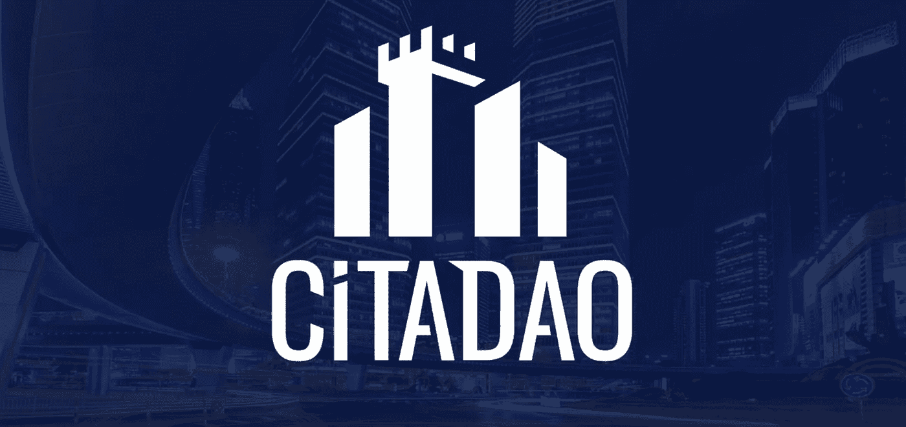

# Citadao.io:房地产如何在区块链上创造可持续价值

> 原文：<https://medium.com/coinmonks/citadao-io-how-real-estate-can-create-sustainable-value-on-the-blockchain-f57895a41db1?source=collection_archive---------3----------------------->

早在 1960 年，美国总统德怀特·艾森豪威尔(Dwight Eisenhower)签署了公法 86-779，允许投资于大规模多样化的创收房地产投资组合。这一大块法律术语允许房地产投资信托或 REITs 的形成。从那时起，房地产投资信托基金已经从传统抵押贷款公司的一个分支发展成为在超过 39 个国家运营的全球化企业，总市场规模约为 1.7 万亿美元。大多数房地产投资信托基金现在不仅拥有它们所投资的房地产，而且还经营它们以产生稳定的收入流。一些你最喜欢的户外购物中心、生活工作空间和其他聚会场所可能由这些房地产投资信托基金拥有和经营。

这些房地产投资信托基金已经存在了一段时间，并取得了成功。他们受益于为投资者提供:

*   **可及性** —房地产投资信托基金的最低投资可能远低于购买整个房地产的成本，房地产投资信托基金的投资者可以获得不同司法管辖区的房地产风险敞口
*   **流动性**——与传统的房地产不同，房地产投资信托基金的股票可以在股票市场自由交易
*   **透明度**——法律要求确保房地产投资信托基金诚实、坦率地报告其持有情况
*   可扩展的(Scalable)——经营房地产投资信托基金的公司已经证明了收购新房产并将其转化为现金流积极投资的方法

与此同时，自 1960 年房地产投资信托基金被签署成为法律以来，该行业一直没有任何重大变化。与此同时，我们经历了微芯片革命、个人电脑革命、互联网革命、无线和智能手机革命，并且正处于人工智能革命的风口浪尖。难道这不是房地产投资信托基金适应 21 世纪的时候了吗？

在 Citadao，我们正在使用区块链的分散金融(DeFi)来使房地产投资更容易、更无国界、更透明和可扩展。使用 Citadao，房地产投资者可以获得基于以太坊的 ERC20 令牌，这些令牌对应于 Citadao 平台上列出的房地产的部分权利和所有权。如果他们获得了足够多的这些 ERC20 代币，他们可以直接购买财产，并将代表财产合法所有权的 NFT 转让给他们。ERC20 代币也可以通过 DeFi 自动做市商交易为其他有价值的加密货币，并且可以在流动性池中下注，以产生 Citadao 代币作为奖励。这些 Citadao 令牌可以反过来用于对平台的治理进行投票，例如平台的收入应该如何支出或分配。在 Citadao 代币持有者投票分配收入的情况下，代币也将使持有者有权获得该分配的相应份额。

房地产所有者可以使用 Citadao 平台在首次房地产发行(IRO)中列出他们的房地产，并在他们的 ERC20 钱包中收到销售收入。这些房产所有者可以根据自己的意愿灵活地提供其房产的零头股份，我们的平台将铸造与这些零头股份相对应的 ERC20 代币。

通过将房地产这种具有公认的价值记录和真实收入流的资产进行令牌化，我们还在 Defi 生态系统中提供了一种降低风险、提高收益的工具。在新的市场进入者、对成功策略的快速模仿、保证金交易的影响以及对风险更高的流动性池的日益犹豫之间，多种力量正在推动 Defi 的不可持续的超大收益率下降。随着锁定在这些资产池中的总价值增加，这些收益率预计将进一步向均值回归。为了发展壮大，Defi 需要以下价值来源:

*   **创收** —资产必须能够产生正现金流
*   **可持续发展** —资产必须有经过证明的历史记录作为价值来源
*   **链上** —资产的所有权和合法权利必须从现实世界的“肉空间”清晰地映射到区块链上的令牌化资产(理想情况下，资产甚至会从“链上”移动中受益)

房地产总是符合前两个标准，随着区块链和 DeFi 的出现，现在是将房地产转移到法律所有权和产权的时候了。这就是 Citadao 的用武之地。

Citadao 平台结合了以下优势:

*   **免许可访问** —任何地方的任何人都可以访问 ERC20 上列出的房地产的部分份额，居住在 54 个英联邦国家的任何人都可以在该平台上列出他们的房地产
*   **流动性**—cita Dao 平台上的房地产可以通过自动做市商与其他 ERC20 代币自由交易
*   **透明度**—Citadao 组织制定的所有治理决策都将基于 cita Dao 令牌投票
*   **可扩展** —我们的门户网站使新房产上市变得容易，并使这些房产的新 ERC20 部分分发给买家变得容易，从而使投资无限量的房地产成为可能
*   **可组合** —通过使用区块链本地资产持有人财产令牌，Citadao 将成为大量创新 DeFi 原始产品的基础，如抵押贷款、期货、指数、房地产支持的稳定债券等。

长期以来，房地产一直是世界上最重要的投资资产之一。现在，Citadao 正在利用房地产的价值，借助 DeFi 的力量对其进行改造。Citadao 是当房地产投资向加密货币代币、流动性池和分散网络的世界发展时所发生的事情。

有兴趣加入我们的旅程吗？在 [Twitter @citadao_io](https://twitter.com/citadao_io) 上关注我们，在 [Discord](https://discord.gg/hz8zNzZtYS) 上加入我们的社区，或者查看我们的网站 [citadao.io](http://citadao.io/)

*免责声明:本通讯中包含的信息来源可靠，但不保证准确或完整。本通信不应作为做出任何投资决策的依据，也不应被解释为参与任何交易的建议或任何投资策略的建议*

> 加入 [Coinmonks 电报频道](https://t.me/coincodecap)，了解加密交易和投资

## 另外，阅读

 [## 最佳加密交易所| 2021 年十大加密货币交易所

### 加密货币交易所的加密交易需要了解市场，这可以帮助你获得利润…

blog.coincodecap.com](https://blog.coincodecap.com/crypto-exchange)  [## 2021 年 9 大最佳加密借贷平台

### 当谈到加密货币贷款时，大量因素等同于良好的收入状况。此外，借款的一部分…

blog.coincodecap.com](https://blog.coincodecap.com/crypto-lending)  [## 加密交易机器人——最佳免费加密交易机器人

### 2021 年币安、比特币基地、库币和其他密码交易所的最佳密码交易机器人。四进制，位间隙…

medium.com](/coinmonks/crypto-trading-bot-c2ffce8acb2a)  [## 最佳 6 个加密交易信号电报通道

### 这是乏味的找到正确的加密交易信号提供商。因此，在本文中，我们将讨论最好的…

medium.com](/coinmonks/best-crypto-signals-telegram-5785cdbc4b2b)  [## BlockFi 评论 2021:利弊和利率

### 今天，我们提出了一个全面的 BlockFi 评论，这是一个成立于 2017 年的加密贷款平台，拥有其…

blog.coincodecap.com](https://blog.coincodecap.com/blockfi-review)  [## 如何在印度购买比特币？2021 年购买比特币的 7 款最佳应用[手机版]

### 如何使用移动应用程序购买比特币印度

medium.com](/coinmonks/buy-bitcoin-in-india-feb50ddfef94)  [## 加密税务软件——五大最佳比特币税务计算器[2021]

### 不管你是刚接触加密还是已经在这个领域呆了一段时间，你都需要交税。

medium.com](/coinmonks/best-crypto-tax-tool-for-my-money-72d4b430816b)  [## Pionex 评论 2021 |免费加密交易机器人和交换

### Pionex 是为交易自动化提供工具的后起之秀。Pionex 上提供了 9 个加密交易机器人…

medium.com](/coinmonks/pionex-review-exchange-with-crypto-trading-bot-1e459d0191ea)  [## 存储比特币的最佳加密硬件钱包[2021]

### 保管您的数字资产很容易，但找到正确的存储方式却是一项繁琐的任务。在线钱包有一个风险…

blog.coincodecap.com](https://blog.coincodecap.com/best-hardware-wallet-bitcoin)