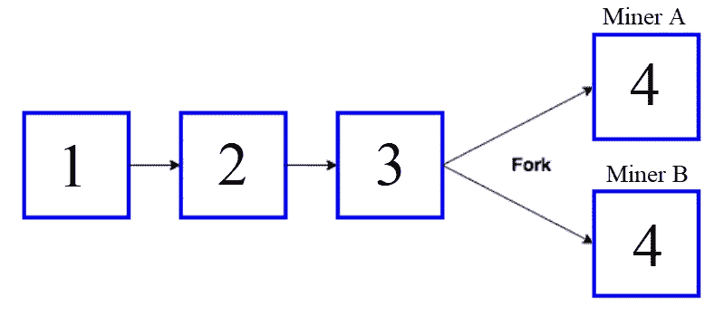
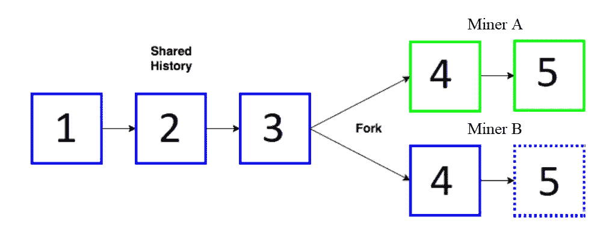
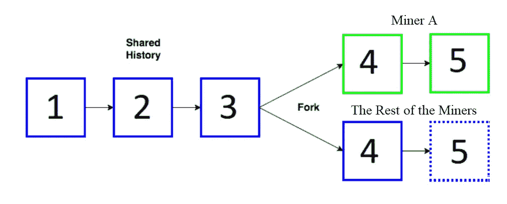
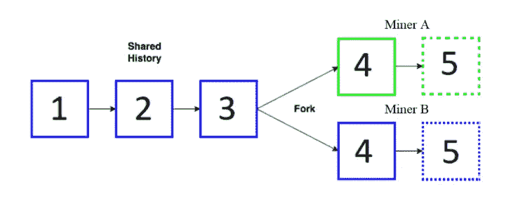
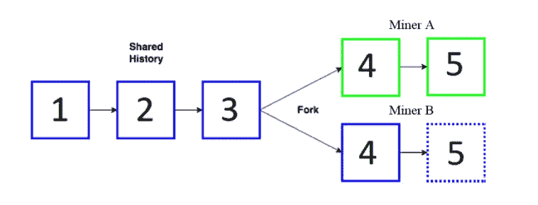
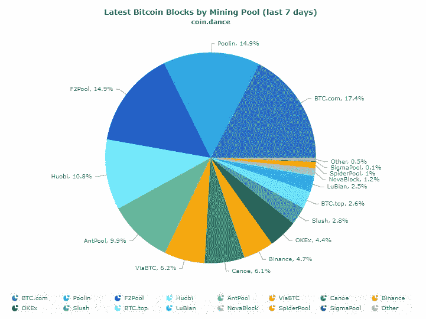
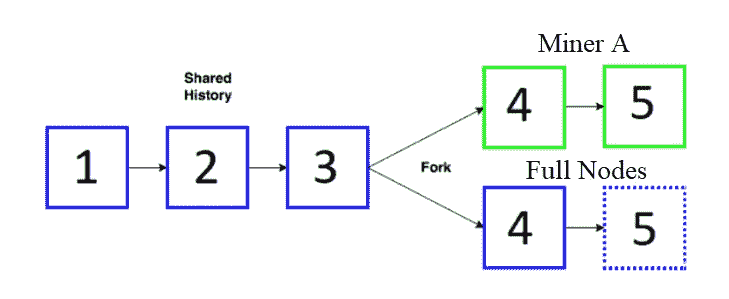
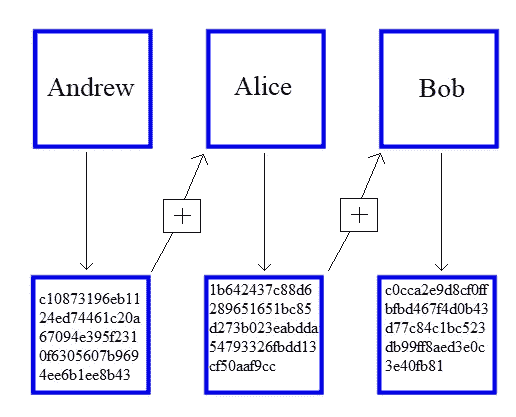
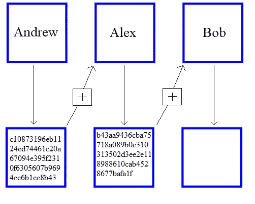

# 城堡学校——从零到比特币

> 原文：<https://medium.com/coinmonks/citadel-school-from-zero-to-bitcoin-8e8c357fb6c6?source=collection_archive---------3----------------------->

*本文将讨论比特币从非技术到技术，从基础到复杂的各个层次——从绝对零度开始。它将尽可能包罗万象，但会受到作者理解的限制。请随意跳过你已经知道的部分，因为所有的基础知识都将被概述。它将不断更新和补充，以提供尽可能简洁的解释。*

# **1。总账**

比特币有一个单一的账本，记录了曾经进行的每一笔交易。例如，摩根大通银行有自己的分类账，包括存款人账户中的美元价值，以记录谁拥有多少钱。他们的分类账是私人的，不会分散在许多个人之间，因此是集中的。大通对他们的分类账拥有集中的所有权，他们可以随意改变它，他们是唯一的控制实体。事实上，任何试图修改它的人都被禁止这样做。与大通的集中式账本不同，比特币的账本分布在很多同行之间，因此是去中心化的。账本包括一个区块链，任何愿意的参与者都可以下载，甚至是你。下载[比特币核心软件](https://bitcoin.org/en/bitcoin-core/)以便开始下载整个账本。完整节点是一台拥有整个区块链副本并不断更新的计算机。拥有一个完整的节点并不是拥有比特币的先决条件。这是比特币的基本事实——账本是完全透明的，任何人都可以下载/查看。这是我们知道每个人都遵守规则和诚实的方式。不可能做假账。

# 2.比特币账本就像 DNA

我喜欢用一个比喻将比特币分类账比作 DNA。一个 DNA 分子包含了创造和维持你的身体所需的所有指令。DNA 被复制并传播到你的身体各处，以保护它所保存的信息。如果有尽可能多的拷贝，信息(包含在 DNA 中)被破坏或恶意操纵的风险就会降低。比特币账本也类似。如果一个实体想要破坏或篡改比特币账本，他们必须摧毁网络上所有可能的副本。摧毁比特币账户最简单的方法就是摧毁地球，其他任何方法都要困难得多。

# **3。点对点**

比特币网络是一个点对点的网络，这意味着没有中央权威。每个用户都有可能与任何其他用户打交道，从而消除了对领导者/协调者的需求。我们将查看 BitTorrent 文件分发系统，以便更好地理解什么是对等网络。当通过 BitTorrent 文件分发系统下载文件时，您是从许多不同的人那里下载您想要的文件。当您下载文件时，您也在将您已经拥有的部分上传给试图下载它的其他人。使用对等网络是因为它们比客户机-服务器网络的伸缩性更好。在后者中，服务器上传速度是瓶颈，并且假设有足够数量的客户端，它在传输数据时会非常慢。举个例子:比如说微软的上传速率是每秒 50 兆。如果有 5 个人试图从他们那里下载一个文件，每个人将以每秒 10 兆的速度下载(假设每个人的下载速度都那么高)。然而，如果有 1000 人试图下载该文件，那么每个人只能以每秒 0.05 兆字节的速度下载，因为微软的上传速度在如此多的用户中是分散的。如果每个用户都在一个对等网络中互相上传，那么它可以毫无问题地扩展到无限个用户。

# 4.区块链简介

如前所述，比特币账户是一个区块链。实际上是一系列相互连接的积木。

大约每 10 分钟，一个新的块被添加到链上。每个块具有 1 兆字节的容量。块就像一个保存事务数据的容器。每个块包含大约 1609 个事务。写这篇文章时，比特币区块链上有 649653 个区块。如何将一个块添加到链中，谁来选择哪些事务将进入下一个块？

# 5.矿工简介

比特币挖矿节点是一个完整的节点，它也消耗能量(工作)来保护网络。他们可以被视为事务处理者。为了说明一个矿工做什么，让我们想象一个叫安东的矿工。安东有机会创造下一个街区。如果他成功做到这一点，他会得到比特币的奖励，这就是所谓的块奖励。他将从 mempool(待定事务的积压)中取出事务，并将它们放入要验证的块中。

这个过程需要大量的工作，即:电力和计算硬件。为了利润而采矿需要强大的计算机来尝试解决困难的算法，当他们解决了一个，他们就可以创造一个区块并因此获得奖励。成功解决该算法的矿工将获得比特币奖励，但他们的大部分收入将用于电费和未来的硬件采购。

使用普通的计算机是不可能盈利的，因为电力/计算的比率不够有效。专用集成电路(ASIC)是只擅长做一件事的计算机，解决比特币挖掘算法。由于它们如此专业化，它们很容易胜过任何通用的硬件，如个人电脑。然而，在软件层面，任何人都可以下载采矿软件，并作为矿工参与网络。

# 6.协议简介

即:交易是如何进行的，允许哪些交易，谁可以进行交易。比特币协议由在网络上强制执行的规则组成，以确保交易和货币供应的完整性。完整节点除了拥有整个区块链的副本之外，还执行协议规则。如果一个邪恶的矿工试图打破这些规则，他们将被分叉出网络，他们的封锁被视为无效。更多细节在下面。

# 7.工作证明

比特币使用一种被称为工作证明的共识机制。你可以把它想象成投票权，但不是每个人都有投票权，你的计算能力越强，你的投票权就越大。这个想法是在网络上有足够多的计算机，因此有很高的计算能力(在采矿方面被称为散列能力)，一个人不可能拥有大多数投票权。

示例:叉子

假设我们的区块链在区块 3，两个矿工同时创建了区块 4。现在有两个 block 4s。

矿工 A 很可能比矿工 B 将不同的事务放入他的块 4 中。因此，有两个不同的块 4。所以现在我们基本上有两个区块链。第一个区块链由区块 1–4 组成(但包含矿工 A 的第 4 个区块),第二个链由区块 1–4 组成(但包含矿工 B 的第 4 个区块)。比特币网络不可能由两条链组成，只有其中一条会赢，是真正的链。根据协议规则，最长的链将是有效链，因此首先添加块 5 的链将被选为有效链。这是起作用的工作机制的证明。

想象一下，矿工 A 和矿工 B 是仅有的两个矿工。哪个矿工生产方块更快(有更多的 hashpower ),哪个就会生产第五个方块并且有最长的链。

Miner B began to work on block five (indicated by the dotted line), however he was not able to solve it before Miner A.

如果矿工 A 拥有 51%或更多的 hashpower，他很可能会在矿工 b 之前生产 block 5。因此，根据工作证明，如本节所示，谁拥有 51%或更多的 hashpower，谁就在创建最长的链(又名:有效链)方面具有优势。假设不使用矿工 B，而是使用网络上的所有矿工来代替他。现在我们有了矿工 A，还有其余的矿工。

同样的情况仍然成立:如果矿工 A 拥有 51%或更多的 hashpower，那么他很可能会产生最长的链，因此将他的块添加到链中仍然有效。

假设矿工 A 是一个邪恶的矿工。他看到矿工 B 将第 4 块添加到区块链:

矿工 B 现在试图将区块 5 添加到区块链，但是他还没有成功地解决它。这由蓝色虚线表示。矿工 A 想颠覆矿工 B 的蓝块 4。矿工 A 认为，如果他在矿工 B 完成蓝色区块 5 之前创建了自己的区块 4 和区块 5，那么矿工 A 的链将是最长的，因此是有效的，他将可以选择哪些交易进入自己的区块 4 和区块 5。

如果矿工 A 比矿工 B 具有更多散列值(51%或更多)，并且两个块 4 都是在相对接近的时间范围内创建的，则矿工 A 最有可能在矿工 B 创建蓝色块 5 之前创建绿色块 5。这将使蓝色块 4 中的事务无效(丢弃),即使在蓝色块 4 被确认之后。

即使蓝色块 4 被确认，它现在属于较短的链，并且最长的链总是被认为是有效的链。

这是一个攻击媒介，其中矿工 A 可以加倍花费交易。让我们更详细地看一下:

矿工 A 拥有 51%或更多的哈希值。矿工 A 向 Alice 发送 100 个比特币，该交易由矿工 b 放入区块 4。该交易被验证并添加到区块链。Alice 看到交易已被确认，因此她向矿工 A 支付了 1，000，000 美元，以换取她从矿工 A 处收到的 100 比特币。矿工 A 在第三个区块之上创建了自己的第四个区块(绿色区块)，并且在矿工 B 可以创建自己的第五个区块(蓝色区块)之前，他还创建了自己的第五个区块(绿色区块)。因为矿工 A 的链是最长的链，所以每个人都将其作为有效链。比特币网络不再承认矿工 A 对爱丽丝进行的比特币交易。现在，矿工 A 仍然拥有 100 万美元现金和 100 个比特币。这被称为双重花费攻击，因为矿工 A 可以再次花费他的比特币。这种情况是我们不希望发生的，但是幸运的是，达到 51%的 hashpower 实际上是不可能的，也不可能持续很长一段时间。目前，比特币网络消耗的能量相当于丹麦一个国家。为这样一项事业购买硬件和电力太昂贵了。从袭击中获得的利润不足以抵消实施袭击的成本。

当处理非常大的金额时，比特币的接收者通常会等待许多天，以确保交易块不能被逆转。在上面的例子中，我们看到有人可以通过拥有 51%的 hashpower 来反转一个块，但是反转 144 个块(一天中生成的块的数量)将需要远远超过 51%的 hashpower。如果一个人想擦除 144 个块之前的一个块，那么他必须先产生 144 个新块，然后其他人才能产生 1 个新块。要连续创建 144 个块，基本上需要 99%的 hashpower。这只会逆转一天的交易量。

让我们看一个稍微不同的情况。矿工 A 和矿工 B 仍然是网络上仅有的矿工。并且矿工 A 想要改变块 5，但是现在矿工 B 的链有块一直到处于确认状态的块 7。在这种情况下，矿工 A 必须在矿工 B 开采区块 8 之前开采区块 5、6、7 和 8。本质上，矿工 A 必须拥有 4 倍于矿工 B 的 hashpower，才能为他的 1 个区块生成 4 个区块。

Current mining pools operating on the bitcoin network over the last seven days. [source](https://coin.dance/blocks/thisweek)

上图暗示 BTC.com 会在 17.4%的时间里制造盖帽。每天有 144 个区块，因此我们可以预计 BTC.com 每天大约创建 25 个区块。只有 3.02%的机会，BTC.com 将创造 2 块在一排，百分比机会急剧下降，作为目标块在一排增加。

# 8.最难存在的钱

对许多比特币持有者来说，比特币最重要的一点是，比特币的数量永远不会超过 2100 万。当中本聪设计比特币协议时，他有一个非常具体的发行时间表，这个时间表过去是、现在也是一成不变的。起初，矿工们解决一个障碍后会获得 50 比特币。(每 10 分钟一名矿工就有机会解决一个障碍，他们的成功与他们拥有的总网络功率的百分比直接相关。如果我在网络上有 20%的采矿能力，那么我有 20%的机会，每 10 分钟，成功创建一个区块，并因此获得奖励。)中本聪设定发行额每四年减少一半，这个术语被创造为“减半”。第一次是在 2012 年，当时每块的发行量从 50 比特币降至 25 比特币。最近一次减半发生在 2020 年 5 月，块补贴从每块 12.5 比特币降至每块 6.25 比特币。中本聪明白，发行量的突然下降将造成供应冲击，进而产生投机泡沫，因此每四年就会有更多人关注比特币。他认为，供应冲击和投机泡沫将形成一个正反馈循环。

我们可以看到，黑线表示比特币的总供应量，是对数的。黄线表示每四年供应量缓慢逐渐下降。中本聪设计它，使发行率每四年继续减半，直到 2140 年。

许多人认为比特币是“数字黄金”，所以让我们对两者进行一些比较:

黄金供应虽然众所周知，但并不确切知道，而比特币供应是完全已知的，可以被任何个人审计。我们也确切知道每个时间段内有多少比特币被创造出来。黄金的发行率取决于它的价格。当黄金价格上涨时，黄金开采公司可以花更多的钱开采黄金，从而提高发行率。增加的供应冲击市场，导致价格下降并达到平衡。而比特币，发行利率是静态的。它独立于所有其他变量，包括比特币的价格，并且每四年下降 50%。

比特币能够体现完美的稀缺性，这是任何物质商品都无法做到的。我们不知道地下或海里有多少金子。我们不知道按照埃隆·马斯克的计划，我们离在小行星上开采黄金还有多远。但我们可以从数学上确定地知道比特币供应的所有方面，并且我们可以通过了解确切的通胀时间表来做出相应的计划。这些品质使比特币成为最难通缩、财富保值能力最高的货币。

# 9.满节点的军队

完全节点通过阻止来自拥有多数控制权的矿工的攻击来保护比特币协议的完整性。如果没有完整的节点表示，拥有 51%或更多 hashpower 的挖掘者将能够造成比双倍开销攻击更大的破坏。他们将能够改变所有的协议规则。

幸运的是，完整节点通过维护诚实的链并识别邪恶的矿工何时脱离网络，创建自己的链来防止这种情况。

当矿工 A 改变协议规则，例如，将发行率增加到每块 1，000，000 比特币时，完整节点将立即识别出他的链是无效的，并且他们不会将他的块添加到他们自己的区块链副本中，从而保留“诚实的”链。

# 10.作为链的加密

在区块链，我们为什么不能拆除一个街区，换上一个不同的街区呢？每个块都需要前一个块的哈希才能工作。首先，我们将了解什么是加密和哈希:

如果我取我的名字 Andrew，并使用 sha256 算法对其加密(这里使用一个简单的工具[T1 ),它将输出:c 10873196 EB 1124 ed 74461 c 20 a 67094 e 395 f 2310 f 6305607 b 9694 ee 6 B1 ee8b 43](https://timestampgenerator.com/generate-hash/sha256)

使用不同的单词不可能得到相同的输出(散列)。类似地，比特币块只是一个很长的文本串，可以被散列。

我们可以玩一个游戏，我把我的名字加密，给你，然后你把你的名字加到我的散列里。我们可以通过一系列的人来做这件事。让我们的链是:安德鲁，爱丽丝，鲍勃。

我们散列安德鲁得到:c 10873196 EB 1124 ed 74461 c 20 a 67094 e 395 f 2310 f 6305607 b 9694 ee 6b 1 ee 8b 43

现在爱丽丝可以把我的输出加上她的名字:

c 10873196 EB 1124 ed 74461 c 20 a 67094 e 395 f 2310 f 6305607 b 9694 ee 6b 1 ee 8 b 43 lice

这将产生:

1b 642437 c 88d 6289651651 BC 85d 273 b 023 eab DD 54793326 fbdd 13 cf 50 AAF 9cc

现在 Bob 可以获得输出，并在输出的末尾加上他的名字:

1b 642437 c 88d 6289651651 BC 85d 273 b 023 eab DD 54793326 fbdd 13 cf 50 AAF 9 cc bob

这将产生:

c 0 CCA 2 e 9d 8 cf 0 FFB FBD 467 f 4d 0 b 43d 77 c 84 C1 BC 523 db 99 ff 8 aed 3 E0 c 3e 40 FB 81

如果我们篡改任何一个名字:安德鲁、爱丽丝或鲍勃，结果都不会一样。即使我们交换两个名字:爱丽丝，安德鲁，鲍勃，它仍然不会是相同的。有了最终的散列，就确保了名称和顺序必须准确无误。

如果我们想将 Alice 修改为 Alex，它看起来会像:

注意，Alex 有一个不同的散列。

哈希:b43aa 9436 CBA 75718 a 089 b0e 310313502 D3 ee2e 118988610 cab 4528677 bafa 1 f

如果我们将 Bob 添加到这个散列中并再次散列它，我们将得到:
5cf 26 e 20988 CB 773d 7094 e 0500 FB 8 FB 4 DD f1 a 0 f 6 ffd 6 E3 ff 612 cefa 8 D2 cc 38 e 7

这是一个完全不同的散列，而不是链中出现的安德鲁、爱丽丝、鲍勃。如果我们把 Alice 改成 Alex，就不可能有旧的最终散列。现在结果完全不一样了。

比特币区块链也是如此。如果你要修改一个先前的块，当前的散列将是不同的，每个人都会立即认出它是一个无效的链。实现这一点的唯一方法是修改一个块，然后在其上再次挖掘每个块，就像我们在前面的示例中看到的 Miner A 和 Miner B 一样。我们可以像哈希 Andrew、Alice、Bob:

与我们在前一个示例中只添加块名不同，每个块中的事务数据将被添加到前一个散列中。如果任何人试图篡改块 2 中的任何数据，都会产生不同的散列，因此无法链接到块 3。考虑到块 2 的新散列，将不得不再次挖掘块 3。因此，修改后的数据块之上的所有数据块都必须再次散列，这实际上是不可能的。

# 11.难度调整

矿工越强，造块越快，那么有什么能阻止大家升级硬件，每 1 分钟就去开采一块呢？难度调整算法到位，以确保满足 10 分钟的分段时间(在误差范围内)。当所有的矿工都大幅增加他们的 hashpower 到可以快速解决方块的程度时，难度调整算法将增加采矿难度，使采矿变得更困难，因此解决方块的速度更慢。难度调整预计大约每两周一次，或者更确切地说，每 2016 个街区一次。如果所有矿工的采矿速度都比平时快(例如，由于每个人同时升级硬件)，那么 2016 年封锁期后的难度调整将会比两周更快。类似地，如果整体 hashpower 下降(由于矿工收入突然减半，收入只有以前的一半),那么区块开采将会变慢，因此，需要超过 2 周的时间才能达到 2016 年区块难度调整。

# 13.比特币核心软件

Internet Explorer、Microsoft Edge、Mozilla Firefox 和 Google Chrome 都是由不同公司开发的不同软件项目，但它们都访问同一个东西:互联网。因此，当有人创建一个新的互联网浏览器时，他们并没有创建一个新的互联网，互联网已经存在，该软件允许一个人访问互联网上的一些对象以及修改其他对象，以读取和写入互联网。同样，比特币核心软件也是一款开源软件，能够读写比特币区块链。

## 另外，阅读

*   最好的[密码交易机器人](/coinmonks/crypto-trading-bot-c2ffce8acb2a)
*   [密码本交易平台](/coinmonks/top-10-crypto-copy-trading-platforms-for-beginners-d0c37c7d698c)
*   最好的[加密税务软件](/coinmonks/best-crypto-tax-tool-for-my-money-72d4b430816b)
*   [最佳加密交易平台](/coinmonks/the-best-crypto-trading-platforms-in-2020-the-definitive-guide-updated-c72f8b874555)
*   最佳[加密贷款平台](/coinmonks/top-5-crypto-lending-platforms-in-2020-that-you-need-to-know-a1b675cec3fa)
*   [最佳区块链分析工具](https://bitquery.io/blog/best-blockchain-analysis-tools-and-software)
*   [加密套利](/coinmonks/crypto-arbitrage-guide-how-to-make-money-as-a-beginner-62bfe5c868f6)指南:新手如何赚钱
*   最佳[加密制图工具](/coinmonks/what-are-the-best-charting-platforms-for-cryptocurrency-trading-85aade584d80)
*   [莱杰 vs 特雷佐](/coinmonks/ledger-vs-trezor-best-hardware-wallet-to-secure-cryptocurrency-22c7a3fd391e)
*   了解比特币的[最佳书籍有哪些？](/coinmonks/what-are-the-best-books-to-learn-bitcoin-409aeb9aff4b)
*   [3 商业评论](/coinmonks/3commas-review-an-excellent-crypto-trading-bot-2020-1313a58bec92)
*   [AAX 交易所审核](/coinmonks/aax-exchange-review-2021-67c5ea09330c) |推荐代码、交易费用、利弊
*   [Deribit 审查](/coinmonks/deribit-review-options-fees-apis-and-testnet-2ca16c4bbdb2) |选项、费用、API 和 Testnet
*   [FTX 密码交易所评论](/coinmonks/ftx-crypto-exchange-review-53664ac1198f)
*   [n 零审核](/coinmonks/ngrave-zero-review-c465cf8307fc)
*   [Bybit 交换审查](/coinmonks/bybit-exchange-review-dbd570019b71)
*   [3Commas vs Cryptohopper](/coinmonks/cryptohopper-vs-3commas-vs-shrimpy-a2c16095b8fe)
*   最好的比特币[硬件钱包](/coinmonks/the-best-cryptocurrency-hardware-wallets-of-2020-e28b1c124069?source=friends_link&sk=324dd9ff8556ab578d71e7ad7658ad7c)
*   最佳 [monero 钱包](https://blog.coincodecap.com/best-monero-wallets)
*   [莱杰纳米 s vs x](https://blog.coincodecap.com/ledger-nano-s-vs-x)
*   [bits gap vs 3 commas vs quad ency](https://blog.coincodecap.com/bitsgap-3commas-quadency)
*   [莱杰纳米 S vs 特雷佐 one vs 特雷佐 T vs 莱杰纳米 X](https://blog.coincodecap.com/ledger-nano-s-vs-trezor-one-ledger-nano-x-trezor-t)
*   [block fi vs Celsius](/coinmonks/blockfi-vs-celsius-vs-hodlnaut-8a1cc8c26630)vs Hodlnaut
*   Bitsgap 评论——一个轻松赚钱的加密交易机器人
*   为专业人士设计的加密交易机器人
*   [PrimeXBT 审查](/coinmonks/primexbt-review-88e0815be858) |杠杆交易、费用和交易
*   [埃利帕尔泰坦评论](/coinmonks/ellipal-titan-review-85e9071dd029)
*   [赛克斯·斯通评论](https://blog.coincodecap.com/secux-stone-hardware-wallet-review)
*   [BlockFi 审查](/coinmonks/blockfi-review-53096053c097) |赚取高达 8.6%的加密利息