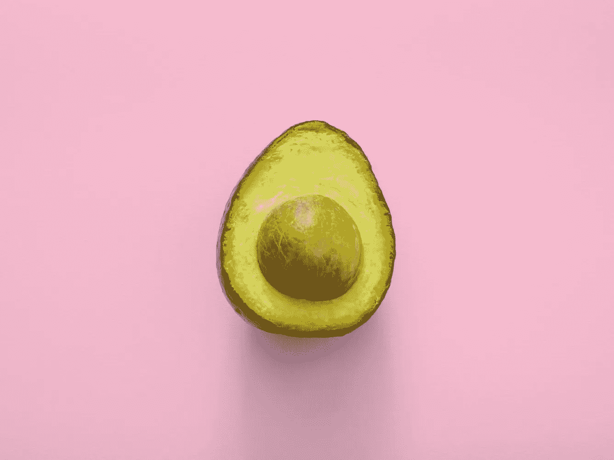
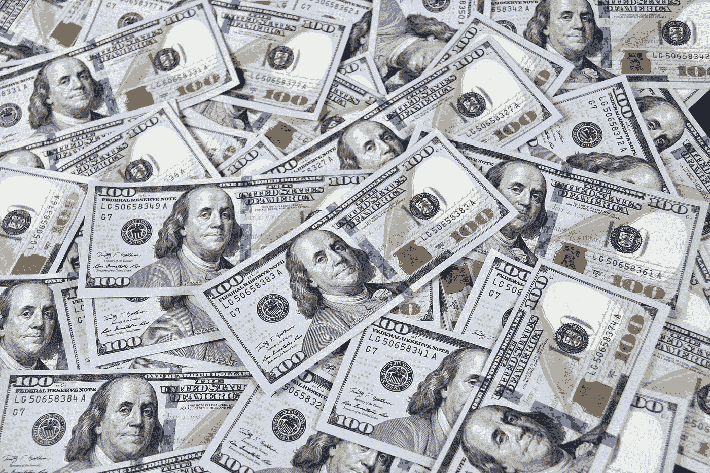

# 阶级斗争:Reddit、GameStop 和对冲基金

> 原文：<https://medium.com/coinmonks/class-warfare-reddit-gamestop-hedge-funds-7c34cfbd2c27?source=collection_archive---------5----------------------->

Pixabay (Pexels)

过去一周我们所看到的绝对是非凡的。Reddit "[**r/Wall Street bets**](https://www.reddit.com/r/wallstreetbets/)**"的一群散户，在埃隆·马斯克和查马斯·帕里哈皮蒂亚的支持下，**搞垮了华尔街当权派。****

**这是一场完全的阶级斗争，非常精彩。**

**对于那些刚刚加入对话或很难理解发生了什么的人，请允许我给你一个非常高层次的概述。以下是 Reddit 上的一个社区、一家名为 GameStop 的游戏公司和对冲基金之间发生的事情。**

# ****GameStop 上的一点小背景****

**GameStop 是一家视频游戏和商品零售商。它有 5000 多家商店，其中大部分在北美、欧洲和澳大利亚。鉴于世界已经数字化，以及最近新冠肺炎·疫情的出现，Gamestop 一直在努力跟上这一趋势，并在财务上遭受损失。**

****

**Pixabay (Pexels)**

**直到 **RC Ventures** ，由**耐嚼创始人瑞安·科恩管理，** 承担了三个董事会席位，并表示:**

> **“我们很高兴能把我们以客户为中心的心态和技术体验带到 GameStop 和它的战略资产中……扩大它取悦客户的方式，并成为游戏玩家的最终目的地。”**

**在声明发布的当天(1 月 11 日)**，GameStop 的股票价格(GME)约为每股 20 美元。现在，该股已飙升至每股 200 美元/256 加元左右。**但是是什么原因导致股价暴涨呢？**

**两件事:**短挤压**和**伽玛挤压**。为了简化这篇文章，*我将把重点放在短消息上。但是我们将在稍后更深入的文章中触及伽马挤压。***

# ****什么是短挤？****

****TL；DR:卖空是一种押注股价下跌的方式(希望获利)。****

**当卖空者被迫买入股票来填补他们的空头头寸时，就会出现空头挤压。这里有一个受[萨希尔·布鲁姆](https://twitter.com/sahilbloom/)启发的例子。**

**想象你读到墨西哥正在经历一个非常潮湿的夏天。你认为这会导致鳄梨大丰收，让鳄梨充斥市场，压低价格。**

**你想从中获利，所以你向你的邻居吉米借了一袋鳄梨。你把这袋鳄梨以 20 美元的价格卖给你的另一个邻居保罗，这是你在市场上买的价格。你现在有 20 美元，但你还欠吉米一袋鳄梨(毕竟是你借的)。**

****

**Thought Catalog (Unsplash)**

**一个月后，鳄梨的价格下跌了 50%。你在当地商店花 10 美元买了一个袋子，走到吉米家，把新的一袋鳄梨递给他，并给他 1 美元作为借来的袋子的利息。**

**所以你以 20 美元的价格卖掉了一个借来的包，然后以 11 美元的价格买了回来(10 美元加上 1 美元的利息)。你已经在你的牛油果“空头”头寸上赚了 9 美元！**

**当然，如果你错了，鳄梨的价格上涨了，你仍然要通过买一袋回来给吉米来“弥补”你的空头。换句话说，你会赔钱。**

**因为*价格可以无限上涨(理论上)，卖空的损失是没有上限的。***

**假设鳄梨的价格确实大幅上涨到了 50 美元——然后你会争先恐后地去买鳄梨来弥补你的空头(因为如果你再等下去，它可能会进一步上涨，你将不得不花 100 美元买一袋鳄梨来代替你从吉米那里借的那袋！).**

****当卖空者被迫平仓时，这就是所谓的卖空交易。**这是华尔街为了盈利而实施的策略。**

# **Reddit 明白了华尔街卖空的肮脏游戏**

**r/wallstreetbets 上的一名 redditor 注意到，一家价值数十亿美元的对冲基金 [Melvin Capital](https://www.cnbc.com/2021/01/27/hedge-fund-targeted-by-reddit-board-melvin-capital-closed-out-of-gamestop-short-position-tuesday.html) 对 GameStop 进行了大量的做空交易。他们成功地说服了线程中的每个人联合起来，尽可能多地购买 GameStop 的股票。**

**这使得 GameStop 的股价上涨。因此，当对冲基金不得不购买股票来弥补他们的空头时，他们以非常高的价格购买，基本上损失了一大笔钱。你要多少……**

**他们的损失超过了 131 亿美元。**

****

**John Guccione (Pexels)**

****Melvin Capital 不得不平仓，并以更高的价格回购所有 GameStop 股票，这使得股价进一步上涨。这是一个第二十二条军规。****

**现在，围绕 Melvin Capital 宣布破产的传言正在流传，reddit 线索正在通过其他对冲基金进行大量做空，以便他们也能挤出这些资金。**

**至少可以说，对冲基金是疯狂的，他们让政府和证券交易委员会介入监控这种情况——包括监控 reddit。毫不夸张地说，对冲基金和金融机构因为亏损而哭泣。**

**他们曾经被视为资本的天才管家，现在却被互联网上随机出现的新手投资者摧毁，这些投资者的用户名有**“DeepFuckingValue**”和**“咆哮的小猫”****

# ****GameStop 正在给世界上一个关于分散金融(DeFi)价值的速成班****

**这不是一夜之间的轰动。这种怨恨始于 2008 年祖科蒂公园的占领华尔街运动。**

**从那以后，人们可能已经离开了公园，但那种被华尔街耍了的感觉从未消失安东尼·庞普利亚诺**

**现在，这种怨恨被美联储、政府和银行所激怒。他们继续干预和操纵市场以获取利润。他们不关心美元正以令人难以置信的速度贬值，通货膨胀继续上升，人们的财富正在大幅缩水。他们认为只要人们不明白发生了什么，他们就能继续获利。**

**但是，Reddit 揭露了他们的肮脏游戏。**

> **“所以有数百万人因过去的经历而留下心理创伤，并持续感觉被抛在后面。但是互联网介入并创造了一条生命线——在过去十年中，对信息、通信工具和金融市场的访问突然显著增加。你不需要彭博终端和传统的经纪账户来玩游戏。”**

# ****最后一句话……****

**对于比特币赖以生存的去中心化金融体系而言，这是一场无意但精彩的营销活动。作为一种加密货币，比特币是一种数字资产，你可以 24/7/365 全天候投资，无需操纵或干预。**

****

**Thought Catalog (Unsplash)**

**相反，Robinhood 今天早些时候宣布限制 GameStop 股票的交易，理由是“最近的波动”与此同时，对冲基金可以自由交易股票，这再次提醒我们，谁从我们的金融体系中受益。作为回应，Robinhood 用户对 Robinhood 应用程序提起集体诉讼，因为它限制了他们的交易，并最终限制了他们的自由。**

**这个世界已经厌倦了，他们现在想要一个系统的改变。他们开始看到权力下放的力量，财富获取的平等，他们终于掌握了自己改变世界的力量。与 2008 年唯一不同的是，现在我们都准备好了。**

**欢迎来到你分散的未来…**

# ****这篇文章的要点****

*   **目前的金融体系存在双重标准，这再次证明了我们为什么需要分散我们的金融业。**
*   **如果你的股票交易账户可以被限制，那么你的银行账户也可以。我们只需要错误的人掌权。这里有一个选择，选择退出，并使用一种你可以更好地控制的货币([#比特币](https://netcoinsteam.slack.com/archives/CTL417J68))。**
*   **想象一下:如果股票在区块链发行，普通投资者将拥有他们自己的股票。通过这种方式，华尔街可以更有效地进行投资，监管机构也可以更准确地监控市场。**
*   **放开市场。**

****非常感谢您花时间阅读我的文章！如果你喜欢读它，你可以给这篇文章一些掌声来支持我。你也可以在[推特](https://twitter.com/Ayelen_Osorio)上关注我，了解更多关于比特币的更新和课程。感谢你阅读❤**

*   *****PS。希望投资比特币或加密，请查看*[*net coins . ca*](https://netcoins.ca/)**