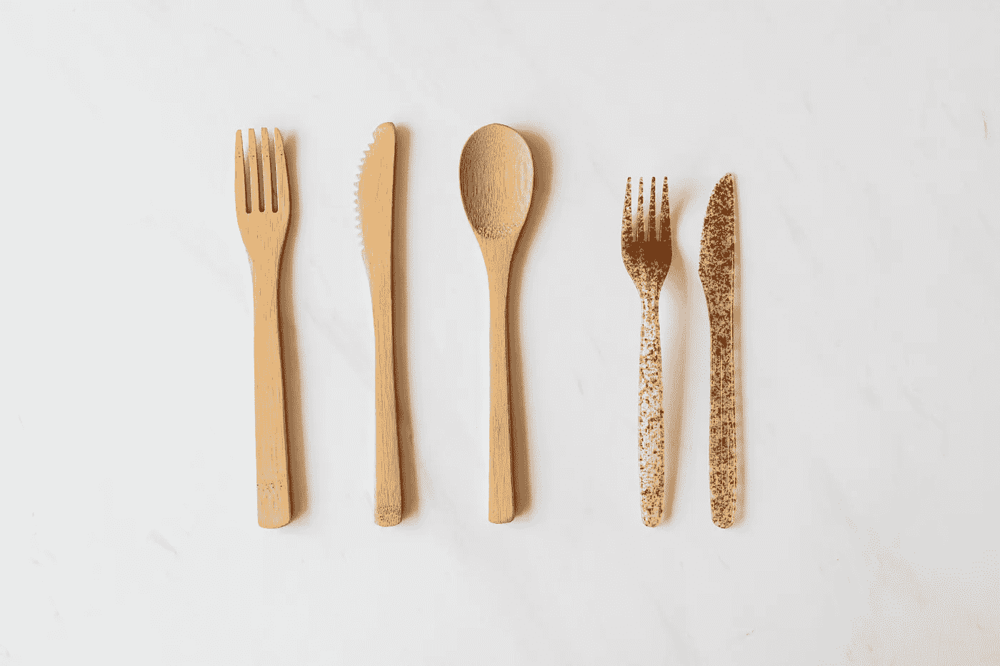

# 打扫该死的厨房👨‍🍳—用来解释区块链的学生生活🔗

> 原文：<https://medium.com/coinmonks/clean-the-freaking-kitchen-students-life-used-to-explain-blockchain-d90be2cf99f7?source=collection_archive---------3----------------------->

大家好👋,

我经常努力解释区块链到底是什么东西。是货币吗？是比特币吗？它是一个计算机程序吗？还是很多？这到底有什么用？这些是我得到的一些问题。不用担心，区块链的概念很简单。区块链是: