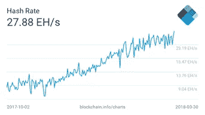
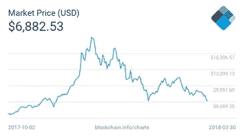

# 云挖掘经验重述:学习的成本超过了损失..

> 原文：<https://medium.com/coinmonks/cloud-mining-experience-retold-the-cost-of-learning-outweighs-the-loss-7e80271c4f88?source=collection_archive---------4----------------------->

Photo by [Taylor Vick](https://unsplash.com/@tvick?utm_source=medium&utm_medium=referral) on [Unsplash](https://unsplash.com?utm_source=medium&utm_medium=referral)

更新(2020 年 6 月):自从我在 2018 年 1 月发表这篇文章以来，两年多过去了，采矿业经历了一些艰难时期。看看从那时起的观察结果到现在为止有多相关是很有趣的。注意，底层 [*比特币*](https://blog.coincodecap.com/a-candid-explanation-of-bitcoin/) *价格较高但不完全关闭。此外，自最初的写作时间以来，它经历了上下波动。*

回到 2018 年 1 月初，我决定多了解一下[云采](https://blog.coincodecap.com/what-is-cloud-mining)(“CM”)。比特币大约是 15，000 美元，我想知道对于小投资者来说，CM 是否是一个可行的切入点，比直接购买要好。

牢记这一点，我决定研究一下。显然，合同价格、期限和 BTC 价格是重要因素。不太明显的因素是难度和散列率。回想起来，一句话就足够解释了:“封锁时间将保持在 10 分钟左右，因此随着计算能力的增加，难度也会增加，这将导致你的采矿产量相应减少。”

在炒作、推荐、困惑和可靠的信息之间——这是存在的，但有些模糊。透过薄雾，我计算出一个较低的产量，同样的 BTC 价格，并计算出一年的可观回报。我已经明白，当那一年过去时，散列函数的用处将会大大减少，因此终生合同不再有意思。

我不会深入讨论退出问题，因为这不是一篇评论或批评，所以让我们继续讨论通用 CM 动态。

由于这是一次实验和学习经历，我只愿意投入很少的资金，所以我用 11 美元从 Hashflare 购买了 0.05 TH/s。https://hashflare.io/:还有一件事我必须调查，但我忽略了。你能猜到吗？

当然，**是维护费！**

以下是我忽略的原因:0.01 秒的价格是 0.0035 美元。当时每 0.01 秒开采 0.00000150 BTC。因此，产量为 0.0225 美元，成本为 0.0035 美元(大约。0.00000023 BTC)。我想，即使到年底难度增加了 5 倍，我也能平均每 0.001 次产生 0.00000090 个 BTC。这仍将覆盖成本，并承受一些价格下降。

现在是第二个猜测——这个假设有什么问题？有人吗？

除了交易费和提款问题等无数跑题的问题之外，还有一个复杂的问题，它在接下来的几周内引发了完美风暴，直到现在。事实上这很简单，简单到让人难以忽视..维护费用不在 BTC，而是以美元计算！

所以在进行实验的 3 个月中，对因素的回顾是为了理解这个问题:

散列率:从 1500 万 TH 上升到 2800 万 TH，上升了 86%。

价格:15000-6800 降 55%。

每生产 0.01 吨:下跌 48%，至 0.00000072 BTC。

维护费:美元相同。

有趣的是，同样的美元汇率在 BTC 换算成 0.00000051 BTC 时，就相当于“上涨 121%”。因此，利润率下降到 0.00000021 BTC。现在考虑到稳定的价格和 2 倍的散列功率，该合同将在今年剩余的时间里开采大约 0.00000059 BTC，几乎只包括维护费。这一结果将导致今年晚些时候约 80%的损失和合同中止。

我比那个稍微积极一点！我假设年末 BTC 价格为 12，000 美元，并且可以很容易地假设每 0.01 个季度的 BTC 总产量为 0.0001。那就是每 0.01 美分投资 2.2 美元，回报 1.2 美元，只有 45%的净亏损。

对于任何特定 CM 提供商的怀疑者，让我声明这个定价方案过去是，现在也是更好的选择之一。平均水平不会比这更好，所以要着眼于大局而不是名字。

矿业公司的反应是降低价格，在 Hashflare 的例子中，他们削减到 1.2 美元，这目前是亏损的，但在我的假设中，对于新进入者来说可能只是收支平衡。

为了进行更新的评估，我使用了 https://hashflareprofit.com/的[并输入了以下内容:7000 美元 BTC 价格保持稳定，没有再投资，难度增加一半至每 13 天 3%。](https://hashflareprofit.com/)

对于 120 美元的第一次投资，这净损失 13，89 美元。盈亏平衡在 13，600 美元左右。

这个现实生活中的实验表明:CM 依赖于许多相互作用的变量，如合同价格和期限、BTC 价格、散列率和难度以及维护费用。按照目前的标准， **CM 被打破**。随着价格下降如此之快，散列值的显著增加已经被判了短期死刑，并将持续几个月。那就清楚了..自然，这将发生在 BTC 价格上涨和/或强制哈希利率调整。当这种情况发生时，我相信只要供应商在透明度、服务质量和合同规范方面有很大改进，这种投资池模式就有生命力。在这些指标上，https://www.genesis-mining.com/[的创世矿业](https://www.genesis-mining.com/)似乎是市场的领导者，尽管长期以来饱受产能不足之苦。

我的职业是私募股权投资者，我从 2017 年底开始才开始关注加密领域——这几乎是一个可怕的时间，但却是一个学习的好机会。我认为 2017 年出现了大量寻求短期利润的投资流入加密货币，这极大地扭曲了市场的上行，然后在价格指标上下跌。然而在庞氏骗局、虚假矿业公司和搞笑 ico 的其他指标上；现场遭受了进一步的损失，但仍然设法在技术、社区建设和治理模式方面进行了强有力的创新。

这是一个作家脱口而出“但并非一切都是坏的”——我强烈反对，我认为一切都是混乱的，但很好，这种损害是健康的。区块链和加密货币领域取得了巨大的技术进步。比特币本身正在成为一种标准，替代货币正在提供替代解决方案，主要的 web 3.0 工作正在进行，数百万人已经接触到这一场景，我们可能只是处于这一漫长过程的第二个季度，这一过程将深刻改变它所涉及的大部分内容。

2018 年 3 月 31 日

> [在您的收件箱中直接获得最佳软件交易](https://coincodecap.com/?utm_source=coinmonks)

