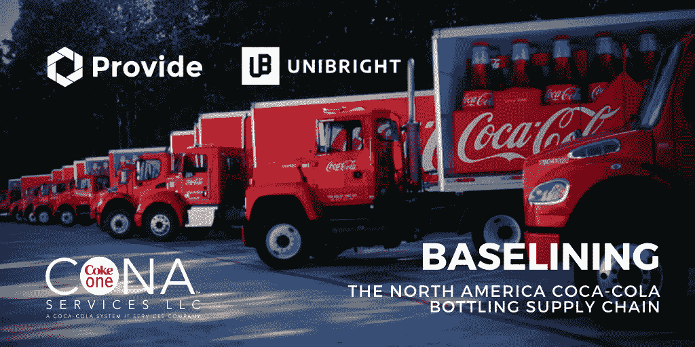
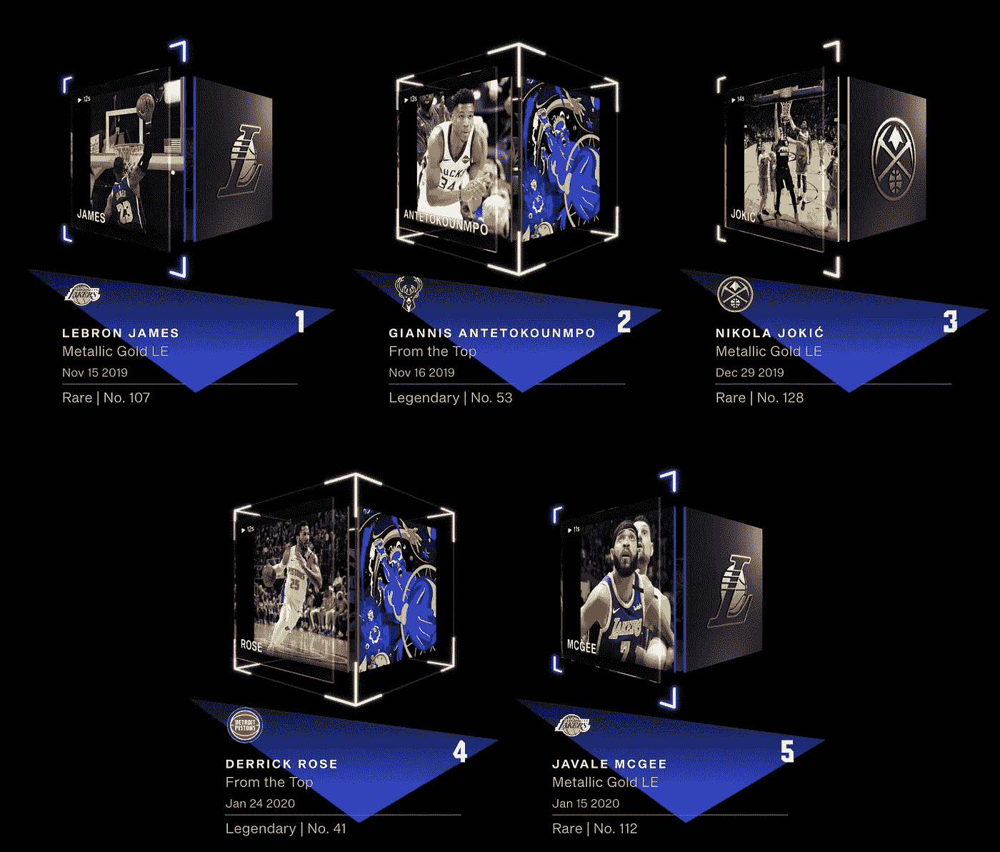
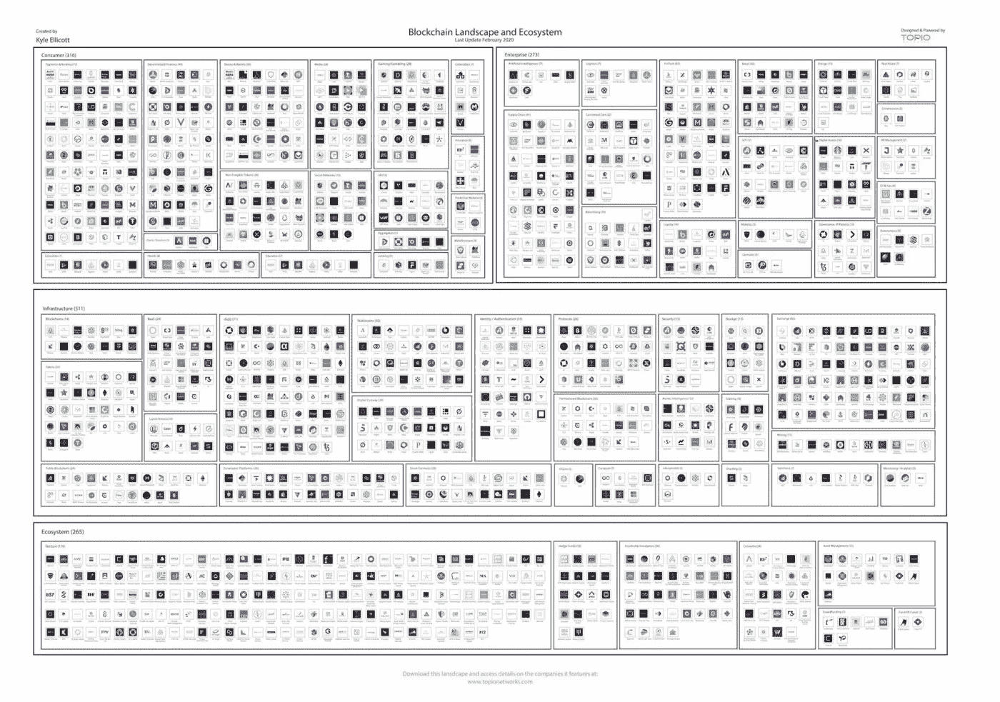

# 可口可乐在整个供应链中扩展区块链/ Dapper Labs 在 NFT 的销售额增加了 120 万美元/ 85%的意大利银行正在使用 R3 的 Corda

> 原文：<https://medium.com/coinmonks/coca-cola-expanding-blockchain-across-supply-chain-dapper-labs-raises-nets-1-2m-in-nft-sales-b27219afd808?source=collection_archive---------0----------------------->

*2020 年 8 月 7 日*

***本周景观****……在我们的上一个夏季月份，没有行业放缓或停滞的迹象，相反情况恰恰相反。我们一整年都在谈论 2020 年是区块链景观的基础年，现在我们看到了它的实际影响。自 1 月份以来，我们已经看到更多的真实世界采用和用例在整个企业中应用，基础设施改进激增，数字货币&cdbc 成为许多政府目标的首要目标，NFTs&数字资产向世界展示自己，DApps 为进入市场铺平了道路，DeFi 总价值达到 40 亿美元以上…这只是一个开始。*

**(可口可乐一北美)是* ***基线化*******可口可乐*** *装瓶供应链和扩大其使用的区块链(以太坊)。说到* ***以太坊*** *，区块链本周早些时候庆祝了它的五岁生日。****Dapper Labs****宣布从风投那里筹集 1200 万美元资金，并招募了一批****NBA****球员。此外，该团队分享说，他们的****NBA Top Shot****应用程序已经在 NFT 获得了 120 万美元的销售额——这对 DApps 和 NFT 来说是一个巨大的消息。85%的意大利银行都在使用* ***R3 的 Corda*** *。中国的国营银行现在正在测试的钱包为* ***数字元*** *。* ***雅达利*** *VCS 成为第一台区块链游戏机——小心任天堂 Switch！投资者，* ***电力资本，*** *宣布成立一只 1.1 亿美元的基金，专注于种子&A 轮投资。* ***【比特币基地】*** *钱包现在将通过* ***支持加密域不可阻挡的域*** *。有报道称，Uniswap 已经在 6 月份筹集了 1100 万美元的首轮融资。****Travala****新增 100 万套加密和数字货币预订房屋。***在* ***蜡*** *上创造了历史，拥有一批 NFTs。****BSN****的全球门户网站将于 8 月 10 日推出，目标是在 2021 年 6 月前整合 30–40+个区块链公共网络，等等！尽情享受吧！****

## **🚚[确立北美可口可乐装瓶供应链的基准](https://provide.services/baselining-the-north-america-coca-cola-bottling-supply-chain/)**

****

**[Source](https://provide.services/baselining-the-north-america-coca-cola-bottling-supply-chain/)**

**CONA(可口可乐北美公司)现在希望将使用案例从内部网络扩展到更多的受众。利用[基线协议](https://www.baseline-protocol.org/)，目标是建立一个“可口可乐装瓶港”，实现[可口可乐装瓶供应商](https://cointelegraph.com/news/coca-cola-embraces-dlt-and-ethereum-for-supply-chain-efficiency)的低壁垒网络入职流程。这不仅简化了内部装瓶商——供应商向装瓶网络提供产品的能力，而且外部供应商(如罐头和瓶子等原材料供应商)也可以从集成的、私有的、分布式集成网络中受益。… [阅读更多](https://provide.services/baselining-the-north-america-coca-cola-bottling-supply-chain/) — [提供](https://medium.com/u/7805b864557?source=post_page-----b27219afd808--------------------------------) & [Unibright.io](https://medium.com/u/9fe2494e51f4?source=post_page-----b27219afd808--------------------------------)**

## **🇮🇹 [85%的意大利银行正在 Corda 上交换银行间转账数据](https://www.coindesk.com/85-of-italian-banks-are-exchanging-interbank-transfer-data-on-corda)**

**85%的意大利银行正在使用 R3 的 Corda([Corda 团队](https://medium.com/u/b90392771839?source=post_page-----b27219afd808--------------------------------))区块链，因为它大大加快了交易日志的双重检查过程，从 30-50 天缩短到一天。使用 Corda 进行银行间的数据交换比在区块链上移动菲亚特的风险更低……[阅读更多](https://www.coindesk.com/85-of-italian-banks-are-exchanging-interbank-transfer-data-on-corda)**

## **🇨🇳 [中国的目标是在谷歌、亚马逊和微软的帮助下成为世界上占主导地位的区块链力量](https://www.coindesk.com/china-aims-to-be-the-worlds-dominant-blockchain-power-with-help-from-google-amazon-and-microsoft)**

**一个来自中国的国家支持的区块链基础设施项目旨在成为分散应用(DApps)的主要互联网服务提供商。但该网络对美国云服务提供商的依赖使其容易受到地缘政治风险的影响。亚马逊网络服务(AWS)、微软和谷歌是 BSN 海外数据中心的主要云服务提供商。美国政府正在考虑限制中国云服务公司在美国运营。然而，它尚未解决美国公司托管有中国连接的应用程序的问题… [阅读更多信息](https://www.coindesk.com/china-aims-to-be-the-worlds-dominant-blockchain-power-with-help-from-google-amazon-and-microsoft)**

***相关:*🏦[*全系统上线中国 DCEP 数字货币*](https://decrypt.co/37897/all-systems-go-for-launch-of-chinas-dcep) *—* [*解密*](https://medium.com/u/2de7a312127a?source=post_page-----b27219afd808--------------------------------)**

***相关:* 🇨🇳 [*中国国营银行据传测试钱包为数字元*](https://cointelegraph.com/news/chinas-state-run-banks-reportedly-testing-wallet-for-digital-yuan)**

## **👾[游戏行业使用区块链可能会导致大规模采用](https://cointelegraph.com/news/gaming-industry-use-of-blockchain-may-lead-to-mass-adoption)**

**采用区块链技术是由游戏驱动的，游戏将用户的动机从纯粹的投机转向在区块链平台上交易。CryptoKitties 是第一个真正的区块链游戏应用。据 EsportsBets 报道，今年领先的区块链游戏大多是卡牌游戏，RTS 游戏紧随其后……[阅读更多](https://www.coindesk.com/85-of-italian-banks-are-exchanging-interbank-transfer-data-on-corda)**

***相关:* 🕹️ [*雅达利 VCS 成为区块链第一游戏机*](https://www.nederob.nl/2020/08/04/atari-vcs-becomes-first-blockchain-gaming-console/)**

***相关:*👾[*区块链游戏的演进:三大阶段*](https://cointelegraph.com/news/the-evolution-of-blockchain-games-three-major-stages)**

## **🏘️ [荷兰监管机构批准令牌化房地产众筹平台](https://cointelegraph.com/news/dutch-regulator-approves-tokenized-real-estate-crowdfunding-platform)**

**荷兰区块链的房地产众筹平台 Max Crowdfund 获得了荷兰金融市场管理局的批准。该许可将允许母公司 Max Property Group 与 DLT 供应商 Jelurida 合作推出该平台。用户可以在 iOS 和 Android 上使用该平台的应用… [阅读更多信息](https://cointelegraph.com/news/dutch-regulator-approves-tokenized-real-estate-crowdfunding-platform)**

# **本周的更多内容:**

**⚡ [宣布我们的 1.1 亿美元种子&a 轮基金](/electric-capital/announcing-our-110m-seed-series-a-fund-9861f6a9e1a1)——[电气资本](https://medium.com/u/3cc66c573073?source=post_page-----b27219afd808--------------------------------)**

**🦄 [SEC 文件显示，Uniswap 在 6 月份筹集了 1100 万美元](https://www.theblockcrypto.com/linked/74182/sec-filing-uniswap-funding-june)、[A 轮](https://uniswap.org/blog/uniswap-raise/)**

**💸大型机收购 Sablier.finance**

**🏦[区块链审计服务为中国区块链行业带来安全](https://decrypt.co/36918/blockchain-audit-service-brings-security-to-chinas-blockchain-industry)**

**⚙️ [区块链在超自动化背景下的角色](/51nodes/the-role-of-blockchain-in-the-context-of-hyperautomation-653bcd60f756)**

**💸[基于使用的支付如何支持基于区块链的综合商业生态系统](/@philippsandner/how-usage-based-payments-are-enabling-blockchain-based-integrated-business-ecosystems-63b3476c76b2)**

**📖[22 个区块链项目已经向 Reddit 提交了他们的以太坊扩展方案，用于其令牌项目](https://www.theblockcrypto.com/post/73885/22-blockchain-projects-ethereum-scaling-proposals-reddit)**

**📖[JD.com 规划中国智能合同法](https://decrypt.co/37780/jd-com-lays-out-vision-for-smart-contract-laws-in-china)**

**💸[区块链游戏《无限舰队》的 310 万美元私人代币募集](https://www.coindesk.com/charlie-lee-adam-back-private-sto-round-blockchain-game-infinite-fleet)**

**💸[比特币基地](https://medium.com/u/b9034df3e57a?source=post_page-----b27219afd808--------------------------------) [钱包现在支持。通过](https://www.theblockcrypto.com/linked/74024/coinbase-wallet-crypto-blockchain-domains-unstoppable-domains) [加密区块链域名不可阻挡的域名](https://medium.com/u/8e928ab8a576?source=post_page-----b27219afd808--------------------------------)**

**🔋[使用比特币 Sidechain 的区块链能源交易试点在洛杉矶上线](https://cointelegraph.com/news/blockchain-energy-trading-pilot-using-bitcoin-sidechain-goes-live-in-la)**

**🏨 [Travala 增加了 100 万个可以通过 Crypto 预订的度假屋](https://cointelegraph.com/news/travala-adds-1-million-more-holiday-homes-you-can-book-with-crypto)**

# **DApps(分散式应用)手表:**

## **🏀 [Dapper Labs 从风投公司和 NBA 球员那里筹集了 1200 万美元，在 NFT 的销售额为 120 万美元](https://cointelegraph.com/news/dapper-labs-raises-12m-from-vc-firms-and-nba-players-nets-12m-in-nft-sales)**

**

Source: [David Pakman](https://medium.com/u/eaa782328eda?source=post_page-----b27219afd808--------------------------------)** 

**CryptoKitties 和 NBA Top Shot 背后的团队 Dapper Labs 在最新一轮投资中为其 [Flow](https://medium.com/u/22ac47d15ea7?source=post_page-----b27219afd808--------------------------------) 区块链获得了 1200 万美元。新的投资者包括比特币基地风险投资公司、BlockTower Capital，以及迈阿密热火队的 NBA 球员安德烈·伊戈达拉、布鲁克林篮网队的加勒特·坦普尔、洛杉矶湖人队的贾维尔·麦基和奥兰多魔术队的阿隆·戈登。Dapper 的首席执行官兼创始人 Roham Gharegozlou(T6)表示，这笔资金将用于“确保流量可以扩大到吸引像 NBA 这样大的粉丝群的项目规模。” [Dapper Labs](https://medium.com/u/6544777e30d2?source=post_page-----b27219afd808--------------------------------) 还透露，在其两个月大的 NBA Top Shot 平台测试版上，它已经向数百名早期用户出售了价值超过[120 万美元的加密收藏品。该游戏是 Dapper 的旗舰游戏，建立在流量区块链。](https://pakman.com/here-comes-digital-sports-collectibles-b7c1c2f294cf) [Top Shot](https://www.nbatopshot.com/) 允许玩家购买不可替换的代币( [NFTs](https://cointelegraph.com/tags/tokens) )，代表篮球历史上的重大“时刻”。Top Shot 已经向大约 900 名活跃的测试版用户出售了 22，000 多包价值 120 万美元的非功能性食物… [阅读更多](https://cointelegraph.com/news/dapper-labs-raises-12m-from-vc-firms-and-nba-players-nets-12m-in-nft-sales)**

***相关:📖* [*数码体育收藏品来了**](https://pakman.com/here-comes-digital-sports-collectibles-b7c1c2f294cf)*——*[*大卫·帕克曼*](https://medium.com/u/eaa782328eda?source=post_page-----b27219afd808--------------------------------)**

***相关:📖* [*威廉·夏特纳在蜡区块链上创造历史！*](https://www.prnewswire.com/news-releases/william-shatner-makes-history-on-the-wax-blockchain-301103510.html)**

## **🇨🇳 [中国 BSN 的目标是在一年内整合 40 家公共连锁店](https://cointelegraph.com/news/chinas-bsn-aims-to-integrate-with-40-public-chains-within-a-year)**

**红枣科技首席执行官何一凡分享了中国基于区块链的服务网络( [BSN](https://medium.com/u/6a485161573d?source=post_page-----b27219afd808--------------------------------) )的计划，该计划旨在到 2021 年 6 月整合 30-40 个区块链公共网络。第二年，它将进一步整合更多的区块链，使这一数字翻一番。BSN 是中国第一个政府支持的区块链计划，于 4 月启动，最初定位于帮助中小型企业和企业家在获得许可的区块链上构建和部署区块链应用… [阅读更多信息](https://www.coindesk.com/everything-you-need-to-know-about-ethereum-2-0)**

***相关:📖* [*BSN 全球门户将于 2020 年 8 月 10 日推出*](https://twitter.com/bsnbase/status/1291739751876190209)**

**📖 [LTO 网络集成 Chainlink Oracles，将认证数据引入以太坊 dApps](https://blog.ltonetwork.com/chainlink-oracles-b2b-accreditation-ethereum/)**

**📖以太坊联合创始人计划为 dapps 开发一个社交“超级应用”**

**📖[符号化社区的四种范式](/abridged-io/four-paradigms-of-tokenized-communities-8be5e6a07832)——[詹姆斯·邓肯](https://medium.com/u/89702594d219?source=post_page-----b27219afd808--------------------------------)**

**📖[介绍个人代币代理](/@coopahtroopa.eth/introducing-the-personal-token-agency-533e433ee4dc) — [库珀·特利](https://medium.com/u/af8b40222d18?source=post_page-----b27219afd808--------------------------------)**

**📖[播客主持人在平衡器上列出自己:“埃文”在 2 小时内增加 500%](https://cointelegraph.com/news/podcast-host-lists-himself-on-balancer-evan-increases-500-in-2-hours)**

# **📺基线上的知识下降& #VCTV:**

**本周在我们的第二集 [**中，基线**](https://www.baseline-protocol.org/) **、** [约翰·沃伯特](https://medium.com/u/26a7c53cdfeb?source=post_page-----b27219afd808--------------------------------)和我一起分析了 [**丹·伯内特**](https://entethalliance.org/about/eea-team/)[**企业以太坊联盟(EEA)**](https://entethalliance.org/) 的新方向，以太坊 2.0、DeFi、DApps、业务自动化等等！每周三美国东部时间中午 12:00 在 YouTube 上直播。每周我们都会与客人讨论 mainnet、基线协议、企业中的区块链以及他们对业务自动化的见解。**

**Source: [YouTube](https://youtu.be/yiCsluUPZGs?t=74)**

## **投资者对金融科技和区块链的见解—2020 年 8 月 6 日**

**Source: [YouTube](https://youtu.be/f_J6JbOQcNI)**

# **🎙️研究:2020 年区块链和 DApps 状况:**

****

**Source: [Topio Networks](https://www.topionetworks.com/markets/dapps-stack-landscape-5de8d07eb9abe453e04203f8)**

***现已上市，免费提供的是我最新研究的去中心化应用或* [***DApp“叠”景观图***](https://s3.amazonaws.com/spoke-profiles-prod-assets/uploads/a069e1e1e798c975d4eca968c72f4ac1352d62a4/original/DApps_Stack_Landscape_Q2_2020.pdf?utm_source=Social%20Media&utm_medium=LinkedIn&utm_campaign=Topio%20-%20Dapps%20Landscape%20update&utm_content=S3%20Link)**——Q2 2020 年版。这张地图提供了新兴 DApps 行业的全面概述和分类，突出显示了在构建下一代应用程序中发挥重要作用的 400 多家全球公司。作为奖励，我包括了一些生态系统玩家和团体，当你准备发布你的应用时，你需要熟悉它们。如果这是你看到的第一个版本，那就把它当作你进一步理解不仅仅是这个行业，而且是构建一个完全或部分去中心化的应用程序所需的所有核心技术的指导性路线图(DApp)。****

****

**Source: [Topio Networks](https://www.topionetworks.com/markets/blockchain-landscape-5bf43854b9abe4633c1f87da)**

***另外可以找我的 Q1 2020 研究整个* [***区块链格局***](https://www.linkedin.com/posts/kyleellicott_q12020-blockchain-landscapekyleellicotttopionetworks-activity-6638879840634310656-UNtB) *。这是《风景》的第五版。你会发现地图上包括 747 家公司(总共 900 多家独特的+更广泛的关键生态系统参与者)，它们从 2010 年到 2020 年筹集了 220 多亿美元的资金，仅 2017 年以来就投资了 180 多亿美元！***

**📣*想要了解区块链、DApps、DeFi 和 FinTech 行业的所有头条新闻、投资、深入研究和最新动态吗？* [***订阅***](https://www.topionetworks.com/newsletters) *关注我的* [***推特***](https://twitter.com/kyleellicott) *每周更新还有更多！***