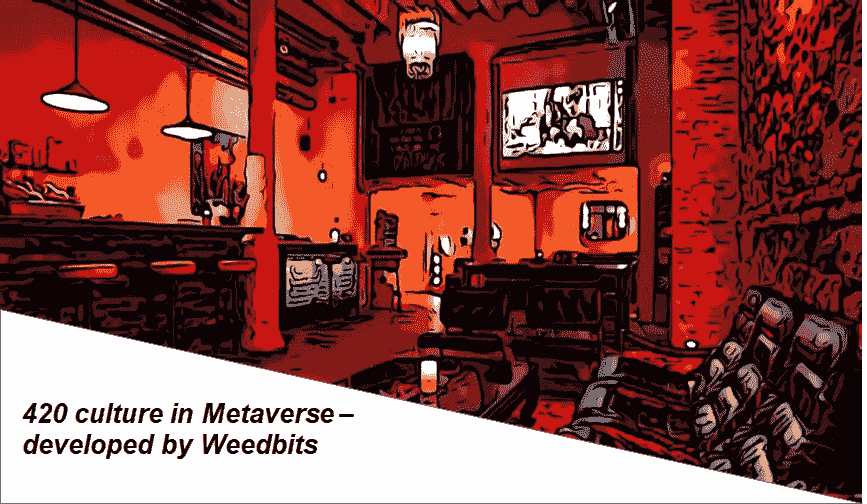

# 代号“420”:威比特 NFT 将 420 文化氛围带到了元宇宙

> 原文：<https://medium.com/coinmonks/code-420-weedbit-nft-bringing-the-420-culture-vibe-to-the-metaverse-5e28dfd1304?source=collection_archive---------5----------------------->

# **你知道什么是‘420’或者它是如何产生的吗:**

420、4:20 或 4/20(发音为 4-20)是大麻文化中大麻和印度大麻脂消费的俚语，尤其是在下午 4:20 左右吸烟，也指每年 4 月 20 日举行的大麻庆祝活动。(参考自[维基](https://en.wikipedia.org/wiki/420_(cannabis_culture)))。

**一个由一群高中生发起的仪式，很快 420 就成了吸食大麻的代名词:**1971 年，加利福尼亚州圣拉斐尔市的五名高中生根据种植者制作的藏宝图，用“4:20”这个词来表示一项寻找废弃大麻作物的计划。这五名学生——史蒂夫、戴夫、杰弗里、拉里和马克——自称为沃尔多一家，因为他们通常出没的地方“是学校外面的一堵墙”，他们指定圣拉斐尔高中(San Rafael High School)操场上的路易斯·巴斯德(Louis Pasteur)雕像为他们的集合地点，下午 4 点 20 分为他们的集合时间。

*Vancouver, April 20, 2012\. Source: Wiki*

沃尔多夫妇称这个计划为“4:20 路易”。在几次寻找庄稼的尝试失败后，该小组最终将短语缩短为“4:20”。High Times 的 Steven Hager 推广了 Waldos 的故事，这个故事最终演变成一个暗语，现在全球的 tokers 都用它来指代吸食大麻。

现在，4 月 20 日被全世界吸食大麻的人珍视为与朋友痛饮的理由，每年的 4.20 日都会举行集会/大规模人群聚集。

# 现在 420 可以不受限制地在元宇宙生活了。

一个由开发人员和艺术家组成的团队正在开发一个 Weedbits Club (WBC)，这是一个元宇宙的“420”会员专用的数字环境，志同道合的人可以在这里聚会和社交。在一个与世隔绝了 1.5 年的世界里，数字社区已经起飞。例如，私人会员社交网络俱乐部 Marque 每年向每位会员收取 2500 美元至 3000 美元的费用，以提供其社交聚会的独家访问权。

要访问 WBC，用户需要拥有一台 Weedbits NFT。目前，在“币安 NFT 市场”上可以买到数量有限的[weed bits NFT](https://weedbits.com/)，价格大约在 550 美元到 5000 美元之间。在 [ETH](https://cryptopurview.com/live-ethereum-usd-price/) 网络上的公共造币厂将于本月在[上线。除了仅限会员进入的俱乐部会所之外，业主每个月还会获得特殊津贴。这些额外津贴是以数字 420 为主题的齿轮的形式给予用户的好处。例如，如果一个人收集了 7 件稀有的龙枪装备，他们可以用它们来交换一件稀有的 NFT。](https://discord.com/invite/kWXPUsR2NB)

由于限量供应 10，420 枚，这些小玩意本身就很有价值，但增加这些收藏品价值的是实用性。收藏家们可以进入会员专用的俱乐部会所，那里有元宇宙的画廊/酒吧/舞台/竞技场，还有机会让成千上万志同道合的人私下交流。此外，那些拥有至少 2 个 Weedbits 的人可以在未来参与铸造第二代 Weedbits NFTs。

# **感兴趣？需要了解更多关于 NFT 和 Weedbits 俱乐部:**

不可替代代币(NFT)今年出现了爆炸式增长。尽管它们从 2014 年就已经存在，但现在却越来越臭名昭著。生态系统见证了班克斯画作的焚烧和皮普尔的“每一天:前 5000 天”艺术品在现在著名的佳士得拍卖中获得 6900 万美元的大肆宣传。

## 为什么对 NFT 这么狂热，毕竟他们只是 PFP？:

虽然从金融角度来看，收藏品没有内在价值，但考虑到买家对项目、艺术和围绕项目构建的用例的个人感受，它可能具有一些内在价值。

NFTs 的特定主题吸引了一个拥有者群体，因为他们把一种个性与提醒他们自己或他们想成为什么样的人联系在一起。因此，对于任何成功的 NFT 项目来说，他们如何建立一个引人注目的品牌故事或者他们如何区分他们 NFT 的主题是非常重要的。

## NFT 以杂草为主题，希望能吸引 420 名志同道合的人。

Weedbits exclusive 10k NFTs 的所有者将在元宇宙 Weedbits 俱乐部度过他们的放松时光——与志同道合的“420”社交，在竞技场(仅限会员的战斗游戏)玩耍，并享受以数字 420 为主题的装备形式的每月津贴。

该系列有 10，420 幅通过算法生成的杂草肖像，使用了极其罕见类型的智能合同——外星人 OG 和 24K 黄金出现了几次。类似于主题稀有性增加价值的交易卡，同样地，特定 NFT 的价值根据稀有特征而变化。有限发射 Weedbits 的稀有性可以从稀有性 Snipper 检查。

就像在现实世界中，没有两种资产可以表现出相似的特征或价值，同样，区块链上的每种 Weedbits 令牌化资产(NFT)都有独特的特征。

由于这些数字资产彼此不同，它们不可互换，因此被称为不可替代的令牌。就像有所有权证书的真实资产一样，NFT 代币在区块链上维护所有权记录和真实性证明，不能被篡改。

> 加入 Coinmonks [电报频道](https://t.me/coincodecap)和 [Youtube 频道](https://www.youtube.com/channel/UCbyDhTbOiKh2iUMKBi4-4Zg)了解加密交易和投资

## 另外，阅读

*   [AscendEx Staking](https://blog.coincodecap.com/ascendex-staking)|[Bot Ocean Review](https://blog.coincodecap.com/bot-ocean-review)|[最佳比特币钱包](https://blog.coincodecap.com/bitcoin-wallets-india)
*   [霍比审核](https://blog.coincodecap.com/huobi-review) | [OKEx 保证金交易](https://blog.coincodecap.com/okex-margin-trading) | [期货交易](https://blog.coincodecap.com/futures-trading)
*   [比特币基地跑马圈地](https://blog.coincodecap.com/coinbase-staking) | [Hotbit 评论](/coinmonks/hotbit-review-cd5bec41dafb) | [KuCoin 评论](https://blog.coincodecap.com/kucoin-review)
*   [最佳加密交易信号电报](/coinmonks/best-crypto-signals-telegram-5785cdbc4b2b) | [MoonXBT 评论](/coinmonks/moonxbt-review-6e4ab26d037)
*   [Coinswitch 俱吠罗评论](/coinmonks/coinswitch-kuber-review-1a8dc5c7a739) | [电网交易机器人](https://blog.coincodecap.com/grid-trading) | [比特币基地收费](/coinmonks/coinbase-fees-831e77d4f2c5)
*   [Bitget 回顾](https://blog.coincodecap.com/bitget-review) | [双子 vs 区块链](https://blog.coincodecap.com/gemini-vs-blockfi) | [OKEx 期货交易](https://blog.coincodecap.com/okex-futures-trading)
*   [OKEx vs KuCoin](https://blog.coincodecap.com/okex-kucoin) | [摄氏替代品](https://blog.coincodecap.com/celsius-alternatives) | [如何购买 VeChain](https://blog.coincodecap.com/buy-vechain)
*   [币安期货交易](https://blog.coincodecap.com/binance-futures-trading)|[3 comas vs Mudrex vs eToro](https://blog.coincodecap.com/mudrex-3commas-etoro)
*   [在印度利用加密套利赚取被动收入](https://blog.coincodecap.com/crypto-arbitrage-in-india)
*   [德国最佳加密交易所](https://blog.coincodecap.com/crypto-exchanges-in-germany) | [WazirX P2P](https://blog.coincodecap.com/wazirx-p2p)
*   [如何购买 Monero](https://blog.coincodecap.com/buy-monero) | [IDEX 评论](https://blog.coincodecap.com/idex-review) | [BitKan 交易机器人](https://blog.coincodecap.com/bitkan-trading-bot)
*   [币安 vs 比特邮票](https://blog.coincodecap.com/binance-vs-bitstamp) | [比特熊猫 vs 比特币基地 vs Coinsbit](https://blog.coincodecap.com/bitpanda-coinbase-coinsbit)
*   [如何购买 Ripple (XRP)](https://blog.coincodecap.com/buy-ripple-india) | [非洲最好的加密交易所](https://blog.coincodecap.com/crypto-exchange-africa)
*   [非洲最佳加密交易所](https://blog.coincodecap.com/crypto-exchange-africa) | [胡交易所评论](https://blog.coincodecap.com/hoo-exchange-review)
*   [eToro vs robin hood](https://blog.coincodecap.com/etoro-robinhood)|[MoonXBT vs Bybit vs Bityard](https://blog.coincodecap.com/bybit-bityard-moonxbt)
*   [Stormgain 回顾](https://blog.coincodecap.com/stormgain-review) | [Bexplus 回顾](https://blog.coincodecap.com/bexplus-review) | [币安 vs Bittrex](https://blog.coincodecap.com/binance-vs-bittrex)
*   [Bookmap 评论](https://blog.coincodecap.com/bookmap-review-2021-best-trading-software) | [美国 5 大最佳加密交易所](https://blog.coincodecap.com/crypto-exchange-usa)
*   [如何在 FTX 交易所交易期货](https://blog.coincodecap.com/ftx-futures-trading) | [OKEx vs 币安](https://blog.coincodecap.com/okex-vs-binance)
*   [如何在势不可挡的域名上购买域名？](https://blog.coincodecap.com/buy-domain-on-unstoppable-domains)
*   [印度的秘密税](https://blog.coincodecap.com/crypto-tax-india) | [altFINS 审查](https://blog.coincodecap.com/altfins-review) | [Prokey 审查](/coinmonks/prokey-review-26611173c13c)
*   [布洛克菲 vs 比特币基地](https://blog.coincodecap.com/blockfi-vs-coinbase) | [比特坎评论](https://blog.coincodecap.com/bitkan-review) | [币安评论](/coinmonks/binance-review-ee10d3bf3b6e)
*   [Coldcard 评论](https://blog.coincodecap.com/coldcard-review) | [BOXtradEX 评论](https://blog.coincodecap.com/boxtradex-review)|[unis WAP 指南](https://blog.coincodecap.com/uniswap)
*   [阿联酋 5 大最佳加密交易所](https://blog.coincodecap.com/best-crypto-exchanges-in-uae) | [SimpleSwap 评论](https://blog.coincodecap.com/simpleswap-review)
*   购买 Dogecoin 的 7 种最佳方式 | [ZebPay 评论](https://blog.coincodecap.com/zebpay-review)
*   [美国最佳加密交易机器人](https://blog.coincodecap.com/crypto-trading-bots-in-the-us) | [经常性评论](https://blog.coincodecap.com/changelly-review)
*   【Huobi 的加密交易信号 | [BitMEX 评论](https://blog.coincodecap.com/bitmex-review)