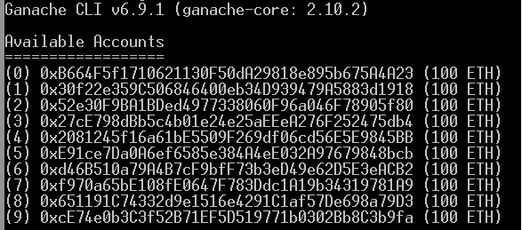
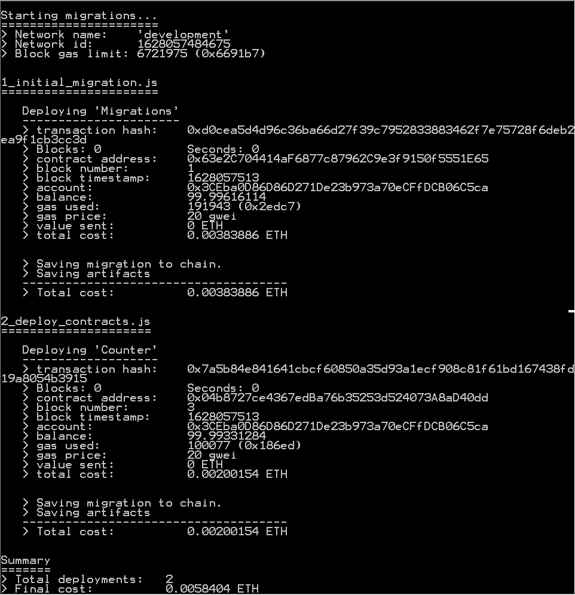

# 使用 Solidity、Truffle 和 Ganache 编写和部署您的第一个以太坊智能合约

> 原文：<https://medium.com/coinmonks/code-and-deploy-your-first-ethereum-smart-contract-b0fe6453daab?source=collection_archive---------6----------------------->


source: ethereum.org

随着 2009 年比特币的出现，世界见证了一场前所未有的变革。第一种真正去中心化的数字货币诞生了，并将开始一场针对我们所知的金融体系的革命。但最重要的是，比特币背后的技术，称为区块链，吸引了极大的关注。2013 年，Vitalik Buterin 发布了以太坊白皮书，该项目于 2015 年启动。这是一个社区驱动的开源项目，是释放区块链技术潜力的一个重大飞跃。以太坊是一个区块链，旨在支持分散式应用和智能合约，本质上是一组由区块链实施的协议。

以太坊智能合约是用一种叫做 Solidity 的编程语言编写的。它是一种图灵完全静态类型语言，被编译成运行在以太坊虚拟机(EVM)上的字节码。在本教程中，我将向您介绍编码和部署一个简单的计数器以太坊智能契约的步骤。

# **步骤 1 -安装要求**

安装[节点 JS](https://nodejs.org/en/) (使用 LTS)。

*注意:如果你使用的是 Windows，确保 Node 和 npm 已经添加到 PATH 中。*

我们需要使用 npm 安装 Truffle 和 Ganache CLI。打开一个新的终端窗口并运行以下命令-

```
$ npm install -g truffle$ npm install -g ganache-cli
```

就是这样！现在我们可以开始编写我们的智能契约了。

# **第 2 步-撰写智能合同**

首先让我们创建一个名为“counter”的新 truffle 项目。

```
$ truffle init counter
$ cd counter
```

通过名称*计数器*创建一个新合同

```
$ truffle create contract Counter
```

并在您选择的代码编辑器中打开它。

在 *Counter.sol* 契约中，第一行指定了 Solidity 编译器的支持版本。

让我们在契约中创建一个状态变量“count ”,它将包含当前计数，

```
uint count;
```

它定义了一个新的无符号整数类型的变量，因为我们还没有初始化 count，所以默认情况下它的值为 0。

让我们创建一个函数来增加计数。

```
function increment() public {
   count++;
}
```

和一个返回当前 count 值的函数，我们可以将其指定为一个 view 函数，这意味着该函数只执行一个 read 操作，而不修改状态。

```
function showCount() public view returns(uint) {
   return count;
}
```

就是这样！最终的合同会是这样的-

```
pragma solidity >=0.5.0;contract Counter {
   uint count; function increment() public {
     count++;
   }

   function showCount() public view returns(uint) {
     return count;
   }
}
```

现在，让我们编译智能合约，打开终端并运行命令-

```
$ truffle compile
```

希望智能合约已经编译成功，没有任何错误。您可能已经注意到，在您的 repo 中已经创建了一个新的目录 *build/* 。它包含智能合约的应用程序二进制接口或 ABI。

# **步骤 3 -部署智能合同**

注意:有一些公共测试网络可以用来部署合同，但是在本教程中，为了简单起见，我们将使用一个个人区块链。

在部署之前，首先我们需要修改 Truffle 配置。打开回购的 *truffle-config.js* 文件，替换如下-

```
module.exports = {
networks: {
 development: {
   host: "127.0.0.1",
   port: 8545,
   network_id: "*"
 },
},compilers: {
  solc: {
    optimizer: {
      enabled: true,
      runs: 200
    }
  }
}
}
```

接下来，在*迁移/* 目录中，用下面的代码创建一个名为 *2_deploy_contracts.js* 的新文件。

```
const Counter = artifacts.require("Counter");module.exports = function(deployer) {
  deployer.deploy(Counter);
};
```

为了在你的计算机上旋转出一个个人的区块链，我们将使用 Ganache。我们可以用它来部署和测试我们的智能合约。打开一个单独的终端并运行-

```
$ ganache-cli
```



您可以看到，它运行了一个本地区块链，有 10 个帐户，每个帐户有 100 个(测试)以太网。

好吧！现在终于到了部署合同的时候了。回到另一个终端运行-

```
$ truffle migrate
```

如果合同部署成功，您将获得此信息。



为了与部署的契约进行交互，让我们打开 Truffle 控制台并创建一个实例。

```
$ truffle console
> counter = await Counter.deployed()
```

检查*计数*变量的当前值，

```
> count = await counter.showCount()
> count.toString()
```

这将产生输出‘0’。现在让我们调用 *increment()* 函数并检查 *count* 的新值。

```
> counter.increment()
> count = await counter.showCount()
> count.toString()
```

瞧啊。*计数*已成功增加。您可以尝试多次调用 *increment()* 函数，然后检查 *count* 的值。

这就到了本教程的结尾，在本教程中，您已经学习了编码、部署和与一个简单的柜台以太坊智能合约进行交互。

希望这对你有所帮助！请在评论中告诉我你的疑惑和反馈。

## 另外，阅读

[](https://blog.coincodecap.com/smart-contract-smartpy) [## 如何使用 SmartPy 编写智能合同？

### 在本文中，您将学习使用 SmartPy 编写智能合同。智能合同是存储在…

blog.coincodecap.com](https://blog.coincodecap.com/smart-contract-smartpy)