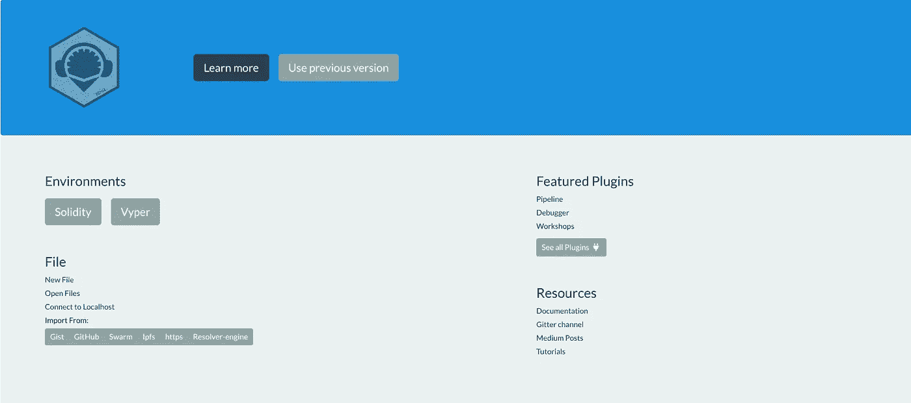

# 编写智能世界系列

> 原文：<https://medium.com/coinmonks/coding-a-smart-world-open-auction-smart-contract-a8221d59fa60?source=collection_archive---------2----------------------->

Source: remix home page

## Vyper 语言简介

在我们开始智能合约之前，让我们快速了解一下以太坊中的新智能合约语言 Vyper。

Vyper 是为 Python 爱好者编写的，因为它源自 Python 3。Vyper 不是 Solidity 编程语言的替代品，而是迎合喜欢 Python 风格语言的开发人员口味的一种选择…