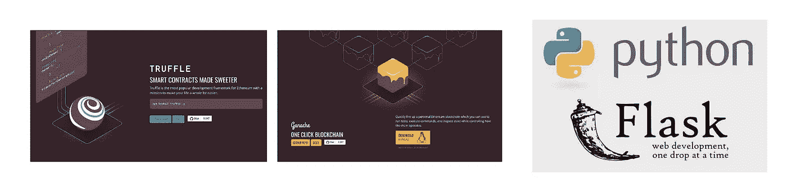

# 编码智能世界系列- DApp

> 原文：<https://medium.com/coinmonks/coding-a-smart-world-series-330fe8b27db9?source=collection_archive---------2----------------------->

Truffle + Ganache + Python Flask = DApp

## 一个以太坊 DApp，使用 Web3.py、松露 Ganache、Python 烧瓶

## 什么是 Web3？

Web3 被广泛认为是未来的 Web 技术，它将使今天的互联网能够以分散和本地的方式存储状态信息。它还允许互联网参与者之间的状态转移，从而产生价值…