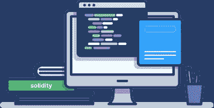
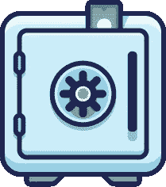

# Coinbae 安全审计

> 原文：<https://medium.com/coinmonks/coinbae-security-audits-3084c95c7bab?source=collection_archive---------4----------------------->

## Coinbae 安全审计旨在通过高质量且价格合理的智能合同审计来降低安全风险。

Coinbae security audits.

## 2020 年及其对加密的意义

随着去中心化金融基础设施(DeFi)的兴起，以及 2020 年期间数十亿美元涌入该行业，对它们所依赖的智能合同的攻击也在增加。黑客寻找错误，闪贷攻击者利用漏洞，甚至更令人不安；臭名昭著的拉地毯。匿名团队利用急切的投资者，他们不想错过炒作和机会，故意在他们的合同中创建后门，通过它他们可以虹吸投资硬币。这些都不是孤立的事件，它们似乎是大大小小的 DeFi 项目屈服于一个或另一个攻击、黑客、利用或简单的地毯拉规范。

显而易见的是，需要一种更好的方式来建立用户对投资合同的信任。

Make smart contracts safe again.

## 为什么不审计合同？

如果我们快速浏览一下 Coinmarketcap.com 和 Coinmarketcap.com(CMC)等市场数据提供商，我们会注意到许多农场都缺乏审计报告，例如，CMC 没有报告所有审计报告的状态(在撰写本文时)。在 Coingecko 列出的合同中，值得注意的是相对缺乏审计，只有少数几个农场进行了审计，大多数农场在部署的合同被审计前几个月都没有经过审计。吸引了大量投资者的项目最终都会让他们的合同得到审计，因为这被视为一种认可。然而，这回避了这样一个问题:如果被审计的合同对项目有利，因为它激发了信心；他们为什么不在发起和开始营销活动之前审核合同？

在咨询了各种项目对审计其智能合同的犹豫后，Coinbae 得出结论，对于大多数 Defi 项目，安全审计的价格根本无法达到，因为 Defi 领域的许多项目都有多个合同，这使得费用更加沉重。

Defi 的性质是特殊的。一方面，这是一个真正去中心化的金融系统，没有边界，没有约束，也没有监督，任何人都可以从任何地方通过点击按钮参与进来。有时候，培养这样做所需的创造力确实需要匿名，但比特币诞生的本质并无不同。然而，这也带来了风险，最终大多数人在做出投资决定时没有时间或知识来仔细检查每一份新合同。

## Coinbae 合同审计

鉴于目前的形势和手头的证据 [Coinbae](http://www.coinbae.org/audit/) 提出了一个解决方案，不提高创造性区块链思想和创新项目的准入门槛。相反，它给新的和上升的项目机会，让他们的合同得到审计，同时为用户创造一个信任层。

Coinbae team.

## 团队。

Coinbae 的团队由许多加密货币和安全专家组成。Coinbae security 的团队负责人 Eelko Neven 拥有超过 12 年的专业安全审计员/代码审查员经验，执行了 1500 多次审计，其中包括 Google、Twitter 和通用电气。

查询:info@coinbae.org

**有关我们审计的完整列表，请访问:**

【www.coinbae.org/audit/ 

[https://twitter.com/Coinbae](https://twitter.com/Coinbae)

 [## Coinbae

### coinbae.org

t.me](https://t.me/coinbae)