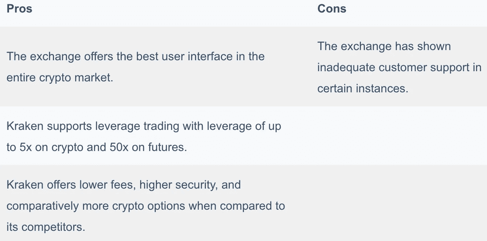

# 2021 年前五大比特币基地备选方案[最新] |美国最佳交易所

> 原文：<https://medium.com/coinmonks/coinbase-alternatives-638fe811f580?source=collection_archive---------1----------------------->

本文将讨论购买、出售或交易加密资产的**替代方案。我们将根据费用、安全性和其他功能对它们进行比较。**

# **比特币基地替代品:总结(TL；博士)**

*   **[**比特币基地**](https://blog.coincodecap.com/go/coinbase) 是美国最受欢迎的合法[密码交易平台](https://blog.coincodecap.com/go/crypto-exchange)之一。**
*   **该交易所在费用、杠杆交易等诸多方面落后于竞争对手。**
*   **最好的五个[比特币基地](https://blog.coincodecap.com/go/coinbase)备选分别是[双子座](https://blog.coincodecap.com/go/gemini)、[罗宾汉](https://blog.coincodecap.com/go/robinhood)、[、**北海巨妖**、](https://blog.coincodecap.com/go/kraken)[币安美国](https://www.binance.us/en/home)、[Crypto.com](https://blog.coincodecap.com/go/crypto-com)。**
*   **[**双子座**](https://blog.coincodecap.com/go/gemini) 被认为是整个密码行业最安全的交易平台。它提供[双子支付](https://gemini.sjv.io/LPX6Yj)、[双子清算](https://gemini.sjv.io/zaNM5O)、[双子赚](https://gemini.sjv.io/6bbqzb)等。**
*   **Robinhood 因提供加密和传统股票投资服务而闻名。**
*   **[**北海巨妖**](https://blog.coincodecap.com/go/kraken) 可以认为是拥有最好的插图和用户界面的平台。该交易所还提供密码和期货的杠杆交易。**
*   **[币安美国](https://www.binance.us/en/home)是 [**币安**](https://blog.coincodecap.com/go/binance) 的衍生产品，在美国合法运作，并提供[币安](https://blog.coincodecap.com/go/binance)的所有基本功能。**
*   **[Crypto.com](https://blog.coincodecap.com/go/crypto-com)是一个拥有超过 1000 万活跃用户和保证金、衍生品、 [DeFi 钱包](https://blog.coincodecap.com/best-smart-contract-wallet)、DeFi 掉期等产品的交易平台。**

****

# **什么是比特币基地？**

**[**比特币基地**](https://blog.coincodecap.com/go/coinbase) 是[最受欢迎的加密交换](https://blog.coincodecap.com/crypto-exchange)平台之一，为 100 多个国家的 5600 多万注册用户提供服务。该交易所在美国提供受监管的加密交易服务，不提供任何杠杆交易服务。**

**比特币基地的目标是在全球范围内提供一个公平、高效、易用的密码交易平台。他们提供了密码市场上最简单的用户界面和最好的客户服务。要了解更多，请阅读我们的[比特币基地评论](https://blog.coincodecap.com/coinbase-review)。**

# **为什么你应该寻找一个替代的交流？**

**尽管比特币基地是美国重要的交易所之一，但它仍有许多缺点。该平台收取加密市场最高的费用，并且不提供加密或期货市场的杠杆交易。**

# **五大比特币基地替代品**

**很明显，由于比特币基地的缺点，我们正在寻找它的替代品。因此，以下是比特币基地交易所的五个最佳选择:**

*   **[**双子座**](https://blog.coincodecap.com/go/gemini)**
*   **[**罗宾汉**](https://blog.coincodecap.com/go/robinhood)**
*   **[**北海巨妖**](https://blog.coincodecap.com/go/kraken)**
*   ****[T5【币安】美国 ](https://www.binance.us/en/home)****
*   ****[**Crypto.com**](https://blog.coincodecap.com/go/crypto-com)****

# ****1.双子星座****

****双子座[是文克莱沃斯双胞胎](https://blog.coincodecap.com/go/gemini)[头脑中一个想法的产物](https://en.wikipedia.org/wiki/Winklevoss_twins)。这是一个总部位于纽约的交易平台，通过其各种产品提供服务。事实证明，该交易所提供了整个密码交易行业中最好的安全服务。****

********

****[Gemini](https://blog.coincodecap.com/go/gemini) 是 SOC 1 型和 SOC 2 型认证的[密码交易所](https://blog.coincodecap.com/go/crypto-exchange)托管人。如下所述，它还提供许多其他产品。****

# ****双子座的产品****

****双子座向个人和金融机构提供一系列产品。让我们一次看一个:****

## ****双子座活跃交易者****

****Gemini 为其交易者提供了 Gemini ActiveTrader 来在微秒内进行加密交易。您可以使用该平台上的各种功能，如市场或取消、立即或取消、限制或填充或删除，来下单并执行您的订单。****

## ****双子座监护权****

****双子座提供加密市场上最好的安全服务，因此也提供加密保管服务。然后，您可以将您的加密资产存储在业内最安全的保险库中。要了解更多关于[双子托管](https://www.gemini.com/custody)，[点击这里](https://www.gemini.com/custody/whitepaper)。****

## ****双子座空地****

****双子座清算类似于 P2P 交易，因为它帮助你从个人手中购买或出售加密资产。您通过 Gemini clearing 进行的所有交易都不会出现在订单簿上。因此，Gemini 在此交易中仅充当第三方。****

## ****双子座薪酬****

****[Gemini Pay](https://www.gemini.com/pay) 允许您使用您的加密资产在全美 30，000 多家零售店支付食品杂货。你可以通过下载[双子星 app](https://play.google.com/store/apps/details?id=com.gemini.android.app&hl=en_IN&gl=US) 来使用这个功能。****

********

## ****双子座收入****

****随着[双子座赚取](https://www.gemini.com/earn)，你有权赚取约 7.4%的加密资产 APY。你所要做的就是注册 Gemini Earn 并存入资金开始赚取。你可以随时从双子座的收入中提取资金。****

## ****双子座隐足动物****

****双子座最近推出了名为 [Cryptopedia](https://www.gemini.com/cryptopedia) 的信息平台。Cryptopedia 是一个免费的加密教育平台，也提供专业人士分享有关加密的信息。****

# ****双子费用****

****双子 的费用结构取决于你使用的产品。通过电汇的存款手续费是免费的，同时，通过借记卡是 3.49%。如果您使用的是 [Gemini ActiveTrader](https://www.gemini.com/activetrader) ，那么费用如下表所示，您可以从这里查看其他费用表:****

********

# ****双子座安全公司****

****[**Gemini**](https://blog.coincodecap.com/go/gemini) 使用具有[FIPS 140–2 三级](https://en.wikipedia.org/wiki/FIPS_140-2)或更高级别的冷藏服务。交易所通过双重认证保护您的所有账户活动和交易。此外，即使是首席执行官和总裁单独或一起也不能非法从双子冷库提取任何资金。****

# ****双子座:利弊****

********

****通过阅读我们的对比文章[双子座对比特币基地](https://blog.coincodecap.com/gemini-vs-coinbase)，你可以更好地理解为什么你更喜欢双子座而不是比特币基地。****

# ****2.罗宾汉****

****[**罗宾汉**](https://blog.coincodecap.com/go/robinhood) 是美国公民的专属平台，因为你只有拥有一辆 SSN 才能使用该平台。该平台直到 2018 年才支持加密交易。并且，BTC 和 ETH 是早期唯一可以交易的硬币。目前，[罗宾汉](https://blog.coincodecap.com/go/robinhood)是美国最受欢迎的交易所之一。****

********

# ****罗宾汉的产品****

****Robinhood 通过其各种产品提供加密和股票方面的独家服务。以下是 Robinhood 提供的产品简介:****

## ****股票和基金****

****Robinhood 提供免佣金的投资服务和许多你应该用来投资的基本工具。该平台提供零股，你只需花 1 美元就可以投资 1000 多只股票。****

## ****秘密党员****

****Robinhood 允许交易重要的加密资产，如 BTC、DOGE、ETH 等。你可以 24 小时不间断地购买、出售和交易加密资产，交易所不收取佣金。****

## ****选择****

****[卖出期权合约](https://robinhood.com/us/en/support/articles/placing-an-options-trade/)是指将合约卖给买方收取溢价，买入是指从卖方回购。罗宾汉对期权合约不收取任何佣金。****

## ****金色的****

****Robinhood 的期权允许你用你的[黄金投资](https://robinhood.com/us/en/support/articles/upgrading-to-gold/)进行保证金交易，因此你可以增加你的黄金。你可以用 2.5%的年利率进行交易，所有的交易都是从 5 美元开始。****

********

## ****现金管理****

****[Robinhood](https://blog.coincodecap.com/go/robinhood) 为您账户中未投资的资金提供 0.30%的 APY。你可以在你的储蓄和支票账户中使用现金管理，也可以在任何你想花的地方花你的现金。****

# ****罗宾汉费****

****Robinhood 提供了一个免佣金的交易平台。然而，像 FINRA 这样的 sro 会对你的卖出指令收取少量费用。由于罗宾汉是一个受监管的交易所，通过 FINRA 收取的费用旨在弥补美国政府产生的费用。你可以从这里了解更多关于 Robinhood [的费用。](https://robinhood.com/us/en/support/articles/trading-fees-on-robinhood/)****

# ****罗宾汉安全****

****你在 [Robinhood](https://robinhood.com/) 获得双重认证，以通过交易中所有重要的步骤。该平台还为你的资产提供冷藏保险库，并为你在交易所的资产提供 [FDIC](https://www.fdic.gov/) 保险。****

# ****罗宾汉:利弊****

********

****通过阅读我们的比较文章[罗宾汉与比特币基地](https://blog.coincodecap.com/coinbase-vs-robinhood)，你可以更好地理解为什么你更喜欢罗宾汉而不是比特币基地。****

# ****3.北海巨妖****

******北海巨妖是 2011 年问世的一个有着完美插图的加密交易平台。这是一家总部位于美国的受监管交易所，提供各种产品，包括杠杆交易。******

************

# ******北海巨妖的产品******

******北海巨妖向其用户提供一系列产品。因此，让我们一个一个地了解它们:******

## ******买卖密码******

******[北海巨妖](https://blog.coincodecap.com/go/kraken)提供几种流行的加密资产的加密买卖。然而，在你开始在北海巨妖的交易之前，你需要完成你的验证过程。******

## ******保证金交易******

******有了北海巨妖直观的用户界面，[保证金交易](https://blog.coincodecap.com/margin-trading)变得更加简单。因此，北海巨妖对几乎所有上市的加密资产提供了高达 5 倍的杠杆。使用[北海巨妖保证金交易](https://www.kraken.com/features/margin-trading)，你可以在交易所做多和做空。******

## ******期货贸易******

******期货交易是指在未来预定的日期和时间以固定的价格买入或卖出一份合约。你可以在北海巨妖用高达 50 倍的杠杆交易期货。******

************

******但是，在使用期货交易之前，您必须在平台上进行一次测验，并根据测验结果，交易所将您分为以下三类之一:******

*   ******零售商******
*   ******职业交易员******
*   ******更大的事业******

## ******场外交易******

******[场外交易](https://www.kraken.com/features/otc-exchange)主要是为需要更高流动性的大型机构或高净值个人而存在。打开柜台，或者场外交易发生在北海巨妖的公开的[密码交易所](https://blog.coincodecap.com/go/crypto-exchange)。******

# ******北海巨妖费用******

******在[T5【北海巨妖】T6](https://blog.coincodecap.com/go/kraken)的费用低至 0%；但平台对稳定币和 FX 对收取 0.9%的费用。为了更深入地了解北海巨妖的费用结构，请访问平台的[费用表](https://www.kraken.com/features/fee-schedule)。您可以在下表中查看[北海巨妖 Pro](https://trade.kraken.com/) 上的制造商和接受者费用:******

************

# ******北海巨妖安全******

******[**北海巨妖**](https://blog.coincodecap.com/go/kraken) 是市场上最受信任的[加密货币交易所](https://blog.coincodecap.com/go/crypto-exchange)之一，因为它们将你的大部分数字资产保存在冰冷的钱包里。冷藏设施由摄像头和警卫进行全天候监控。北海巨妖也有一个 bug 奖励计划，你可以通过报告平台上的重大 bug 来获得奖励。要了解更多关于 bug bounty 计划的信息，请点击这里。******

# ****北海巨妖:利弊****

********

****你可以通过阅读我们的比较文章[北海巨妖对比特币基地](https://blog.coincodecap.com/kraken-vs-coinbase)，更好地理解为什么你更喜欢北海巨妖而不是比特币基地。****

# ****4.美国币安****

****美国有严格的密码交易法规。因此，作为美国居民，你不能使用币安。因此，币安最近推出了[币安美国](https://www.binance.us/en/home)，这是一个遵守美国交易法律的[加密交易所](https://blog.coincodecap.com/go/crypto-exchange)。币安美国提供高流动性，但加密资产非常少。****

********

# ****美国币安公司的产品****

****美国币安提供所有的基本功能。然而，由于美国的监管法律，它不能提供其全部潜力的服务。你可以很容易地在美国币安购买、出售和交易密码。该交易所的其他功能包括基本和高级交易选项以及场外交易门户。****

# ****币安美国费用****

****[币安美国](https://www.binance.us/en/home)的费用相对高于[币安](https://blog.coincodecap.com/go/binance)。交易所收取 0.1%的现货交易费和 0.5%的即时买入/卖出费。如果你的账户中持有 BNB，那么交易所将默认使用它来支付费用。****

****要了解更多，请阅读我们关于[币安费用](https://blog.coincodecap.com/binance-fees)的文章。您还可以根据您的 BNB 持仓量和过去 30 天的交易量，在下表中观察做市商和接受者费用:****

********

# ****币安美国安全****

****[币安美国](https://www.binance.us/en/home)保持完全的安全性，维护其母公司的声誉。然而，2019 年[黑客盗取了 7000 个左右的比特币](https://www.usatoday.com/story/money/2019/05/08/bitcoin-exchange-binance-robbed-7-000-bitcoins-hackers/1139907001/#:~:text=Hackers%20have%20stolen%20over%20%2440,breach%E2%80%9D%20which%20occurred%20on%20Tuesday.)；当时的绝对值是 4000 万美元。该公司声称，他们已经向受影响的用户全额支付了损失。****

# ****币安美国:利弊****

********

# ****5.Crypto.com****

****[**Crypto.com**](https://blog.coincodecap.com/go/crypto-com)是一个拥有超过 1000 万活跃用户的加密交易平台。交易所提供加密市场上最好的安全服务之一。它有超过 3 . 6 亿美元的保险。****

********

# ****Crypto.com 的产品****

****Crypto.com 为其用户提供各种各样的产品。你可以访问 Crypto.com 交易所平台[，从保证金、衍生品、现货等众多选项中选择一个进行交易。平台还允许你使用](https://crypto.com/exchange) [DeFi 钱包](https://blog.coincodecap.com/best-smart-contract-wallet)、 [Defi 赚、](https://crypto.com/defi-wallet)和[互换](https://crypto.com/defi/swap)。****

****遗憾的是，我们无法在本文中涵盖 Crypto.com[的所有产品。然而，你仍然可以通过阅读我们的](https://blog.coincodecap.com/go/crypto-com)[Crypto.com 评论](https://blog.coincodecap.com/crypto-com-review)来了解他们。Crypto.com 也提供了自己的 NFT 平台，你可以通过阅读我们对 Crypto.com NFT 平台的评论来了解更多。该平台还提供自己的 Visa 卡，你可以通过阅读我们对 MCO 卡的[评论来了解它。](https://blog.coincodecap.com/mco-card-review)****

# ****Crypto.com 费用****

****[Crypto.com](https://blog.coincodecap.com/go/crypto-com)对用户实行分级收费制度，你可以根据下表计算你的费用。****

********

****如果您使用 CRO 并在其中支付费用，您有权享受折扣。此外，即使在 CRO 投资也能让你在 CRO 的股份获得 10%的 APY。你也可以通过邮寄申请到 vip@Crypto.com 来申请一个 VIP 账户，从而享受额外的奖励。****

********

# ****Crypto.com 安全****

****该交易所使用冷存储来存储您的加密资产，并将少量资产存储在热钱包中以供日常使用——该交易所将法定货币存储在托管银行账户中。该平台使用高度安全的 AWS 用于其防火墙和加密。****

****该交易所符合以下 CCSS(加密货币安全标准)，成为第一家同时拥有以下所有证书的交易所:****

********

# ****Crypto.com:利弊****

********

# ****比特币基地替代品:结论****

****比特币基地 是一个昂贵的加密交换机，缺少许多其他东西。密码市场上还有许多其他交易所提供类似甚至更好的服务。因此，你可以选择上述任何一家交易所作为比特币基地的替代选择。如果你有兴趣深入研究加密交易，那么我建议你选择[双子座](https://crypto.com/)。另一方面，如果你想开始你的交易之旅，那么你应该试试北海巨妖。****

# ****常见问题****

******robin hood 适合初学者吗？******

****Robinhood 提供多种多样的投资产品，因此有时会让新手不知所措。然而，该交易所也有一个交互式用户界面，并且没有账户最低限额。如果你准备在其他地方学习这个平台，你当然可以选择 Robinhood。他们没有任何教育工具。****

******如何将比特币从比特币基地转移到北海巨妖？******

****首先，你必须登录到你的[比特币基地](https://blog.coincodecap.com/go/coinbase)账户，然后访问你的仪表板标题中的发送或接收部分。然后你可以输入收款账户的钱包地址，点击发送按钮。****

****双子座比比特币基地好吗？****

****如果我们谈论的是安全性、移动应用程序和收费等功能，那么 Gemini 可能是一个更好的选择。然而，如果你想深入研究加密交易，比特币基地可能是一个更好的选择。要了解更多，请阅读[双子座 vs 比特币基地](https://blog.coincodecap.com/gemini-vs-coinbase)。****

****如何删除比特币基地账户？****

****如果您使用完比特币基地，并希望删除您的帐户，您需要前往设置的活动页面。现在向下滚动，找到页面底部的关闭账户选项。现在，点击它，禁用您的帐户。在关闭你的[比特币基地](https://blog.coincodecap.com/go/coinbase)账户之前，一定要确保你的账户里没有任何资金。****

******如何从比特币基地撤出？******

****要从[比特币基地](https://www.coinbase.com/)提款，你需要去账户区，然后点击 BTC 钱包，点击发送按钮。如果你使用的是[比特币基地专业版](https://pro.coinbase.com/)账户，点击取款按钮，在下一页输入所有细节，包括收款账户的钱包地址。****

*   ****[比特币基地 vs 罗宾汉|哪个最适合你？【2021】T5](https://blog.coincodecap.com/coinbase-vs-robinhood)****
*   ****[双子座 vs 比特币基地|美国最好的密码交易所是哪家？](https://blog.coincodecap.com/?p=8030)****
*   ****比特币基地 vs 北海巨妖|美国最好的密码交易所是哪家？****
*   ****[币安 vs 北海巨妖 2021 |你该选择哪个加密交易所？](https://blog.coincodecap.com/binance-vs-kraken)****
*   ****[5 家最佳比特币保证金交易交易所【2021】](https://blog.coincodecap.com/bitcoin-margin-trading-exchange)****

> ****加入 [Coinmonks Telegram group](https://t.me/joinchat/uiLERCQL1fQ5ZjA1) 并了解加密交易和投资****

## ****另外，阅读****

*   ****最好的[加密交易机器人](/coinmonks/crypto-trading-bot-c2ffce8acb2a) | [网格交易机器人](https://blog.coincodecap.com/grid-trading)****
*   ****[加密复制交易平台](/coinmonks/top-10-crypto-copy-trading-platforms-for-beginners-d0c37c7d698c) | [五大 BlockFi 替代品](https://blog.coincodecap.com/blockfi-alternatives)****
*   ****[CoinLoan 点评](/coinmonks/coinloan-review-18128b9badc4)|[Crypto.com 点评](/coinmonks/crypto-com-review-f143dca1f74c) | [火币保证金交易](/coinmonks/huobi-margin-trading-b3b06cdc1519)****
*   ****[尤霍德勒 vs 科恩洛 vs 霍德诺特](/coinmonks/youhodler-vs-coinloan-vs-hodlnaut-b1050acde55a) | [Cryptohopper vs 哈斯博特](https://blog.coincodecap.com/cryptohopper-vs-haasbot)****
*   ****[杠杆代币](/coinmonks/leveraged-token-3f5257808b22) | [最佳密码交易所](/coinmonks/crypto-exchange-dd2f9d6f3769) | [Paxful 点评](/coinmonks/paxful-review-4daf2354ab70)****
*   ****[如何在印度购买比特币？](/coinmonks/buy-bitcoin-in-india-feb50ddfef94) | [WazirX 评论](/coinmonks/wazirx-review-5c811b074f5b) | [BitMEX 评论](https://blog.coincodecap.com/bitmex-review)****
*   ****[双子座 vs 比特币基地](https://blog.coincodecap.com/gemini-vs-coinbase) | [比特币基地 vs 北海巨妖](https://blog.coincodecap.com/kraken-vs-coinbase)|[coin jar vs coin spot](https://blog.coincodecap.com/coinspot-vs-coinjar)****
*   ****[币安 vs 北海巨妖](https://blog.coincodecap.com/binance-vs-kraken) | [美元成本平均交易机器人](https://blog.coincodecap.com/pionex-dca-bot)****
*   ****[印度比特币交易所](/coinmonks/bitcoin-exchange-in-india-7f1fe79715c9) | [比特币储蓄账户](/coinmonks/bitcoin-savings-account-e65b13f92451)****
*   ****[币安收费](/coinmonks/binance-fees-8588ec17965) | [Botcrypto 审查](/coinmonks/botcrypto-review-2021-build-your-own-trading-bot-coincodecap-6b8332d736c7) | [Hotbit 审查](/coinmonks/hotbit-review-cd5bec41dafb) | [KuCoin 审查](https://blog.coincodecap.com/kucoin-review)****
*   ****[我的加密副本交易经历](/coinmonks/my-experience-with-crypto-copy-trading-d6feb2ce3ac5) | [比特币基地评论](/coinmonks/coinbase-review-6ef4e0f56064)****
*   ****[加密货币储蓄账户](/coinmonks/cryptocurrency-savings-accounts-be3bc0feffbf) | [YoBit 审查](/coinmonks/yobit-review-175464162c62) | [Bitbns 审查](/coinmonks/bitbns-review-38256a07e161)****
*   ****[最佳比特币保证金交易](/coinmonks/bitcoin-margin-trading-exchange-bcbfcbf7b8e3) | [比特币保证金交易](https://blog.coincodecap.com/bityard-margin-trading)****
*   ****[加密保证金交易交易所](/coinmonks/crypto-margin-trading-exchanges-428b1f7ad108) | [赚取比特币](/coinmonks/earn-bitcoin-6e8bd3c592d9) | [Mudrex 投资](https://blog.coincodecap.com/mudrex-invest-review-the-best-way-to-invest-in-crypto)****
*   ****[BlockFi 信用卡](https://blog.coincodecap.com/blockfi-credit-card) | [如何在币安购买比特币](https://blog.coincodecap.com/buy-bitcoin-binance)****
*   ****[顶级付费加密货币和区块链课程](https://blog.coincodecap.com/blockchain-courses) | [币安评论](/coinmonks/binance-review-ee10d3bf3b6e)****
*   ****[MXC 交易所评论](/coinmonks/mxc-exchange-review-3af0ec1cba8c) | [Pionex vs 币安](https://blog.coincodecap.com/pionex-vs-binance) | [Pionex 套利机器人](https://blog.coincodecap.com/pionex-arbitrage-bot)****
*   ****[在美国如何使用 BitMEX？](https://blog.coincodecap.com/use-bitmex-in-usa) | [BitMEX 回顾](https://blog.coincodecap.com/bitmex-review) | [币安 vs Bittrex](https://blog.coincodecap.com/binance-vs-bittrex)****

*****原载于 2021 年 5 月 3 日 https://blog.coincodecap.com**[*。*](https://blog.coincodecap.com/coinbase-alternatives)*****