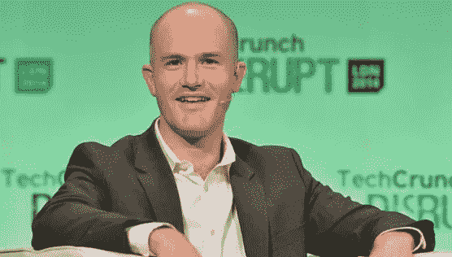

# 比特币基地与自作聪明的情感

> 原文：<https://medium.com/coinmonks/coinbase-and-the-smartydom-affect-bf717f335b2a?source=collection_archive---------0----------------------->

> "信任和品味一样，是一种需要脑力劳动的主观判断."Nick Szabo，[受信任的第三方是安全漏洞](https://nakamotoinstitute.org/trusted-third-parties/)，2001。

在比比特币[白皮书](https://bitcoin.org/bitcoin.pdf)早七年的这篇论文中，萨伯观察到现代机构和公司将不信任的陌生人连接成一个经济所依赖的公共网络。

随后， [Szabo](https://en.wikipedia.org/wiki/Nick_Szabo) 谈到在电子商务等新环境中找到一个不需要高成本和高风险的第三方的协议是一个“非常大的胜利”:Szabo 主张降低心理交易成本，这为小额支付设定了一个最小粒度。

Nick Szabo

当我们看第一行*比特币:点对点电子现金系统*时，将 Szabo 与中本聪身份联系起来已经成为一个显而易见的结论——Szabo 否认了这一点:

> “互联网上的商业几乎完全依赖于金融机构作为可信的第三方来处理电子支付。虽然该系统对于大多数交易来说足够好，但它仍然受到基于信任的模型的固有弱点的困扰。”[中本聪](https://bitcoin.org/bitcoin.pdf)，2008 年

# 聪明王国的崛起

Szabo 发展了“智能合同”的概念，这样编码规则——一种事实上的法律——可以在互联网上的陌生人之间运行，而不需要中介。

在[可信第三方是安全漏洞](https://nakamotoinstitute.org/trusted-third-parties/)中，Szabo 指出，让个人财产的功能依赖于*可信第三方*是不可接受的。

时至今日，这已经演变成了密码朋克和“最大化主义者”的同义词，即除非你拥有自己的私钥，否则它就不是你的比特币，而比特币又以准意识形态的方式扩大了规模:

这意味着，相比之下，遗留契约是愚蠢的，因为它们需要精神交易成本。这反过来导致了对交易所的怀疑，认为加密资产不应该留在交易所里。

# 比特币基地的社会背景

> “成为下一个 Visa 或 Verisign 的雄心是一场难以拒绝的权力之旅。”Nick Szabo，[受信任的第三方是安全漏洞](https://nakamotoinstitute.org/trusted-third-parties/)，2001。

[比特币基地](https://en.wikipedia.org/wiki/Coinbase)称自己是一家高速增长的公司，也是最容易买卖加密货币的地方。人们使用比特币基地，因为他们可以快速交易，因为他们*信任它:比特币基地已经克服了心理交易成本作为进入其客户的障碍。*

# 论合同的性质

有人说[所有的合同都是文字化的](/coinmonks/proof-of-work-in-games-contracts-and-language-67c7b6609bff):不管它们是写下来的还是用代码运行的，它们仍然需要翻译。有鉴于此，Szabo 承认[解读术语](https://nakamotoinstitute.org/trusted-third-parties/)。

比特币基地与其用户之间的合同是基于一种新资产——加密货币——的可信价格发现。如果没有美元或其他主权货币的换算，就很难确定在交易所交易的硬币的实际价值。

Brian Armstrong, CEO Coinbase

如果这种新的资产形式的价值本身本质上是在消除可信任的第三方中发现的，那么尼采的道德谱系中出现的概念仍然是相关的:法律通过使[主体]能够遵守它来创造主体。相反，这将我们从一个可执行的承诺的想法，到灌输承诺本身的记忆的本质。

如果我们不得不信任软件和代码——以及代码的作者——那么这是一种什么样的承诺，它的规模如何？

> [直接在您的收件箱中获得最佳软件交易](https://coincodecap.com/?utm_source=coinmonks)

