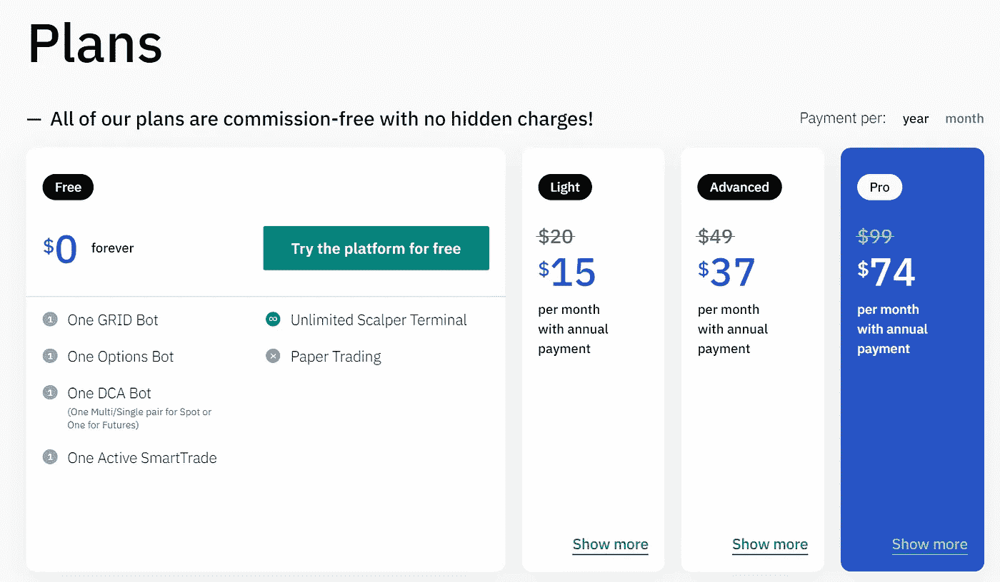

# 5 款最佳比特币基地机器人让你的交易自动化

> 原文：<https://medium.com/coinmonks/coinbase-bots-ac6359e897f3?source=collection_archive---------0----------------------->

[**【比特币基地】**](https://coinbase-consumer.sjv.io/7mbkNg) 是第一家卓越且易于使用的[美国加密货币交易所](https://coincodecap.com/crypto-exchange-usa)。因此，今天我们将讨论五个最好的比特币基地机器人，它们将帮助你自动化你的交易之旅。

# 摘要

*   加密交易机器人是自动执行交易策略的计算机程序。
*   **比特币基地是第一家也是最大的美国监管交易平台之一。**
*   **对比特币基地来说最好的五个比特币机器人分别是 [**Bitsgap**](https://bitsgap.com/?ref=2cb1231&utm_source=coincodecap&utm_medium=article&utm_campaign=promo) 、Quadency、 [**3Commas**](https://coincodecap.com/go/best-coinbase-bots-to-automate-your-trading) 、Aluna。社交和贸易。**
*   **对于初学者来说，使用比特币基地机器人是最好的选择。它是安全的，合法的，并且易于配置。**
*   **Bitsgap 是最受欢迎的交易机器人之一，因为它支持超过 25 个交易所，并且与比特币基地 Pro 很好地配合。**
*   **Quadency 是另一个比特币基地机器人，因其先进的制图、专家评审和许多更有趣的功能而更受欢迎。**
*   **另一方面，Aluna.social 有一些独特的功能，如多交流连接、社交网络等。**
*   **TradeSanta 是一个体面的比特币基地交易机器人，价格合理，适合初学者和专业人士。**

> **搞定自己[Pionex！只需为您的订单支付交易费，您就可以在有生之年免费使用](https://www.pionex.com/offers/#/grid-4?r=BI2UEarX)[**交易机器人**](/coinmonks/crypto-trading-bot-c2ffce8acb2a)**。****

# ****什么是加密交易机器人？****

****简而言之，[加密交易机器人](/coinmonks/crypto-trading-bot-c2ffce8acb2a)是让你的交易自动化的软件。如果你想创建你的交易机器人，你必须写一个你的交易策略的代码。****

****然后，您可以使用该编码/编程策略来下订单。然而，许多公司在购买付费订阅后才提供这些服务。****

****因此，如果你不想为编码和其他事情腾出时间，你可以使用这些服务来自动化你的交易。****

# ****交易机器人是如何工作的？****

****一个由专业编码员和交易员组成的团队结合他们的智慧来编码交易策略。所以最终的结果是一个能够根据流程开仓和平仓的交易机器人。****

****使用这些机器人的目的是它们不受人类情绪的影响，从而以公正的策略进行交易。所以他们大部分时间都是值得你投资的。****

**** [## 加密交易机器人|最佳 16 款比特币交易机器人

### 2021 年币安、比特币基地、库币和其他密码交易所的最佳密码交易机器人。四进制，位间隙…

medium.com](/coinmonks/crypto-trading-bot-c2ffce8acb2a) 

# 什么是比特币基地？

[**【比特币基地】**](https://coinbase-consumer.sjv.io/7mbkNg) 是受监管的加密货币交易所，支持充足的数字资产。此外，比特币基地是安全的使用，也提供保险的资金，其客户。

除此之外，这项业务收费很高，有时忙得不可开交。你也可以选择[比特币基地专业版](https://coinbase-consumer.sjv.io/7mbkNg)或[比特币基地高级版](https://www.coinbase.com/prime)来寻找一些高级交易选项。

Coinbase bot

要了解更多，请前往我们的[比特币基地评论](https://coincodecap.com/coinbase-review)。如果你想拥有一张加密卡，那么试着阅读一下比特币基地卡。此外，你还可以从[比特币基地赌博](https://coincodecap.com/coinbase-staking)中获得被动收入。

**Visit Coinbase**

# 5 款最佳比特币基地机器人

嗯，认为自己是密码行业最好的交易者并没有什么坏处。但是，有时候你无法 24×7 跟踪市场。

因此，即使你在睡觉，交易机器人也能为你带来利润。此外，它们在一定程度上有助于减轻损失。所以，让我们探索五个最好的比特币基地交易机器人。

# 1.3Commas 比特币基地 Bot

## 什么是 3Commas？

[**3Commas**](https://coincodecap.com/go/best-coinbase-bots-to-automate-your-trading) 是一家总部位于迈阿密的交易机器人提供商，也是比特币基地最好的比特币机器人之一。这对初学者或没有金融经验的人来说尤其可取。

bot 拥有丰富的交易策略，在行业中享有良好的声誉。除此之外，它还提供出色的速度和安全性。此外，您可以使用 API 密钥轻松连接这个比特币基地交易机器人。

要了解更多信息，请阅读[3 商业评论](https://coincodecap.com/3commas-review-an-excellent-crypto-trading-bot)。

## 3 常见功能

由 [**3Commas**](https://coincodecap.com/go/best-coinbase-bots-to-automate-your-trading) 开发的机器人在速度、安全性和众多交易策略方面也是无与伦比的，年费每月仅需 14.5 美元。

但是，速率更快，更适合零售平台。总的来说，交易机器人在开始时是好的。该机器人还支持一些高级功能，如 [DCA 机器人](https://coincodecap.com/dca)、[网格机器人](https://coincodecap.com/grid-trading)、可选机器人等。

## 3 商品定价

3Commas 交易机器人有四种主要计划，你甚至可以使用免费版本，直到你发现需要订阅。每个计划的详细信息如下图所示:

3Commas Pricing

## 3Commas 合法吗？

3Commas 是一个合法的交易机器人。然而，关于机器人上的数据个性化存在模糊性。然而，比特币基地 bot 使用 API 密钥来提供对用户帐户的受限访问。

它收集所有专业/领先交易者使用的策略和用户赚取的利润的数据。此外，它使用收集的数据来增强其交易机器人和预先配置的策略。

## 3Commas:利弊

3Commas: Pros and Cons

# 2.比特币基地机器人

## 什么是 Bitsgap？

[**Bitsgap**](https://bitsgap.com/?ref=2cb1231&utm_source=coincodecap&utm_medium=article&utm_campaign=promo) 是一个流行的交易机器人，为您提供使交易顺利进行的集成解决方案。通过使用 Bitsgap，您可以在同一个房间内使用您的所有交易账户。此外，它支持超过 25 个平台来自动化您的交易之旅。

令人着迷的是，你可以进行演示试验来检查这个机器人的实际功能。通过这种方式，你可以优先决定机器人是否适合你的财务目标。要了解更多信息，请阅读 [Bitsgap 评论](https://coincodecap.com/bitsgap-review)。

Bitsgap Coinbase bot

## Bitsgap 功能

## Bitsgap 功能

平台 **Bitsgap** 精通投资组合跟踪、用于多个交易所的顶级工具、套利(从顶级交易所获得差价)等功能。该平台还具有预配置的交易机器人和 Bitsgap 演示交易功能，用于事先测试机器人。

此外，Bitsgap 信号为您提供了从潜在市场机会中获取回报的机会。此外，Bitsgap 最近推出了其 [Bitsgap 期货机器人](https://coincodecap.com/bitsgap-futures-bot)，很快将在大多数交易所上市。

**Visit Bitsgap**

## Bitsgap 定价

该平台大致有三种不同的每月订阅计划，详情如下:

Bitsgap pricing

## Bitsgap 合法吗？

到目前为止， **Bitsgap** 比特币基地 Pro bot 是合法和安全的，因为它不拥有提款权。你所有的资金都安全地存放在你的[比特币基地钱包](https://coincodecap.com/coinbase-wallet-review-the-best-bitcoin-wallet)里，因为 API 密匙连接着 bot 和 crypto exchange。此外，部署 2FA 是明智的，如果它跟踪频繁的错误登录尝试，那么您的帐户将被阻止。

# 3.比特币基地机器人

## 什么是 Quadency？

Quadency 是另一个交易机器人提供商，它将帮助你在比特币基地的交易之旅自动化。它有来自专业交易者的大约 15 个市场策略，并且它支持超过 35 个密码交换。此外，您可以免费访问 Quadency 的 Pro 版本，为此，您必须与其官方交易伙伴进行交易。

要了解更多信息，请阅读[四项审查](https://coincodecap.com/quadency-review-a-crypto-trading-automation-platform)。

Quadency Coinbase Bot

## 四项特征

交易机器人提供商 Quadency 有一些独特的功能，如仪表板管理(用于投资组合管理)、交易(充满了复杂的图表和交易工具)、期权交易机器人和自动化(11 个面向专业用户的交易机器人)。此外，该机器人易于使用，安全可靠。

**Visit Quadency**

## 四元定价

机器人供应商主要有三个月的订阅计划。此外，它还有一个免费版本，可以让你使用几乎所有的基本功能。然而，你必须每月支付 99 美元才能获得无限套餐。有关更多详细信息，请参考下图:

Quadency Pricing

## Quadency 合法吗？

Quadency 是一个安全合法的加密交易机器人。它使用 API 密匙和 2FA 来连接到机器人和额外的安全。因此，如果你在寻找一个比特币基地专业交易机器人，你可以选择 Quadency。

## 优势:优势和劣势

Quadency Pros and Cons

# 4.阿露娜。社交比特币基地机器人

## 什么是阿露娜？社交？

[**阿露娜。Socia** l](https://aluna.social/signup?ref=dwpPWfqb) 是另一个可以和比特币基地一起使用的交易机器人。它以其旨在向所有用户提供的透明度而闻名，并帮助他们做出完全知情的决定。此外，该平台结合了众多功能，如交易者的社交网络、多交易所交易体验、[复制交易](/coinmonks/top-10-crypto-copy-trading-platforms-for-beginners-d0c37c7d698c)功能等等。

在阿卢纳。社交，你可以从其他专业交易者的交易中学习，因为每个人都可以看到。简而言之，阿露娜。社交媒体将透明度与用户对资金的控制融为一体。要了解更多信息，请阅读 [Aluna。社会评论](https://coincodecap.com/aluna-social-review)。

Aluna.Social Coinbase bot

## 阿露娜。社会特征

Aluna 也有一些与众不同的特点，比如复制交易，它会和你复制的交易一样。然而，目前复制交易只适用于期货和保证金市场。而且，阿露娜。社交支持利润分享、预测游戏和每月交易订阅。

**Visit Aluna**

## 阿露娜。社会定价

**阿露娜。Social** 是一个交易终端，允许你使用 API 密匙连接和维护各种交易交易所的账户。因此，该平台只收取交易费，没有包月计划。你甚至可以使用 ALN 代币来降低费用。

Aluna

## 是阿露娜。社会正统？

阿露娜。社交可能是最安全和合法的比特币基地自动交易机器人。你可以看到和分析交易，也可以完全控制你的资金。它是安全的，并且对用户完全透明。此外，在阿卢纳。社交，你可以通过 API 键在上面连接多个交易所。它还有一个社交网络，一个在 Aluna 上全天候活跃的交易者社区。所有的交易都是公开的，因此社交平台可以让你了解其他交易者的心情。

## 阿露娜。社交:利弊

Aluna.Social Pros and Cons

# 5.比特币基地机器人贸易公司

## 什么是 TradeSanta？

[TradeSanta](https://tradesanta.com/en/site/set-referral-cookie?referral_id=177722) 是一款基于云的加密货币交易软件，最适合专业交易者和初级交易者。市场上另一个突出的比特币基地 bot 与比特币基地 Pro 和许多其他交易所如[火币](https://coincodecap.com/huobi-review)、[币安](https://coincodecap.com/binance-review)等都很好。

因此，如果你不想花额外的时间交易，而想赚取利润，TradeSanta 会为你做。要了解更多信息，请阅读 [TradeSanta 评论](https://coincodecap.com/tradesanta-crypto-trading-bot-review)。

TradeSanta

## TradeSanta 特色

TradeSanta 最突出的特点是其多空交易机器人，在市场中实施集中交易策略。该平台还提供各种技术指标、bot 模板、实时跟踪、获利目标，以及一个针对 API [Android](https://tradesanta.onelink.me/IFCO?pid=WebLanding&c=MainPage_1984255787.1624208901&af_web_dp=https%3A%2F%2Fplay.google.com%2Fstore%2Fapps%2Fdetails%3Fid%3Dcom.tradesanta) 和 [iOS](https://tradesanta.onelink.me/IFCO?pid=WebLanding&c=MainPage_1984255787.1624208901&af_web_dp=https%3A%2F%2Fapps.apple.com%2Fus%2Fapp%2Ftradesanta-crypto-trading-bot%2Fid1457051269) 的移动应用。

## TradeSanta 定价

[**TradeSanta**](https://blog.coincodecap.com/go/tradesanta)**的定价包含三种不同的包月套餐，详情如下所示。**

****

**TradeSanta Pricing**

## **TradeSanta 合法吗？**

**TradeSanta 是完全安全合法的。它还需要定期进行安全审计，以维护和更新比特币基地亲机器人的安全标准。此外，它还部署了 API 密钥和 2FA 以获得额外的安全性。**

## **TradeSanta:利弊**

****

**TradeSanta Pros and Cons**

# **如何在比特币基地制作一个交易机器人？**

**所以你需要做的第一件事就是将交易机器人连接到你的 [**比特币基地**](https://coinbase-consumer.sjv.io/7mbkNg) 账户。现在，当你选择了交易机器人，你需要有你的比特币基地账户的 API 密匙。之后，您可以转到 API 管理，并在完成身份验证后创建一个新的 API 密钥。只需将这些 API 密钥复制并粘贴到您的交易机器人中。在这里，你已经为你的交易机器人编写了程序，你可以开始了。**

# **比特币基地支持机器人**

**比特币基地利用其常见问题部分提供广泛的客户支持。然而，如果你在自动化或任何其他加密交易机器人的事情上遇到任何问题，首先向机器人提供商核实问题。然而，如果他们那边一切顺利，你就去找比特币基地支持团队。为此，您可以去帮助中心或联系比特币基地团队来描述您的问题。他们会尽快和你联系。**

# **比特币基地机器人公司:结论**

**[**【比特币基地】**](https://coinbase-consumer.sjv.io/7mbkNg) 是最受欢迎的受监管的[加密交易所](https://blog.coincodecap.com/go/crypto-exchange)，因此了解[最佳加密交易机器人](/coinmonks/crypto-trading-bot-c2ffce8acb2a)非常重要。 [**Bitsgap**](https://bitsgap.com/?ref=2cb1231&utm_source=coincodecap&utm_medium=article&utm_campaign=promo) 提供综合交易机会，您可以在一个屋檐下使用您的所有交易账户。之后， [Quadency](https://blog.coincodecap.com/go/quadency) 还有很多好处，比如交易专业人士的市场调研，高级交易图表等等。 [**3Commas**](https://3commas.io/?c=tc252152) 也有一套行之有效的盈利策略，适用于所有初学者和专业人士。**

**阿露娜。社交有它的社交交易网络，预测游戏，等等。TradeSanta 以合理的价格提供了良好的订阅计划。而且平台提供 YT 视频，配有精美插图。**

# **常见问题**

**为什么有必要为机器人使用比特币基地交易 API？**

**API 密匙可以让你连接你喜欢的交易机器人和你的比特币基地账户。正是由于他们，机器人无法从你的账户中提取任何资金。因此，几乎所有的加密交易所都使用 API 密匙来连接你的交易机器人。**

**哪个是最好的免费比特币基地密码交易机器人？**

**[**Pionex**](https://blog.coincodecap.com/go/pionex)**是市场上最好的免费[密码交易机器人](/coinmonks/crypto-trading-bot-c2ffce8acb2a)之一。此外，在使用 Pionex 时，您甚至不必关心使用 API 键连接您的交换。****

****比特币基地有投资机器人吗？****

****不，比特币基地没有自己的机器人；但是，您可以使用 API 密钥连接 Bitsgap 或 CryptoHopper 等第三方交易机器人，并在平台上开始交易。****

****哪个是最好的免费比特币基地专业交易机器人？****

****如果你想使用免费的 Coinbae Pro 交易机器人，你可以选择 Quadency 的 Lite 计划。而且，你还可以使用 Pionex，免费获得一个高级 bot 的所有功能。****

****如何在比特币基地制作一个 python 交易机器人？****

****你可以使用比特币基地专业版和一个在[比特币基地专业版沙盒](https://public.sandbox.pro.coinbase.com/)上的账户制作一个 python 交易机器人。如果你是新手，一定要看教程或博客。****

******比特币基地做市 bot 哪个最好？******

****本文中提到的所有机器人都很适合使用。然而，Cryptohopper 可以成为比特币基地做市 bot 的一个很好的替代方案。****

> ****加入 Coinmonks [电报频道](https://t.me/coincodecap)和 [Youtube 频道](https://www.youtube.com/c/coinmonks/videos)了解加密交易和投资****

## ****另外，阅读****

*   ****[如何开始通过加密贷款赚取被动收入](https://coincodecap.com/passive-income-crypto-lending)****
*   ****[加密货币储蓄账户](/coinmonks/cryptocurrency-savings-accounts-be3bc0feffbf) | [加密交易机器人](https://coincodecap.com/best-crypto-trading-bots)****
*   ****[BigONE 交易所评论](/coinmonks/bigone-exchange-review-64705d85a1d4) | [CEX。IO 审查](https://coincodecap.com/cex-io-review) | [Swapzone 审查](/coinmonks/swapzone-review-crypto-exchange-data-aggregator-e0ad78e55ed7)****
*   ****[最佳比特币保证金交易](/coinmonks/bitcoin-margin-trading-exchange-bcbfcbf7b8e3) | [比特币保证金交易](https://coincodecap.com/bityard-margin-trading)****
*   ****[加密保证金交易交易所](/coinmonks/crypto-margin-trading-exchanges-428b1f7ad108) | [赚取比特币](/coinmonks/earn-bitcoin-6e8bd3c592d9)****
*   ****[WazirX vs coin dcx vs bit bns](/coinmonks/wazirx-vs-coindcx-vs-bitbns-149f4f19a2f1)|[block fi vs coin loan vs Nexo](/coinmonks/blockfi-vs-coinloan-vs-nexo-cb624635230d)****
*   ****[BlockFi 信用卡](https://coincodecap.com/blockfi-credit-card) | [如何在币安购买比特币](https://coincodecap.com/buy-bitcoin-binance)****
*   ****[火币交易机器人](https://coincodecap.com/huobi-trading-bot) | [如何购买 ADA](https://coincodecap.com/buy-ada-cardano) | [Geco。一次复习](https://coincodecap.com/geco-one-review)****
*   ****[加密复制交易平台](/coinmonks/top-10-crypto-copy-trading-platforms-for-beginners-d0c37c7d698c) | [五大 BlockFi 替代方案](https://coincodecap.com/blockfi-alternatives)****
*   ****[CoinLoan 点评](https://coincodecap.com/coinloan-review)|[Crypto.com 点评](/coinmonks/crypto-com-review-f143dca1f74c) | [火币保证金交易](/coinmonks/huobi-margin-trading-b3b06cdc1519)********