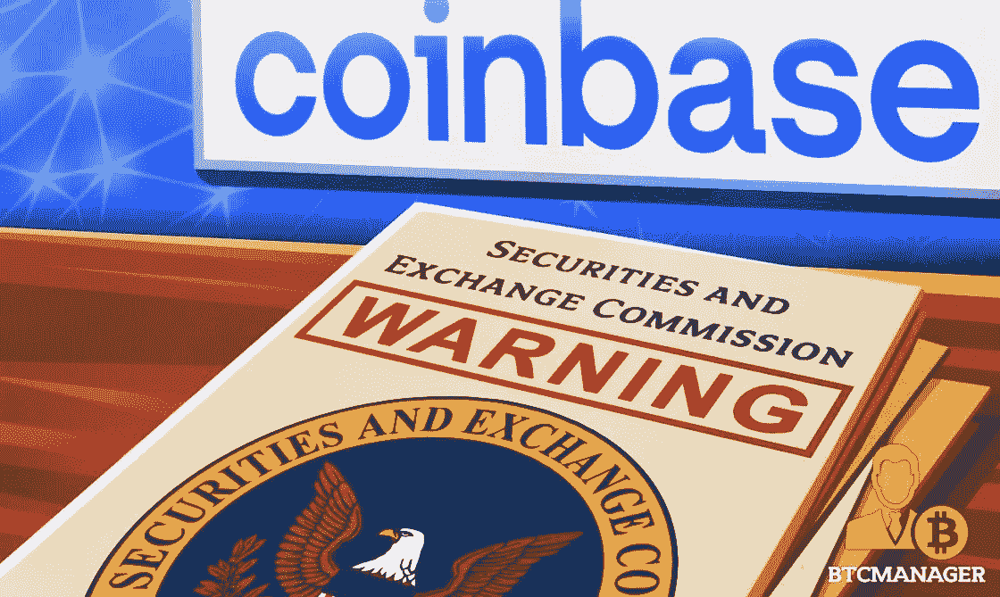

# 比特币基地贷款计划:对抗加密的最后一道银行屏障

> 原文：<https://medium.com/coinmonks/coinbase-deposit-program-the-last-banking-shelter-against-crypto-c1727f9deaf2?source=collection_archive---------11----------------------->

9 月 17 日，比特币基地在收到 SEC 的警告后，在其官方博客上宣布取消其 USDC APY 贷款计划，即所谓的比特币基地贷款计划。通过 Wells Notice(审慎监管机构宣布起诉一家公司的意图的官方渠道)发出的通知导致了上述计划的取消。

本文的目的是从 SEC 的角度理解不遵守监管的可能原因，以及可以应用的可能补救措施。

比特币基地贷款计划为账户中有 USDC 的比特币基地用户提供了以同样的加密货币赚取利息的可能性，利率为“传统储蓄账户全国平均水平的 50 倍”。此外，USDC 由比特币基地担保。

## 什么是 USDC？

USDC 是根据 ERC-20 协议(以太坊的基本智能合约)制定的稳定货币，允许创建可编程的数字美元，通过它可以全天候快速执行微观和宏观交易。虽然目前支持 USDC 的网络是以太坊(因为它是一个本地 ERC-20 令牌)，但新的内部开发允许在 Fantom、Solana 和 Avalanche 等网络下执行交易，这些网络正在为 DeFi 行业生成可行的 L1 层。

它是一种 EMT(电子货币代币),在 MiCA 计划下与美元稳定配对，因为它由发行者保管的美元担保，保证 1:1 的平价。从这个意义上来说，USDC 的发行是通过一个标准化和审计的程序产生的，在该程序中，在中心的受保护账户上进行的存款使得智能合同能够产生在 USDC 存放的金额，并在与存款人相关联的公共以太坊地址中释放该金额。就结构而言，它类似于 Tether，是内部监控机制以及主要用例导致了两者之间的相关差异。

USDC 保持着一种集中的结构，因此加密货币的治理允许发行者在没有其他参与者同意的情况下做出决定。也就是说，尽管通过分布式注册体系构建了稳定硬币，但决策并不响应激励的平衡机制(博弈论均衡，如比特币)，而是响应发行者的自由裁量能力。从这个意义上说，USDC 更接近于一种私人形式的可编程数字货币(CDBC 或中央银行数字货币)。

就其用途而言，通过以太坊，USDC 是推动 DeFi 行业的一个替代方案，因为，尽管其用途相对于通过 DAI 的 DeFi 担保品而言微不足道，但它是用作以太坊上运行的协议的担保品的中央稳定币。此外，由于以太坊抵押品价值的下降，DAI CDP 协议允许纳入其他类型的抵押品，包括 USDC stablecoin，这进一步加强了其与 DeFi 生态系统的联系。

事实上，虽然 USDT 通过集中的借贷平台(如 Nexo 和 Celsius Network)提供贷款类型的投资和储蓄产品，但 USDC 也允许通过分散的平台(如 Compound 或 Nuo Network)在 USDC 上借贷。

与戴相比，最根本的区别在于中央集权，以及由此而产生的对各稳定区的联合治理。尽管 MiCA 侧重于支持其差异化的担保品(USDC 的美元和戴的加密担保品)，但在我们看来，最相关的一点在于治理和随后的激励调整，以确保价格稳定。USDC 采取的折衷方案(对货币供应进行更多的审计和控制，以换取交易安全)意味着由的监管当局指导，或至少受到很大的影响，而戴作为一个分散的结构，其治理由做市商令牌持有者行使，保持较高程度的独立性，并且没有受到像那样严格的控制。

在内部治理层面，USDC 是由 Center Consortium 推出的一种加密货币，Center Consortium 是由比特币基地交易所和金融科技圈(Fintech Circle)合资成立的一家公司。Center Consortium 是 stablecoins 的管理框架，因为它支持发行和连接使用 USDC 的其他平台。

负责 USDC 发展的公司结构保证了稳定货币抵押的透明度和可追溯性，因为属于中心财团的公司可以被识别、核实并承担行政和刑事责任。此外，内部和外部审计(均富 LLP)已经定期进行，以确保对 USDC 公布的数据进行核实。

在中心财团的企业结构中，Circle 是 USDC 核心技术的创造者，比特币基地负责提供商业支持，并促进加密货币的推出和采用。Circle 是由 IDG 资本、Breyer Capital、General Catalyst Partners、高盛、CICC 阿尔法、百度、万向、宜信和光大银行等投资的合伙企业，而比特币基地是纳斯达克上市公司。

## **存款作为信贷机构的预留活动:**

一旦分析了 USDC 作为稳定货币的性质，就可以证明货币的三个职能的有效履行:记账单位、价值储存和支付手段，这要归功于其价值的稳定。因此，可以理解为，由中央银行发行的货币构成的信贷机构的存款基础可与 USDC 同化。为会计目的，财务报告的概念框架(国际财务报告准则)规定了为会计目的任何财务关系必须遵循的一般原则，指出经济实质必须优先于法律形式。因此，USDC 作为稳定币(用于 MiCA 目的的未来电子货币代币)的法律分类不能被理解为不同于货币的会计类别，因为两种工具(中央银行发行的货币和稳定币)的经济效果是相同的。

如果认为 USDC 等同于法定货币，就必须分析比特币基地吸收存款的能力。在这方面，首先应该指出的是，吸收存款活动是一种保留活动，即保留活动必须符合审慎银行条例规定的一系列法律要求。为什么？因为巴塞尔委员会制定的审慎监管规定在存款人保护的范式下构想了金融稳定。银行部门通过转换条款和风险来引导储蓄和投资，并利用其存款融资结构，从而为金融中介提供担保，在这种情况下，保护存款人对于金融活动的连续性至关重要，因为他们构成了大量的融资，而且通过在部分准备金模式下运作，存款人的恐慌可能导致违反合同义务和随后的破产程序。此外，鉴于金融体系的相互关联性，一家机构的单一危机所产生的传染效应会拖累其他机构，并有可能导致金融体系崩溃。

因此，有能力吸收存款的法律实体必须遵守一系列审慎要求，并接受具体的部门监督，以监测对相关标准的有效遵守情况。这一制度在欧洲通过《资本要求指令》(《CRD 五号法案》)进行监管，在美国得到推广，在 2008 年金融危机和颁布《沃尔克规则》之后，在投资活动和吸收存款活动之间建立了必要的结构性分离，以避免将筹集的资金用于风险投资。

根据这一原理，有义务设立一个机构作为吸收存款的信贷机构。即使考虑到审慎监管，也不能说比特币基地没有采用部分准备金模式，因为法律参考仅限于收取存款。

在当前电子货币机构、支付机构和其他金融科技兴起的背景下，银行监管机构呼吁适用*相同活动、相同风险*的原则，这基本上确立了所有希望开展保留活动的机构都有义务承担现有法律要求。这可以被理解为信贷机构的最后一道防线，在贷款活动竞争的当前阶段，由于监管负担的要求，它们发现存款融资是唯一一个不会受到其他参与者威胁的活动分支。在监管和审慎要求的应用方面，将比特币基地转变为信用机构将意味着非常苛刻的权衡(尽管 MiCA 已经规定将此类要求应用于任何加密资产服务提供商，并且 MakerDAO 等协议已经在银行风险参数下推出了他们的第一次分析)，这阻止了交易所尝试采取这一步骤。

## **结论:**

在我看来，证交会禁止比特币基地发行存款有两个理由支持:

*   USDC 稳定币与法定货币的同化，因为它实现了货币的三个功能，因此，贷款计划的结构是作为等同于信贷机构存款的存款。
*   根据国际银行监管标准，禁止不符合信贷机构授权条件的所有实体吸收存款。

> 加入 Coinmonks [电报频道](https://t.me/coincodecap)和 [Youtube 频道](https://www.youtube.com/c/coinmonks/videos)了解加密交易和投资

## 也阅读

 [## 最佳加密交易所| 2021 年十大加密货币交易所

### 编辑描述

blog.coincodecap.com](https://blog.coincodecap.com/crypto-exchange)  [## 2021 年 10 大最佳加密贷款平台| CoinCodeCap

### 编辑描述

blog.coincodecap.com](https://blog.coincodecap.com/crypto-lending)  [## 2021 年最佳免费加密交易机器人

### 2021 年币安、比特币基地、库币和其他密码交易所的最佳密码交易机器人。四进制，位间隙…

medium.com](/coinmonks/crypto-trading-bot-c2ffce8acb2a)  [## 最佳 4 个加密交易信号电报通道

### 这是乏味的找到正确的加密交易信号提供商。因此，在本文中，我们将讨论最好的…

medium.com](/coinmonks/best-crypto-signals-telegram-5785cdbc4b2b)  [## BlockFi 评论 2021:利弊和利率| CoinCodeCap

### 编辑描述

blog.coincodecap.com](https://blog.coincodecap.com/blockfi-review)  [## 如何在印度购买比特币？2021 年购买比特币的 7 款最佳应用[手机版]

### 如何使用移动应用程序购买比特币印度

medium.com](/coinmonks/buy-bitcoin-in-india-feb50ddfef94)  [## 加密税务软件——五大最佳比特币税务计算器[2021]

### 不管你是刚接触加密还是已经在这个领域呆了一段时间，你都需要交税。

medium.com](/coinmonks/best-crypto-tax-tool-for-my-money-72d4b430816b)  [## 存储比特币的最佳加密硬件钱包[2021] | CoinCodeCap

### 编辑描述

blog.coincodecap.com](https://blog.coincodecap.com/best-hardware-wallet-bitcoin)  [## Pionex 评论 2021 |免费加密交易机器人和交换

### Pionex 是为交易自动化提供工具的后起之秀。Pionex 上提供了 9 个加密交易机器人…

medium.com](/coinmonks/pionex-review-exchange-with-crypto-trading-bot-1e459d0191ea)