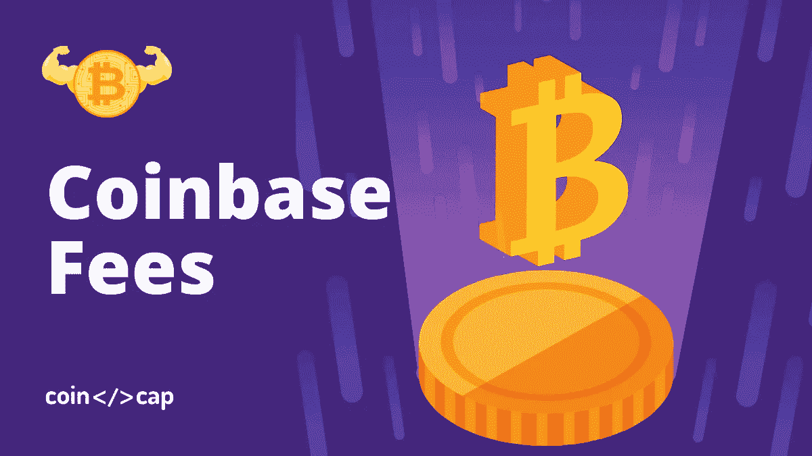
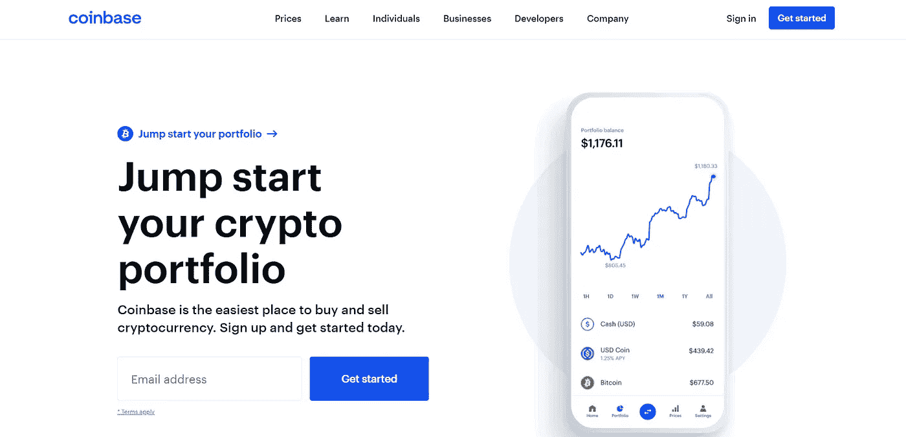
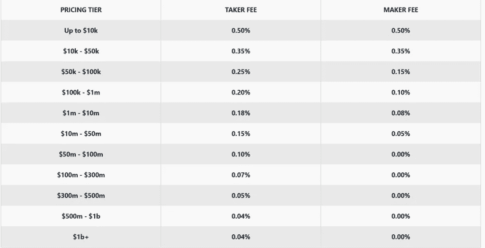
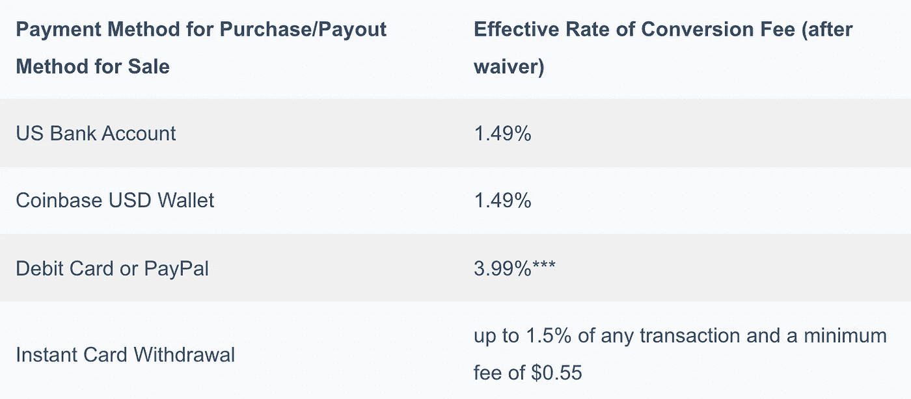
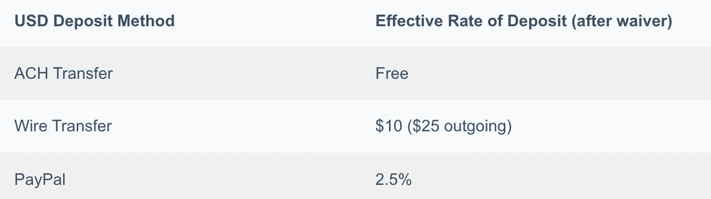
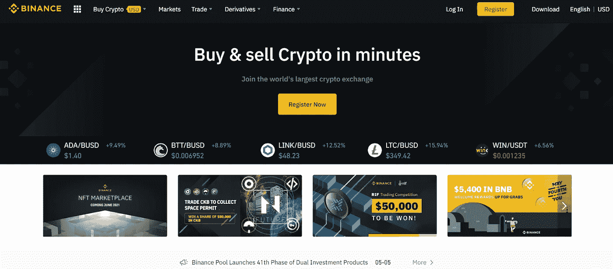

# 比特币基地费用:美国最便宜的交易所？

> 原文：<https://medium.com/coinmonks/coinbase-fees-831e77d4f2c5?source=collection_archive---------4----------------------->

Coinbase Fees

[**比特币基地**](https://blog.coincodecap.com/go/coinbase) 是美国最受欢迎的[加密货币交易平台](https://blog.coincodecap.com/crypto-exchange)之一。因此，本文将通过所有的[比特币基地](https://blog.coincodecap.com/go/coinbase)费用收费。

# 摘要

*   [比特币基地](https://blog.coincodecap.com/go/coinbase)是全球最大的[加密货币交易所](https://blog.coincodecap.com/go/crypto-exchange)之一。
*   此外，该平台还提供免费钱包服务。
*   当您直接从交易所购买密码时，将收取 0.50%的固定费用。
*   如果你想把你的资金从[区块链网络](https://blog.coincodecap.com/what-is-blockchain-a-simple-guide-for-dummies)中取出来换取法币，[比特币基地](https://blog.coincodecap.com/go/coinbase)会向你收取 1.49%的佣金。
*   在比特币基地上，用户可以进行加密到加密的转换。为此，比特币基地收取高达 2%的利差。
*   [比特币基地](https://blog.coincodecap.com/go/coinbase)当你从平台提取资金时，会收取网络费用。
*   你可以通过使用比特币基地专业版或者币安 T21 来避免支付某些费用。

# 什么是比特币基地？

比特币基地于 2012 年在三藩市推出。它现在已经成为世界上最大的加密货币交易所之一。它拥有超过 4300 万用户。比特币基地是独一无二的，因为它允许用户用法定货币购买密码。用户也可以在比特币基地上非常容易地进行加密到加密的转换。比特币基地的易用性是它在用户中受欢迎的原因。

比特币基地还有一个专业的交易平台，名为[比特币基地专业版](https://coinbase-consumer.sjv.io/7mbkNg)(原名 GMAX)。它独立于比特币基地工作。

Coinbase

要了解更多，请阅读[比特币基地评论](https://blog.coincodecap.com/coinbase-review)。该平台还提供了一个通过[比特币基地赌注](https://blog.coincodecap.com/coinbase-staking)从你的加密资产中赚取被动收入的选项。该平台还提供自己的加密卡，阅读[比特币基地卡评论](https://blog.coincodecap.com/coinbase-card-review)了解更多。

# 钱包服务

比特币基地提供免费的加密货币钱包服务，存储交易所支持的所有加密货币。

# 比特币基地交易费

该平台根据你的分级交易量收取佣金和做市商费。请参考下表了解分层价格结构:

Coinbase Fees

# 比特币基地购买费

当您直接从[比特币基地](https://blog.coincodecap.com/go/coinbase)购买加密货币时，将收取 0.50%的固定费用。除此之外，你还必须支付一些额外的费用，称为“比特币基地费”此外，它大于固定费用或可变费用。该变量由您所在的地区、产品特性和支付类型决定。

**美国的可变费用为:**

Coinbase Buying fees

Coinbase Deposit Fees

# 销售费用

如果你想把你的资金拿出区块链网络换取菲亚特，[比特币基地](https://blog.coincodecap.com/go/coinbase)会向你收取 1.49%的佣金。

# 比特币基地加密到加密转换费

比特币基地允许你直接转换加密到加密。对于这项服务，比特币基地收取高达 2%的差价。实际利差将取决于市场波动。

注意:(对于美国用户)以美元硬币开始或结束的转换将被视为购买或出售加密。该平台将收取固定费用和“比特币基地费用”

# 比特币基地撤离费

[比特币基地](https://blog.coincodecap.com/go/coinbase)当您从该平台提取资金时，会收取网络费用。此外，网络费用取决于网络当时的流量。而且，这个费用是要覆盖你的交易加入区块链的成本。

# 如何避免比特币基地费用？

比特币基地的费用相对高于其他交易所。而且，平台提供的几乎所有服务都是收费的。对于普通交易者来说，这些费用会很快增加。因此，了解如何避免他们收取过高的费用是至关重要的。

## 如何避免费用使用比特币基地专业版？

比特币基地和比特币基地都属于同一家公司。使用比特币基地专业版可以避免支付某些费用。比特币基地专业版尤其适用于专业交易者。该网站提供给你的数据比比特币基地多得多，所以这个平台一开始看起来可能有点吓人。

## 避免支付比特币基地专业版的取款费

[比特币基地](https://blog.coincodecap.com/go/coinbase)的提现费很高。当您从该平台提取资金时，将根据比特币基地需要支付的估计网络费用向您收取费用。然而，该平台对资金从一个比特币基地钱包转移到另一个钱包不收取任何费用。因为同一家公司拥有比特币基地和比特币基地 Pro，你可以免费将你的资金从比特币基地汇至[比特币基地 Pro](https://coinbase-consumer.sjv.io/7mbkNg) 。这将被视为将资金从一个比特币基地钱包转移到另一个钱包。

## 避免与币安支付比特币基地费用

币安不收取任何存款费用。这是因为币安只提供加密对加密的交易。与比特币基地不同，[币安](https://blog.coincodecap.com/go/binance)不提供法定转加密交易。处理加密到加密的交易比处理法定到加密的交易要便宜得多。币安只对所有交易收取 0.1%的费用。

币安还为使用币安币进行的交易提供 50%的费用折扣。币安的费用比比特币基地的费用便宜得多。如果你经常进行加密交易，你应该考虑转到像币安这样收费最低的交易所。

[Binance Exchange](/coinmonks/binance-review-ee10d3bf3b6e)

想了解更多关于币安的信息，请前往《币安评论》。该平台还提供加密卡；要了解更多信息，请前往[币安卡审查](https://blog.coincodecap.com/binance-card-review)。

如果你认为比特币基地的收费很高，并且你正在寻找一个替代方案，那么就去看看 [**比特币基地五大替代方案**](https://blog.coincodecap.com/coinbase-alternatives) 。

# 比特币基地安全吗？

是的，[比特币基地](https://blog.coincodecap.com/go/coinbase)是一个安全的交易所，将 98%的用户资金储存在黑客无法进入的冷库中。其余的用户资金可在线“热储”中获得，以满足平台的流动性需求。此外，这些基金也有保险。万一有违约，你失去了你的资金，你会得到补偿。

比特币基地成立于美国，在法律上必须遵守美国的所有法规和法律。这迫使[比特币基地](https://blog.coincodecap.com/go/coinbase)对此负责。

就个人而言，所有用户在使用该平台之前都必须通过 KYC(了解你的客户)。在这里，用户必须提交一个政府颁发的 ID，输入他们的电话号码和家庭地址。这最大限度地降低了金融欺诈和诈骗的风险。

该平台允许用户通过 Google authenticator 设置双因素认证。这给用户的账户提供了一层额外的保护。

# 比特币基地费用:结论

[比特币基地](https://blog.coincodecap.com/go/coinbase)是一款易于使用且安全的交易所。此外，有许多独特的特征使比特币基地有别于其他交易所。比特币基地对初学者来说是极好的。然而，如果你定期交易加密，比特币基地费用会很快增加。如果你想适当地利用你的加密投资，你需要尽量减少你支付的费用。你可以选择使用[比特币基地 Pro](https://coinbase-consumer.sjv.io/7mbkNg) 或者其他[密码交易所](https://blog.coincodecap.com/go/crypto-exchange)比如[币安](https://blog.coincodecap.com/go/coinbase)来避免支付高额费用。

# 常见问题

**比特币基地有手机应用吗？**

是的，比特币基地确实有一个手机应用程序。这款应用可以在 iOS 和 Android 设备上下载。

我怎样才能联系到比特币基地？

以下是联系比特币基地的方式:
–现场聊天室
–[比特币基地电子邮件支持](https://help.coinbase.com/en/contact-us)
–比特币基地呼叫中心支持:+1 888 908–7930

*   比特币基地评论 2021 |它是美国最好的加密交易所吗？
*   [币安 vs 比特币基地:哪个更好？【2021】](https://blog.coincodecap.com/binance-vs-coinbase)
*   [比特币基地卡评 2021:最佳加密借记卡](https://blog.coincodecap.com/coinbase-card-review)
*   如何将资金从币安转移到比特币基地？【2021】
*   比特币基地 vs 北海巨妖|美国最好的密码交易所是哪家？

> 加入 [Coinmonks 电报频道](https://t.me/coincodecap)，了解加密交易和投资

## 另外，阅读

*   [密码交易机器人](/coinmonks/crypto-trading-bot-c2ffce8acb2a)
*   [什么是保证金交易](https://blog.coincodecap.com/margin-trading) | [美元成本平均法](https://blog.coincodecap.com/dca)
*   [BigONE 交易所评论](/coinmonks/bigone-exchange-review-64705d85a1d4) | [电网交易机器人](https://blog.coincodecap.com/grid-trading)
*   [3 商业评论](/coinmonks/3commas-review-an-excellent-crypto-trading-bot-2020-1313a58bec92) | [Pionex 评论](/coinmonks/pionex-review-exchange-with-crypto-trading-bot-1e459d0191ea) | [Coinrule 评论](/coinmonks/coinrule-review-2021-a-beginner-friendly-crypto-trading-bot-daf0504848ba)
*   [莱杰 vs n rave](/coinmonks/ledger-vs-ngrave-zero-7e40f0c1d694)|[莱杰 nano s vs x](/coinmonks/ledger-nano-s-vs-x-battery-hardware-price-storage-59a6663fe3b0) | [币安评论](/coinmonks/binance-review-ee10d3bf3b6e)
*   [Bybit Exchange 审查](/coinmonks/bybit-exchange-review-dbd570019b71) | [Bityard 审查](/coinmonks/bityard-review-7d104239be35) | [CoinSpot 审查](https://blog.coincodecap.com/coinspot-review)
*   [3 commas vs Cryptohopper](/coinmonks/3commas-vs-pionex-vs-cryptohopper-best-crypto-bot-6a98d2baa203)|[赚取加密利息](/coinmonks/earn-crypto-interest-b10b810fdda3)
*   最好的比特币[硬件钱包](/coinmonks/the-best-cryptocurrency-hardware-wallets-of-2020-e28b1c124069?source=friends_link&sk=324dd9ff8556ab578d71e7ad7658ad7c) | [BitBox02 回顾](/coinmonks/bitbox02-review-your-swiss-bitcoin-hardware-wallet-c36c88fff29)
*   [block fi vs Celsius](/coinmonks/blockfi-vs-celsius-vs-hodlnaut-8a1cc8c26630)|[Hodlnaut 审核](/coinmonks/hodlnaut-review-best-way-to-hodl-is-to-earn-interest-on-your-bitcoin-6658a8c19edf) | [KuCoin 审核](https://blog.coincodecap.com/kucoin-review)
*   [Bitsgap 审查](/coinmonks/bitsgap-review-a-crypto-trading-bot-that-makes-easy-money-a5d88a336df2) | [Quadency 审查](/coinmonks/quadency-review-a-crypto-trading-automation-platform-3068eaa374e1) | [Bitbns 审查](/coinmonks/bitbns-review-38256a07e161)
*   [加密复制交易平台](/coinmonks/top-10-crypto-copy-trading-platforms-for-beginners-d0c37c7d698c) | [Coinmama 评论](/coinmonks/coinmama-review-ace5641bde6e)
*   [印度的加密交易所](/coinmonks/bitcoin-exchange-in-india-7f1fe79715c9) | [比特币储蓄账户](/coinmonks/bitcoin-savings-account-e65b13f92451)

*原载于 2021 年 7 月 1 日 https://blog.coincodecap.com**[*。*](https://blog.coincodecap.com/coinbase-fees)*