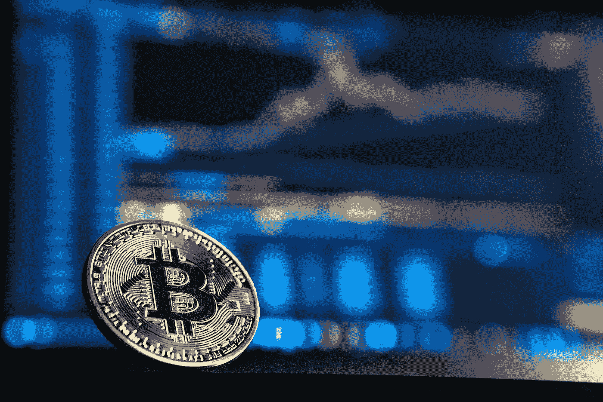

# 比特币基地 IPO:要知道什么

> 原文：<https://medium.com/coinmonks/coinbase-ipo-what-to-know-7ba44f6a7cf2?source=collection_archive---------4----------------------->

2021 年 4 月 14 日，比特币基地将成为第一家上市的主要加密货币公司。但这意味着什么？为什么这对投资者很重要？

**比特币基地**:“一个安全的平台，让购买、出售和存储比特币、以太坊等加密货币变得更加容易”。([*【https://www.coinbase.com/】*](https://www.coinbase.com/))。

Photo by André François McKenzie on Unsplash

# 什么是比特币基地 IPO？

比特币基地是美国最大的加密货币交易平台，与其他类似的公司不同，比特币基地将在完成首次公开募股(IPO)后，于 2021 年 4 月 14 日在纳斯达克证券交易所上市。

值得注意的是，当其他(传统的)IPO 利用投资银行帮助出售股票时，比特币基地将跳过这一步，选择直接公开发行(DPO)。简单地说，公司目前的所有者将把他们的股份转换成股票，这些股票将在纳斯达克上市，供投资者购买；去掉了涉及投资银行家及其费用的昂贵步骤。通常情况下，当一家公司不打算筹集额外资金，而是向公众出售股票时，就会这么做。

# 我应该投资吗？

与任何公司投资一样，最好是研究公司，他们对未来的计划是什么，在这种情况下，也要了解加密货币市场。

**比特币基地用法**

该公司成立于 2012 年，使命是“……构建加密经济——一个由加密技术支持的更加公平、高效和透明的金融系统。”([https://investor.coinbase.com/overview/default.aspx](https://investor.coinbase.com/overview/default.aspx))。

近年来，该平台越来越受欢迎，截至 2020 年 12 月底，已有 4300 万验证用户，截至 2021 年 3 月底，已有超过 5600 万验证用户。

**收入+利润**

值得注意的是，2021 年第一季度，已经超过了 2020 年全年的营收。2020 年，比特币基地报告收入 13 亿美元，利润 3.22 亿美元，而在 2021 年第一季度，他们报告收入 18 亿美元，利润 7.3 亿至 8 亿美元。

比特币基地约 96%的收入来自该平台的交易费用，2021 年第一季度的交易量为 3350 亿美元，而 2020 年的交易量为 1930 亿美元，很明显他们的收入大幅增加。

**在纳斯达克投资比特币基地**

比特币基地 IPO 将在纳斯达克交易，股票代码为 **COIN** 。如[比特币基地 IPO 申报文件](https://www.sec.gov/Archives/edgar/data/0001679788/000162828021005373/coinbaseglobalincs-1a2.htm)所述，该公司将向公众出售 1.149 亿股股票。股票的参考价格将于 2021 年 4 月 13 日(交易开始的前一天)公布。

据 investors.com 消息，分析师估计比特币基地的价值在 700-900 亿美元之间。然而，有人预测这一数字将高达 1000 亿美元。

然而，该公司概述了投资于一家严重依赖高度波动市场的公司所伴随的许多风险。根据[比特币基地的 IPO 申报文件](https://www.sec.gov/Archives/edgar/data/0001679788/000162828021005373/coinbaseglobalincs-1a2.htm)，该公司的收入取决于许多因素，其中包括:

*   整个加密经济的市场条件；
*   高度活跃的用户、投机者、矿工和投资者的投资交易活动；
*   用户和投资者对 cryto 资产和加密平台的信心下降；
*   政府的货币政策、贸易限制和法定货币贬值；
*   加密平台的流动性。

比特币基地表示，他们不能保证其平台支持的任何加密资产会保持价值，或者会有大量的交易活动。如果交易加密资产的需求或加密资产的价格下降，他们的业务和平台将受到不利影响。

总的来说，这是第一个上市的主要加密货币平台的消息至少令人兴奋。有人猜测，比特币基地的 IPO 也将为加密经济提供更多验证。

如果你有兴趣了解更多关于比特币基地和/或他们首次公开募股的信息，可以看看下面的链接:

**比特币基地:**

[https://help . coin base . com/en/coin base/getting-started/crypto-education/what-is-coin base](https://help.coinbase.com/en/coinbase/getting-started/crypto-education/what-is-coinbase)

**比特币基地 IPO:**

 [## 比特币基地 IPO:以下是你需要知道的

### 很快你就能买下帮你买比特币的公司了。比特币基地，世界上最大的加密货币交易所…

www.forbes.com](https://www.forbes.com/advisor/investing/coinbase-ipo-direct-listing/) 

> 加入 coin monks[Telegram group](https://t.me/joinchat/Trz8jaxd6xEsBI4p)学习加密交易和投资

## 另外，阅读

*   最好的[密码交易机器人](/coinmonks/crypto-trading-bot-c2ffce8acb2a) | [网格交易](https://blog.coincodecap.com/grid-trading)
*   [加密复制交易平台](/coinmonks/top-10-crypto-copy-trading-platforms-for-beginners-d0c37c7d698c) | [如何在 WazirX 上购买比特币](/coinmonks/buy-bitcoin-on-wazirx-2d12b7989af1)
*   [CoinLoan 点评](/coinmonks/coinloan-review-18128b9badc4)|[Crypto.com 点评](/coinmonks/crypto-com-review-f143dca1f74c) | [火币保证金交易](/coinmonks/huobi-margin-trading-b3b06cdc1519)
*   [尤霍德勒 vs 科恩洛 vs 霍德诺特](/coinmonks/youhodler-vs-coinloan-vs-hodlnaut-b1050acde55a) | [Cryptohopper vs 哈斯博特](https://blog.coincodecap.com/cryptohopper-vs-haasbot)
*   [杠杆代币](/coinmonks/leveraged-token-3f5257808b22) | [最佳密码交易所](/coinmonks/crypto-exchange-dd2f9d6f3769) | [Paxful 点评](/coinmonks/paxful-review-4daf2354ab70)
*   [加密套利](/coinmonks/crypto-arbitrage-guide-how-to-make-money-as-a-beginner-62bfe5c868f6)指南| [如何做空比特币](/coinmonks/how-to-short-bitcoin-568a2d0b4ae5)
*   [如何在印度购买比特币？](/coinmonks/buy-bitcoin-in-india-feb50ddfef94) | [WazirX 评论](/coinmonks/wazirx-review-5c811b074f5b) | [BitMEX 评论](https://blog.coincodecap.com/bitmex-review)
*   [印度比特币交易所](/coinmonks/bitcoin-exchange-in-india-7f1fe79715c9) | [比特币储蓄账户](/coinmonks/bitcoin-savings-account-e65b13f92451)
*   [币安收费](/coinmonks/binance-fees-8588ec17965) | [僵尸加密审查](/coinmonks/botcrypto-review-2021-build-your-own-trading-bot-coincodecap-6b8332d736c7) | [热门审查](/coinmonks/hotbit-review-cd5bec41dafb)
*   [我的密码副本交易经验](/coinmonks/my-experience-with-crypto-copy-trading-d6feb2ce3ac5) | [购买硬币评论](https://blog.coincodecap.com/buycoins-review)
*   [Bybit 融资融券交易](/coinmonks/bybit-margin-trading-e5071676244e) | [币安融资融券交易](/coinmonks/binance-margin-trading-c9eb5e9d2116) | [Overbit 审核](/coinmonks/overbit-review-9446ed4f2188)
*   [加密货币储蓄账户](/coinmonks/cryptocurrency-savings-accounts-be3bc0feffbf) | [YoBit 审查](/coinmonks/yobit-review-175464162c62) | [Bitbns 审查](/coinmonks/bitbns-review-38256a07e161)
*   [Botsfolio vs nap bots vs Mudrex](/coinmonks/botsfolio-vs-napbots-vs-mudrex-c81344970c02)|[gate . io 交流回顾](/coinmonks/gate-io-exchange-review-61bf87b7078f)
*   [最佳比特币保证金交易](/coinmonks/bitcoin-margin-trading-exchange-bcbfcbf7b8e3) | [萝莉点评](/coinmonks/lolli-review-e6ddc7895ad8) | [比特币保证金交易](https://blog.coincodecap.com/bityard-margin-trading)
*   [创造并出售你的第一个 NFT](https://blog.coincodecap.com/create-nft) | [本地比特币评论](/coinmonks/localbitcoins-review-6cc001c6ed56)
*   [加密保证金交易交易所](/coinmonks/crypto-margin-trading-exchanges-428b1f7ad108) | [赚取比特币](/coinmonks/earn-bitcoin-6e8bd3c592d9) | [Mudrex 投资](https://blog.coincodecap.com/mudrex-invest-review-the-best-way-to-invest-in-crypto)
*   [如何在印度购买以太坊？](https://blog.coincodecap.com/buy-ethereum-in-india) | [如何在币安购买比特币](https://blog.coincodecap.com/buy-bitcoin-binance)
*   [顶级付费加密货币和区块链课程](https://blog.coincodecap.com/blockchain-courses)
*   [MXC 交易所评论](/coinmonks/mxc-exchange-review-3af0ec1cba8c) | [Pionex vs 币安](https://blog.coincodecap.com/pionex-vs-binance) | [Pionex 套利机器人](https://blog.coincodecap.com/pionex-arbitrage-bot)
*   [在美国如何使用 BitMEX？](https://blog.coincodecap.com/use-bitmex-in-usa) | [BitMEX 评论](https://blog.coincodecap.com/bitmex-review)