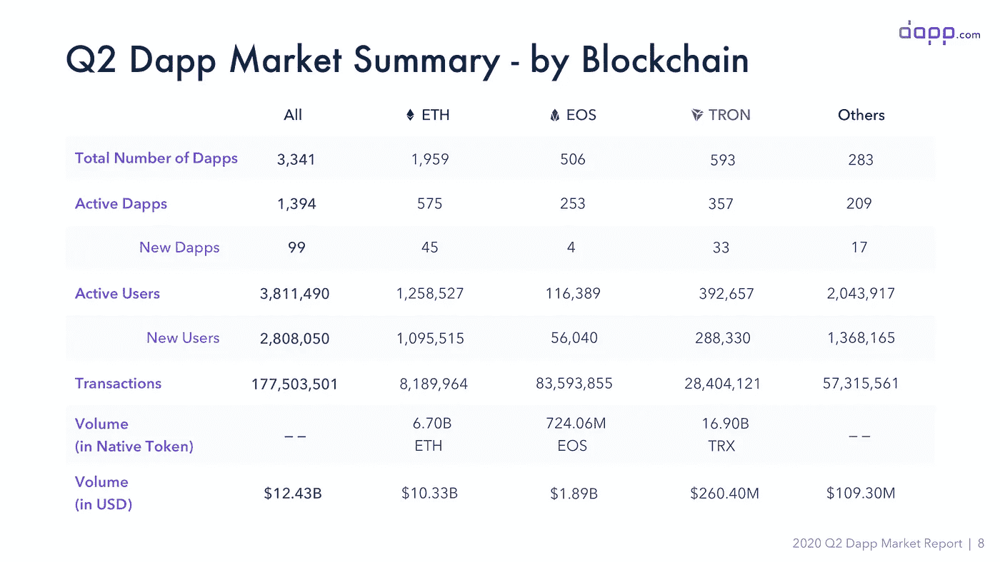

# 比特币基地计划上市/滴滴出行试验中国的 CBDC / Dfinity 开放互联网计算机

> 原文：<https://medium.com/coinmonks/coinbase-plans-to-go-public-didi-trialing-chinas-cbdc-dfinity-opens-internet-computer-4587a562d196?source=collection_archive---------0----------------------->

*2020 年 7 月 10 日*

***本周景观****…我们获悉* ***【比特币基地】*** *已经开始计划股票市场上市，最早可能在今年【2020】上市，使其成为美国第一家上市的主要加密货币交易所。此外，该公司将首次投资者路演日期定在 8 月 14 日。简而言之，这是一个 BFD。成功上市将在关键时刻为该行业注入至关重要的合法性，强调区块链日益增长的重要性，以及在我们日常生活中除数字货币之外的更多采用。***滴滴出行正在组建一个任务组，设计并实现中国央行数字货币(***)在其运输平台上的试用。滴滴是少数几家以地区为基础的公司之一，以各种用例测试中国的 CBDC。* ***中远海运*** *(中国)正在与蚂蚁金服的* ***蚂蚁区块链*** *合作，精简其运营。* ***必和必拓集团*** *(澳洲)和中国金属巨头* ***宝钢&钢铁有限公司*** *利用区块链进行了首次铁矿石贸易试验。* ***海洋协议*** *交付 PoC 为* ***戴姆勒股份公司*** *。做好准备，****Twitter****用户现在可以互相发送数字货币，另一个社交网络踏在了* ***脸书*** *的前面，在这个类别中——****Reddit****已经率先加强了社区参与。* ***不可阻挡的域名*** *推出分散式聊天协议——超级酷，绝对要看看这个。根据最近来自***、Q2 2020 的报道，在 12 个公共区块链上产生了****1394 个活跃 DApp、280 万活跃 DApp 用户、*** *和****124.3 亿美元*** *。****

***加趋势&来自投资人的见解，****web 3****&****DApp****资金报告，生产部署企业用例，吨研究，****ZK proofs****，* ***Flow 旗下*** *区块链训练营，等等！尽情享受吧！***

## **📈比特币基地证券交易所准备里程碑式的股票上市**

**据三位知情人士透露，比特币基地公司已开始计划最早于今年上市，这将使其成为美国首家上市的主要加密货币交易所。消息人士称，比特币基地可能会在今年晚些时候或明年初寻求上市，并警告称，这些计划仍有可能发生变化。该公司尚未向美国证券交易委员会登记其上市意向，但一直在谈判聘请投资银行和律师事务所，消息人士补充道… [阅读更多](https://www.nytimes.com/reuters/2020/07/09/business/09reuters-coinbase-ipo-exclusive.html)**

***相关:📈***

## **🏦[美国向数字美元迈进](https://www.forbes.com/sites/tatianakoffman/2020/07/01/senate-moves-closer-to-digital-dollar/)**

**参议院银行委员会 6 月 30 日举行听证会，讨论美元数字化问题。最近，中国已经开始测试其数字货币 DCEP，这增加了创造数字美元的压力。目前还不清楚数字美元将在多长时间内出现，尽管来自中国的日益激烈的竞争可能是美国监管机构需要的推动力。… [阅读更多信息](https://www.forbes.com/sites/tatianakoffman/2020/07/01/senate-moves-closer-to-digital-dollar/)**

***相关:📈* [*Circle 证实应执法部门要求在 USDC 冻结 10 万美元*](https://www.coindesk.com/circle-confirms-freezing-100k-in-usdc-at-law-enforcements-request)**

## **🚘[中国滴滴出行优步将试行央行数字货币](https://www.coindesk.com/chinas-uber-didi-said-to-trial-pbocs-central-bank-digital-currency)**

**滴滴出行正在组建一个工作组，在其交通平台上设计和实施中国央行数字货币(CBDC)的试验。该公司已与中国人民银行(PBoC)数字货币研究所建立战略合作伙伴关系，以加速 CBDC 的应用，即数字货币电子支付(DCEP)。该公司表示:“根据中国人民银行的 DCEP 总体战略和运营时间表，滴滴出行的 DCEP 工作组将根据严格的安全、安保和治理标准设计和实施 DCEP 试点项目……”[阅读更多信息](https://www.coindesk.com/chinas-uber-didi-said-to-trial-pbocs-central-bank-digital-currency)**

## **🚢[全球航运巨头中远试水阿里巴巴旗下蚂蚁区块链](https://www.coindesk.com/global-shipping-giant-cosco-to-trial-alibabas-ant-blockchain)**

**总部位于上海的中远海运本周早些时候证实，它将试用阿里巴巴子公司蚂蚁金服的产品蚂蚁区块链，以简化其运营。中远海运拥有 1，330 艘船舶，总载货量不到 1.06 亿吨，是世界上最大的船舶之一。在周一的一份声明中，这些公司表示，区块链可以用于向相关方分发经过验证和防篡改的关键文件，如集装箱记录和进口许可证。… [阅读更多信息](https://www.coindesk.com/global-shipping-giant-cosco-to-trial-alibabas-ant-blockchain)**

***相关:🏥* [*阿富汗批准区块链项目，帮助解决假药祸害*](https://www.coindesk.com/afghanistan-approves-blockchain-project-to-help-tackle-scourge-of-counterfeit-meds)**

## **🖥️有限公司展示其 TikTok 克隆产品，向外部开发者开放其“互联网计算机”**

**DFINITY 正在建造所谓的[互联网计算机](http://A plan to redesign the internet could make apps that no one controls)，这是一个去中心化的非专有网络，用于运行下一代大型应用程序。今天，该公司宣布，互联网计算机现在向第三方开发者和企业家开放，以构建下一代。愿景是重启互联网，摧毁创造虚拟垄断的能力，如脸书、LinkedIn、Instagram 和 WhatsApp……[阅读更多](https://techcrunch.com/2020/06/30/dfinity-demos-its-tiktok-clone-opens-up-its-internet-computer-to-outside-developers/)**

***相关:📖* [*没有物联网传感器的智能合同“潜力有限”*](https://cointelegraph.com/news/smart-contracts-have-limited-potential-without-iot-sensors)**

## **⚒️ [世界最大的矿业公司在区块链进行第一笔矿石交易](https://www.coindesk.com/worlds-biggest-mining-firm-bhp-transacts-first-ore-trade-blockchain)**

**总部位于澳大利亚的必和必拓集团和中国金属巨头宝山钢铁股份有限公司利用区块链技术进行了首次铁矿石贸易试验。MineHub 平台用于处理合同条款、在线交换文档，并提供供应链的可见性和责任……[阅读更多信息](https://www.coindesk.com/worlds-biggest-mining-firm-bhp-transacts-first-ore-trade-blockchain)**

## **📖[一家以色列区块链初创公司声称已经为 BTC 交易发明了一个“撤销”按钮](https://cointelegraph.com/news/israeli-blockchain-startup-offers-undo-button-for-bitcoin-transactions)**

**以色列区块链初创公司 Kirobo 推出了一项“可检索转账”功能，以解决加密货币交易中与人为错误相关的问题。平台向发送者提供唯一的代码；此外，收款人必须输入匹配的密码才能接收转账……[了解更多信息](https://cointelegraph.com/news/israeli-blockchain-startup-offers-undo-button-for-bitcoin-transactions)**

# **本周的更多内容:**

**🏦 [ING 加入密码行业团体制定行为准则](https://www.coindesk.com/index.php?p=492849)**

**👩‍🏫 [**现在申请:**开放世界建设者:免费虚拟区块链训练营](/dapperlabs/open-world-builders-free-virtual-blockchain-bootcamp-cefe7f0ccb9f)——[流量](https://medium.com/u/22ac47d15ea7?source=post_page-----4587a562d196--------------------------------)**

**📖[ **报告** ] [Web 3 资助:Q2 2020 in numbers](https://outlierventures.io/research/web-3-funding-q2-2020-in-numbers/) — [离群风险投资](https://medium.com/u/5751ee054871?source=post_page-----4587a562d196--------------------------------)**

**📖[ **报告** ] [加密美元:故事到此为止](https://www.castleisland.vc/cryptodollars)**

**📖[介绍数据中枢:Web 3 网关](https://figment.network/resources/introducing-data-hub-the-web-3-gateway/) — [虚拟网络](https://medium.com/u/618d17b61837?source=post_page-----4587a562d196--------------------------------)**

**📖[海洋协议](https://medium.com/u/1e7ff6f6df18?source=post_page-----4587a562d196--------------------------------) [为戴姆勒股份公司提供概念验证](https://blog.oceanprotocol.com/ocean-protocol-delivers-proof-of-concept-for-daimler-ag-in-collaboration-with-daimler-south-east-564aa7d959ca)**

**📖[印度主要农民生产者组织将区块链用于供应链](https://cointelegraph.com/news/major-indian-farmer-producer-organization-to-use-blockchain-for-supply-chains)**

**💸Twitter 用户现在可以用 Torus 互相发送加密信息了**

**📖以太坊的搭便车指南**

**📖[无法阻止的域名](https://medium.com/u/8e928ab8a576?source=post_page-----4587a562d196--------------------------------) [启动分散聊天协议](https://cointelegraph.com/news/unstoppable-domains-launches-decentralized-chat-protocol)**

**💸[Impact Accelerator ETC Labs 的区块链基金女创始人](https://www.forbes.com/sites/nisaamoils/2020/06/02/blockchain-for-impact-accelerator-etc-labs-funds-female-founders/)——[Nisa Amoils](https://medium.com/u/353a379a85d6?source=post_page-----4587a562d196--------------------------------)**

**📖[我是叙利亚难民。比特币就是这样改变了我的生活](https://www.coindesk.com/index.php?p=493062)**

**📖【**视频**】[ZKPs 和区块链:技术深度挖掘](https://www.youtube.com/watch?v=XKdhOYd7qYg)——[保罗·布罗迪](https://medium.com/u/275d4a02c655?source=post_page-----4587a562d196--------------------------------)**

# **分散式应用程序手表**

## **📖 [2020 年 Dapp.com Q2 Dapp 市场报告](https://www.dapp.com/article/q2-2020-dapp-market-report/)—**

****

**Source: [Dapp.com](https://www.dapp.com/article/q2-2020-dapp-market-report/)**

**在 Q2 2020 中，有**1394 个活跃的 dapp，2808050 个活跃的 dapp 用户，在 12 个公共区块链——以太坊、EOS、TRON、Steem、Hive、Chiliz、Terra、ICON、Klaytn、NEO、Tomochain、IOST 和 Vexanium——上产生的总交易额为 124.3 亿美元。以太坊在 Q2 的活跃 dapp 用户数量翻了一番(97%)，从第一季度的 637，278 人激增至本季度的 1，258，527 人，达到了其 ATH** 。同时，EOS 和 Tron 上的 dapp 活跃用户数也分别增长了 30%和 50%，分别达到 116，389 和 392，657……[阅读更多](https://www.sia.eu/en/media-events/news-press-releases/quant-network-and-sia-successfully-tested-blockchain-interoperability)**

## **📖项目研究员称，以太坊 2.0 的第 0 阶段可能要到 2021 年才会上线**

**据参与该项目的一名研究人员称，以太坊 2.0 的初始阶段——被称为 0 期——可能要到 2021 年初才会上线。以太坊基金会贾斯汀·德雷克(Justin Drake)周五在 Reddit 的“问我任何问题”会议上被问及 0 期部署何时开始。正如之前所报道的，过去发布延迟背后的主要因素之一是参与 0 期开发的人员所倡导的多客户方法。… [阅读更多](https://www.theblockcrypto.com/linked/71155/eth-2-phase-0-ama-2021)**

***相关:📖* [*菲律宾证交会刚刚痛斥顶级以太坊 dapp 为庞氏骗局*](https://decrypt.co/34640/philippines-sec-just-denounced-the-top-ethereum-dapp-as-a-ponzi)**

## **📖[区块链游戏行业现状| H1 2020](https://dappradar.com/blog/state-of-the-blockchain-game-sector-h1-2020)——[DappRadar](https://medium.com/u/b355b203c3dd?source=post_page-----4587a562d196--------------------------------)**

**截至 2020 年 6 月 30 日，每日活跃的独立钱包总数不到 22，000 个，或者说，过去 30 天的平均总数约为 21，400 个。相比之下，在 1 月和 2 月初的日子里，每日活跃的唯一钱包的日峰值超过 28，000 个。然而，在此期间，每个区块链的累计总数显示出不同的趋势。… [阅读更多信息](https://dappradar.com/blog/state-of-the-blockchain-game-sector-h1-2020)**

***相关:📖* [*霓虹区*](https://medium.com/u/9c59515ce072?source=post_page-----4587a562d196--------------------------------)*’*[*RPG 将在 Matic 网络上启动*](https://cointelegraph.com/news/blockchain-enabled-neon-district-rpg-will-launch-on-matic-network)**

**📖[DAPP 网络的 Reddit 缩放奖金](/the-liquidapps-blog/the-dapp-networks-reddit-scaling-bounty-d60e057de6d)**

**📖[更加开放、基于区块链的虚拟世界](https://andrewsteinwold.substack.com/p/a-call-for-more-open-blockchain-based)**

**📖对于开发者来说，在 Tezos、Cosmos——[解密](https://medium.com/u/2de7a312127a?source=post_page-----4587a562d196--------------------------------)上构建变得更加容易**

# **📺#VCTV 的知识点滴:**

**当我与行业领先的投资者坐在一起观看另一集 [VCTV](https://exchange.latoken.com/events/) ( [拉图肯](https://medium.com/u/eb73c6f6ed28?source=post_page-----4587a562d196--------------------------------))时，这里是全球空间和深度技术(区块链和分布式系统)领域发生的最新情况。**

**Source: [YouTube](https://youtu.be/SuEMQ5fOiL4) & [LA Token](https://go.latoken.com/July9Panel)**

# **🎙️研究:2020 年区块链和 DApps 状况:**

****

**Source: [Topio Networks](https://www.topionetworks.com/markets/dapps-stack-landscape-5de8d07eb9abe453e04203f8)**

***现已上市，免费提供的是我最新研究的去中心化应用或*[***【DApp】【栈】景观图***](https://s3.amazonaws.com/spoke-profiles-prod-assets/uploads/a069e1e1e798c975d4eca968c72f4ac1352d62a4/original/DApps_Stack_Landscape_Q2_2020.pdf?utm_source=Social%20Media&utm_medium=LinkedIn&utm_campaign=Topio%20-%20Dapps%20Landscape%20update&utm_content=S3%20Link)**—Q2 2020 年版。这张地图提供了新兴 DApps 行业的全面概述和分类，突出显示了在构建下一代应用程序中发挥重要作用的 400 多家全球公司。作为奖励，我包括了一些生态系统玩家和团体，当你准备发布你的应用时，你需要熟悉它们。如果这是你看到的第一个版本，那就把它当作你进一步理解不仅仅是这个行业，而且是构建一个完全或部分去中心化的应用程序所需的所有核心技术的指导性路线图(DApp)。****

****

**Source: [Topio Networks](https://www.topionetworks.com/markets/blockchain-landscape-5bf43854b9abe4633c1f87da)**

***另外，可以找我的《Q1 2020 研究》整个* [***区块链格局***](https://www.linkedin.com/posts/kyleellicott_q12020-blockchain-landscapekyleellicotttopionetworks-activity-6638879840634310656-UNtB) *。这是《风景》的第五版。你会发现地图上包括 747 家公司(总共 900 多家独特的+更广泛的关键生态系统参与者)，它们从 2010 年到 2020 年筹集了 220 多亿美元的资金，仅 2017 年以来就投资了 180 多亿美元！***

**📣*想要了解区块链、DApps、DeFi 和 FinTech 行业的所有头条新闻、投资、深入研究和最新动态吗？* [***订阅***](https://www.topionetworks.com/newsletters) *关注我的* [***推特***](https://twitter.com/kyleellicott) *每周更新还有更多！***

> **[直接在您的收件箱中获得最佳软件交易](https://coincodecap.com/?utm_source=coinmonks)**

****