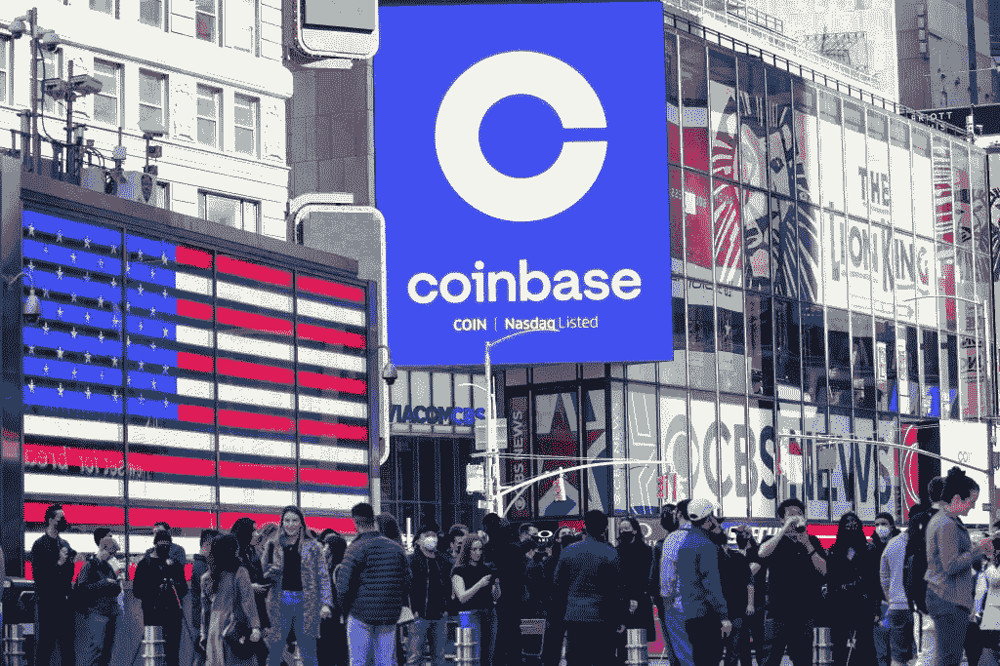
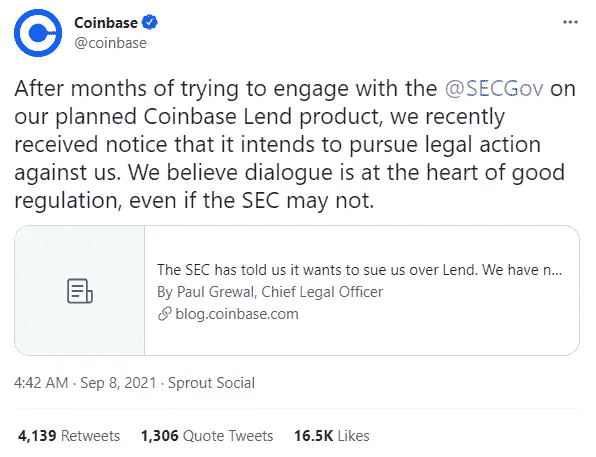
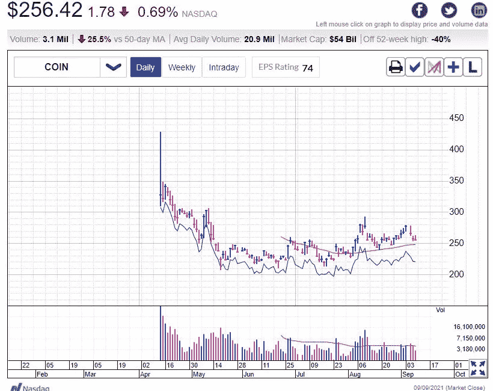
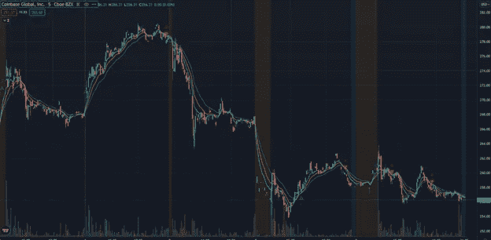

# 比特币基地最近在证券交易委员会的遭遇:巧合还是欺凌？

> 原文：<https://medium.com/coinmonks/coinbase-recent-ordeals-with-the-s-e-c-coincidence-or-bullying-b58378f72dac?source=collection_archive---------6----------------------->

自上周以来，密码世界发生了很多变化。比特币现在正式成为萨尔瓦多的法定货币。乌克兰议会议员批准了有助于澄清比特币法律地位的立法。我们可能会看到各国竞相效仿，导致比特币的采用率上升。

Coinbase listed on Stock Exchange

在美国，证券交易委员会威胁要对比特币基地提起诉讼。正在接受审查的项目被称为比特币基地贷款。比特币基地最近宣布，它将推出比特币基地出借功能，允许用户将稳定的硬币借给其他用户，以获得丰厚的年收益率(APY)。目前，APY 的利率是从 4%开始。

## **为什么证券交易委员会对比特币基地有意见**

比特币基地即将推出的计划预示着美国政府的危险。金融机构目前通过债券市场借钱给美国政府，政府提供的贷款利率充其量也是不够的。想象一下，如果金融机构找到一种利润高出数千倍的替代方案，会发生什么。想象一下，如果允许自由市场决定贷款利率，现有政府会发生什么。他们可能会破产。

## 术语“安全性”是什么意思？

目前的长篇大论是在投资者保护的支持下进行的。具体来说，这与“证券”一词的法律定义有关。根据美国证券交易委员会的规定，证券属于他们的管辖范围。然而，他们尚未澄清该术语将如何应用于数字资产。他们已经不再这样做，而是继续面对个别公司，并声称违规。然而，就公司而言，由于缺乏明确性，他们被迫根据自己的最佳判断采取行动。

## 第一印象

鉴于加里·詹斯勒(Gary Gensler)的出身和经历，大多数专家预计，在 SEC 新领导层的领导下，事情会有所不同。证交会主席加里·詹斯勒(Gary Gensler)比大多数人更了解这些问题。他当然比他的前任更有资格知道更多。显然，这不是一个理解含义或前景的问题。看起来主要的问题是证交会不制定法律。他们最多能做的就是树立一个榜样，赢得官司。

SEC 与比特币基地的激烈辩论以及比特币在萨尔瓦多成为法定货币的消息可能是加密价格下跌的主要原因。比特币价格下跌

这种新产品提供丰厚的美元回报，同时为您的美元提供保险。是管制还是欺凌？这看起来很像保护他们的利益。

如下图所示，比特币基地股票从 9 月 3 日的 280 美元大幅下跌至 9 月 9 日的 256 美元。由于 SEC 可能起诉这家出色的机构的消息引发的猜测，它一直在苦苦挣扎。这不是比特币基地第一次受到攻击和审查。

## 巧合还是霸凌？

比特币基地是美国最大的加密交易所。传统金融生态系统和分散金融之间的利益冲突似乎再次抬头。萨尔瓦多一采用比特币，价格就暴跌了 20%。主要角色挑选个别组织，并试图通过恐惧、不确定性和怀疑(俗称 FUD)迫使它们投降。这已经影响到比特币基地，因为他们的股价大幅下跌。

Coinbase market price

周三，比特币基地发布了一份声明，称证券监管机构威胁要就其计划发行的一款贷款产品提起诉讼。该委员会表示，它将研究寻求民事禁令的可能性。禁令的基础是，比特币基地处于一个不受监管的行业，提供的产品类似于传统银行提供的产品。在这种情况下，它属于美国证券交易委员会的管辖范围。Gary Gensler 还表示，他担心加密交易和产品可能对市场和投资者产生的影响。有一点很清楚，加密产品的回报率很高。它们比替代品高得多。

我想指出，监管是阻碍机构和对冲基金大举投资加密货币的一个主要障碍。他们担心会被起诉，因为他们需要遵守法规。至少，凯文·奥利里证实了这个事实。他对自己投资中分配给加密货币的部分一直很小心，因为潜在的诉讼可能会导致不良后果，就像比特币基地现在面临的情况。

奇妙先生最近发表了一个大胆的声明，分散融资将把金融中间人排除在等式之外。事实上，他们会擦亮鞋子。他显然看好加密货币的前景，不考虑传统生态系统的回扣。

对比特币基地的警告似乎是一个信号，表明证券交易委员会将其一些举动视为威胁。它不会去袖手旁观看。

> 加入 Coinmonks [电报频道](https://t.me/coincodecap)和 [Youtube 频道](https://www.youtube.com/channel/UCbyDhTbOiKh2iUMKBi4-4Zg)了解加密交易和投资

## 另外，阅读

*   [尤霍德勒 vs 考尼洛 vs 霍德诺特](/coinmonks/youhodler-vs-coinloan-vs-hodlnaut-b1050acde55a) | [Cryptohopper vs 哈斯博特](https://blog.coincodecap.com/cryptohopper-vs-haasbot)
*   [币安 vs 北海巨妖](https://blog.coincodecap.com/binance-vs-kraken) | [美元成本平均交易机器人](https://blog.coincodecap.com/pionex-dca-bot)
*   [如何在印度购买比特币？](/coinmonks/buy-bitcoin-in-india-feb50ddfef94) | [WazirX 评论](/coinmonks/wazirx-review-5c811b074f5b) | [BitMEX 评论](https://blog.coincodecap.com/bitmex-review)
*   [比特币主根](https://blog.coincodecap.com/bitcoin-taproot) | [Bitso 点评](https://blog.coincodecap.com/bitso-review) | [排名前 6 的比特币信用卡](/coinmonks/bitcoin-credit-card-bc8ab6f377c6)
*   [双子座 vs 比特币基地](https://blog.coincodecap.com/gemini-vs-coinbase) | [比特币基地 vs 北海巨妖](https://blog.coincodecap.com/kraken-vs-coinbase) | [硬币罐 vs 硬币点](https://blog.coincodecap.com/coinspot-vs-coinjar)
*   [印度密码交易所](/coinmonks/bitcoin-exchange-in-india-7f1fe79715c9) | [比特币储蓄账户](/coinmonks/bitcoin-savings-account-e65b13f92451) | [Paxful 审核](/coinmonks/paxful-review-4daf2354ab70)
*   [杠杆令牌](/coinmonks/leveraged-token-3f5257808b22) | [最佳加密交易所](/coinmonks/crypto-exchange-dd2f9d6f3769) | [AscendEX 评论](/coinmonks/ascendex-review-53e829cf75fa)
*   [Godex.io 审核](/coinmonks/godex-io-review-7366086519fb) | [邀请审核](/coinmonks/invity-review-70f3030c0502) | [BitForex 审核](https://blog.coincodecap.com/bitforex-review) | [HitBTC 审核](/coinmonks/hitbtc-review-c5143c5d53c2)
*   [Crypto.com 费用](/coinmonks/binance-fees-8588ec17965) | [Botcrypto 审查](/coinmonks/botcrypto-review-2021-build-your-own-trading-bot-coincodecap-6b8332d736c7) | [替代方案](https://blog.coincodecap.com/crypto-com-alternatives)
*   [有哪些交易信号？](https://blog.coincodecap.com/trading-signal) | [Bitstamp vs 比特币基地](https://blog.coincodecap.com/bitstamp-coinbase) | [买索拉纳](https://blog.coincodecap.com/buy-solana)
*   [ProfitFarmers 回顾](https://blog.coincodecap.com/profitfarmers-review) | [如何使用 Cornix Trading Bot](https://blog.coincodecap.com/cornix-trading-bot)
*   [MXC 交易所评论](/coinmonks/mxc-exchange-review-3af0ec1cba8c) | [Pionex vs 币安](https://blog.coincodecap.com/pionex-vs-binance) | [Pionex 套利机器人](https://blog.coincodecap.com/pionex-arbitrage-bot)
*   [我的密码交易经验](/coinmonks/my-experience-with-crypto-copy-trading-d6feb2ce3ac5) | [《比特币基地评论》](/coinmonks/coinbase-review-6ef4e0f56064)
*   [CoinFLEX 评论](https://blog.coincodecap.com/coinflex-review) | [AEX 交易所评论](https://blog.coincodecap.com/aex-exchange-review) | [UPbit 评论](https://blog.coincodecap.com/upbit-review)
*   [AscendEx 保证金交易](https://blog.coincodecap.com/ascendex-margin-trading) | [Bitfinex 赌注](https://blog.coincodecap.com/bitfinex-staking) | [bitFlyer 审核](https://blog.coincodecap.com/bitflyer-review)
*   [麻雀交换评论](https://blog.coincodecap.com/sparrow-exchange-review) | [纳什交换评论](https://blog.coincodecap.com/nash-exchange-review)
*   [加密货币储蓄账户](/coinmonks/cryptocurrency-savings-accounts-be3bc0feffbf) | [赌注加密](https://blog.coincodecap.com/staking-crypto) | [加密交易机器人](https://blog.coincodecap.com/best-crypto-trading-bots)
*   [BigONE 交易所评论](/coinmonks/bigone-exchange-review-64705d85a1d4) | [CEX。IO 审查](https://blog.coincodecap.com/cex-io-review) | [交换区审查](/coinmonks/swapzone-review-crypto-exchange-data-aggregator-e0ad78e55ed7)
*   [最佳比特币保证金交易](/coinmonks/bitcoin-margin-trading-exchange-bcbfcbf7b8e3) | [比特币保证金交易](https://blog.coincodecap.com/bityard-margin-trading)
*   [加密保证金交易交易所](/coinmonks/crypto-margin-trading-exchanges-428b1f7ad108) | [赚取比特币](/coinmonks/earn-bitcoin-6e8bd3c592d9) | [Mudrex 投资](https://blog.coincodecap.com/mudrex-invest-review-the-best-way-to-invest-in-crypto)
*   [WazirX vs CoinDCX vs bit bns](/coinmonks/wazirx-vs-coindcx-vs-bitbns-149f4f19a2f1)|[block fi vs coin loan vs Nexo](/coinmonks/blockfi-vs-coinloan-vs-nexo-cb624635230d)
*   [BlockFi 信用卡](https://blog.coincodecap.com/blockfi-credit-card) | [如何在币安购买比特币](https://blog.coincodecap.com/buy-bitcoin-binance)
*   [火币交易机器人](https://blog.coincodecap.com/huobi-trading-bot) | [如何购买 ADA](https://blog.coincodecap.com/buy-ada-cardano) | [Geco。一次审查](https://blog.coincodecap.com/geco-one-review)
*   [加密副本交易平台](/coinmonks/top-10-crypto-copy-trading-platforms-for-beginners-d0c37c7d698c) | [五大 BlockFi 替代方案](https://blog.coincodecap.com/blockfi-alternatives)
*   [CoinLoan 点评](https://blog.coincodecap.com/coinloan-review)|【Crypto.com】点评 | [火币保证金交易](/coinmonks/huobi-margin-trading-b3b06cdc1519)
*   [Bybit vs 币安](https://blog.coincodecap.com/bybit-binance-moonxbt)|[stealth x 回顾](/coinmonks/stealthex-review-396c67309988) | [Probit 回顾](https://blog.coincodecap.com/probit-review)
*   [顶级付费加密货币和区块链课程](https://blog.coincodecap.com/blockchain-courses)
*   [在美国如何使用 BitMEX？](https://blog.coincodecap.com/use-bitmex-in-usa) | [BitMEX 评论](https://blog.coincodecap.com/bitmex-review)
*   [最佳免费加密信号](https://blog.coincodecap.com/free-crypto-signals) | [YoBit 评论](/coinmonks/yobit-review-175464162c62) | [Bitbns 评论](/coinmonks/bitbns-review-38256a07e161)
*   [OKEx 回顾](/coinmonks/okex-review-6b369304110f) | [Kucoin 交易机器人](/coinmonks/kucoin-trading-bot-automate-your-trades-8cf0ca2138e0) | [期货交易机器人](/coinmonks/futures-trading-bots-5a282ccee3f5)
*   [AscendEx Staking](https://blog.coincodecap.com/ascendex-staking)|[Bot Ocean Review](https://blog.coincodecap.com/bot-ocean-review)|[最佳比特币钱包](https://blog.coincodecap.com/bitcoin-wallets-india)
*   [霍比审核](https://blog.coincodecap.com/huobi-review) | [OKEx 保证金交易](https://blog.coincodecap.com/okex-margin-trading) | [期货交易](https://blog.coincodecap.com/futures-trading)
*   [比特币基地跑马圈地](https://blog.coincodecap.com/coinbase-staking) | [Hotbit 点评](/coinmonks/hotbit-review-cd5bec41dafb) | [KuCoin 点评](https://blog.coincodecap.com/kucoin-review)
*   [最佳加密交易信号电报](/coinmonks/best-crypto-signals-telegram-5785cdbc4b2b) | [MoonXBT 评论](/coinmonks/moonxbt-review-6e4ab26d037)
*   [Coinswitch 俱吠罗评论](/coinmonks/coinswitch-kuber-review-1a8dc5c7a739) | [电网交易机器人](https://blog.coincodecap.com/grid-trading) | [比特币基地收费](/coinmonks/coinbase-fees-831e77d4f2c5)
*   [Bitget 回顾](https://blog.coincodecap.com/bitget-review) | [双子星 vs BlockFi](https://blog.coincodecap.com/gemini-vs-blockfi) | [OKEx 期货交易](https://blog.coincodecap.com/okex-futures-trading)
*   [OKEx vs KuCoin](https://blog.coincodecap.com/okex-kucoin) | [摄氏替代品](https://blog.coincodecap.com/celsius-alternatives) | [如何购买 VeChain](https://blog.coincodecap.com/buy-vechain)