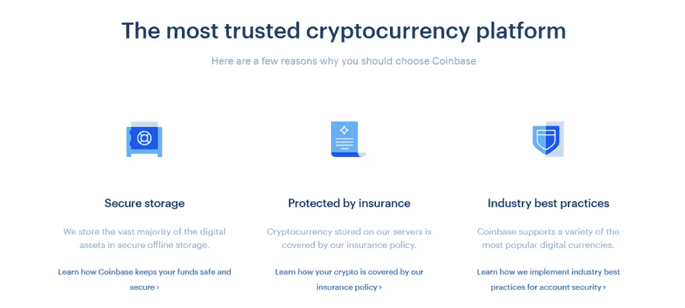

# 比特币基地评论 2021 |它是美国最好的密码交易所吗？

> 原文：<https://medium.com/coinmonks/coinbase-review-6ef4e0f56064?source=collection_archive---------2----------------------->

今天我们就来回顾一下 [**比特币基地**](https://blog.coincodecap.com/go/coinbase) 交易平台。它是美国第一家[密码交易所](https://blog.coincodecap.com/go/crypto-exchange)，该交易所[上市](https://financialpost.com/fp-finance/cryptocurrency/coinbase-tops-100-billion-value-in-landmark-for-cryptocurrency)，估值超过 1000 亿美元。

# 总结(TL；博士)

*   比特币基地是一家领先的密码交易所，总部设在旧金山。它在其平台上支持广泛的加密资产。
*   通过注册并完成帐户验证，您可以快速开始使用[比特币基地](https://blog.coincodecap.com/go/coinbase)。
*   你可以在[比特币基地](https://blog.coincodecap.com/go/coinbase)上免费了解各种加密货币及其交易方式。此外，你可以通过[比特币基地赚取](https://www.coinbase.com/earn)来[赚取免费的加密](https://blog.coincodecap.com/earn-bitcoin)资产。
*   该交易所还提供其他产品，如比特币基地专业版、比特币基地钱包版、比特币基地托管版等等。
*   比特币基地专业版为拥有高端交易工具的交易者提供广泛的服务。
*   比特币基地支持用卡进行交易。此外，您可以使用 PayPal 轻松地从交易所提款。
*   该平台的收费是整个加密市场最高的收费之一。
*   比特币基地有严格的安全措施，保证网上资金的联邦存款保险公司保险。

# 什么是比特币基地？

[**比特币基地**](https://blog.coincodecap.com/go/coinbase) 是一家受监管的[加密货币交易所](https://blog.coincodecap.com/go/crypto-exchange)，由 [Brian Armstrong](https://www.linkedin.com/in/barmstrong) 和 [Fred Ehrsam](https://www.linkedin.com/in/fredehrsam) 于 2012 年成立。最初，该平台提供比特币经纪服务。然而，随着加密资产和交易选项的发展，交易所不断改进平台。

除此之外，该交易所旨在创建一个更加公平、透明、可靠和高效的加密货币金融系统。此外，该交易所收取高额费用，但也使得购买加密资产变得容易。因为你可以通过银行转账、信用卡、贝宝等方式在比特币基地购买加密货币。

# 如何使用比特币基地？

[**比特币基地**](https://blog.coincodecap.com/go/coinbase) 有一个非常直观的用户界面，使得在这个交易所开始交易只需几秒钟。然而，作为一个初学者，你可能会在某些地方卡住。因此，下面是我们一步一步的指导，帮助你开始你的比特币基地交易之旅。

## 如何在比特币基地上创建账户？

您可以通过下面提到的几个简单步骤在比特币基地上创建您的帐户

*   进入 [**比特币基地**](https://blog.coincodecap.com/go/coinbase) 官网。
*   点击网站右上角的“开始”选项。
*   输入您的姓名、电子邮件地址，并创建一个强密码。
*   单击位于表单底部的复选框，并点击创建帐户按钮。
*   现在，通过点击邮件上发送的验证链接来验证您输入的电子邮件。
*   要完成两步验证，您必须输入带有国家代码的手机号码。
*   输入手机上发送代码，点击验证。如果您没有收到代码，请单击重新发送代码选项。

## 如何在比特币基地上完成身份验证？

在 [**【比特币基地】**](https://blog.coincodecap.com/go/coinbase) 上按照一步一步的指引确认自己的身份。

*   一旦你完成了两步验证，你必须填写你的凭证来完成你的帐户验证。
*   你必须输入姓名、邮政编码、SSN 代码、职业等信息。仔细检查信息，然后提交。
*   下一步，你必须上传驾驶执照或任何政府颁发的身份证。
*   上传自己的身份证明后，需要自拍一张，上传验证。如果可能的话，确保在自拍时，你有一个透明的背景。
*   现在上传你的身份证和照片后，你会收到一封验证邮件。如果您的验证无效，您将不得不重新拍摄照片。
*   在 ID 的验证邮件中，您必须遵循那里给出的链接。您将被重定向到一个页面，告诉您您的帐户已准备好。
*   如果你愿意，你可以通过点击页面底部的购买加密按钮立即购买加密资产。

## 如何在比特币基地购买比特币？

比特币或许是世界上最受欢迎的加密资产。因此，了解如何顺利地从 [**【比特币基地】**](https://blog.coincodecap.com/go/coinbase) 购买比特币就成了一个至关重要的方面。这里有一步一步的指南来帮助你。

*   登录您的比特币基地帐户。在您的仪表板上，您可以看到所有加密资产的价格。
*   之后，点击位于顶部中心的账户。
*   进入您的帐户选项卡后，单击“无交易”报价下方的“添加资金”选项。
*   在这一点上，你将有两个选择存款资金是通过电汇或银行存款。
*   **通过电汇存款**:为此，点击存款后出现的电汇标签。您必须输入您的银行凭证，输入您希望存入的美元金额，然后点击继续按钮。这会自动将您的资金转入您的比特币基地账户。

或者

*   **通过银行转账存入资金**:为此，您必须点击点击存款资金按钮后出现的银行存款选项卡。然后点击链接银行账户选项。

现在输入您的银行凭证，并等待几分钟，同时它得到验证。之后，选择您需要使用的银行账户，启用转账选项，然后点击继续将资金转入您的比特币基地账户。

*   一旦您存入资金，请进入您的[比特币基地](https://blog.coincodecap.com/go/coinbase)账户主页，点击“买入/卖出”选项卡，输入您需要买入的 BTC 金额，然后确认您的订单。现在，交易所会把收到的比特币转到你的[比特币基地钱包](https://wallet.coinbase.com/)里。

*   [比特币基地 vs 北海巨妖|美国最好的密码交易所是哪家？](https://blog.coincodecap.com/kraken-vs-coinbase)
*   双子座 vs 比特币基地|美国最好的密码交易所是哪家？
*   [比特币基地钱包回顾【你需要知道的一切】](https://blog.coincodecap.com/coinbase-wallet-review-the-best-bitcoin-wallet)
*   [最佳加密交易所| 2021 年十大加密货币交易所](https://blog.coincodecap.com/crypto-exchange)
*   [比特币基地 vs 罗宾汉|哪个最适合你？【2021】](https://blog.coincodecap.com/coinbase-vs-robinhood)

# 在比特币基地买/卖密码

在比特币基地，你可以非常迅速地买卖各种加密资产。它是一个初学者友好的平台，你可以一次从你的银行账户转移你的资金。

# 比特币基地挣:学习和挣密码

比特币基地推广加密教育。它免费发布关于比特币基地的各种加密资产和交易方法的课程。不仅如此，当你完成这些课程时，你会得到一些免费的加密资产。

# 比特币基地专业

[比特币基地专业版](https://pro.coinbase.com/)拥有最适合高级交易者的高级交易选项。你可以用相对较低的入场费向专业人士申请限价单、市价单和止损单。不仅如此，比特币基地专业版还包括更多创新的图表功能和额外的交易工具。

# 比特币基地总理

[比特币基地 Prime](https://prime.coinbase.com/) 主要面向机构投资者和大型金融机构。它是受监管的、安全的、合规的。此外，它还配有保险支持的冷藏设施。此外，它还可以访问功能齐全的比特币基地[交易 API](https://primebroker.coinbase.com/liquidity-providers) 。我们将在前进的过程中详细讨论这一点。

# 比特币基地专业:交易交易所

[比特币基地 Pro](https://pro.coinbase.com/) 是比特币基地独有的产品，主要面向个人密码交易者。它支持先进的交易工具和订单，融合了清晰直观的用户界面。你可以安全可靠地进行各种配对交易。

以下是你必须知道的比特币基地职业版的一些重要特性:

*   **用户界面:** [比特币基地 Pro](https://pro.coinbase.com/) 有一个排列整齐且迷人的用户界面。最重要的是，这个面板可以让你很好地访问整个交易历史、订单簿和高级图表工具。
*   **流动性:**Pro 的关键之处在于它为所有交易活动提供了高流动性。
*   **保险:** [比特币基地 pro](https://pro.coinbase.com/) 稳定且有保险。 [FDIC](https://www.fdic.gov/) 为其担保最高限额为 25 万美元。不仅如此，该平台还得到了金融界的大力支持，受到了潜在投资者的信任。
*   **API 基础:**平台集成了稳定的 API 支持。通过这一点，您可以部署额外的工具，如机器人和直观的界面。因此，API 增加了交换的整体功能。

# 在比特币基地专业公司交易

如果你想在比特币基地专业版上开始交易，并节省你自己发现一切的时间，那么遵循以下步骤:

1.  如果你已经有了一个[比特币基地](https://blog.coincodecap.com/go/coinbase)账户，只需登录你的[比特币基地专业版](https://pro.coinbase.com/)，如果你没有，那就去比特币基地专业版。
2.  点击右上角的“开始”选项。
3.  在注册表单中填写必要的详细信息，如电子邮件、姓名和密码。现在点击创建帐户按钮。
4.  点击邮件中发送的验证链接，验证您的电子邮件。
5.  现在，假设您还没有完成两步验证，即之前在您的比特币基地帐户中提供您的电话号码。那样的话，你必须在这里做。
6.  完成两步验证后，您必须使用您的文件、照片等来验证您的身份。
7.  假设比特币基地支持你的法定货币；在这种情况下，您可以选择链接您的银行帐户来存放资金。但是，您可以跳过这一步，使用任何可接受的加密货币存款。
8.  现在登录到您的专业帐户，点击存款选项存款。

# 比特币基地评论:可用的付款方式

众所周知，[比特币基地](https://blog.coincodecap.com/go/coinbase)支持通过信用卡和贝宝支付。这是所有-

*   信用卡/借记卡
*   电汇(欧洲的 SEPA 和美国的 ACH)
*   PayPal(仅用于提款)

# 比特币基地评论:主要特点

在回顾[比特币基地](https://blog.coincodecap.com/go/coinbase)的时候，了解交易所提供的所有功能是至关重要的。让我们看一看所有这些。

*   **钱包:**比特币基地有独立的钱包，你可以通过它存储和管理你的加密资产。这些钱包非常安全，易于使用，可以作为 android 和 iPhone 用户的移动应用程序使用。此外，只需使用您朋友的用户名，您就可以通过您的[比特币基地钱包](https://blog.coincodecap.com/coinbase-wallet-review-the-best-bitcoin-wallet)快速汇款或收款。
*   比特币基地商务:比特币基地允许电子商务商家在其业务中接受加密货币。因此，他们可以从世界任何地方的网站上快速接收加密资产。一个带有高级公钥的强大插件被用来为网站创建一个简单、安全的基础设施。通过[比特币基地商务](https://commerce.coinbase.com/docs/)，客户可以使用加密资产在网站上轻松进行交易。
*   **比特币基地一切:**登录您的帐户后，您可以在控制面板的左侧栏中轻松找到“为您”选项。通过这个标签，[比特币基地](https://blog.coincodecap.com/go/coinbase)提供与加密货币相关的有价值的教育内容和新闻。

*   **比特币基地托管:**它提供世界上先进和可靠的托管相关解决方案，并支持投资者钟爱的所有加密资产。[比特币基地托管](https://custody.coinbase.com/)是一个独立的[纽约金融服务部门](https://www.dfs.ny.gov/) (NYDFS)。
*   USDC: 你可以把 USDC 想象成一枚稳定的硬币。这意味着你可以用 1 美元的价格兑换 1 USDC。有趣的是，在比特币基地，潜在客户可以通过持有 USDC 获得令人兴奋的奖励。由于是稳定币，所以价格不会频繁波动。
*   **风险:**除了在加密经济中提供良好的经纪服务和解决方案，[比特币基地](https://blog.coincodecap.com/go/coinbase)还涉足早期风险投资。也就是说，比特币基地  风险投资公司投资具有惊人创意的初级和早期加密初创企业。更多信息可以参考交易所自己发布的公告[博文](https://blog.coinbase.com/introducing-coinbase-ventures-c67865a1d2fe)。

# 比特币基地评论:用户界面

谈到用户界面和易用性，比特币基地是最好的加密交易所之一。因此，比特币基地有一个简单明了的界面，是初学者友好的。

每一页上的插图都使与交易所的互动更加引人入胜。你可以通过在网站底部滚动来跳转到任何想要的页面。

# 比特币基地费用

不可能完全说明比特币基地的确切费用结构，因为它因您的国家和交易类型而异。此外，[比特币基地](https://blog.coincodecap.com/go/coinbase)因收费相当高而出名。不过，一般来说，比特币基地收取 1.49%到 3.99%不等的押金费用，这取决于你选择的支付方式。

以下是比特币基地费用的概述

*   价差费用在 0.50%左右，你必须记住这是近似值。准确的费用可能会随着比特币基地专业版上加密货币价格的波动而变化。
*   固定费用在 0.99 美元到 2.99 美元之间，最终取决于你完成的交易数量。
*   请记住，比特币基地对数字货币兑换不收取任何费用。然而，这些转换的差价约为 2%。

在[比特币基地 Pro](https://pro.coinbase.com/) ，你要支付 0.04%到 0.5%的收取费用，这取决于分级制度。您可以在下表中为各个层级分配接受者和制造者费用:

**定价 TierTaker FeeMaker 费用**<10k 0.50% 0.50% 10-50k 0.35% 0.35% 50-100K 0.25% 0.15% 100K-1m 0.20% 0.10% 1-10m 0.18% 0.08% 10-50m 0.15% 0.05% 50-100m 0.10% 0.00%

# 比特币基地的交易限额

现在让我们来看看[比特币基地](https://blog.coincodecap.com/go/coinbase)的交易限额。请记住，购买限额取决于您的账户级别，这一点非常重要。为了达到更高的极限，你需要完全验证你的身份。

例如，经过全面认证的美国交易商每周可以进行高达 5 万美元的交易。以下是比特币基地交易限额的一些一般信息:

*   您可以提取最高可用余额。这意味着你可以把账户里所有的钱都取出来。
*   对于通过区块链发送和接收资金，您必须解锁第 3 级，其中您必须拥有有效的状态 id。
*   有关限额和级别的更多信息，[请访问此处](https://help.coinbase.com/en/coinbase/trading-and-funding/buying-selling-or-converting-crypto/limits-and-account-levels.html?b_id=13521)。

# 比特币基地评论:安全

比特币基地完美地设定了金融业的安全标准，这并不令人惊讶。很明显，比特币基地是少数几家通过 FDIC 提供保险的交易所之一。

[**比特币基地**](https://blog.coincodecap.com/go/coinbase) 出自美国，显然必须满足美国监管安全标准。此外，该交易所在存储用户资金方面非常透明。客户资金与公司资金分开存放。

除此之外，比特币基地声称将其用户 95%的资金离线存储在冷存储硬件钱包中。网上存储的剩余资金已经投保。这意味着，如果发生任何黑客攻击，这些资金将退还给购买保险的用户。

考虑到其他安全措施，比特币基地具有双重身份认证以及完整的用户身份验证。您将完全控制存储在离线钱包中的资金。

# 比特币基地支持

[**比特币基地**](https://blog.coincodecap.com/go/coinbase) 通过电子邮件提供客户支持。除此之外，它还有一个庞大而多样的知识库，通过它的学习和收入计划和广泛的常见问题提供。

另外，你可以使用 FAQ 专栏，因为你的大部分问题都已经在那里得到了解答。比特币基地通过电子邮件提供全天候支持。您可以通过点击“[联系我们](https://help.coinbase.com/en/contact-us)”按钮联系支持团队。

# 比特币基地评论:利弊

# 比特币基地评论:结论

[**【比特币基地】**](https://blog.coincodecap.com/go/coinbase) 是一个安全易用的买卖加密资产的平台。然而，比特币基地有一个致命的缺点，那就是收费高。除此之外，在功能方面，exchange 仍然是无与伦比的。

通过比特币基地，新手和高级交易者都可以广泛接触投资世界。广泛的加密资产及其许多产品，如[比特币基地币](https://coinbase-consumer.sjv.io/7m5Pag)和 USDC 币[稳定币](https://blog.coincodecap.com/stablecoins-a-simple-overview)使比特币基地成为启动您交易之旅的完美交易所。

# 常见问题

**如何从比特币基地撤出？**

要完成取款，您可以访问余额部分，然后点击取款按钮。然后在下一个窗口中，输入您希望提取的金额，并粘贴您的收款钱包的地址。最后，点击发送按钮。

**如何删除比特币基地账户？**

首先，你必须转到你的个人资料部分，然后前往设置。你必须一直向下滚动，直到你在页面底部看到一个关闭账户的选项。最后，点击那个按钮，关闭你的账户，但是在关闭之前，确保你的比特币基地账户里没有任何资金。

**比特币基地有多合法？**

比特币基地是一个合法的、受监管的加密货币交易所。该平台遵守美国的所有密码法律。由于它来自旧金山，很难相信交易所会带着你的资产逃跑。

把我的 SSN 给比特币基地安全吗？

交易所要求您的 SSN 在账户验证时检查您的背景信息。根据美国加密监管规范，必须提供您的 SSN，这有助于申报税收和防止洗钱。

*   [比特币基地 vs 北海巨妖|美国最好的密码交易所是哪家？](https://blog.coincodecap.com/kraken-vs-coinbase)
*   双子座 vs 比特币基地|美国最好的密码交易所是哪家？
*   [比特币基地钱包评论【你需要知道的一切】](https://blog.coincodecap.com/coinbase-wallet-review-the-best-bitcoin-wallet)
*   [最佳加密交易所| 2021 年十大加密货币交易所](https://blog.coincodecap.com/crypto-exchange)
*   [比特币基地 vs 罗宾汉|哪个最适合你？【2021】](https://blog.coincodecap.com/coinbase-vs-robinhood)

> 加入 [Coinmonks 电报小组](https://t.me/joinchat/uiLERCQL1fQ5ZjA1)，了解加密交易和投资

## 另外，阅读

*   最好的[加密交易机器人](/coinmonks/crypto-trading-bot-c2ffce8acb2a) | [网格交易机器人](https://blog.coincodecap.com/grid-trading)
*   [加密副本交易平台](/coinmonks/top-10-crypto-copy-trading-platforms-for-beginners-d0c37c7d698c) | [五大 BlockFi 替代方案](https://blog.coincodecap.com/blockfi-alternatives)
*   [CoinLoan 审核](/coinmonks/coinloan-review-18128b9badc4)|[Crypto.com 审核](/coinmonks/crypto-com-review-f143dca1f74c) | [火币保证金交易](/coinmonks/huobi-margin-trading-b3b06cdc1519)
*   [尤霍德勒 vs 考尼洛 vs 霍德诺特](/coinmonks/youhodler-vs-coinloan-vs-hodlnaut-b1050acde55a) | [Cryptohopper vs 哈斯博特](https://blog.coincodecap.com/cryptohopper-vs-haasbot)
*   [杠杆代币](/coinmonks/leveraged-token-3f5257808b22) | [最佳密码交易所](/coinmonks/crypto-exchange-dd2f9d6f3769) | [Paxful 点评](/coinmonks/paxful-review-4daf2354ab70)
*   [如何在印度购买比特币？](/coinmonks/buy-bitcoin-in-india-feb50ddfef94) | [WazirX 评论](/coinmonks/wazirx-review-5c811b074f5b) | [BitMEX 评论](https://blog.coincodecap.com/bitmex-review)
*   [双子座 vs 比特币基地](https://blog.coincodecap.com/gemini-vs-coinbase) | [比特币基地 vs 北海巨妖](https://blog.coincodecap.com/kraken-vs-coinbase)|[coin jar vs coin spot](https://blog.coincodecap.com/coinspot-vs-coinjar)
*   [币安 vs 北海巨妖](https://blog.coincodecap.com/binance-vs-kraken) | [美元成本平均交易机器人](https://blog.coincodecap.com/pionex-dca-bot)
*   [印度比特币交易所](/coinmonks/bitcoin-exchange-in-india-7f1fe79715c9) | [比特币储蓄账户](/coinmonks/bitcoin-savings-account-e65b13f92451)
*   [币安收费](/coinmonks/binance-fees-8588ec17965) | [Botcrypto 审查](/coinmonks/botcrypto-review-2021-build-your-own-trading-bot-coincodecap-6b8332d736c7) | [Hotbit 审查](/coinmonks/hotbit-review-cd5bec41dafb) | [KuCoin 审查](https://blog.coincodecap.com/kucoin-review)
*   [我的密码副本交易经验](/coinmonks/my-experience-with-crypto-copy-trading-d6feb2ce3ac5) | [购买硬币评论](https://blog.coincodecap.com/buycoins-review)
*   [加密货币储蓄账户](/coinmonks/cryptocurrency-savings-accounts-be3bc0feffbf) | [YoBit 审查](/coinmonks/yobit-review-175464162c62) | [Bitbns 审查](/coinmonks/bitbns-review-38256a07e161)
*   [最佳比特币保证金交易](/coinmonks/bitcoin-margin-trading-exchange-bcbfcbf7b8e3) | [比特币保证金交易](https://blog.coincodecap.com/bityard-margin-trading)
*   [加密保证金交易交易所](/coinmonks/crypto-margin-trading-exchanges-428b1f7ad108) | [赚取比特币](/coinmonks/earn-bitcoin-6e8bd3c592d9) | [Mudrex 投资](https://blog.coincodecap.com/mudrex-invest-review-the-best-way-to-invest-in-crypto)
*   [BlockFi 信用卡](https://blog.coincodecap.com/blockfi-credit-card) | [如何在币安购买比特币](https://blog.coincodecap.com/buy-bitcoin-binance)
*   [顶级付费加密货币和区块链课程](https://blog.coincodecap.com/blockchain-courses) | [币安评论](/coinmonks/binance-review-ee10d3bf3b6e)
*   [MXC 交易所评论](/coinmonks/mxc-exchange-review-3af0ec1cba8c) | [Pionex vs 币安](https://blog.coincodecap.com/pionex-vs-binance) | [Pionex 套利机器人](https://blog.coincodecap.com/pionex-arbitrage-bot)
*   [在美国如何使用 BitMEX？](https://blog.coincodecap.com/use-bitmex-in-usa) | [BitMEX 回顾](https://blog.coincodecap.com/bitmex-review) | [币安 vs Bittrex](https://blog.coincodecap.com/binance-vs-bittrex)

*原载于 2021 年 5 月 3 日 https://blog.coincodecap.com***。**