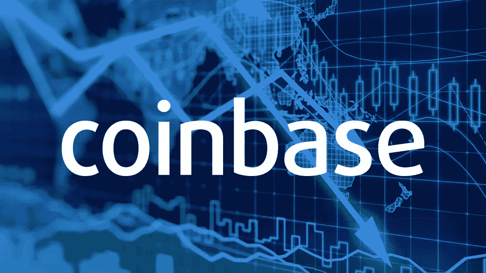

# 比特币基地股票分析——投资比特币基地 IPO？

> 原文：<https://medium.com/coinmonks/coinbase-stock-analysis-invest-in-coinbase-ipo-e93b4185e4e0?source=collection_archive---------1----------------------->

任何人想要购买比特币、以太坊、莱特币或市场上其他众多的加密货币，都很难避免已经建立的加密交易所之一。比特币基地是最受欢迎的加密交易平台之一，现在正冒险进入大型交易大厅。首次公开募股(IPO)，即比特币基地股票的首次发行，将于 2021 年 4 月 14 日进行。该公司仅提交了其 S1…