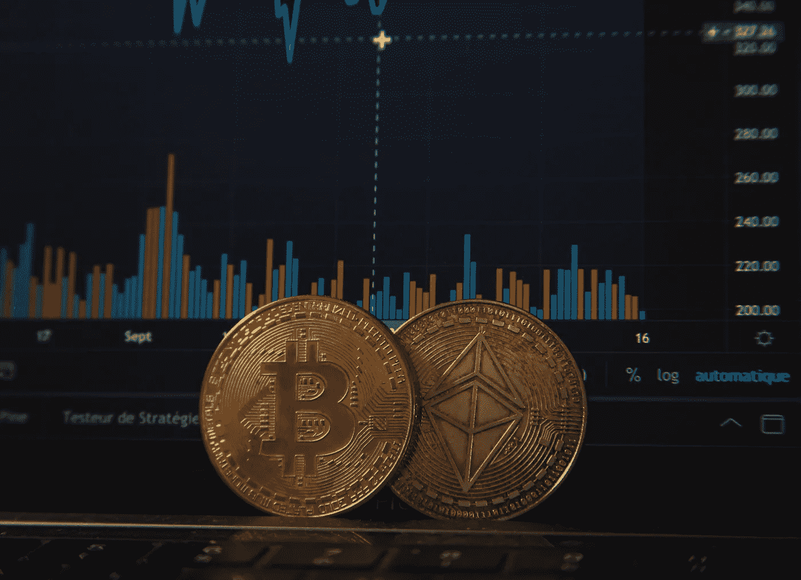

# 比特币基地对比特币基地职业队

> 原文：<https://medium.com/coinmonks/coinbase-vs-coinbase-pro-1dd79291d828?source=collection_archive---------11----------------------->

## 购买/交易加密货币的新手，不知道该使用哪种货币？这里有一个细目分类。

Photo by Pierre Borthiry on Unsplash

注意:在设置比特币基地或比特币基地专业版帐户之前，您需要:

1.  至少年满 18 岁
2.  政府颁发的带照片的身份证、护照或国民身份证(仅限非美国)
3.  具有互联网连接的电脑或智能手机
4.  连接到智能手机的电话号码(用于短信)
5.  最新版本的浏览器(推荐使用 Chrome)或最新的比特币基地/比特币基地专业版应用程序

# 比特币基地—设置

如果你是这个领域的新手，由于用户界面的简单，建立一个比特币基地账户并购买你的第一种加密货币将会相对简单。然而，与比特币基地专业版相比，使用比特币基地最大的缺点是费用高。以下是如何设置您的帐户:

1.  进入[*【https://www.coinbase.com】*](http://blog.coincodecap.com/go/coinbase)或下载比特币基地 App，点击**开始**后按步骤操作。填写姓名和电子邮件地址等信息后，您需要阅读并接受用户协议和隐私政策。
2.  验证您的电子邮件(点击发送到您的电子邮件的链接)并验证您的电话号码(您的电话将收到 7 位数字代码)。
3.  将您的个人信息添加到帐户中，然后验证您的身份；为此你需要政府颁发的带照片的身份证。
4.  链接付款方式。关于这个的更多细节:[*https://help . coin base . com/en/coin base/getting-started/getting-started-with-coin base/create-a-coin base-account*](https://help.coinbase.com/en/coinbase/getting-started/getting-started-with-coinbase/create-a-coinbase-account)

# 比特币基地——购买和使用平台+/-

**+简单易用:**现在您已经设置了比特币基地账户，只需点击您个人资料左侧的“购买/出售”按钮。

**+赢取奖励:**在平台左侧的“礼物图标”中，您可以找到您可以赢取的所有奖励。从观看教育视频赚取加密货币，到邀请朋友使用该平台。

**-更高的交易费用:**比特币基地对加密货币的购买和销售收取 0.5% — 4.5%的费用，具体取决于交易规模和平台、支付方式、你购买的国家和加密货币类型。例如，从美国银行账户购买价值 100 美元的比特币，费用将为 2.99 美元，但有关费用的更多细节，您可以访问:[*https://help . coin base . com/en/coin base/trading-and-funding/pricing-and-fees/fees*](https://help.coinbase.com/en/coinbase/trading-and-funding/pricing-and-fees/fees)

# 比特币基地专业-设置

如果您已经有一个比特币基地帐户，那么请确保您使用相同的登录电子邮件地址，因为这样您的帐户将被链接。

1.  转到 pro.coinbase.com 或比特币基地专业应用程序，并指定您的帐户详细信息，包括您的姓名和电子邮件地址。
2.  验证您的电子邮件地址和电话号码(通过短信)。
3.  根据您所在的地区，您将被要求提供详细信息，如您的姓名、地址、资金来源、意图和职业。
4.  通过上传或拍摄政府颁发的身份证照片来验证您的身份证。
5.  一旦您验证了您的 ID，您就可以链接您的银行帐户。

# 比特币基地专业版—购买和使用平台+/-

**+费用更低:**这是使用比特币基地 Pro 的最大好处之一。与我们之前购买 100 美元比特币的例子相比，使用 coinbase pro 和他们 0.5%的费用，这将花费你“仅仅”50 美分。

**+支持更多交易类型:**与只能进行买卖、发送、接收和交换的比特币基地相比，比特币基地专业版增加了允许您设置止损单、生效时间单和限价单的功能。根据你想使用的平台，也许比特币基地有你需要的所有功能，但这是使用比特币基地专业版的额外收获。

**-更“复杂”的用户界面:**在玩了比特币基地 Pro 用户界面之后，即使作为一个新手，我也认为这个界面并不十分难用，但起初它可能会令人生畏，因为似乎有很多事情要做。在平台的左侧，你可以存放法定货币，然后购买加密货币。在下图中，左上角是你可以选择你想看的市场的地方。如果你想用英镑购买比特币，那么你会选择下面的市场。然后，您需要选择“存款”并点击资产“英镑”，然后进行支付。在您看到您的法定货币在您的投资组合中后，确保选择“购买”(如这里所示)，点击“最大”选择您所有的存款英镑(如果您希望全部以比特币支付)，然后选择“下单购买”。

总的来说，如果你是交易新手，或者是购买/出售加密货币的新手，那么在购买之前查看一下这两个平台是值得的。建立一个账户是不需要花费成本的，所以如果你花时间去验证两者，你可以充分利用两者的优势；比特币基地的回报和简单，但较低的购买/销售费用从比特币基地专业。

如果您对这两个平台的进一步细分和比较感兴趣，我建议您:

 [## 比特币基地 vs 比特币基地:你应该选择哪一个？

### 你是加密货币交易的新手还是积极的投资者？虽然比特币基地和比特币基地专业版的目标用户不同…

www.investopedia.com](https://www.investopedia.com/coinbase-vs-coinbase-pro-5120704) 

> 加入 Coinmonks [Telegram group](https://t.me/joinchat/Trz8jaxd6xEsBI4p) 并了解加密交易和投资

## 另外，阅读

*   最好的[密码交易机器人](/coinmonks/crypto-trading-bot-c2ffce8acb2a) | [网格交易](https://blog.coincodecap.com/grid-trading)
*   [加密复制交易平台](/coinmonks/top-10-crypto-copy-trading-platforms-for-beginners-d0c37c7d698c) | [如何在 WazirX 上购买比特币](/coinmonks/buy-bitcoin-on-wazirx-2d12b7989af1)
*   [CoinLoan 点评](/coinmonks/coinloan-review-18128b9badc4)|[Crypto.com 点评](/coinmonks/crypto-com-review-f143dca1f74c) | [火币保证金交易](/coinmonks/huobi-margin-trading-b3b06cdc1519)
*   [尤霍德勒 vs 科恩洛 vs 霍德诺特](/coinmonks/youhodler-vs-coinloan-vs-hodlnaut-b1050acde55a) | [Cryptohopper vs 哈斯博特](https://blog.coincodecap.com/cryptohopper-vs-haasbot)
*   [杠杆代币](/coinmonks/leveraged-token-3f5257808b22) | [最佳密码交易所](/coinmonks/crypto-exchange-dd2f9d6f3769) | [Paxful 点评](/coinmonks/paxful-review-4daf2354ab70)
*   [加密套利](/coinmonks/crypto-arbitrage-guide-how-to-make-money-as-a-beginner-62bfe5c868f6)指南| [如何做空比特币](/coinmonks/how-to-short-bitcoin-568a2d0b4ae5)
*   [如何在印度购买比特币？](/coinmonks/buy-bitcoin-in-india-feb50ddfef94) | [WazirX 评论](/coinmonks/wazirx-review-5c811b074f5b) | [BitMEX 评论](https://blog.coincodecap.com/bitmex-review)
*   [印度比特币交易所](/coinmonks/bitcoin-exchange-in-india-7f1fe79715c9) | [比特币储蓄账户](/coinmonks/bitcoin-savings-account-e65b13f92451)
*   [币安费](/coinmonks/binance-fees-8588ec17965) | [Botcrypto 评论](/coinmonks/botcrypto-review-2021-build-your-own-trading-bot-coincodecap-6b8332d736c7) | [Hotbit 评论](/coinmonks/hotbit-review-cd5bec41dafb)
*   [我的密码副本交易经验](/coinmonks/my-experience-with-crypto-copy-trading-d6feb2ce3ac5) | [购买硬币评论](https://blog.coincodecap.com/buycoins-review)
*   [Bybit 融资融券交易](/coinmonks/bybit-margin-trading-e5071676244e) | [币安融资融券交易](/coinmonks/binance-margin-trading-c9eb5e9d2116) | [Overbit 审核](/coinmonks/overbit-review-9446ed4f2188)
*   [加密货币储蓄账户](/coinmonks/cryptocurrency-savings-accounts-be3bc0feffbf) | [YoBit 审查](/coinmonks/yobit-review-175464162c62) | [Bitbns 审查](/coinmonks/bitbns-review-38256a07e161)
*   [Botsfolio vs nap bots vs Mudrex](/coinmonks/botsfolio-vs-napbots-vs-mudrex-c81344970c02)|[gate . io 交流回顾](/coinmonks/gate-io-exchange-review-61bf87b7078f)
*   [最佳比特币保证金交易](/coinmonks/bitcoin-margin-trading-exchange-bcbfcbf7b8e3) | [萝莉点评](/coinmonks/lolli-review-e6ddc7895ad8) | [比特币保证金交易](https://blog.coincodecap.com/bityard-margin-trading)
*   [创造并出售你的第一个 NFT](https://blog.coincodecap.com/create-nft) | [本地比特币评论](/coinmonks/localbitcoins-review-6cc001c6ed56)
*   [加密保证金交易交易所](/coinmonks/crypto-margin-trading-exchanges-428b1f7ad108) | [赚取比特币](/coinmonks/earn-bitcoin-6e8bd3c592d9) | [Mudrex 投资](https://blog.coincodecap.com/mudrex-invest-review-the-best-way-to-invest-in-crypto)
*   [如何在印度购买以太博物馆？](https://blog.coincodecap.com/buy-ethereum-in-india) | [如何在币安购买比特币](https://blog.coincodecap.com/buy-bitcoin-binance)
*   [顶级支付密码货币和区块链课程](https://blog.coincodecap.com/blockchain-courses)
*   [MXC 交易所评论](/coinmonks/mxc-exchange-review-3af0ec1cba8c) | [Pionex vs 币安](https://blog.coincodecap.com/pionex-vs-binance) | [Pionex 套利机器人](https://blog.coincodecap.com/pionex-arbitrage-bot)
*   [在美国如何使用 BitMEX？](https://blog.coincodecap.com/use-bitmex-in-usa) | [BitMEX 审核](https://blog.coincodecap.com/bitmex-review)