# 比特币基地 vs 北海巨妖|哪个是美国最好的密码交易所？

> 原文：<https://medium.com/coinmonks/coinbase-vs-kraken-80f774d6e222?source=collection_archive---------2----------------------->

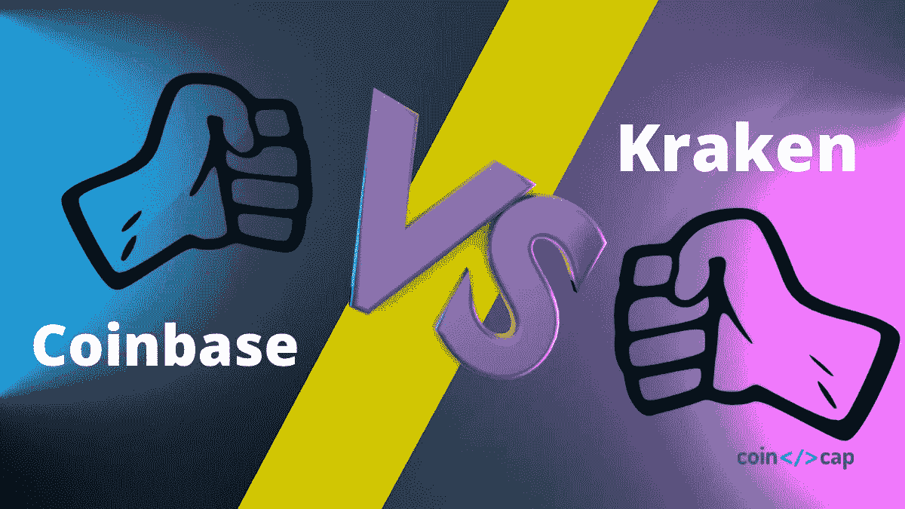

[**【比特币基地】**](https://blog.coincodecap.com/go/coinbase)[**北海巨妖**](https://blog.coincodecap.com/go/kraken) 位列[最佳密码交易平台](https://blog.coincodecap.com/crypto-exchange)。[比特币基地](https://blog.coincodecap.com/go/coinbase)不提供[保证金交易](https://blog.coincodecap.com/margin-trading)等高级交易选项。另一方面，使用北海巨妖，你可以进行杠杆交易。因此，在本文中，我们将比较这两个交易平台。

# 总结(TL；博士)

*   北海巨妖[和比特币基地](https://blog.coincodecap.com/go/kraken)都是美国[的加密交易平台](https://blog.coincodecap.com/go/crypto-exchange)。
*   [北海巨妖](https://blog.coincodecap.com/go/kraken)提供[北海巨妖 pro](https://trade.kraken.com/) 、[北海巨妖期货](https://futures.kraken.com/)、[密码手表](https://www.kraken.com/en-us/cryptowatch)等产品。
*   [比特币基地](https://blog.coincodecap.com/go/coinbase)提供[比特币基地 Pro](https://pro.coinbase.com/) 、[比特币基地 Prime](https://prime.coinbase.com/) 等产品。
*   北海巨妖有一个漂亮的图形增强用户界面，而比特币基地有一个初学者友好和简单的用户界面。
*   你可以在几分钟之内在两个交易所建立账户。
*   与北海巨妖相比，比特币基地的费用较高。北海巨妖声称收费低至 0%。
*   两家交易所都将安全视为首要任务之一。然而，比特币基地是由联邦存款保险公司承保的。
*   在安全漏洞的情况下，你可以通过打电话给比特币基地轻松锁定你的帐户。
*   北海巨妖为其期货衍生品提供高达 50 倍的杠杆。

# 什么是北海巨妖？

[**北海巨妖**](https://blog.coincodecap.com/go/kraken) 由[杰西·鲍威尔](https://www.linkedin.com/in/jessepowell)于 2011 年成立，目前交易所支持 50 多种新的加密货币。这是一个总部设在美国的交易所，提供各种先进的交易选择。

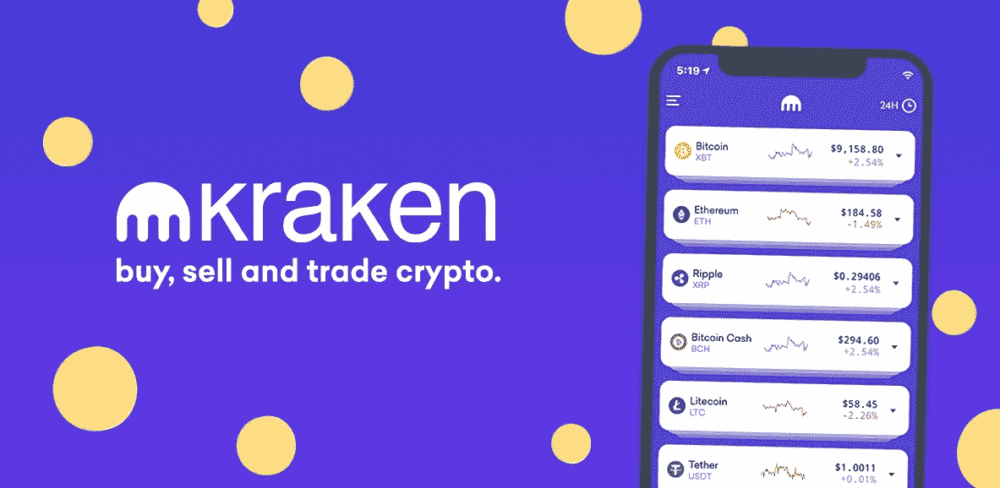

除此之外，这是一个安全透明的加密货币交易平台[并且符合所有的安全标准。该交易所非常适合新手和专业交易者。此外，它通过聊天机器人提供 24×7 的客户支持。](https://blog.coincodecap.com/go/crypto-exchange)

# 什么是比特币基地？

[**比特币基地**](https://blog.coincodecap.com/go/coinbase) 由 Brian Armstrong 和 Fred Ehrsam 于 2012 年创立。从那以后，它获得了关注，并成为美国高度认可的加密货币交易所。比特币基地不提供一些先进的交易选择，如杠杆交易。

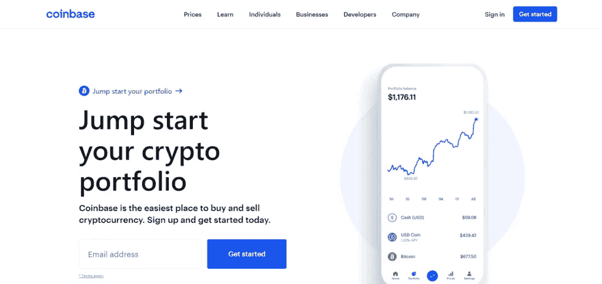

它有直观的应用程序，如比特币基地钱包应用程序。您可以轻松地存储您的加密资产或直接从您的钱包发送给朋友。该平台分为多个部分，如比特币基地 Prime 和比特币基地 Pro，它们是为个人和机构投资加密资产而存在的。

# 北海巨妖 vs 比特币基地:交易选择

几乎不可能跳过这一点。在比较任何两个大的[加密交易所](https://blog.coincodecap.com/go/crypto-exchange)时，必须讨论如何通过它们获得回报。

# 北海巨妖交易期权

**北海巨妖提供了多种多样的功能和交易选项。其中有[融资融券](https://blog.coincodecap.com/go/margin-trading)，期货交易，场外服务等。下面让我们同样理解:**

*   ******:**[北海巨妖](https://blog.coincodecap.com/go/kraken)对其交易所上市的几乎所有加密资产提供高达 5 倍的杠杆。它还提供了各种订单类型和可定制的时间。使用北海巨妖直观先进的交易平台，您可以轻松建立多头和空头头寸。****
*   ******期货交易:**在北海巨妖进行期货交易时，你可以使用高达 50 倍的杠杆。但是，要测试你对期货市场和杠杆的理解，你必须在交易期货之前在平台上回答一份问卷。基于此，你获得了“散户”、“专业交易员”或“大企业”的头衔****

****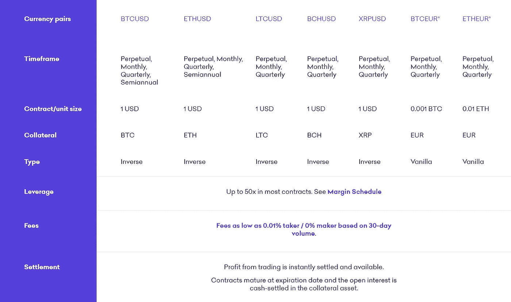****

****散户投资者有资格获得高达 2 倍的杠杆。专业交易者或大型企业可以利用高达 50 倍的杠杆；杠杆作用本身是巨大的，你必须谨慎使用。****

*   ******场外交易服务(OTC):** 这项服务并不适合所有人，因为它发生在开放的北海巨妖[密码交易所](https://blog.coincodecap.com/go/crypto-exchange)。它主要存在于需要更高流动性和个人服务的大型机构和拥有大量净资产的个人。****
*   ******买卖加密资产:**北海巨妖也提供买卖各种加密资产的服务。您需要完成验证过程才能在北海巨妖上购买、出售和交易加密资产。****
*   ****[**Cryptowatch**](https://r.kraken.com/yR2Mq3)**:**这个功能让用户可以很容易地关注自己的加密组合和加密市场。这样，用户就可以了解和分析市场，并在市场需要时进行交易。****

# ****比特币基地交易期权****

****比特币基地也是一家领先的加密交易所，提供多种服务和功能。偶尔它也会向用户提供一些免费的加密资产。所以让我们全部了解。****

*   ******购买和出售加密:**比特币基地是一个合法和著名的平台，用于购买和出售各种加密资产。要购买任何加密资产，您首先需要将所需资金存入您的帐户。在第四次和第八次购买时，交易所还为您提供 10 美元，以实现 50 美元的递归购买。****
*   ******比特币基地专业:** [比特币基地专业](https://pro.coinbase.com/)的存在是为了迎合个人和高级交易者的需求。该平台通过高级图表和各种选项描述关键信息。然而，交换缺乏动力，因为与比特币基地相比，用户界面有点难以理解。此外，它还为用户提供保险。****
*   ******比特币基地 prime:** [比特币基地 Prime](https://prime.coinbase.com/) 是为巨型机构、身家不菲的个人、企业投资者、组织机构编造的。它融合了先进的工具和交易选项，如保证金融资、算法订单等。****
*   ****[**比特币基地学习并获得 crypto**](https://coinbase-consumer.sjv.io/7m5Pag) **:** 嗯，这是比特币基地提供的一个激动人心的功能。在这方面，比特币基地提供了各种加密资产和交易选项的免费教育内容。此外，它给你一些密码资产，以测试它如何在实际工作的方式。****

# ****北海巨妖 vs 比特币基地:用户界面****

****所以用户界面在任何[密码交换](https://blog.coincodecap.com/go/crypto-exchange)中都扮演着至关重要的角色。简单、吸引人、有序的用户界面使用户的生活变得非常容易。简而言之，用户界面越简单，你就能越快地操作那个交换。****

****在这种情况下，无论是**还是**都拥有简单、直观、有吸引力的用户界面。北海巨妖有一个直观的，迷人的，干净的界面充满了插图。谈到比特币基地，它也有一个排序，丰富多彩和简单的界面。然而，北海巨妖的用户界面比比特币基地的更有趣、更吸引人、更容易使用。********

# ******北海巨妖 vs 比特币基地:钱包******

******因此，钱包是每个加密交易的重要组成部分。它们帮助交易者轻松存储和发送加密资产。这就是在两个交易所收集钱包信息变得至关重要的原因。******

## ******北海巨妖钱包******

********[**【比特币基地】**](https://blog.coincodecap.com/go/coinbase) 在向用户提供单独的个性化钱包服务方面落后。然而，它支持一个[数字钱包](https://blog.coincodecap.com/best-crypto-wallets-app)来保存购买之间的加密资产。********

## ****比特币基地钱包****

****嗯，[比特币基地钱包](https://blog.coincodecap.com/coinbase-wallet-review-the-best-bitcoin-wallet)使用安全飞地和生物认证来保护您的数字资产。它还可以帮助您在一个地方存储所有的加密资产。通过比特币基地钱包应用程序，你可以快速直接支付给你的朋友。****

****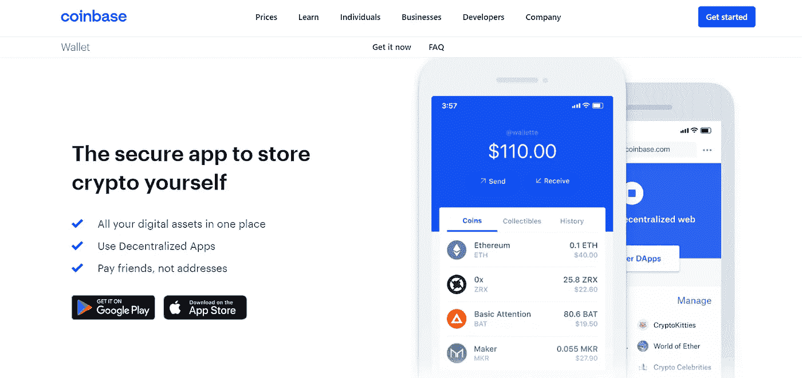****

# ****北海巨妖 vs 比特币基地:移动应用****

****在这个互联互通的世界里，移动电话不能被视为理所当然，因为移动应用已经成为人类生活不可或缺的一部分。这就是为什么在比较两个交易所时，移动应用程序起着重要作用。****

## ****北海巨妖手机应用****

****[**北海巨妖**](https://blog.coincodecap.com/go/kraken) 有三款手机 app，分别是[北海巨妖](https://kraken.app.link/mobile-apps-android)、[北海巨妖 pro](https://krakenpro.app.link/mobile-apps-android) 、[北海巨妖期货](https://futures.app.link/mobile-apps-android)。所有这些应用程序都可以在 Google play 商店和 App Store 中找到。这些应用程序拥有漂亮的用户界面，包括交易所官网上所有可用的功能。****

****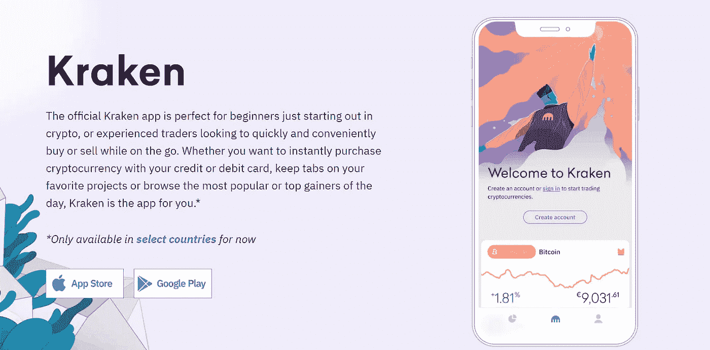****

****北海巨妖的官方应用最适合初学者。同时，北海巨妖专业版支持移动高级交易选项，北海巨妖期货允许以高达 50 倍的杠杆进行期货交易。****

## ****比特币基地手机应用****

****比特币基地的移动应用程序允许用户使用所有必要的选项进行交易，以进行明智的交易。除此之外，该应用程序有一个整洁和迷人的用户界面。然而，许多用户对该应用的稳定性提出了质疑。许多用户声称在应用程序上面临多次延迟。所以，在移动应用方面，**比**提供更好更快的服务。********

# ******北海巨妖 vs 比特币基地:如何购买比特币？******

******[比特币](https://blog.coincodecap.com/a-candid-explanation-of-bitcoin)是最流行的加密资产之一。全球大多数人通过投资比特币开始了他们的交易之旅。那么，让我们来讨论一下如何在北海巨妖和比特币基地购买比特币。******

## ******如何在北海巨妖购买比特币？******

******因此，让我们讨论一下在北海巨妖快速购买比特币的一步一步的过程。******

1.  ******去北海巨妖的网站，用用户名、强密码和电子邮件注册一个账户。******
2.  ******现在，转到您输入的电子邮件，复制并粘贴在您点击注册按钮后出现的激活码。******
3.  ******在交易所创建账户后，完成验证过程。点击你的名字出现在右上角，然后点击获得验证。******
4.  ******现在，提供必要的文件和细节来确认你在交易所的身份。******
5.  ******要使用法定货币存款，请进入导航栏并点击“资金”。******
6.  ******一个新的页面将会打开，在这个页面上你必须选择你的法定货币和存款方式。******
7.  ******检查你的账户余额。一旦资金存入你的账户，你就可以点击购买加密选项来购买比特币了。******

## ******如何在比特币基地购买比特币？******

******您可以按照下面给出的分步指南从 [**比特币基地**](https://blog.coincodecap.com/go/coinbase) 购买比特币:******

1.  ****去比特币基地的官方网站并登录你的账户。****
2.  ****如果您还没有帐户，请单击注册按钮创建一个帐户。****
3.  ****验证您的帐户电子邮件，然后登录您的[比特币基地帐户。](https://www.coinbase.com/)****
4.  ****现在，要存放资金，请转到“投资组合”选项卡，点击“存放资金”按钮。****
5.  ****走向你的仪表盘，点击买入/卖出按钮。****
6.  ****选择比特币作为购买选项，输入您希望购买的金额，然后点击购买按钮。****

****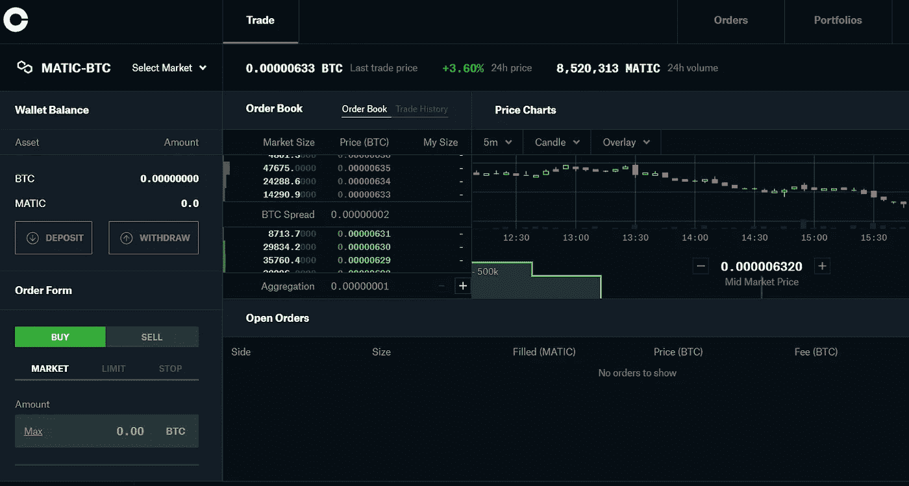****

# ****北海巨妖 vs 比特币基地:费用****

****在沉迷于任何秘密交易之前，费用是你需要记住的一个关键因素。因此，我们将比较两个交易所的费用结构和交易成本。****

## ****北海巨妖费用****

******收费低至 0%。该平台在购买账户余额时，对 stablecoins 和 FX 对收取 0.9%的费用，对任何其他密码收取 1.5%的费用。有关详细信息，请访问交易所的[费用表](https://www.kraken.com/features/fee-schedule)。******

******为了计算你的交易费用，你可以参考[北海巨妖专业版](https://trade.kraken.com/)上的 30 天交易量，并参考下表:******

******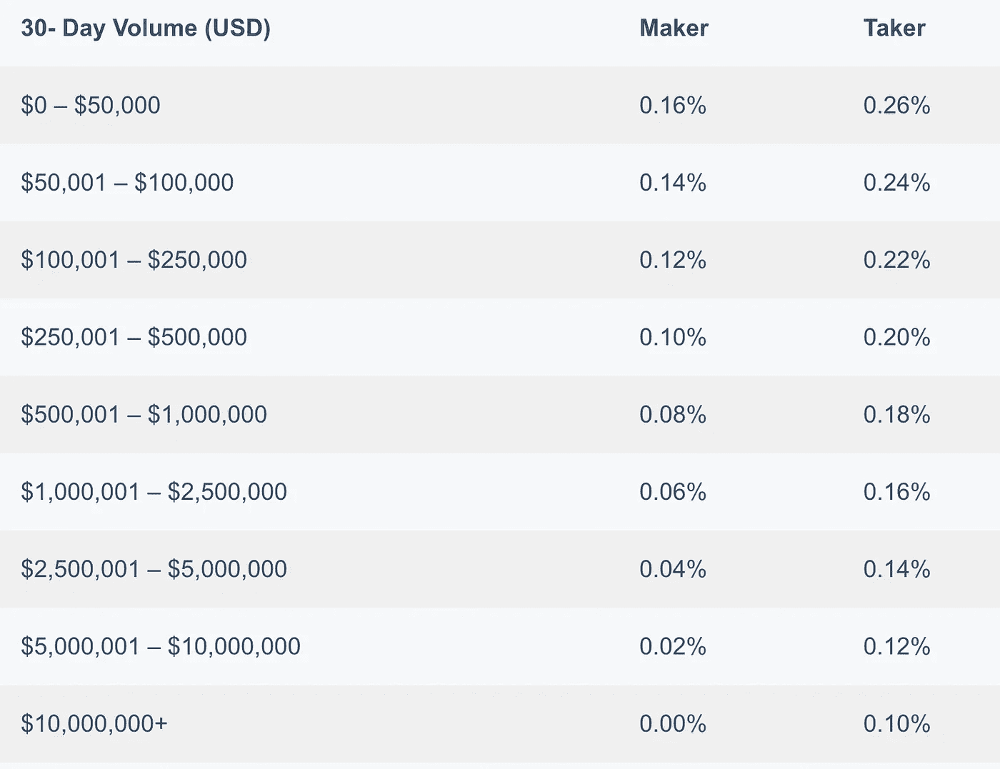******

## ******比特币基地费用******

******比特币基地因向用户收取大量费用而闻名。然而，它也有一些额外津贴。它允许你购买加密资产使用各种选项，如借记卡，贝宝等。比特币基地的基准交易费是 4%，是市场上最高的。******

******而与[比特币基地 pro](https://pro.coinbase.com/) 打交道，你要支付 0.04%到 0.5%之间的费用才能完成一笔订单。这完全取决于层级系统。您必须观察下表中不同层级的接受者和制造者费用:******

******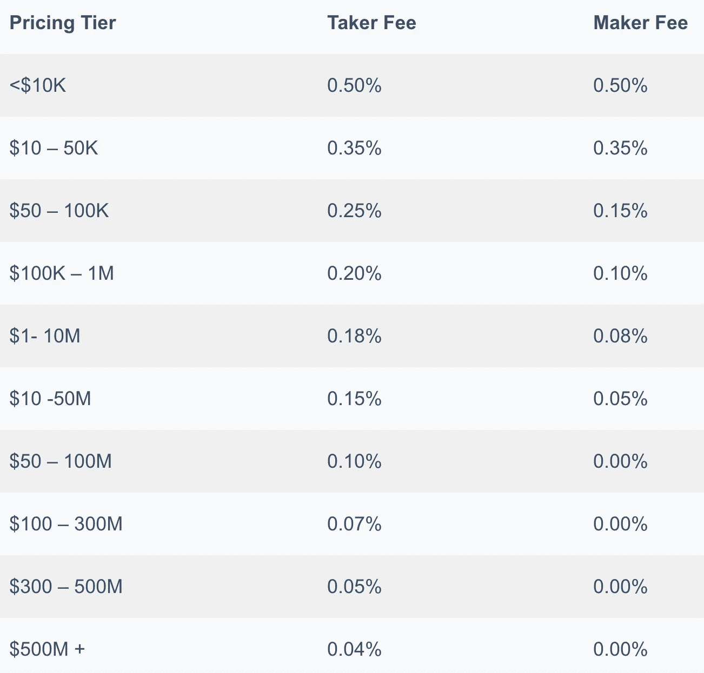******

# ******北海巨妖 vs 比特币基地:安全******

******很明显，我们希望我们的资产在交易平台上保持最大的安全性。 [**比特币基地**](https://blog.coincodecap.com/go/coinbase) 和 [**北海巨妖**](https://blog.coincodecap.com/go/kraken) 都采取了强有力的安全措施，但是让我们来了解一下哪一个才是最好的。******

## ****北海巨妖安全****

****北海巨妖有一套全面的方法来保护您的金钱和信息免遭盗窃。他们声称将客户安全放在第一位。让我们了解一些北海巨妖独有的安全特征。****

*   ******安全的硬币存储:**这意味着你所有存款的 95%都安全地保存在有空隙的、离线的、地理上分散的冷库里。你可以随时从北海巨妖高度安全的金库里取出你的资金。****
*   ******平台安全:**北海巨妖的服务器有武装警卫把守，24×7 视频监控。这意味着代码部署和任何类型的物理方法都是严格禁止的。****
*   ******信息安全:**所有用户的关键信息都在系统级和数据级加密。任何形式的访问都受到严格控制和监督。****
*   ******渗透测试:**这个阶段的专家团队对任何可能的和可以想象的攻击媒介进行一次又一次的测试。北海巨妖还管理着一个 [bug 赏金](https://www.kraken.com/en-us/features/security/bug-bounty/)项目，如果你发现了一个重大且相关的 bug，就会得到奖励。有关更详细的安全信息，[单击此处](https://www.kraken.com/en-us/features/security)。****

## ****比特币基地安全****

****[**比特币基地**](https://blog.coincodecap.com/go/coinbase) 也有一些严格的安全措施，分类如下:****

*   ******两步认证:**交易所将你的凭证与常规数据库分开存储。此外，它还在其所有平台上部署了双因素身份认证。****
*   ******离线冷藏库:**比特币基地几乎 98%的加密资产都保存在一个安全的冷藏库中，其地理位置只有地球上的少数人知道。****

****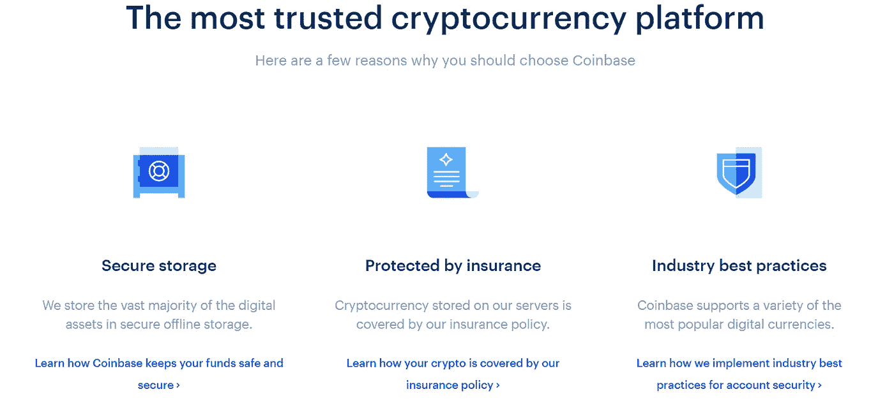****

*   ****[**比特币基地 bug 赏金计划**](https://coinbase-consumer.sjv.io/XxYk15) **:** 任何人向平台报告相关且关键的 bug，都有资格获得高达 5 万美元的奖励。比特币基地与黑客组织合作开展了一项臭虫奖励计划。更多关于比特币基地安全的相关信息，请点击此处。****

# ****北海巨妖 vs 比特币基地:客户支持****

****北海巨妖有[24×7 实时聊天支持](https://r.kraken.com/zaNMjm)。在加密资产和金融领域拥有丰富专业知识的客户参与专家总是在一天之内回答客户的问题。然而，有人猜测北海巨妖提供的客户支持很差。****

****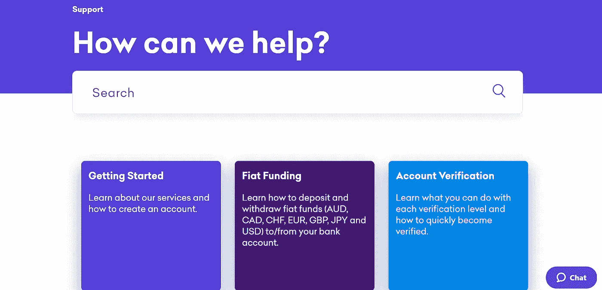****

******拥有强大的客户支持。您可以在每个窗口的[联系我们](https://help.coinbase.com/en/contact-us)栏中报告您的问题。登记问题后，您可以通过选择相关备选方案来选择您面临的产品或资产。最后，输入你的电子邮件，点击提交按钮。******

# ******北海巨妖对比特币基地:结论******

******[**比特币基地**](https://blog.coincodecap.com/go/coinbase) 不支持杠杆交易选项。另一方面， [**北海巨妖**](https://blog.coincodecap.com/go/kraken) 支持期货交易等高级交易选项。两家交易所都位于美国，并在全球范围内提供服务。如果你是初学者，最好选择比特币基地，因为它的交易选项对初学者来说非常友好。相比之下，如果你在寻找友好的 UX、更低的费用和更好的交易选择，你可以选择北海巨妖。最终，选择取决于你的个人偏好和需求。******

****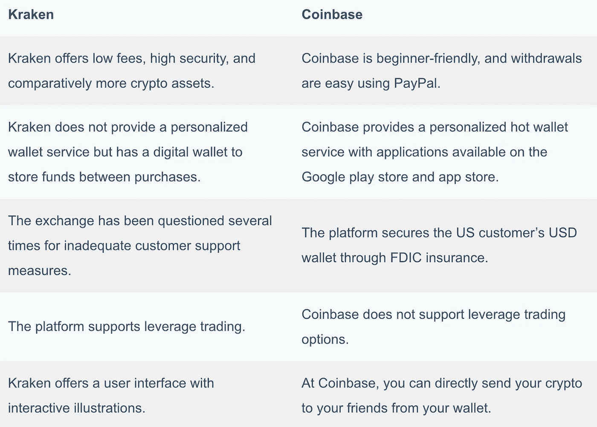****

# ****常见问题****

****如何关闭比特币基地账户？****

****从你的比特币基地账户，你可以进入设置部分，然后前往活动页面向下滚动。在底部，你会找到关闭账户的选项。点击并禁用您的帐户。但是，请确保您的比特币基地账户中没有任何资金。****

******如何将比特币从比特币基地转移到北海巨妖？******

****前往你北海巨妖账户的资金页面，从那里复制你的比特币钱包地址。现在，前往你在[比特币基地职业](https://pro.coinbase.com/)的[比特币基地](https://blog.coincodecap.com/go/coinbase)账户，点击取款按钮。然后输入所有的细节并粘贴你刚才复制的地址，点击发送按钮。****

******如何从比特币基地撤出？******

****如果你想从[比特币基地](https://blog.coincodecap.com/go/coinbase)提款，那就去账户区，然后点击 BTC 钱包，点击发送。如果是一个[比特币基地专业版](https://pro.coinbase.com/)账户，点击取款按钮，选择您想要取款的密码，并在下一页输入取款金额。然后粘贴你的钱包地址，点击取款按钮。****

*   ****[币安 vs 北海巨妖 2021 |你应该选择哪个加密交易所？](https://blog.coincodecap.com/binance-vs-kraken)****
*   ****[5 家最佳比特币保证金交易交易所【2021】](https://blog.coincodecap.com/bitcoin-margin-trading-exchange)****
*   ****[比特币基地钱包点评【你需要知道的一切】](https://blog.coincodecap.com/coinbase-wallet-review-the-best-bitcoin-wallet)****
*   ****[最佳加密交易所| 2021 年十大加密货币交易所](https://blog.coincodecap.com/crypto-exchange)****
*   ****[比特币基地 vs 罗宾汉|哪个最适合你？【2021】](https://blog.coincodecap.com/coinbase-vs-robinhood)****

> ****加入 coin monks[Telegram group](https://t.me/joinchat/PmKOYQ9NNKZlZGNl)学习加密交易和投资****

## ****另外，阅读****

*   ****[什么是保证金交易](https://blog.coincodecap.com/margin-trading) | [美元成本平均法](https://blog.coincodecap.com/dca)****
*   ****最好的[密码交易机器人](/coinmonks/crypto-trading-bot-c2ffce8acb2a) | [网格交易机器人](https://blog.coincodecap.com/grid-trading)****
*   ****[3 商业评论](/coinmonks/3commas-review-an-excellent-crypto-trading-bot-2020-1313a58bec92) | [Pionex 评论](/coinmonks/pionex-review-exchange-with-crypto-trading-bot-1e459d0191ea) | [Coinrule 评论](/coinmonks/coinrule-review-2021-a-beginner-friendly-crypto-trading-bot-daf0504848ba)****
*   ****[AAX 交易所评论](/coinmonks/aax-exchange-review-2021-67c5ea09330c) | [德里比特评论](/coinmonks/deribit-review-options-fees-apis-and-testnet-2ca16c4bbdb2) | [FTX 交易所评论](/coinmonks/ftx-crypto-exchange-review-53664ac1198f)****
*   ****[n rave 零点回顾](/coinmonks/ngrave-zero-review-c465cf8307fc) | [Phemex 回顾](/coinmonks/phemex-review-4cfba0b49e28) | [PrimeXBT 回顾](/coinmonks/primexbt-review-88e0815be858)****
*   ****[Bybit Exchange 审查](/coinmonks/bybit-exchange-review-dbd570019b71) | [Bityard 审查](/coinmonks/bityard-review-7d104239be35) | [CoinSpot 审查](https://blog.coincodecap.com/coinspot-review)****
*   ****[3 commas vs crypto hopper](/coinmonks/3commas-vs-pionex-vs-cryptohopper-best-crypto-bot-6a98d2baa203)|[赚取加密利息](/coinmonks/earn-crypto-interest-b10b810fdda3)****
*   ****最好的比特币[硬件钱包](/coinmonks/the-best-cryptocurrency-hardware-wallets-of-2020-e28b1c124069?source=friends_link&sk=324dd9ff8556ab578d71e7ad7658ad7c) | [BitBox02 回顾](/coinmonks/bitbox02-review-your-swiss-bitcoin-hardware-wallet-c36c88fff29)****
*   ****[莱杰 vs n 格拉夫](/coinmonks/ledger-vs-ngrave-zero-7e40f0c1d694) | [莱杰纳诺 s vs x](/coinmonks/ledger-nano-s-vs-x-battery-hardware-price-storage-59a6663fe3b0) | [币安评论](/coinmonks/binance-review-ee10d3bf3b6e)****
*   ****[加密复制交易平台](/coinmonks/top-10-crypto-copy-trading-platforms-for-beginners-d0c37c7d698c) | [Coinmama 评论](/coinmonks/coinmama-review-ace5641bde6e)****
*   ****[CoinLoan 审核](/coinmonks/coinloan-review-18128b9badc4) | [YouHodler 审核](/coinmonks/youhodler-4-easy-ways-to-make-money-98969b9689f2) | [BlockFi 审核](/coinmonks/blockfi-review-53096053c097)****
*   ****最好的[加密税务软件](/coinmonks/best-crypto-tax-tool-for-my-money-72d4b430816b) | [硬币追踪评论](/coinmonks/cointracking-review-a-reliable-cryptocurrency-tax-software-5114e3eb5737)****
*   ****最佳[加密借贷平台](/coinmonks/top-5-crypto-lending-platforms-in-2020-that-you-need-to-know-a1b675cec3fa) | [杠杆代币](/coinmonks/leveraged-token-3f5257808b22)****
*   ****[BlockFi vs Celsius](/coinmonks/blockfi-vs-celsius-vs-hodlnaut-8a1cc8c26630)|[Hodlnaut 点评](/coinmonks/hodlnaut-review-best-way-to-hodl-is-to-earn-interest-on-your-bitcoin-6658a8c19edf) | [KuCoin 点评](https://blog.coincodecap.com/kucoin-review)****
*   ****[Bitsgap 审查](/coinmonks/bitsgap-review-a-crypto-trading-bot-that-makes-easy-money-a5d88a336df2) | [Quadency 审查](/coinmonks/quadency-review-a-crypto-trading-automation-platform-3068eaa374e1) | [Bitbns 审查](/coinmonks/bitbns-review-38256a07e161)****
*   ****[埃利帕尔泰坦评论](/coinmonks/ellipal-titan-review-85e9071dd029) | [赛克斯斯通评论](/coinmonks/secux-stone-hardware-wallet-review-15-discount-coupon-2020-7577032faa6e)****
*   ****[本地比特币审核](/coinmonks/localbitcoins-review-6cc001c6ed56) | [加密货币储蓄账户](https://blog.coincodecap.com/cryptocurrency-savings-accounts)****
*   ****最佳[区块链分析](https://bitquery.io/blog/best-blockchain-analysis-tools-and-software)工具| [赚比特币](/coinmonks/earn-bitcoin-6e8bd3c592d9)****
*   ****[加密套利](/coinmonks/crypto-arbitrage-guide-how-to-make-money-as-a-beginner-62bfe5c868f6)指南| [如何做空比特币](/coinmonks/how-to-short-bitcoin-568a2d0b4ae5)****
*   ****最佳[加密制图工具](/coinmonks/what-are-the-best-charting-platforms-for-cryptocurrency-trading-85aade584d80) | [最佳加密交易所](/coinmonks/crypto-exchange-dd2f9d6f3769)****
*   ****[如何在印度购买比特币？](/coinmonks/buy-bitcoin-in-india-feb50ddfef94) | [瓦济克斯审查](/coinmonks/wazirx-review-5c811b074f5b)****
*   ****[印度比特币交易所](/coinmonks/bitcoin-exchange-in-india-7f1fe79715c9) | [比特币储蓄账户](/coinmonks/bitcoin-savings-account-e65b13f92451)****
*   ****[CoinDCX 评论](/coinmonks/coindcx-review-8444db3621a2) | [加密保证金交易交易所](https://blog.coincodecap.com/crypto-margin-trading-exchanges)****

*****原载于 2021 年 4 月 20 日*[*【https://blog.coincodecap.com】*](https://blog.coincodecap.com/kraken-vs-coinbase)*。*****