# 比特币基地 vs 罗宾汉|哪个最适合你？[2021]

> 原文：<https://medium.com/coinmonks/coinbase-vs-robinhood-d78f4a0fa7a3?source=collection_archive---------2----------------------->

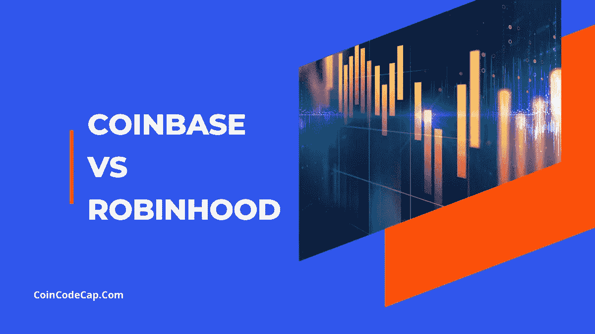

**比特币基地是世界各国最大和[最可靠的加密交易所之一](https://blog.coincodecap.com/crypto-exchange)。另一方面， [**Robinhood**](https://blog.coincodecap.com/go/robinhood) 是一个巨大的交易平台，用于买卖加密货币以及股票和其他商品。**

**然而，选择一个最适合你的可能是一件乏味的工作。因此，为了帮助你理解这一点，我们提出了两个交易所之间的比较。**

**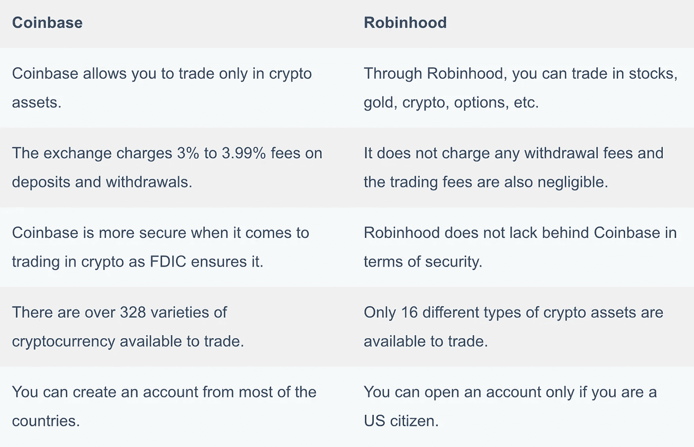**

# **总结(TL；博士)**

*   **[**比特币基地**](https://blog.coincodecap.com/go/coinbase) 是美国最受欢迎的提供加密交易服务的交易所之一。**
*   **[**Robinhood**](https://blog.coincodecap.com/go/robinhood) 提供股票、期权、[密码交易所](https://blog.coincodecap.com/go/crypto-exchange)等多种交易选项。**
*   **如果你是美国或波多黎各居民，你只能使用 [**罗宾汉**](https://blog.coincodecap.com/go/robinhood) **。然而，比特币基地在许多国家都有售。****
*   **[比特币基地](https://blog.coincodecap.com/go/coinbase)通过[学习和赚取](https://www.coinbase.com/earn)窗口为您提供免费的加密资产。你可以在最初的交易日使用这些资产进行交易。**
*   **两个交易所都有直观易用的用户界面；然而，[比特币基地](https://blog.coincodecap.com/go/coinbase)提供了更好的移动应用。**
*   **[**robin hood**](https://blog.coincodecap.com/go/robinhood)**不收取任何佣金费用**，无需支付任何额外费用即可自由交易。**
*   **比特币基地有固定的非常高的交易费用。**
*   **两家交易所都有友好的全天候客户支持。**

# **什么是比特币基地？**

**[**【比特币基地】**](https://blog.coincodecap.com/go/coinbase) 是一家[密码交易所](https://blog.coincodecap.com/go/crypto-exchange)，由 Brian Armstrong 和 Fred Ehsom 于 2012 年成立。该交易所允许用户用他们的法定货币交易，提供了一个简单的用户界面。**

**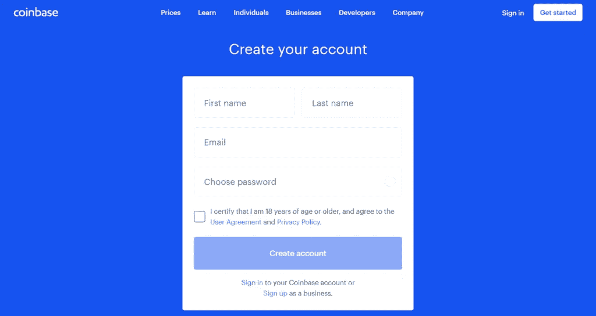**

**该交易所还获得了第一个被美国政府合法允许的加密交易所的称号。这背后的原因很明显，它的政策是透明的，并对法律负责。**

# **什么是罗宾汉？**

**罗宾汉于 2013 年诞生。除了少数例外，你可以使用几乎所有国家的罗宾汉。然而，**只有拥有**[**SSN**](https://en.wikipedia.org/wiki/Social_Security_number)**的美国公民才能在罗宾汉**开户。**

**该交易所提供现金管理等功能，向其经纪人、用户和合作伙伴描述透明度和效率。该交易所还声称自己是一家零手续费的经纪商。**

**Robinhood 直到 2018 年才支持加密货币的交易。[比特币](https://blog.coincodecap.com/a-candid-explanation-of-bitcoin)和以太坊是早期平台上最早的两种加密资产。除此之外，罗宾汉不仅从事密码交易，还从事股票交易。它在美国金融业占据了巨大的空间。**

**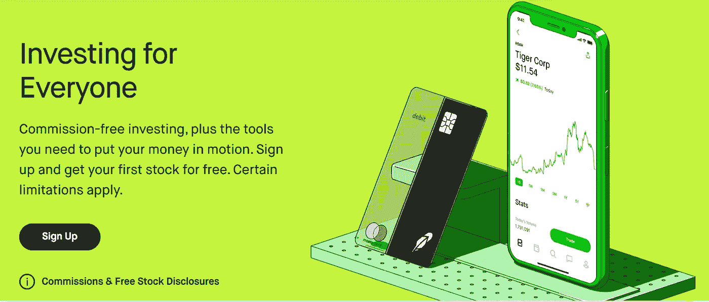**

# **比特币基地 vs 罗宾汉:交易特点**

**两个交易平台都有自己的条款和条件。 [**比特币基地**](https://blog.coincodecap.com/go/coinbase) **只经营加密资产**，而 [**罗宾汉**](https://blog.coincodecap.com/go/robinhood) **经营股票**以及加密货币。让我们在下面详细回顾一下这两者。**

# **罗宾汉贸易特征**

## **现金管理**

**超越自由股票交易的限制，允许对你账户中未投资的钱进行现金管理。为此，你可以使用与借记卡关联的储蓄账户和支票账户。在这里，你可以在杂货店或任何地方花你的钱。其次，你可以将你的钱转移到银行网络中。然后银行会付给你同样的利息。**

**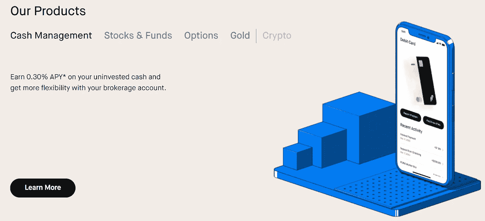**

## **股票和基金**

**如前所述，你也可以在 Robinhood 上交易一家公司的股票或一组股票。罗宾汉对交易[股票(ETF)](https://robinhood.com/us/en/about/#our-products)不收取任何佣金。你可以通过 [Robinhood 手机应用](https://play.google.com/store/apps/details?id=com.robinhood.android&hl=en_US&gl=US)舒适地在手机上访问股票市场。**

## **期权合同**

**当您使用[期权交易](https://blog.coincodecap.com/an-overview-of-binary-options-trading)时，罗宾汉不收取佣金。当你卖出一份期权合约时，它仅仅意味着你把合约卖给一个买方来收取期权费。然而，购买期权合约意味着你在回购你卖出的东西。**

## **罗宾汉密码交换机**

**在 Robinhood 上，你可以交易重要的加密资产，如[比特币](https://blog.coincodecap.com/a-candid-explanation-of-bitcoin)、Dogecoin 等。是的，你不能忘记，当你进行加密货币交易时，它是不收费的。除此之外，Robinhood 是一个安全可靠的平台。**

## **金色的**

**有了[罗宾汉](https://blog.coincodecap.com/go/robinhood)，你可以给你的[金币](https://robinhood.com/us/en/about/gold/)充能。通过这个，你可以用你的黄金投资进行保证金交易。这样的投资为你提供了更高的额外购买力、灵活性和更快的存款资金存取。此外，它还提供了超过 1，700 只股票的深入股票研究报告。**

# **比特币基地贸易特点**

## **买卖密码**

**您可以在 [**【比特币基地】**](https://blog.coincodecap.com/go/coinbase) 上买卖数字货币。除此之外，您可以在一个地方管理所有的加密资产。比特币基地提供了一个不同于 T4 买卖加密资产的平台，叫做比特币基地专业版。**

**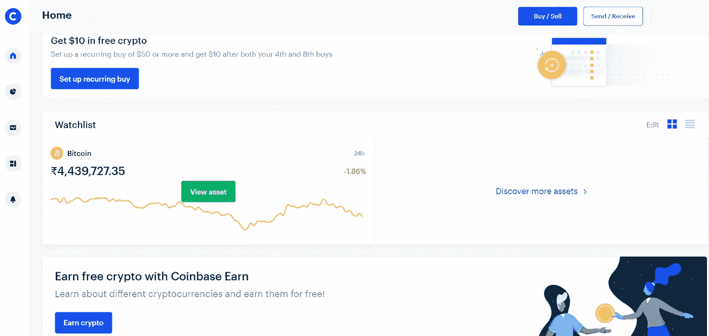**

## **比特币基地专业**

**有了[比特币基地 pro](https://pro.coinbase.com/) ，你就可以进行加密货币交易。比特币基地专业版面向机构投资者和专业投资者，该交易所还降低了用户的费用。专业版提供功能更强的信息包。**

## **比特币基地总理**

**[面向金融科技、经纪公司和交易所的比特币基地 Prime](https://prime.coinbase.com/) 诞生。该平台帮助金融机构向客户提供高效的加密技术。它拥有一些令人兴奋的功能，如流动性的多种选择、保管冷藏解决方案和机构级 API。**

## **学习并获得密码**

**最重要的是，比特币基地免费为你提供一定数量的加密货币。它是这样工作的:有一些课程与一些精选的加密资产相关。在完成一门特定的课程后，你[会获得一定数量的加密资产](https://www.coinbase.com/earn)来测试和分析它在实际市场中的表现。**

**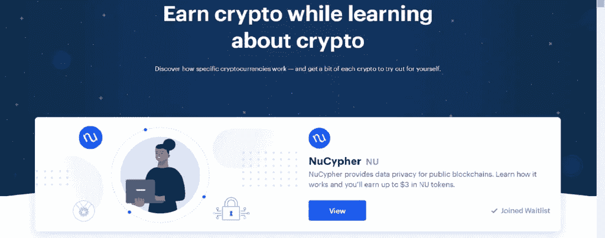**

# **比特币基地 vs 罗宾汉:用户界面**

**由于这个世界充满了竞争对手，交流网站的可访问性对于观众的理解变得非常重要。因此，让我们了解一下，当谈到一个像样的用户界面时，哪种交换是最好的。**

**[**比特币基地**](https://blog.coincodecap.com/go/coinbase) 是最简单易懂的，尤其是如果你是初学者。该网站使注册、购买和出售加密资产变得容易。除此之外，交易所提供的高级和学习选项为您提供了在市场上交易的免费加密资产。在比特币基地注册并开始交易只需要几分钟的时间。**

**[**Robinhood**](https://blog.coincodecap.com/go/robinhood) 不断努力和更新其平台，为用户创造更安全的环境。然而，Robinhood 的网站和移动应用程序都有一个有影响力且易于使用的用户界面。几秒钟之内，你就可以注册创建一个帐户，并很快验证它。**

**简而言之，当谈到用户界面时，比特币基地和罗宾汉都有令人印象深刻且易于理解的方法。因此，在使用这些交换时，您永远不会因为糟糕的用户界面而分心。**

# **罗宾汉与比特币基地:钱包**

**在存储和发送加密资产时，钱包扮演着重要的角色。钱包是每个交易平台必备的；因此，让我们来看看这两家交易所的钱包。**

## **罗宾汉钱包**

**罗宾汉钱包接受法定货币，由于 [AON](https://www.aon.com/) 为其提供保险，因此安全可靠。在过去的某个时候，钱包一直是一个有争议的问题。然而，Robinhood 无疑已经从错误中吸取了教训，并提供了最好的服务之一。**

## **比特币基地钱包**

**该交易所有一个独立的应用程序，专门用于服务于[钱包](https://wallet.coinbase.com/)。利用这一点，你可以将所有的数字资产分散到一个地方，并非常迅速地支付给你的朋友和家人。此外，该交易所在保险方面占据优势，因为比特币基地钱包是由联邦存款保险公司投保的。**

**此外，在管理数字资产的安全性和直观钱包方面，比特币基地比罗宾汉做得更好。**

# **比特币基地与罗宾汉:移动应用**

**说移动用户的数量日复一日的成倍增长并没有错。这是我们在比较两家数字交易所时不能跳过移动应用的唯一原因。**

## **Robinhood 手机应用**

**[Robinhood 的移动应用](https://play.google.com/store/apps/details?id=com.robinhood.android&hl=en_IN&gl=US)易于使用，展示了有用的图表和有意义的应用信息。用户界面得体而直观，在 google play 和 App Store 上都可以使用。**

**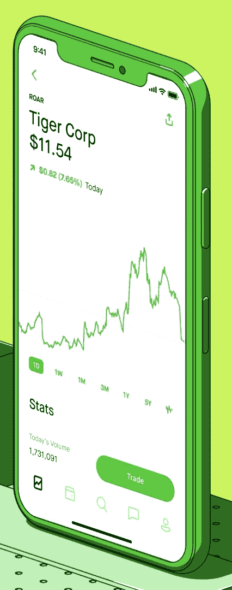**

## **比特币基地手机应用**

**比特币基地的移动应用也适用于安卓系统和 iPhone 手机。该应用程序是安全的，易于使用，用户界面似乎很直观。这款应用非常优秀，对初学者非常友好。**

**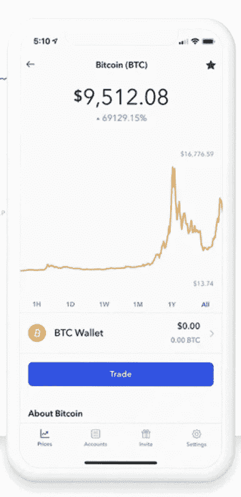**

**比特币基地提供了比罗宾汉更好的用户界面，这让它在平台上占有优势。**

# **比特币基地与罗宾汉:如何购买比特币？**

**比特币是最突出和使用最广泛的数字资产，因此了解在两个交易所购买比特币的程序非常重要。以下是从罗宾汉和比特币基地购买比特币的分步说明。**

## **如何在 Robinhood 购买比特币？**

**你可以在 [**罗宾汉**](https://blog.coincodecap.com/go/robinhood) 上购买比特币，只需遵循下面提到的几个简单步骤-**

*   **从[谷歌 Play 商店](https://play.google.com/store/apps/details?id=com.robinhood.android&hl=en_IN&gl=US)或[应用商店](https://apps.apple.com/us/app/robinhood-investing-for-all/id938003185)下载他们的应用。**
*   **现在，在您的设备上打开应用程序。**
*   **搜索比特币或 BTC 选项。**
*   **现在点击交易按钮，然后点击购买按钮。**
*   **然后输入在 USDT 购买所需比特币的金额。**
*   **点击并确认查看选项。**
*   **最后，向上滑动以提交订单。**

## **如何在比特币基地购买比特币？**

**以下是在 [**比特币基地**](https://blog.coincodecap.com/go/coinbase) 购买比特币需要遵循的几个简单步骤。**

*   **在它的网站上向上滚动，点击买卖选项。**
*   **将出现一个弹出窗口。输入您希望花费在购买比特币上的 USDT 金额。**
*   **现在，您将能够看到订单执行后您将收到的比特币数量。**
*   **你会看到添加了比特币基地费的购买比特币的订单。比特币基地收取 0.04%至 0.5%的手续费。**
*   **点击确认购买选项，完成您的比特币购买。**

# **比特币基地 vs 罗宾汉:费用**

**当涉及到在[密码交易所](https://blog.coincodecap.com/go/crypto-exchange)进行交易时，费用总是起着至关重要的作用。一方面，Robinhood 在各种交易框架上没有或很少收取成本费用。另一方面，比特币基地则纯粹致力于对与加密货币相关的资产收取合理的费用。**

## **罗宾汉费**

****Robinhood 是一个免佣金的交易平台**，从现在到永远。Robinhood 在开立账户、维护账户或转移资金时不向您收取任何费用。**

*   ****自律组织(sro)**如[金融行业监管局(FINRA)](https://www.finra.org/) 要求小额费用来销售订单。他们对卖出订单收取费用，不考虑经纪公司。然而，在罗宾汉的案例中，顾客并没有这样的费用。他们可以汇款申请 [SRO](https://www.investopedia.com/terms/s/sro.asp) s**
*   ****账户无现金:**出于交易目的，账户没有汇率。**
*   ****加密交易费用:** Robinhood 声称完全免佣金，也就是说，他们不会向你收取任何利润。然而，在资产的原始价格之外还有一些费用。这大约是 0.1%，要了解更多信息，[点击这里](https://robinhood.com/us/en/support/articles/trading-fees-on-robinhood/)。**

## **比特币基地费用**

**[**比特币基地**](https://blog.coincodecap.com/go/coinbase) 允许您使用在线交易申请进行提款。您可以使用借记卡或信用卡快速保护您的交易。比特币基地的手续费率是 1.49%，最低取款费是 0.55 美元。以下是您可能需要支付的一些其他费用:**

*   ****美国银行账户:**您可以用这个通过您的账户**进行各种活动。**比特币基地给你一个美国银行的记账利率。它占账户资金总额的 1.49%。**
*   ****钱包:**想要钱包里的资产？然后比特币基地给你提供了大量的支持，占总数的 1.49%。**
*   ****卡选项:**您可以在平台上链接您的借记卡或信用卡。该交易所对信用卡交易收取 3.99%的费用。要了解更多关于比特币基地的费用，点击这里。**
*   ****密码交易费用:**庄家不收费；对于接受者，它是总量的 1.49%，对于差价，它大约等于加密的 1.00%。你可以在下表中查看美国的学费结构，其他国家的学费结构，[点击这里](https://help.coinbase.com/en/coinbase/trading-and-funding/pricing-and-fees/fees)。**

**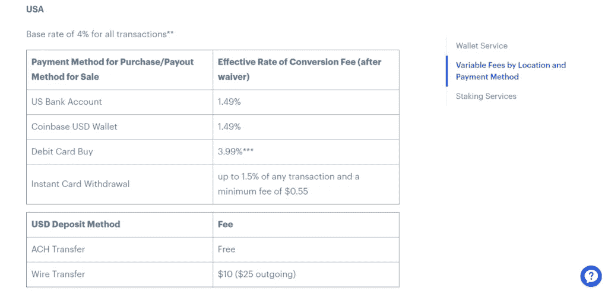**

**您可以选择比特币基地，因为它使用起来更安全可靠。然而，如果你想节省一些钱，罗宾汉应该是你的第一选择。**

# **比特币基地 vs 罗宾汉:安全**

**安全性对于任何加密交易平台都非常重要。因此，让我们从安全的角度比较一下这些[密码交易所](https://blog.coincodecap.com/go/crypto-exchange)。**

## **罗宾汉安全**

**Robinhood 提供的一些安全功能如下:**

*   ****认证流程:** Robinhood 提供 2FA 认证系统，通过短信和电子邮件验证。**
*   ****冷藏:** Robinhood 将您的所有资产储存在离线冷藏金库中，保护它们免受黑客攻击。**
*   **[**FDIC 保险**](https://www.fdic.gov/resources/deposit-insurance/) **:** 可以做某一级别的保险最低可达 250K。**
*   ****身份验证:**只有拥有美国永久居住地址和 SSN，才能在 coinbase 上创建账户。**

**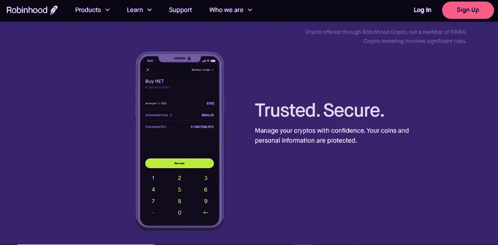**

## **比特币基地安全**

**[**比特币基地**](https://blog.coincodecap.com/go/coinbase) 提供的一些安全特性如下:**

*   **认证流程:比特币基地为您提供双因素认证流程。您可以通过短信或使用谷歌认证应用程序来验证自己。这两者都需要区分大小写的密码才能访问您的帐户。**
*   ****冷库和加密金库:**比特币基地将你 98%的资产保存在冷库中。**
*   **[**FDIC 保险**](https://www.fdic.gov/deposit/deposits/faq.html) **:** 与传统银行一样，比特币基地也可以选择通过多种保险来获取资产。FDIC 为比特币基地提供保险，在金融领域享有良好声誉。**
*   ****身份验证:**比特币基地使用 KYC 验证来验证您的详细信息。你必须上传所有必要的文件才能在平台上交易。**

**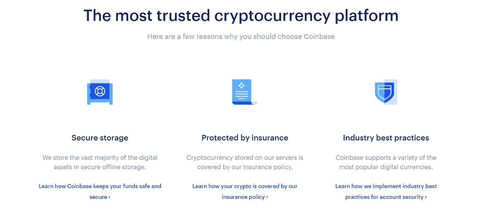**

# **比特币基地 vs 罗宾汉:客户支持**

**您可以通过电子邮件联系[比特币基地客户支持](https://help.coinbase.com/en/contact-us)。但是，如果您迫切希望禁用您的帐户，您可以致电比特币基地。你也可以通过推特来了解他们。**

**Robinhood 将[客户支持](https://robinhood.com/support)服务扩展到电子邮件，您可以在 48 小时内收到回复。该交易所还提供了一个独家的常见问题集来帮助你。**

# **比特币基地 vs 罗宾汉:结论**

**我们很多人在选择 [**罗宾汉**](https://blog.coincodecap.com/go/robinhood) 和**之间的交易平台时陷入两难。两个平台提供几乎相同的服务。然而，最重要的是用户界面、费用和安全性。在这些领域，罗宾汉统治着比特币基地。然而，如果你是那些想在加密货币方面走得更远的人之一，那么**比特币基地可能是一个更好的选择**。****

# ****常见问题****

****罗宾汉的缺点是什么？****

****只有持有有效 SSN 的美国公民才能在 Robinhood 上注册账户。除此之外，Robinhood 只提供 16 种加密资产，不提供共同基金、卖空股票、IRA、期货交易或杠杆交易。****

******为什么 coinbase 费用这么高？******

****与其他市场竞争对手相比，比特币基地向用户收取很高的费用。一个主要原因可能是它遵循了美国政府的规范。交易所根据他们对必须支付的网络交易费用的估计来收取费用。****

******robin hood 适合初学者吗？******

****Robinhood 可能是新手交易者最好的交易平台，因为他们提供自由交易，而且没有账户最低限额。然而，他们在网站上缺乏教育工具，这对初学者来说可能是个问题，可能不得不在其他地方找到。****

******如何从比特币基地撤出？******

****您可以通过访问余额部分并点击取款按钮来提取您的资金。在下一个窗口中，输入您希望提取的金额和钱包地址，以防加密提取。****

*   ****[比特币基地钱包评论【你需要知道的一切】](https://blog.coincodecap.com/coinbase-wallet-review-the-best-bitcoin-wallet)****
*   ****[最佳加密交易所| 2021 年十大加密货币交易所](https://blog.coincodecap.com/crypto-exchange)****
*   ****[2021 年最佳比特币支付处理器](https://blog.coincodecap.com/best-bitcoin-payment-processors)****
*   ****[印度 5 大最佳比特币交易所【2021】](https://blog.coincodecap.com/bitcoin-exchange-in-india)****
*   ****[什么是多签名钱包？5 个最佳 Multisig 钱包【2021】](https://blog.coincodecap.com/multi-signature-wallet)****

> ****加入 Coinmonks [电报集团](https://t.me/joinchat/Trz8jaxd6xEsBI4p)，了解加密交易和投资****

## ****另外，阅读****

*   ****最好的[密码交易机器人](/coinmonks/crypto-trading-bot-c2ffce8acb2a) | [网格交易](https://blog.coincodecap.com/grid-trading)****
*   ****[加密复制交易平台](/coinmonks/top-10-crypto-copy-trading-platforms-for-beginners-d0c37c7d698c) | [如何在 WazirX 上购买比特币](/coinmonks/buy-bitcoin-on-wazirx-2d12b7989af1)****
*   ****[CoinLoan 审核](/coinmonks/coinloan-review-18128b9badc4)|[Crypto.com 审核](/coinmonks/crypto-com-review-f143dca1f74c) | [火币保证金交易](/coinmonks/huobi-margin-trading-b3b06cdc1519)****
*   ****[尤霍德勒 vs 考尼洛 vs 霍德诺特](/coinmonks/youhodler-vs-coinloan-vs-hodlnaut-b1050acde55a) | [Cryptohopper vs 哈斯博特](https://blog.coincodecap.com/cryptohopper-vs-haasbot)****
*   ****[杠杆代币](/coinmonks/leveraged-token-3f5257808b22) | [最佳密码交易所](/coinmonks/crypto-exchange-dd2f9d6f3769) | [Paxful 点评](/coinmonks/paxful-review-4daf2354ab70)****
*   ****[加密套利](/coinmonks/crypto-arbitrage-guide-how-to-make-money-as-a-beginner-62bfe5c868f6)指南| [如何做空比特币](/coinmonks/how-to-short-bitcoin-568a2d0b4ae5)****
*   ****[如何在印度购买比特币？](/coinmonks/buy-bitcoin-in-india-feb50ddfef94) | [WazirX 评论](/coinmonks/wazirx-review-5c811b074f5b) | [BitMEX 评论](https://blog.coincodecap.com/bitmex-review)****
*   ****[印度比特币交易所](/coinmonks/bitcoin-exchange-in-india-7f1fe79715c9) | [比特币储蓄账户](/coinmonks/bitcoin-savings-account-e65b13f92451)****
*   ****[币安费用](/coinmonks/binance-fees-8588ec17965) | [Botcrypto 审查](/coinmonks/botcrypto-review-2021-build-your-own-trading-bot-coincodecap-6b8332d736c7) | [Hotbit 审查](/coinmonks/hotbit-review-cd5bec41dafb)****
*   ****[我的密码副本交易经验](/coinmonks/my-experience-with-crypto-copy-trading-d6feb2ce3ac5) | [购买硬币评论](https://blog.coincodecap.com/buycoins-review)****
*   ****[Bybit 融资融券交易](/coinmonks/bybit-margin-trading-e5071676244e) | [币安融资融券交易](/coinmonks/binance-margin-trading-c9eb5e9d2116) | [Overbit 审核](/coinmonks/overbit-review-9446ed4f2188)****
*   ****[加密货币储蓄账户](/coinmonks/cryptocurrency-savings-accounts-be3bc0feffbf) | [YoBit 审查](/coinmonks/yobit-review-175464162c62) | [Bitbns 审查](/coinmonks/bitbns-review-38256a07e161)****
*   ****[Botsfolio vs nap bots vs Mudrex](/coinmonks/botsfolio-vs-napbots-vs-mudrex-c81344970c02)|[gate . io 交流回顾](/coinmonks/gate-io-exchange-review-61bf87b7078f)****
*   ****[最佳比特币保证金交易](/coinmonks/bitcoin-margin-trading-exchange-bcbfcbf7b8e3) | [萝莉点评](/coinmonks/lolli-review-e6ddc7895ad8) | [比特币保证金交易](https://blog.coincodecap.com/bityard-margin-trading)****
*   ****[创造并出售你的第一个 NFT](https://blog.coincodecap.com/create-nft) | [本地比特币评论](/coinmonks/localbitcoins-review-6cc001c6ed56)****
*   ****[加密保证金交易交易所](/coinmonks/crypto-margin-trading-exchanges-428b1f7ad108) | [赚取比特币](/coinmonks/earn-bitcoin-6e8bd3c592d9) | [Mudrex 投资](https://blog.coincodecap.com/mudrex-invest-review-the-best-way-to-invest-in-crypto)****
*   ****[如何在印度购买以太坊？](https://blog.coincodecap.com/buy-ethereum-in-india) | [如何在币安购买比特币](https://blog.coincodecap.com/buy-bitcoin-binance)****
*   ****[顶级付费加密货币和区块链课程](https://blog.coincodecap.com/blockchain-courses) | [币安评论](/coinmonks/binance-review-ee10d3bf3b6e)****
*   ****[MXC 交易所评论](/coinmonks/mxc-exchange-review-3af0ec1cba8c) | [Pionex vs 币安](https://blog.coincodecap.com/pionex-vs-binance) | [Pionex 套利机器人](https://blog.coincodecap.com/pionex-arbitrage-bot)****
*   ****[在美国如何使用 BitMEX？](https://blog.coincodecap.com/use-bitmex-in-usa) | [BitMEX 审查](https://blog.coincodecap.com/bitmex-review)****

*****原载于 2021 年 4 月 12 日 https://blog.coincodecap.com***。******