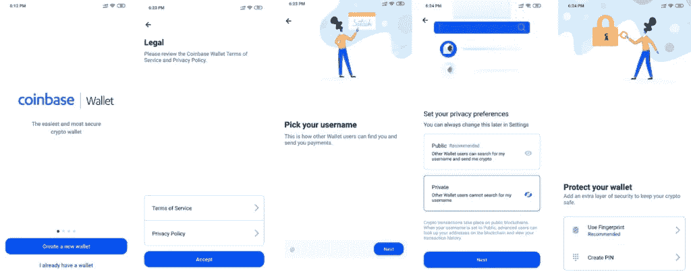

# 比特币基地钱包评论【你需要知道的一切】

> 原文：<https://medium.com/coinmonks/coinbase-wallet-review-everything-you-need-to-know-427781af2d1a?source=collection_archive---------3----------------------->

[比特币基地](https://www.coinbase.com?utm_source=coincodecap.com)自 2012 年以来一直在打造 crypto first 产品。该团队已经为密码交易、存储和[支付](https://coincodecap.com/category/payment)构建了多个世界级的解决方案。今天，我们将回顾一下[比特币基地钱包](https://wallet.coinbase.com/?utm_source=coincodecap.com)，它面向消费者的[日常用户的加密钱包](https://blog.coincodecap.com/tag/crypto-wallet/)。

# 总结(TL；博士)

*   轻松入职
*   Google drive 或 iCloud 上的恢复阶段备份
*   多种货币支持
*   可收集(又名[不可替换令牌](https://en.wikipedia.org/wiki/Non-fungible_token))支持
*   应用内置的 Dapp 浏览器
*   避免使用用户名或 [ENS](https://ens.domains/?utm_source=coincodecap.com) 的地址
*   多种法定货币支持
*   具有实用安全功能的非保管式[加密钱包](https://blog.coincodecap.com/tag/crypto-wallet/)

> 对硬件钱包感兴趣？阅读我们的[最佳硬件钱包](/coinmonks/the-best-cryptocurrency-hardware-wallets-of-2020-e28b1c124069?source=friends_link&sk=324dd9ff8556ab578d71e7ad7658ad7c)指南。

# 装置

根据您使用的操作系统，您可以从 [Playstore](https://play.google.com/store/apps/details?id=com.coinbase.android&hl=en_IN) 或 [Appstore](https://apps.apple.com/us/app/coinbase-wallet/id1278383455) 安装比特币基地钱包。

**注意:**千万不要安装来历不明或来自第三方的钱包。

# 钱包设置

安装完成后，让我们来设置我们的钱包。我们有两种选择，要么创建新的 wallet，要么使用恢复短语导入现有的 wallet。

对于导入现有的钱包，比特币基地提供了两个选项。

*   从 Google drive 或 iCloud 恢复
*   使用恢复短语还原

比特币基地提供了在 Google Drive 或 iCloud 帐户上备份恢复短语的选项。对于我们的审查，我们将从头开始创建一个新的钱包。

以下是创建新的[比特币基地钱包](https://coincodecap.com/product/coinbase-wallet-4)的步骤。

*   接受条款和条件
*   创建新用户名
*   隐私设置(其他钱包用户是否可以搜索你的用户名？).现在，让我们保密吧。
*   添加额外的安全性、指纹或 PIN(如果您的设备支持指纹，则推荐使用)。

这就是我们的基本钱包设置，但在继续之前，让我们备份我们的恢复短语。

> 另请阅读:Uniswap 的[最佳钱包](/coinmonks/best-wallets-to-use-uniswap-e91a6385d9e8)

# 备份您的恢复短语

我们建议备份您的恢复短语。您的备份将使用 AES-256-GCM 加密进行加密，并且只能通过比特币基地钱包手机应用程序访问。此备份只能用您的密码解密。

您的云备份提供商或比特币基地在任何时候都无法访问您的密码或资金，从而保护您的隐私和控制权。只有您知道解密您的加密恢复短语的密码。

因此，在备份您的恢复短语时，请使用您能记住的密码。要备份您的恢复短语，请转到设置→恢复短语。

**注意:**使用你个人的谷歌或 iCloud 账户，不要使用你公司的账户。

# 安全性

比特币基地钱包提供标准的安全功能，如个人识别码和指纹。如果您的移动设备支持指纹，我们建议您通过 PIN 使用指纹。

此外，比特币基地钱包是非托管钱包，因此如果您忘记了 PIN 或丢失了恢复短语，比特币基地团队将无法帮助您。因此，正确备份恢复短语至关重要。

# 特征

现在让我们回顾一下比特币基地钱包的功能。该钱包充满了令人兴奋的功能，使您的生活更加轻松，并在处理加密货币时为您提供最佳体验。让我们回顾一下这些特性。

## 1.与您的比特币基地帐户整合

您可以将您的[比特币基地账户](https://www.coinbase.com?utm_source=coincodecap.com)与[比特币基地钱包](https://wallet.coinbase.com/?utm_source=coincodecap.com)连接，无缝转移硬币。比特币基地账户是托管解决方案，而比特币基地钱包是非托管解决方案。

因此，你可以使用你的比特币基地账户购买加密货币(如[比特币](https://blog.coincodecap.com/tag/bitcoin/)或[以太坊](https://blog.coincodecap.com/tag/ethereum/))，并通过你的比特币基地钱包使用。

## 2.储存你的硬币和收藏品

比特币基地钱包支持多种加密货币。此外，它还支持收藏品(又名不可替换的令牌)。所以现在，你可以在一个地方看到你所有的收藏品。

## 3.Dapp 商店

钱包还允许你发现[dapp](https://blog.coincodecap.com/tag/dapps/)并在应用程序内部与他们互动。你也可以把你最喜欢的 Dapp 加入书签。这个功能让钱包变得有趣，尤其是对 [DeFi](https://blog.coincodecap.com/tag/defi/) 用户来说。

> *也读:* [*最佳智能合约钱包(DeFi Wallets)*](https://blog.coincodecap.com/best-smart-contract-wallet/)

对于用户和 Dapp 创建者来说，这是一个令人兴奋的特性。用户可以发现最好的加密 Dapp，同时，Dapp 构建者可以使用比特币基地钱包接触到数百万用户。

## 4.使用你当地的法定货币

当您创建比特币基地钱包时，默认货币是美元，但您可以使用设置→本地货币进行更改。我希望比特币基地将来也能提供多种语言选择。

## 5-使用用户名或 ENS 进行搜索

在设置我们的钱包时，比特币基地要求我们创建一个用户名。使用此用户名，您可以搜索公开其用户名的其他 wallet 用户。

此外，比特币基地还支持 ENS 域名。ENS 很容易记住代表钱包地址的字符串。

用户名和 ENS 增强了处理加密货币地址时的用户体验。

## 高级功能

比特币基地钱包支持[比特币 Segwit 地址](/@buddhasource/bitcoin-legacy-vs-segwit-wallet-address-what-is-the-difference-cb2e71ab8381)。此外，还有一些先进的功能，开发者可以使用不同的钱包地址，并在 Mainnet 和 Testnet 之间切换。

> *也可阅读:* [*保护你的比特币的最佳硬件钱包*](https://blog.coincodecap.com/best-hardware-wallet-bitcoin/)

## 正在总结…

比特币基地有一个最轻松的用户入门和简单化的设计。钱包提供了令人兴奋的功能，令人惊叹的用户体验。

钱包的一大亮点是个人云上的恢复短语备份。我们认为它将帮助成千上万的新密码用户不用担心他们的恢复阶段，并成为在云上安全备份密码短语的行业标准。

请在评论区告诉我们你对我们的比特币基地钱包评论的看法。

**同样，阅读**

*   [顶级 DeFi 项目](/coinmonks/defi-future-10-promising-projects-in-the-defi-world-ff2b697ab006)
*   [最佳加密交易机器人](/coinmonks/whats-the-best-crypto-trading-bot-in-2020-top-8-bitcoin-trading-bot-c16adeb13317)
*   最好的比特币[硬件钱包](/coinmonks/the-best-cryptocurrency-hardware-wallets-of-2020-e28b1c124069)
*   最好的[加密税务软件](/coinmonks/best-crypto-tax-tool-for-my-money-72d4b430816b)
*   [最佳加密交易平台](/coinmonks/the-best-crypto-trading-platforms-in-2020-the-definitive-guide-updated-c72f8b874555)

> [直接在您的收件箱中获得最佳软件交易](https://coincodecap.com?utm_source=coinmonks)

*原载于 2020 年 3 月 2 日 https://blog.coincodecap.com**的* [*。*](https://blog.coincodecap.com/coinbase-wallet-review-the-best-bitcoin-wallet)