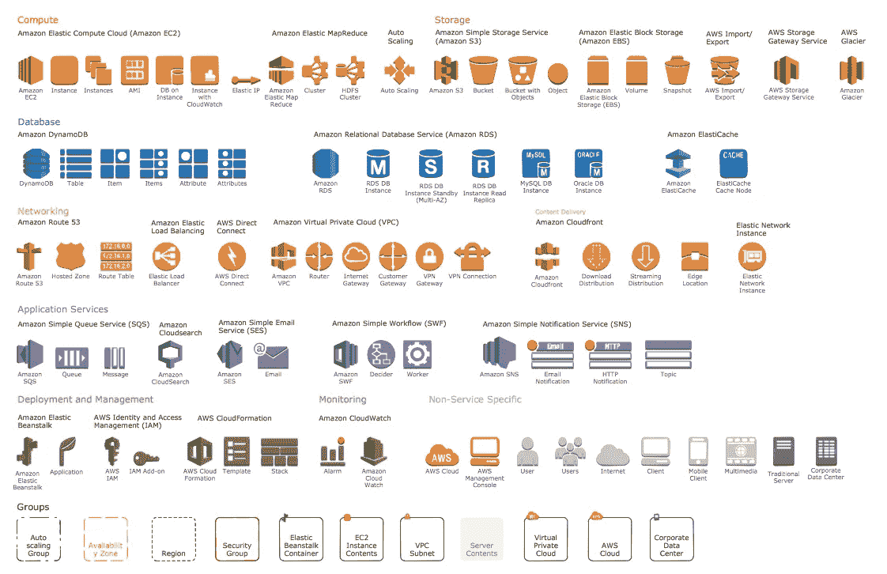
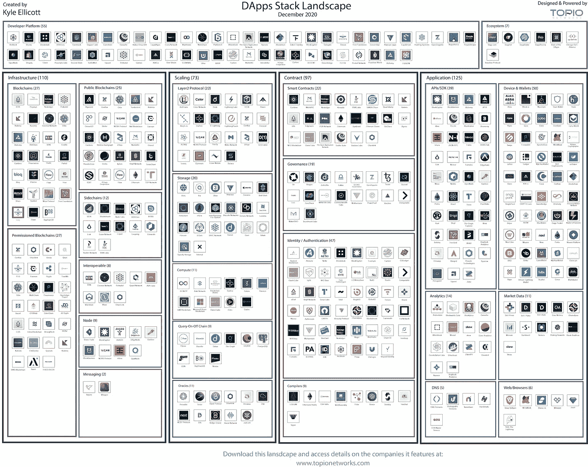

# 比特币基地的 S-1 旅程/德国使数字证券合法化/ MSFT 和 ey 为游戏扩展区块链平台

> 原文：<https://medium.com/coinmonks/coinbases-s-1-journey-germany-legalizes-digital-securities-msft-ey-expanding-blockchain-96171fdccba6?source=collection_archive---------6----------------------->

Photo by [Misty Ladd](https://unsplash.com/@arkansas007?utm_source=unsplash&utm_medium=referral&utm_content=creditCopyText) on [Unsplash](https://unsplash.com/s/photos/elf?utm_source=unsplash&utm_medium=referral&utm_content=creditCopyText)

*2020 年 12 月 20 日*

*本周的邮件稍微推迟了一些，因为该行业决定在年底前偷偷送上满满一袋礼物。小精灵巴迪(Buddy the Elf)得知圣诞老人将抵达纽约时的兴奋，与我们迈向 2021 年时的热情程度并不相称(是的，我正处于完全的假日模式)。现在我已经把你带到了我的水平，让我们直接进入本周的重点。*

***比特币基地*** *决定为什么不，现在是 2020 年，他们宣布向 SEC 提交 S-1 表格的注册声明草案，准备上市。这已经不是我们第一次听到这个消息了，时间表还没有确定……美国财政部***决定进入全面禁止名单，并围绕 KYC/反洗钱对交易所和钱包的要求发布了一项拟议中的规则(顺便说一下，周五晚些时候)。请继续关注这方面的更多信息，以及它对金融服务不足的行业、DApps 等的连锁反应。回到尼斯列表，****e . y .****和* ***微软*** *宣布扩展微软的区块链解决方案，使其****Xbox****游戏合作伙伴和艺术家、音乐家、作家&其他内容创作者的网络能够更好地跟踪、管理和支付版税合同*。 ***Visa*** *分享了一篇关于使用中央银行数字货币(****CBD cs****)或“数字现金”&如何让消费者受益的技术论文&经济体。说到数字货币…* ***比特币*** *最高 24k 美元，这值得一提的原因有很多，但特别是作为* ***北方信托*** *和* ***渣打*** *合作伙伴的新托管解决方案和****coin star****

*****德*** *通过一项新的法律将数字化证券合法化，该法律将终止证券销售需要纸质证书的要求。****IDEO CoLab****启动合作 DeFi 孵化器&常驻项目。* ***复合*** *发布白皮书* ***复合链*** *，一种能够在对等总账之间转移价值&流动性的分布式总账。* ***基线协议*** *揭示以太坊互操作性。* ***北海巨妖交易所*** *计划明年晚些时候整合比特币的* ***闪电网*** *。而****Square****的现金应用程序现在允许客户在购买时收到比特币。****BitGo****为****Hedera Hashgraph****提供多签名钱包技术。****block data****和****CB insights****与我们分享 2020 年的区块链 50 强。***

***如果你认为这就是结束了，那就续杯吧，因为我们已经有了新的 11 项融资公告，包括****Pax OS****的滔天系列 C 和* ***美国运通*** *最近对该行业的投资。加上 DApps 围捕，研究，等等！尽情享受吧！***

## **🏢[比特币基地宣布秘密提交 S-1 表格注册声明草案](https://blog.coinbase.com/coinbase-announces-confidential-submission-of-draft-registration-statement-b140a9dfc9f5)**

**比特币基地全球公司今天宣布，它已向美国证券交易委员会(简称“SEC”)秘密提交了一份 S-1 表格注册声明草案。表格 S-1 预计将在美国证券交易委员会完成其审查程序后生效，取决于市场和其他条件……[阅读更多](https://blog.coinbase.com/coinbase-announces-confidential-submission-of-draft-registration-statement-b140a9dfc9f5)作者[比特币基地](https://medium.com/u/913e7ed84452?source=post_page-----96171fdccba6--------------------------------)**

***相关:*🚨[*梅萨里*](https://medium.com/u/7cf93d3c3400?source=post_page-----96171fdccba6--------------------------------) [*在申请 IPO 后，比特币基地的估值为 280 亿美元*](https://cointelegraph.com/news/messari-values-coinbase-at-28-billion-following-ipo-filing)**

***相关:*📈[*比特币基地上市对密码行业意味着什么*](https://decrypt.co/51979/what-coinbase-going-public-means-for-the-crypto-industry) *-* [*解密*](https://medium.com/u/2de7a312127a?source=post_page-----96171fdccba6--------------------------------)**

## **🏦[美国出台长期以来令人恐惧的计划，让密码交易所识别个人钱包](https://www.coindesk.com/fincen-proposes-kyc-rules-for-crypto-wallets)**

**根据美国财政部周五提出的一项规定，希望将自己的存款从交易所转移到自己个人钱包的美国加密货币用户可能需要遵守新的了解你的客户(KYC)要求。根据规则制定提案的预先通知，如果发送的金额超过… [阅读更多信息](https://www.coindesk.com/fincen-proposes-kyc-rules-for-crypto-wallets)，希望从集中交易所向私人钱包发送加密货币的用户需要向交易所提供钱包所有者的个人信息**

***相关:📈* [*比特币突破 24K 美元，创下历史新高*](https://www.coindesk.com/bitcoin-briefly-tops-24k-setting-new-all-time-high)**

***相关:🏦* [*渣打与北方信托合作推出 Zodia，一家加密货币托管机构*](https://www.northerntrust.com/united-states/pr/2020/standard-chartered-northern-trust-launch-zodia)**

## **🎮[微软、EY 扩展区块链平台用于游戏权利以包括支付](https://www.coindesk.com/microsoft-ey-expand-blockchain-platform-for-gaming-rights-to-include-payments)**

**安永(EY)和微软今天宣布，他们已经扩展了微软基于区块链的游戏版权和版税管理解决方案，以提供从合同创建到支付和对账的财务记录系统。微软计划使用扩展的区块链功能，使其微软 Xbox 游戏合作伙伴及其艺术家、音乐家、作家和其他内容创作者的网络能够更好地了解版税合同的跟踪、管理和支付处理。EY 希望帮助其通过合同驱动的 B2B 企业客户……[阅读更多信息](https://www.coindesk.com/microsoft-ey-expand-blockchain-platform-for-gaming-rights-to-include-payments)**

***相关:📖* [*COVID &大科技倦怠正在推社交令牌主流*](https://www.coindesk.com/covid-big-tech-pushing-social-tokens-mainstream)*——*[*【周凯文】*](https://medium.com/u/28ed0bb882d8?source=post_page-----96171fdccba6--------------------------------)**

# **本周的更多内容:**

**📈[央行数字货币&未来:Visa 发布新研究](https://usa.visa.com/visa-everywhere/blog/bdp/2020/12/17/central-bank-digital-1608165518834.html)——[Cuy Sheffield](https://medium.com/u/4ea58435f8c?source=post_page-----96171fdccba6--------------------------------)**

**📈 [IDEO CoLab](https://medium.com/u/d8021244090d?source=post_page-----96171fdccba6--------------------------------)**

**🏧 [Coinstar 将其 Coinme 比特币 ATM 机数量扩大至 5000 台](https://www.coindesk.com/coinstar-bitcoin-atm-expansion)**

**🇩🇪 [德国将数字化证券合法化](https://cointelegraph.com/news/germany-legalizes-digitized-securities)**

**📈 [Compound 发布 Compound Chain 白皮书，Compound Chain 是一种能够在对等分类帐之间转移价值的分布式分类帐&流动性](https://compound.cash/)**

**📈[区块链 50:利用区块链& Crypto 变革产业的创新者](https://www.cbinsights.com/research/report/blockchain-technology-companies/) — [BLOCKDATA](https://medium.com/u/279c07ad0b4d?source=post_page-----96171fdccba6--------------------------------)**

**💸[令牌化资产市场超过 200 亿美元](https://decrypt.co/51792/tokenized-asset-market-surpasses-20-billion)**

**💸[摩根大通利用区块链在回购市场交易中转移数十亿美元](https://www.bloomberg.com/news/articles/2020-12-10/jpmorgan-using-blockchain-to-move-billions-in-repo-market-trades)**

**💸 [Square 的现金应用程序现在允许客户在购买时取回比特币](https://www.coindesk.com/squares-cash-app-now-lets-customers-get-bitcoin-back-on-purchases)**

**🏦[尼日利亚中央银行阻止奈拉汇款，比特币在尼日利亚的使用大幅增加](https://cointelegraph.com/news/bitcoin-adoption-in-nigeria-soars-as-central-bank-blocks-remittances-in-naira)**

**🏦[这些银行和初创公司正在使用区块链重新想象融资](https://www.cbinsights.com/research/blockchain-primary-markets-bonds-dlt-banks-startups/) — [CB Insights](https://medium.com/u/914088e570e?source=post_page-----96171fdccba6--------------------------------)**

**📖[斯潘塞·丁威迪扩大与](https://www.sportico.com/leagues/basketball/2020/dinnwiddie-expands-crypto-ties-with-bison-trails-deal-1234618378/) [拜森小道](https://medium.com/u/e9a232ffaa7b?source=post_page-----96171fdccba6--------------------------------) [交易](https://www.sportico.com/leagues/basketball/2020/dinnwiddie-expands-crypto-ties-with-bison-trails-deal-1234618378/)的秘密联系**

**📦[通过区块链提高供应链的弹性、可追溯性和可预测性](https://cloudblogs.microsoft.com/industry-blog/manufacturing/2020/12/17/improve-supply-chain-resiliency-traceability-and-predictability-with-blockchain/)—[Yorke . Rhodes III](https://medium.com/u/7428d557099?source=post_page-----96171fdccba6--------------------------------)**

**🇨🇳 [中国正在苏州测试其数字货币](https://www.theblockcrypto.com/post/87754/china-digital-yuan-touching-pay)**

**🏦[比特币基地商务增加开票](https://u.today/coinbase-commerce-adds-invoicing-heres-how-it-works)**

# **💸首都 Update️:**

**从投资到新基金，再到 M&A，这一切都凸显了最近的风险投资公告。**

**💸[币安实验室领投多资产钱包开发商 MATH 的 1200 万美元融资(B 轮)](https://www.coindesk.com/binance-labs-leads-12m-series-b-for-multi-asset-wallet-developer-math)**

**💸 [Paxos](https://www.topionetworks.com/companies/paxos-58b5ac7014d395c3c5000007) [在最新一轮融资中筹集了 1.42 亿美元(C 轮)](https://www.reuters.com/article/paxos-funding/crypto-firm-paxos-raises-142-million-in-latest-funding-round-idUSKBN28R1HC)**

**💸 [Maple Finance 在最新一轮融资中筹集了 130 万美元的种子资金](https://www.coindesk.com/maple-finance-corporate-lending-defi)**

**💸 [Union 已经筹集了 300 万美元用于以太坊](/union-finance/union-has-raised-3m-to-bring-credit-to-ethereum-6cc1b5f40776) — [Jacob Shiach](https://medium.com/u/d6eefb20a04a?source=post_page-----96171fdccba6--------------------------------)**

**💸[pool together raises see extension 由 ParaFi Capital 牵头](/pooltogether/seed-extension-with-parafi-2ab973302d50)**

**💸[比特币交易公司 B2C2 被 SBI 收购](https://decrypt.co/51546/bitcoin-trading-firm-b2c2-gets-acquired-by-japans-sbi)**

**💸[美国运通的风险部门宣布投资](https://www.bloomberg.com/news/articles/2020-12-16/amex-dives-deeper-into-crypto-with-trading-platform-investment) [FalconX](https://www.bloomberg.com/news/articles/2020-12-16/amex-dives-deeper-into-crypto-with-trading-platform-investment)**

**💸 [Safello 为计划中的 2021 年 IPO 融资 130 万美元](https://www.coindesk.com/bitcoin-exchange-safello-raises-1-3m-ipo-2021)**

**💸[数据保护初创公司 BigID 融资 7000 万美元](https://siliconangle.com/2020/12/16/data-protection-startup-bigid-raises-70m-1b-unicorn-valuation/)**

**💸 [Lido，Eth2 staking protocol，筹集了 200 万美元的新资金](https://www.theblockcrypto.com/linked/87761/eth2-staking-protocol-lido-raises-2-million-funding)**

**💸 [Bonfida 在 CMS Holdings 牵头的种子轮融资中筹集了 450 万美元](https://www.theblockcrypto.com/linked/87811/decentralized-exchange-bonfida-seed-round)**

# **DApps(分散式应用)手表:**

## **🔗[是的，你可能需要一个区块链](https://balajis.com/yes-you-may-need-a-blockchain/)**

****

**[Source](https://balajis.com/yes-you-may-need-a-blockchain/)**

**有一种特定的开发人员说区块链只是糟糕的数据库。正如叙述所述，为什么不在您的应用程序中使用 [PostgreSQL](https://www.topionetworks.com/topics/postgresql-50cf74083ae4b26cd5014448) ？它成熟、强大、性能卓越。与关系数据库相比，怀疑论者声称区块链只是缓慢、笨重、昂贵的数据库，而且无法扩展……[阅读更多](https://balajis.com/yes-you-may-need-a-blockchain/)Bala Ji s . Srinivasan**

***相关:📖*[*DAOs 中的投票选项*](/daostack/voting-options-in-daos-b86e5c69a3e3) *—* [*埃里克·阿森诺特*](https://medium.com/u/944b87f3e7ef?source=post_page-----96171fdccba6--------------------------------) *、*[*Dao stack*](https://medium.com/u/430be2f021c7?source=post_page-----96171fdccba6--------------------------------)**

## **🌐 [2021 年 Web 3 生态系统的预测和需求](https://figment.io/resources/2021-predictions-and-needs-for-the-web-3-ecosystem/)**

**2020 年是 Web 3 生态系统的决定性一年，但[figument Networks](https://medium.com/u/618d17b61837?source=post_page-----96171fdccba6--------------------------------)团队已经在考虑 2021 年了。BTC 将最终成为传统金融机构中的“主流”投资资产(尽管不情愿)。这将导致供需失衡，推高价格，除非监管机构杀死黄金区块链。然后，BTC 将成为投资者(更重要的是黑客开发者)进入其他分散网络/资产的门户。我们将看到区块链的第一个主流非投机性用例，它将不是“x，而是分散的”,而是技术的全新使用……[阅读更多](https://figment.io/resources/2021-predictions-and-needs-for-the-web-3-ecosystem/)**

***相关:*📈[*DeFi 景气带动 2020 年 DApp 成交量增长 1200%*](https://cointelegraph.com/news/defi-boom-drives-1200-increase-in-dapp-volume-in-2020-report)*——*[*DappRadar*](https://medium.com/u/b355b203c3dd?source=post_page-----96171fdccba6--------------------------------)**

***相关:*📈*[*dappardar*](https://medium.com/u/b355b203c3dd?source=post_page-----96171fdccba6--------------------------------)*2020 年前 52 名 dapp****

## **⚒️ [基线协议揭示以太坊互操作性，部署需要时间](https://cointelegraph.com/news/baseline-protocol-unveils-ethereum-interoperability-deployment-will-take-time)**

**企业区块链应用正在缓慢但稳步地走向公共网络，尤其是在以太坊生态系统中实施新的升级和功能时。虽然 Eth2 承诺为以太坊网络带来可扩展性、安全性和容量，以推进企业用例，但其他技术正在开发中，以帮助企业正确利用以太坊网络。… [阅读更多](https://cointelegraph.com/news/baseline-protocol-unveils-ethereum-interoperability-deployment-will-take-time)——[雷切尔·沃尔森](https://medium.com/u/56cedbf92c62?source=post_page-----96171fdccba6--------------------------------)**

***相关:* ⚒️ [*萝卜农夫的故事*](https://jwolpert.medium.com/the-radish-farmers-story-2e4aa841c0f8)*——*[*约翰·沃伯特*](https://medium.com/u/26a7c53cdfeb?source=post_page-----96171fdccba6--------------------------------)**

**📖 [BitGo](https://medium.com/u/8a3098b11fe8?source=post_page-----96171fdccba6--------------------------------) [为](https://finance.yahoo.com/news/bitgo-provides-first-multi-signature-150000066.html) [Hedera Hashgraph](https://medium.com/u/387bb8085e8a?source=post_page-----96171fdccba6--------------------------------) 的 [HBAR](https://finance.yahoo.com/news/bitgo-provides-first-multi-signature-150000066.html) 提供首个多重签名钱包技术**

**♎[重温脸书的区块链计划](https://cipher.substack.com/people/1594916-joel-john)——[乔尔·约翰](https://medium.com/u/13d031419d6f?source=post_page-----96171fdccba6--------------------------------)**

**📖[北海巨妖交易所将于 2021 年整合比特币的闪电网络](https://www.coindesk.com/kraken-exchange-integrate-bitcoin-lightning-2021)**

**📖[嘉手纳大厦](/kadena-io/kadena-building-defi-bridge-to-celo-and-joining-alliance-for-prosperity-also-announcing-bounty-9ead803be8c3)至[德菲桥](https://medium.com/u/18e0dc50a66e?source=post_page-----96171fdccba6--------------------------------)——[范文忠](https://medium.com/u/b87612590052?source=post_page-----96171fdccba6--------------------------------)**

**📖[为什么没人能黑区块链](https://coinmarketcap.com/alexandria/article/why-nobody-can-hack-a-blockchain)**

# **📺VCTV 的知识点滴:**

**本周，我想分享我最近在 VCTV 与区块链投资者的对话，内容是关于 2021 年风险投资将走向哪些机会领域的最新行业活动。尽情享受吧！**

**Source: [YouTube](https://youtu.be/STUFO9DbB1c)**

# **🎙️研究:2020 年区块链和 DApps 状况:**

****

**Source: [Topio Networks](https://www.topionetworks.com/markets/dapps-stack-landscape-5de8d07eb9abe453e04203f8)**

***现已提供，免费是我最新研究的去中心化应用或*[***【DApp】【栈】景观图***](https://www.topionetworks.com/rep/dapps-stack-landscape-december-2020-5fc76545843bac77a3825d57)**—Q4 2020 版。这张地图提供了新兴 DApps 行业的全面概述和分类，突出了在构建下一代应用程序中发挥重要作用的 400 多家全球公司。作为奖励，我包括了一些生态系统玩家和团体，当你准备发布你的应用时，你需要熟悉它们。如果这是你看到的第一个版本，那就把它当作你进一步理解不仅仅是这个行业，而且是构建一个完全或部分去中心化的应用程序所需的所有核心技术的指导性路线图(DApp)。****

****

**Source: [Topio Networks](https://s3.amazonaws.com/spoke-profiles-prod-assets/uploads/9312f9408ba3ef581b818c797cc7137d829d8a04/original/Blockchain_26th_Aug.pdf)**

**我们正在向完全数字化的经济转型，2020 年区块链行业的活动比以往任何时候都更能证明这一点。现在 w/ **1，100 多家公司**建设& **资金(300 亿美元以上！将构成这种新经济的基础设施层。[全面细分](https://s3.amazonaws.com/spoke-profiles-prod-assets/uploads/6b002da229bbc3453d3e903499d5671567703fb6/original/Q3_2020_Update_Blockchain_Landscape.pdf)现已发布，包括对前景的[深入概述](https://youtu.be/eE6XZ1RVblA)、新类别&商业模式、机会领域、新兴类别、用例，以及对 2020 年剩余时间到 2021 年的展望。****

**📣*想要了解区块链、DApps、DeFi 和 FinTech 行业的所有头条新闻、投资、深入研究和最新动态吗？* [***订阅***](https://www.topionetworks.com/newsletters) *并关注我的* [***推特***](https://twitter.com/kyleellicott) *获取每周更新及更多！***

## **另外，阅读**

*   **[密码交易机器人](/coinmonks/crypto-trading-bot-c2ffce8acb2a)**
*   **[Uniswap API](https://bitquery.io/blog/uniswap-pool-api) —如何获取 Uniswap 数据？**
*   **[AAX 交易所评论](/coinmonks/aax-exchange-review-2021-67c5ea09330c) |推荐代码、交易费用、利弊**
*   **[Deribit 审查](/coinmonks/deribit-review-options-fees-apis-and-testnet-2ca16c4bbdb2) |选项、费用、API 和 Testnet**
*   **[FTX 密码交易所评论](/coinmonks/ftx-crypto-exchange-review-53664ac1198f)**
*   **[Bybit 交换评论](/coinmonks/bybit-exchange-review-dbd570019b71)**
*   **最好的比特币[硬件钱包](/coinmonks/the-best-cryptocurrency-hardware-wallets-of-2020-e28b1c124069?source=friends_link&sk=324dd9ff8556ab578d71e7ad7658ad7c)**
*   **[加密复制交易平台](/coinmonks/top-10-crypto-copy-trading-platforms-for-beginners-d0c37c7d698c)**
*   **[bits gap vs 3 commas vs quad ency](https://blog.coincodecap.com/bitsgap-3commas-quadency)**
*   **最好的[加密税务软件](/coinmonks/best-crypto-tax-tool-for-my-money-72d4b430816b)**
*   **[最佳加密交易平台](/coinmonks/the-best-crypto-trading-platforms-in-2020-the-definitive-guide-updated-c72f8b874555)**
*   **最佳[加密借贷平台](/coinmonks/top-5-crypto-lending-platforms-in-2020-that-you-need-to-know-a1b675cec3fa)**
*   **[莱杰纳米 S vs 特雷佐 one vs 特雷佐 T vs 莱杰纳米 X](https://blog.coincodecap.com/ledger-nano-s-vs-trezor-one-ledger-nano-x-trezor-t)**
*   **[block fi vs Celsius](/coinmonks/blockfi-vs-celsius-vs-hodlnaut-8a1cc8c26630)vs Hodlnaut**
*   **Bitsgap 评论——一个轻松赚钱的加密交易机器人**
*   **为专业人士设计的加密交易机器人**
*   **[PrimeXBT 审查](/coinmonks/primexbt-review-88e0815be858) |杠杆交易、费用和交易**
*   **[Altrady 审查](https://blog.coincodecap.com/altrady-reivew)**
*   **[埃利帕尔泰坦评论](/coinmonks/ellipal-titan-review-85e9071dd029)**
*   **[SecuX Stone 评论](https://blog.coincodecap.com/secux-stone-hardware-wallet-review)**
*   **[BlockFi 评论](/coinmonks/blockfi-review-53096053c097) |从您的密码中赚取高达 8.6%的利息**
*   **[面向开发人员的最佳加密 API](/coinmonks/best-crypto-apis-for-developers-5efe3a597a9f)**
*   **[最佳区块链分析工具](https://bitquery.io/blog/best-blockchain-analysis-tools-and-software)**
*   **[加密套利](/coinmonks/crypto-arbitrage-guide-how-to-make-money-as-a-beginner-62bfe5c868f6)指南:新手如何赚钱**
*   **顶级[比特币节点](https://blog.coincodecap.com/bitcoin-node-solutions)提供商**
*   **最佳[加密制图工具](/coinmonks/what-are-the-best-charting-platforms-for-cryptocurrency-trading-85aade584d80)**
*   **了解比特币的[最佳书籍有哪些？](/coinmonks/what-are-the-best-books-to-learn-bitcoin-409aeb9aff4b)**

> **[直接在您的收件箱中获得最佳软件交易](/coinmonks/newsletters/coinmonks)**

****