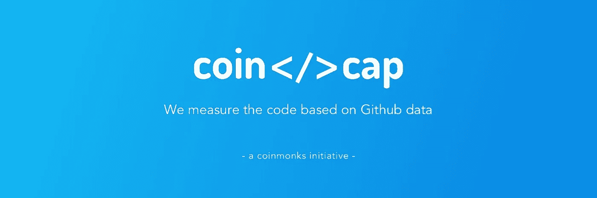

# CoinCodeCap

> 原文：<https://medium.com/coinmonks/coincodecap-f8337eaeed93?source=collection_archive---------1----------------------->

## 空谈不值钱。给我看看代码

我去年开始[***CoinCodeCap***](https://coincodecap.com)基于不同加密货币的 Github 开发来跟踪它们。

**什么是 Github？** [GitHub](https://github.com/) 是协作平台的代码托管平台，对开源项目免费。几乎所有的加密货币项目都将其代码托管在 Github 上。

**为什么要跟踪 Github 活动？** 加密项目从投资者那里筹集资金来开发软件和技术，以解决一些问题，但你如何追踪他们是否真的创造了这项技术，或者打包去了 home❔

找出这一点的最好方法是追踪代码。由于大多数项目使用 Github 托管他们的代码，我们可以跟踪他们的 Github 活动。

> 空谈不值钱。给我看看代码。——莱纳斯·托瓦尔兹

**CoinCodeCap 有什么帮助？** 我们跟踪不同的加密货币，监控它们的 Github 活动。最近我们从名单上删除了 700 多个加密项目 ，他们在过去的六个月里没有写一行代码。😉

我们还从今天开始在 Twitter 上发起了一系列“ [***CoinCodeCap 检查***](https://twitter.com/coincodecap/status/1149278027018203137) ”我们将随机检查一种加密货币，看看他们的开发进度如何。

今天我们发现了一个加密货币 ***骗局*** 项目， ***白鹭*** 其市值超过 3.7 亿美元，是 CoinMarketCap 上排名前 40 的硬币之一，在这里了解更多*。😕*

*CoinCodeCap 已经在[主流媒体](https://www.moneycontrol.com/news/business/cryptocurrency/cardano-most-actively-developed-cryptocurrency-in-2018-bitcoin-not-even-in-top-50-3350361.html)上制造[噪音](https://www.ccn.com/the-top-10-cryptocurrencies-arent-the-most-actively-developed/)。👏我们将继续监控这些加密项目，如果你投资了任何加密项目，并想了解它的 Github 活动，请发推特给我们，我们将对其进行检查。*

*请关注我们的 [***推特***并访问](https://twitter.com/coincodecap)[***CoinCodeCap***](https://coincodecap.com)。*

*❤️~高拉夫*

> *[直接在您的收件箱中获得最佳软件交易](https://coincodecap.com/?utm_source=coinmonks)*

**