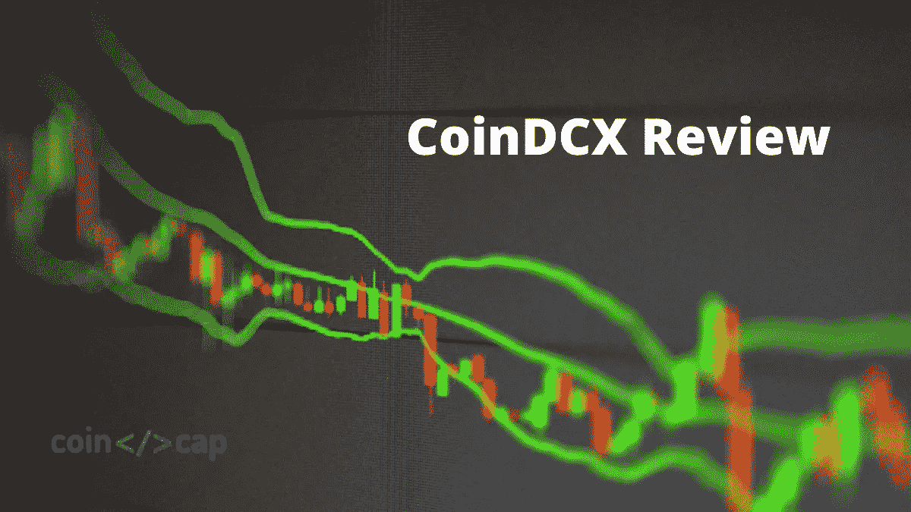
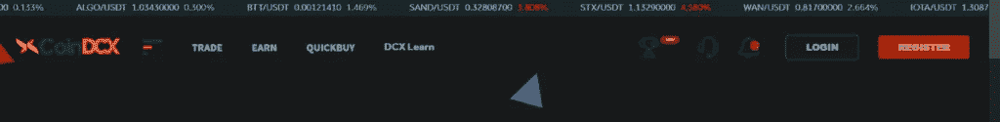
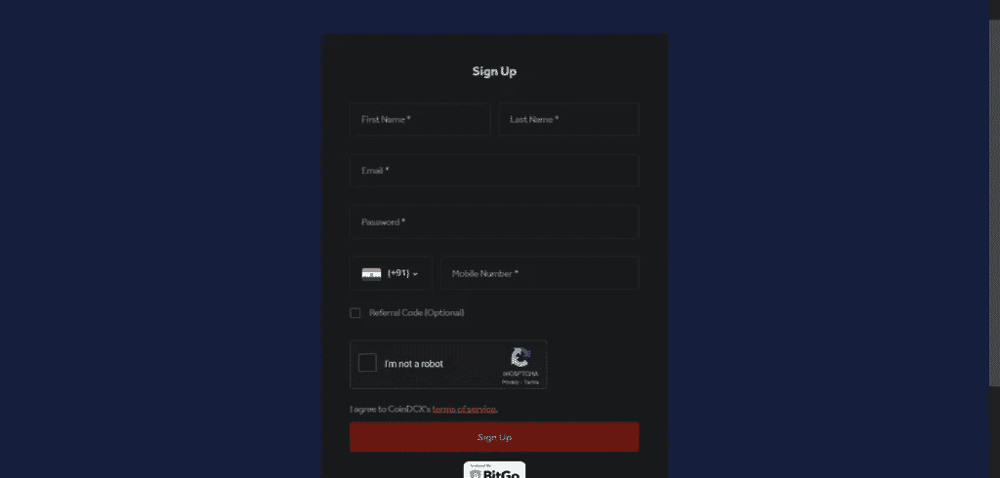
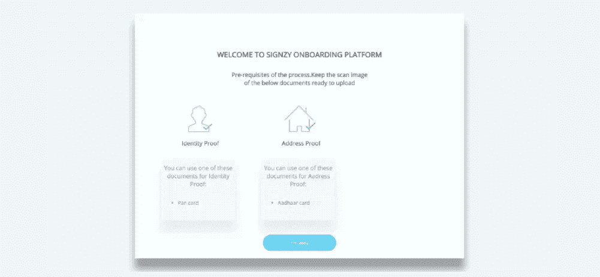
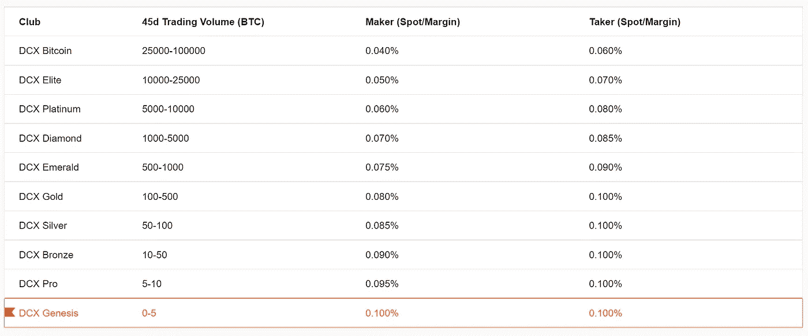
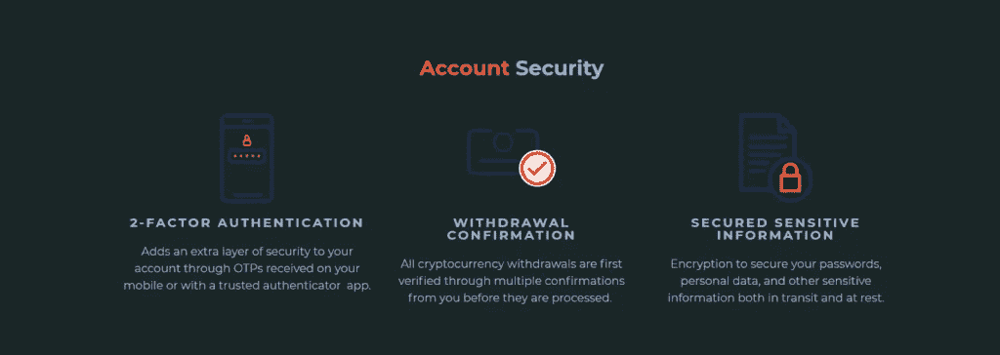

# CoinDCX 评论 2022 |安全吗？【必读】

> 原文：<https://medium.com/coinmonks/coindcx-review-8444db3621a2?source=collection_archive---------0----------------------->

无论你是一直从事加密货币交易，还是一个新手，你一定都遇到过 [CoinDCX](https://coindcx.com/signup?r=70297373$$Dxroxs&utm_medium=coincodecap&utm_campaign=coinmonks) 。特别是如果你在这里，并且正在阅读这篇文章，那就说明你正在考虑使用这个平台，对吗？所以，不浪费太多时间，让我们开始 CoinDCX 回顾。

# 概观

[CoinDCX](https://coindcx.com/signup?r=70297373$$Dxroxs&utm_medium=coincodecap&utm_campaign=coinmonks) 是一个加密货币交易平台，拥有超过 200 种不同类型的加密货币。它是一家总部位于新加坡的公司，自 2018 年以来一直很活跃。在印度，**coin dcx 办公室**位于孟买。

CoinDCX 的独特卖点是，他们提供了众多的密码，如比特币、以太坊和许多其他替代硬币。它意味着不同的 altcoin 交易者可以使用这个平台，而不必在其他地方徘徊。然而，这也是有代价的。众多的加密意味着可能会有更多的诈骗硬币，因为新推出的替代硬币不会有同样的审查。

CoinDCX 目前的主要投资者包括 Polychain、贝恩资本风险投资公司和 100x 风险投资公司。除了这三个主要投资者，CoinDCX 还有十个投资者，他们已经在三轮中筹集了 550 万美元。

# CoinDCX 审查:摘要

*   [CoinDCX](https://coindcx.com/signup?r=70297373$$Dxroxs&utm_medium=coincodecap&utm_campaign=coinmonks) 是最安全的加密货币交易平台，为用户的账户信息和交易提供了适当的安全功能。
*   它支持 200 多种密码。
*   即时买卖、用户友好的体验、无限制交易等功能使 CoinDCX 成为成千上万用户喜爱的平台。
*   CoinDCX 还有较低的交易和提现费用，吸引了用户。
*   它有 24 小时的客户支持。

# 如何在 CoinDCX 上创建账户？

## 第一步:访问网站

要创建一个帐户，你必须访问 CoinDCX 网页，点击注册开始注册过程。你会在右上角找到注册按钮，如截图所示。

## 第二步:填写详细信息进行注册

您必须填写您的详细信息，如姓名、电子邮件地址、电话号码等。填写完之后，点击注册选项。

## 步骤 3:电子邮件和电话号码验证

对于电子邮件验证，请检查您的电子邮件收件箱，查看您将从 CoinDCX 收到的验证链接。为了验证电话号码，您将收到一个动态口令。

## 步骤 4:核实银行账户

要验证您的银行帐户，您必须遵循以下步骤:

1.  点击右上角的个人资料图标，进入您的个人资料部分。
2.  你必须点击验证银行账户，它会重定向到一个新的屏幕。
3.  在新的屏幕上，填写所有的银行信息和其他信息。
4.  为了确认银行详细信息，您将收到一笔小额存款，并从您的帐户中提取一笔用于验证过程的金额。
5.  您必须输入一个 12 位的 UTR 号码，该号码将在银行帐户详细信息验证后收到。

## 步骤 5: KYC 验证(可选)

**CoinDCX 登录**过程很简单。因此，登录您的帐户开始 KYC 验证过程。如果你有 KYC 强制要求的所有文件，这个过程是没有麻烦的。

要完成此过程，您必须上传两个文档的图像:

1.  **潘卡**:这是你必须上传的强制性文件。
2.  **身份证**:可以使用身份证、选民证、护照中的任意一种证件。正反两面都上传。

请注意，使用许可证作为身份证现在不适用。对于国际用户，他们可以上传等效的当地政府 ID 进行验证。

# CoinDCX 提款

**根据用户是否进行了 KYC 验证，INR 中的 CoinDCX 最小取款**限额会有所不同。最大 INR 提款限额也是如此。

## KYC 验证的帐户

最小值为 Rs。500，最高每天 500000。如果金额超出自动限额，您也可以手动提取。

## 没有 KYC 验证的帐户

最小值为 Rs。500，类似于完全 KYC 的用户。不过和他们不一样的是，最大值只有 10000，作为 Max。交易价值高达 10，000 印度卢比。此外，如果交易超出自动限额，您可以手动撤销。

# CoinDCX 加密取款限额

拥有完整 KYC 验证的用户没有提款限制。同时，没有 KYC 验证的账户每天最多只能提取 4 个 BTC。

# CoinDCX 费用:交易和取款费用

交易和提现费用是一个平台至关重要的因素，也是获得新用户或失去原有用户的一个因素。

## CoinDCX 交易费用

每当你下单时，交易所向你收取一笔特定的费用，这叫做自由交易。它通常是您订单金额的一个相关百分比。CoinDCX 分别向接受者和制造者收取 0.04%和 0.06%的费用。

在这里，接受者是从订单簿中获取现有订单的人，而制定者是向订单簿中添加交易的人。该费用相对较低，低于行业平均水平，这给了用户另一个事实，即相比其他平台，他们更喜欢 CoinDCX。目前行业平均水平在 0.10% — 0.15%左右。

根据您的俱乐部，交易费用如下所示:

CoinDCX Tiered Fees

## CoinDCX 提款费

较低的交易费用被**的高额提现费用所克服。每提取一次 BTC，收费约为 0.001 BTC。与行业平均收费相比，这一取款金额较高。根据当前的行业平均水平，每 BTC 提款的提款量约为 0.0006 BTC。如果我们用百分比来说，那么 CoinDCX 的退出感觉比行业平均水平高出 60%。**

## **CoinDCX 存款**

**在 CoinDCX 中，用户可以立即存入印度卢比，而加密货币需要大约半个小时。提取 INR 最多需要 6 个小时才能存入您的银行账户，提取加密货币需要几分钟才能到达您的钱包。**

****

# **CoinDCX 评论:安全性**

**印度和全球最安全的[加密交易平台是](https://coincodecap.com/best-bitcoin-exchange-in-india) [CoinDCX](https://coindcx.com/signup?r=70297373$$Dxroxs&utm_medium=coincodecap&utm_campaign=coinmonks) 。该平台对用户的私人信息给予最高优先权，并且不与任何第三方共享 KYC 的详细信息。它包含业界领先的安全协议，定期维护和测试以检查任何违规行为。**

**它具有双重认证，为用户帐户增加了额外的安全级别。不仅如此，所有加密货币取款在处理之前都要经过多重验证过程，以避免任何欺诈取款。**

****

# **CoinDCX 贷款**

**顾名思义，[密码借贷](/coinmonks/top-5-crypto-lending-platforms-in-2020-that-you-need-to-know-a1b675cec3fa)是一种另类的投资形式。就加密货币而言，借贷意味着投资者以一定的利率向借款人出借加密货币。 [CoinDCX](https://coindcx.com/signup?r=70297373$$Dxroxs&utm_medium=coincodecap&utm_campaign=coinmonks) 借贷服务安全舒适。只需点击一下，你就可以借出最长 7 天的时间。还有，最高年利率 16.25%。**

# **CoinDCX 打桩**

**赌注是一种用户锁定加密货币以获得奖励的活动。可以和挖矿比。CoinDCX 平台向用户提供服务，以获得被动收入。要开始下注，您只需注册，持有受支持加密货币的最低余额，并有资格获得奖励。**

# **CoinDCX 评论:客户支持**

**根据 [CoinDCX](https://blog.coincodecap.com/go/coindcx) 的说法，为用户提供最好的服务是一个企业崛起和繁荣的关键。因此，他们拥有 24 小时支持的卓越客户服务。由于这种 24 小时支持，来自不同国家的用户不必担心时区。**

**诸如入职、INR 管理和票务等服务有 24 小时支持协助。还有，目前的电报时长和聊天时间是从早上 06:00 到晚上 11:00。**

**由于这些设施，用户可以在第二天解决任何问题，而无需等待数小时。CoinDCX 客户服务号码在他们的网站上不可用，但对于客户支持，您可以在 support@coindcx.com 给他们发邮件。**

# **CoinDCX 评论:利弊**

**看完所有因素和关键事实后，让我们总结一下，对 [CoinDCX](https://blog.coincodecap.com/go/coindcx) 有一个更清晰的了解。**

## **赞成的意见**

*   **可供交易的硬币种类繁多。**
*   **它在大量交易对中拥有充足的流动性。**
*   **交易费用很低，交易金额的最低限额也很低。**
*   **只需轻轻一点，你就可以立即进行买卖。**
*   **它的保证金交易大约是众多资产杠杆的 6 倍。**
*   **它接受像合众国际社和 IMPS 的付款方式。**
*   **持续和现场客户也在场即时回答问题。**
*   **期货交易的杠杆大约是 20 倍。**
*   **它可用于多种平台。**

## **骗局**

*   **印度卢比只是法定货币，没有其他选择。**
*   **您将需要验证更高的菲亚特价值。**

# **CoinDCX 审查:结论**

**有了上面提到的几点，你就很容易决定 [CoinDCX](https://blog.coincodecap.com/go/coindcx) 是否值得你花费时间和金钱。此外，你可以很容易地将这些因素与其他加密交易平台进行比较，以检查哪一个对你最有利。**

# **CoinDCX 评论:常见问题**

****coin dcx 安全吗？****

**是的，通过 CoinDCX 平台投资加密货币的每一只基金都是安全的。这个平台向用户保证，它支持每一项投资，并确保他们不会面临任何问题。**

****如何从 CoinDCX 取钱？****

**首次登录您的 CoinDCX 帐户。从 DCXtrade 页面选择资金部分，然后单击 INR Wallet。输入您想要提取的金额，并通过验证过程删除该金额。**

****KYC 在 CoinDCX 有必要吗？****

**完成 **CoinDCX KYC** 并不是强制性的。尽管如此，您的账户仍将被限制在每天 10，000 印度卢比或 4 BTC 加密货币的存款和取款总额内。**

****有没有 CoinDCX 的 app？****

**Ans。你可以从安卓设备的 play store 下载 [CoinDCX 应用](https://play.google.com/store/apps/details?id=com.coindcx&hl=en&utm_source=homepage&utm_medium=Fold10&utm_campaign=rebranding)。**

****在 CoinDCX 上开户必须用 Pan 卡吗？****

**Ans。在 CoinDCX 上开户不需要 Pan 卡。但是，您将需要它来验证 KYC。**

> **加入 Coinmonks [电报频道](https://t.me/coincodecap)和 [Youtube 频道](https://www.youtube.com/c/coinmonks/videos)获取每日[加密新闻](http://coincodecap.com/)**

## **另外，阅读**

*   **[复制交易](/coinmonks/top-10-crypto-copy-trading-platforms-for-beginners-d0c37c7d698c) | [加密税务软件](/coinmonks/crypto-tax-software-ed4b4810e338)**
*   **[网格交易](https://coincodecap.com/grid-trading) | [加密硬件钱包](/coinmonks/the-best-cryptocurrency-hardware-wallets-of-2020-e28b1c124069)**
*   **[密码电报信号](http://Top 4 Telegram Channels for Crypto Traders) | [密码交易机器人](/coinmonks/crypto-trading-bot-c2ffce8acb2a)**
*   **[NFT 十大市场造币集锦](https://coincodecap.com/nft-marketplaces)**
*   **[AscendEx Staking](https://coincodecap.com/ascendex-staking)|[Bot Ocean Review](https://coincodecap.com/bot-ocean-review)|[最佳比特币钱包](https://coincodecap.com/bitcoin-wallets-india)**
*   **[Bitget 评论](https://coincodecap.com/bitget-review)|[Gemini vs block fi](https://coincodecap.com/gemini-vs-blockfi)|[OKEx 期货交易](https://coincodecap.com/okex-futures-trading)**
*   **[美国最佳加密交易机器人](https://coincodecap.com/crypto-trading-bots-in-the-us) | [经常性评论](https://coincodecap.com/changelly-review)**
*   **[最佳加密交易所](/coinmonks/crypto-exchange-dd2f9d6f3769) | [印度最佳加密交易所](/coinmonks/bitcoin-exchange-in-india-7f1fe79715c9)**
*   **[开发者最佳加密 API](/coinmonks/best-crypto-apis-for-developers-5efe3a597a9f)**
*   **最佳[密码借贷平台](/coinmonks/top-5-crypto-lending-platforms-in-2020-that-you-need-to-know-a1b675cec3fa)**
*   **[杠杆代币](/coinmonks/leveraged-token-3f5257808b22)终极指南**