# CoinJar vs CoinSpot |澳洲加密交易所哪家最好？

> 原文：<https://medium.com/coinmonks/coinjar-vs-coinspot-3f5199a4f968?source=collection_archive---------1----------------------->

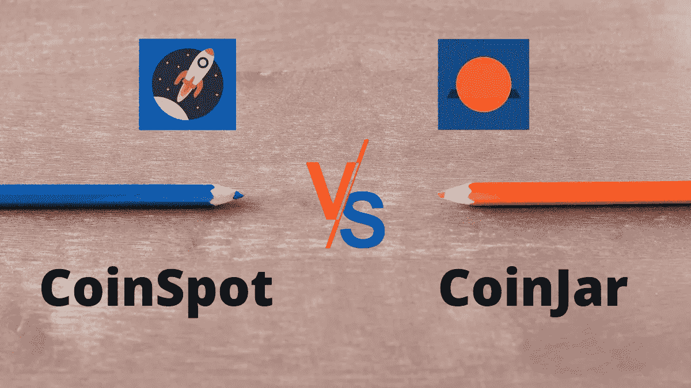

[**CoinSpot**](https://blog.coincodecap.com/go/coinspot) 和 [**CoinJar**](https://blog.coincodecap.com/go/coinjar) 是两个[流行的加密交易所](https://blog.coincodecap.com/crypto-exchange)，它们为您提供个性化账户或钱包，具有保护您数字资产的附加功能。它们是你进行小额交易和大规模交易的途径。这些平台将你的法定货币转换成加密货币，如[比特币](https://blog.coincodecap.com/a-candid-explanation-of-bitcoin)和以太坊。相当多的澳大利亚人和英国人使用 [CoinSpot](https://blog.coincodecap.com/go/coinspot) 和 [CoinJar](https://blog.coincodecap.com/go/coinjar) 进行加密货币交易。

在本文中，我们将帮助您配置、分析 [CoinJar](https://blog.coincodecap.com/go/coinjar) 和 [CoinSpot](https://blog.coincodecap.com/go/coinspot) 的优缺点，以便您选择适合自己的交换平台。

# CoinSpot vs CoinJar:总结(TL；博士)

[CoinJar](https://blog.coincodecap.com/go/coinjar) 和 [CoinSpot](https://blog.coincodecap.com/go/coinspot) 都是非常有名的[加密货币交易](https://blog.coincodecap.com/go/crypto-exchange)平台。我们过去已经写过 [CoinJar review](https://blog.coincodecap.com/coinjar-australia-review) 和 [CoinSpot review](https://blog.coincodecap.com/coinspot-review) 。许多澳大利亚人信任他们交易比特币。他们提供各种存款和订购方法以及多种加密货币。这两个平台都向用户收取交易费，并显示先进的价格监控图表。虽然两家交易所的目的都是帮助全球用户快速在线交易硬币，但它们主要关注澳大利亚和英国公民。

让我们快速看一下 [CoinJar](https://blog.coincodecap.com/go/coinjar) 和 [CoinSpot](https://blog.coincodecap.com/go/coinspot) 提供的设施:

## 硬币点

*   提供的加密货币数量为 260+。
*   支持的法定货币是澳元。
*   交易费 0.1% & 1%。
*   澳大利亚管理的金融部门监管货币现货交易。
*   接受的付款方式有 BPAY、里坡、PayID 和通过 BlueShyft 的现金。
*   除了使用 BPAY 或现金方式外，提款和存款金额没有限制。
*   多硬币钱包具有即时“购买和出售”功能。
*   你甚至可以在没有验证账户的情况下交换加密货币。
*   CoinSpot 的移动应用程序可以在 Android 和 iOS 上运行。

## 硬币罐

*   提供的加密货币数量为 24 种。
*   支持的法定货币是澳元和英镑。
*   相当于 0.2% & 1%的交易费用。
*   宣誓作证是免费的，但当用户使用 Blueshyft 时，它会收取 1.5%的费用。
*   适合机构以及个人投资者和交易者。
*   主网站上丰富的常见问题部分非常方便实用。
*   简单快速的 KYC 过程和双因素认证。
*   要获得帮助，您需要提交一张支持票。
*   接受的付款方式有 PayID、BPAY 和现金存款。
*   CoinJar 的移动应用程序可以在 Android 和 iOS 上运行。

既然您已经了解了这两个平台的特点，我们将更多地讨论 [**CoinSpot**](https://blog.coincodecap.com/go/coinspot) 和 [**CoinJar**](https://blog.coincodecap.com/go/coinjar) 的特性、比较和分析。

# 什么是 CoinSpot？

[**CoinSpot**](https://blog.coincodecap.com/go/coinspot) 是在澳大利亚诞生或制造的[密码交易所](https://blog.coincodecap.com/go/crypto-exchange)。他们是加密货币世界中著名的澳大利亚门户公司之一，这表明他们授权用法定货币投资加密。2013 年，该业务在墨尔本奠基。他们是 ADCA——澳大利亚数字商务协会的成员。ADCA 不是一个监管机构，但其成员仍然表现出对采用区块链技术的某种长期责任模式。

# CoinSpot 特征

*   消费者和经销商可以获得超过 280 种加密货币硬币。
*   要为您的 CoinSpot 帐户提供资金，您可以使用各种支付方式，如里坡、PayID、BPAY、直接存款，甚至现金存款。

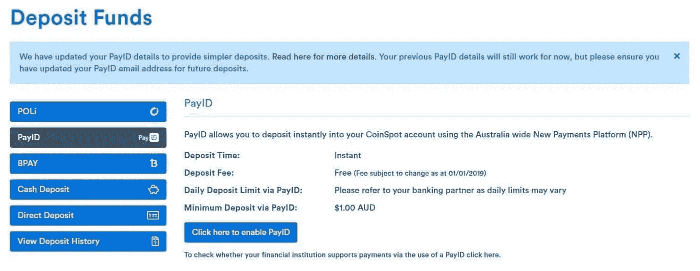

*   它具有行业领先的保护措施和 ISO 安全认证。
*   遵守合法化所必需的所有反洗钱法律。
*   它有双重认证来保护帐户免受网络朋克的攻击。
*   澳大利亚超级基金的投资者和消费者可以通过实时聊天获得柜台和 24/7 的帮助。
*   [**CoinSpot**](https://blog.coincodecap.com/go/coinspot) 提供即时购买&多种可转让的加密货币。

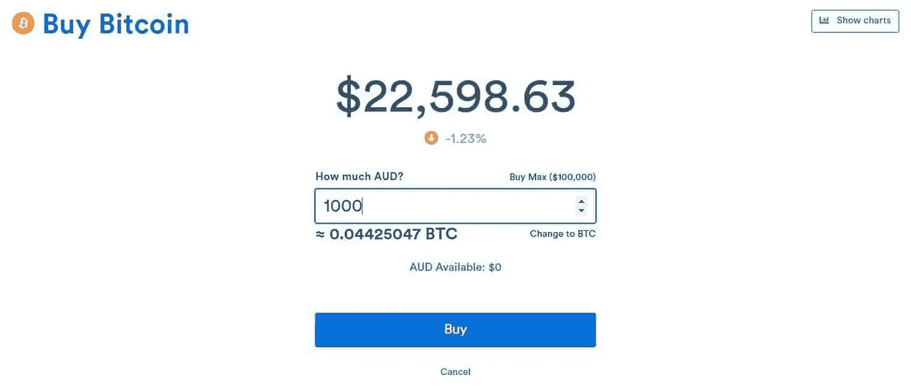

*   这是一个联合计划，为推荐用户提供 30%的佣金。
*   提供有 [TradingView](https://blog.coincodecap.com/go/tradingview) 图表和完善功能的交易策略。

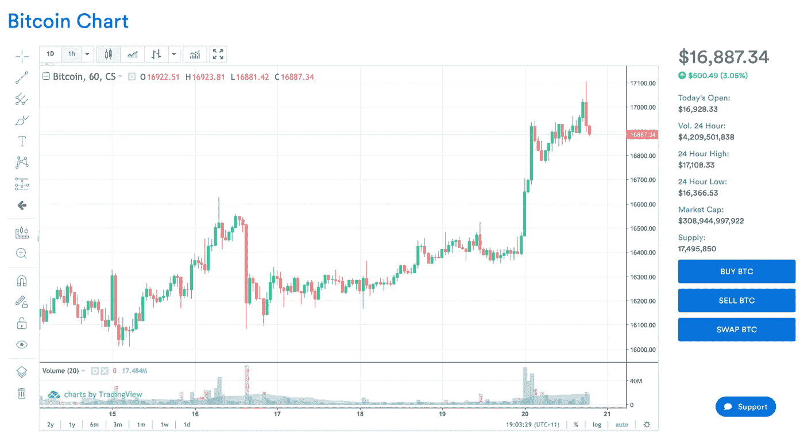

*   它具有用户友好的界面，以满足所有投资者和用户。

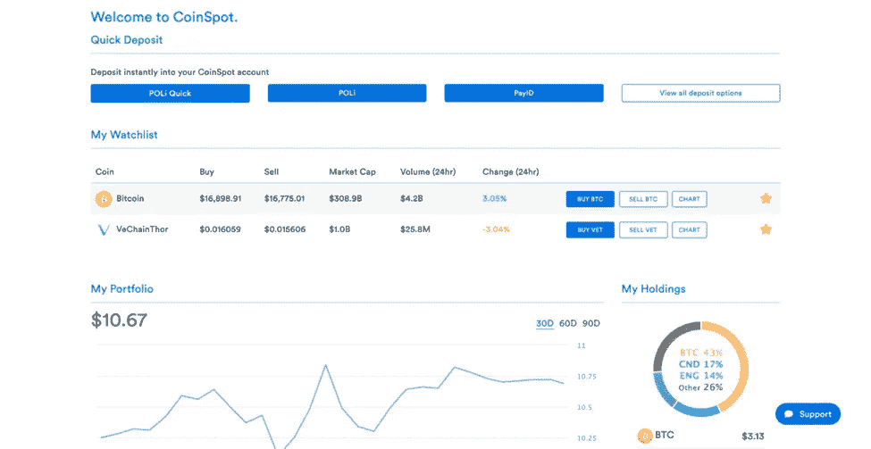

*   [**CoinSpot**](https://blog.coincodecap.com/go/coinspot) 为了您的方便，已经将热门资产分组打包。

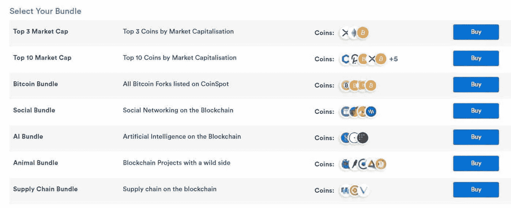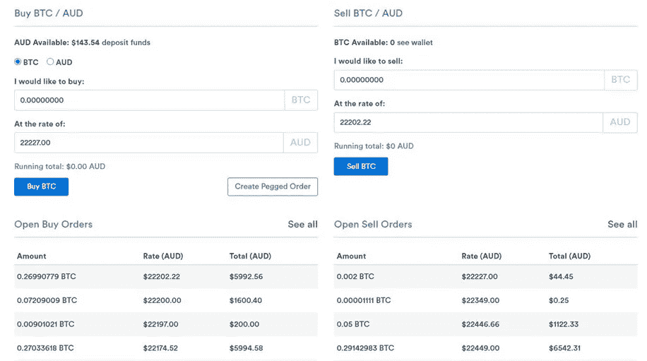

# 什么是 CoinJar？

2013 年在墨尔本成立的公司 [**CoinJar**](https://blog.coincodecap.com/go/coinjar) 允许澳大利亚人购买、出售、储存和使用比特币。由 Asher Tan 和 Ryan Zhou 创建，它实际上是一个“比特币业务和钱包提供商”，最好的描述是“下一代自己的金融账户”。在三年的创业过程中，CoinJar 已经获得了 70，000 多名忠实客户，参与了价值 1 亿美元的交易。

下面给出了 CoinJar 的一些特征，将有助于你仔细理解这个术语

*   在 CoinJar 上，你可以通过支付 1%的 CoinJar 费用来转换、购买和出售[比特币](https://blog.coincodecap.com/a-candid-explanation-of-bitcoin)。
*   要将澳元转入您的硬币罐，您必须首先验证您的 ID。即使您的 CoinJar 帐户未经验证，您仍然可以接收和发送比特币，但不会转移它们。

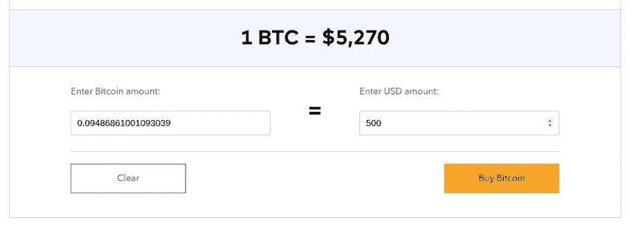

*   我们接受 PayID、BPAY 和 Blueshyft 存款等支付方式将您的澳元转入您的 CoinJar 账户。

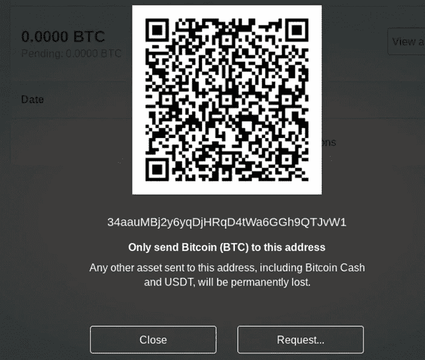

*   通过使用您的 [**CoinJar**](https://blog.coincodecap.com/go/coinjar) 账户，您可以快速将加密货币发送到近 196 个国家。
*   CoinJar 有一张名为“CoinJar Swipe”的 EFTPOS 卡，当你使用任何 EFTPOS 机进行购买时，它可以自动将你的比特币转换为澳元。
*   当您不希望积极实施价格监控，并希望保护您的资金免受价格波动的影响时，您可以激活 CoinJar 对冲账户。它允许您以替代货币形式(如美元、澳元、英镑、欧元)短暂存储您的加密货币。
*   通过使用您的 CoinJar 帐户，您可以快速将加密货币发送到近 196 个国家。
*   CoinJar 有一张名为“CoinJar Swipe”的 EFTPOS 卡，当你使用任何 EFTPOS 机进行购买时，它可以自动将你的比特币转换为澳元。
*   当您不希望积极实施价格监控，并希望保护您的资金免受价格波动的影响时，您可以激活 CoinJar 对冲账户。它允许您以替代货币形式(如美元、澳元、英镑、欧元)短暂存储您的加密货币。

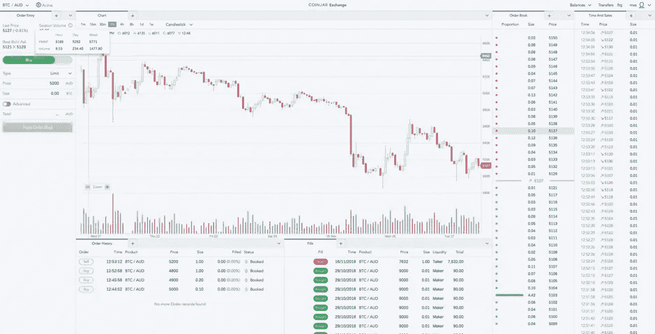

作为澳大利亚每个人都可以使用的两个广泛细致、历史悠久的加密产品，我们对 CoinSpot 和 CoinJar 之间的比较或区别有所了解，因此您可以决定合理地满足您的要求的交换。

# CoinSpot vs CoinJar:规则

作为一家独家澳大利亚公司， [**CoinSpot**](https://blog.coincodecap.com/go/coinspot) 是澳大利亚数字商务协会的合作伙伴，并遵守该地区的所有反洗钱法规。

不同的是， [**CoinJar**](https://blog.coincodecap.com/go/coinjar) 与 [AUSTRAC](https://www.austrac.gov.au/) 同列，但现在是注册英国业务。它还符合英国反洗钱和商业法规。

反洗钱(AML)法律意义重大，因为它们为管理战略提供了标准。两家公司都体现了他们在各自国家优先考虑客户保护的目标。所以 CoinJar 赢了这一轮。

# CoinSpot vs CoinJar:存款

您可以将三家著名的澳大利亚支出公司存入 CoinSpot，即里坡、BPAY 和 PayID。您还可以通过 Blueshyft 在澳大利亚主要城市的重要零售点存钱。

[**CoinJar**](https://blog.coincodecap.com/go/coinjar) ，通过差异，允许直接银行和电汇，以及加密货币沉淀和 Blueshyft。BPAY 是最广泛使用的方法，它要求快速的转账速度和高额的保险费用。

# CoinSpot vs CoinJar:安全性

[**CoinSpot**](https://blog.coincodecap.com/go/coinspot) 成为唯一一家持有 [ISO 27001](https://en.wikipedia.org/wiki/ISO/IEC_27001) 的澳大利亚密码企业——这意味着它是谨慎、安全地监督和保护关键证据的国际理想选择。他们还在智能手机上应用基本的双因素身份认证来签署交易。

[**CoinJar**](https://blog.coincodecap.com/go/coinjar) 另一方面，使用机器学习算法来理解可疑活动。就像 CoinSpot 一样，CoinJar 也隐含着双因素认证。然而，ISO 27001 地位是国际公认的黄金标准，这使得 CoinSpot 比 CoinJar 更胜一筹。

# CoinSpot vs CoinJar:移动友好

[**CoinSpot**](https://blog.coincodecap.com/go/coinspot) 不具备定制的移动功能。然而，该公司承认，他们的网站很容易理解，可以在任何一天通过任何智能手机上的网络浏览器使用，但它不像移动应用程序那样容易浏览。

**另一方面，CoinJar 在其移动应用程序中牢牢抓住基本策略稳定性，这在 Android 和 iOS 上均可使用。该应用程序完全一致，用户友好，可访问的所有 CoinJar 的目标，使 CoinJar 比 CoinSpot 更容易理解的用户谁是新的术语和含义。**

# **CoinSpot vs CoinJar:客户支持**

**CoinJar 使你有权发送电子邮件进行补贴。CoinSpot 通过 Zendesk(一个高效且有用的援助和帮助渠道，您会发现它很容易使用)运行其援助总部，并授权您进行支持证书记录和直接发送电子邮件。**

**CoinSpot 和 CoinJar 在快速提问的设置上都有广泛的 FAQ 类别，但由于 Zendesk 的存在，CoinSpot 更容易访问。**

# **CoinSpot vs CoinJar:费用**

**[CoinSpot](https://blog.coincodecap.com/go/coinspot) 对于许多成本来说都很重要，它在中心设置上精确地利用了即时战略，谴责了 1%的固定成本。CoinSpot 对 BPAY 证券收取 0.9%的费用，对 Blueshyft 货币沉淀收取 2.5%的费用。**

**CoinJar 还对其业务中的买卖收取 1%的费用，不过如果使用 BPAY，这一比例会降至 0.5%。从加密到加密的业务的税率为 0.1%。CoinJar 与 CoinSpot 的基本比较令人满意的是其证券，尽管 Blueshyft 和 BPAY 的比例分别为 1.5%和 0%。**

**如果我们及时区分他们的补偿程序，CoinJar 的费用要低得多。然而，在 CoinSpot 上发布市场法令是购买 Crypto 最便宜的选择，这让 CoinSpot 在 CoinJar 上占了上风。**

# **CoinSpot vs CoinJar:支持加密货币**

**[CoinSpot](https://blog.coincodecap.com/go/coinspot) 以要求大量加密货币而闻名，其既定的计划远远超过 150 种，包括所有重要的货币和许多其他替代货币。这包括[比特币](https://blog.coincodecap.com/a-candid-explanation-of-bitcoin)，以太坊，XRP，比特币现金，莱特币。**

**与此同时，CoinJar 最近将其贡献从 5 种扩大到 13 种(从 5 种加密货币到 13 种加密货币)。包括纳入恒星，0x 令牌，制造商戴，化合物和链环。**

**作为一个加密新手，人们可能会期望有购买和协商多种货币的选择。CoinSpot 给你一个合理的提名，让 CoinSpot 赢得他们应得的位置。**

**作为澳大利亚每个人都可以访问的两个广泛细致、历史悠久的加密商务，我们在 [CoinSpot](https://blog.coincodecap.com/go/coinspot) 和 [CoinJar](https://blog.coincodecap.com/go/coinjar) 之间的比较或区别中获得了一瞥，因此您可以决定合理地满足您的要求的交换。**

# **CoinSpot vs CoinJar:利弊**

**像所有的加密交换一样，CoinSpot 和 CoinJar 有优点也有缺点。让我们快速浏览一下汇总表:**

## **硬币点:利弊**

**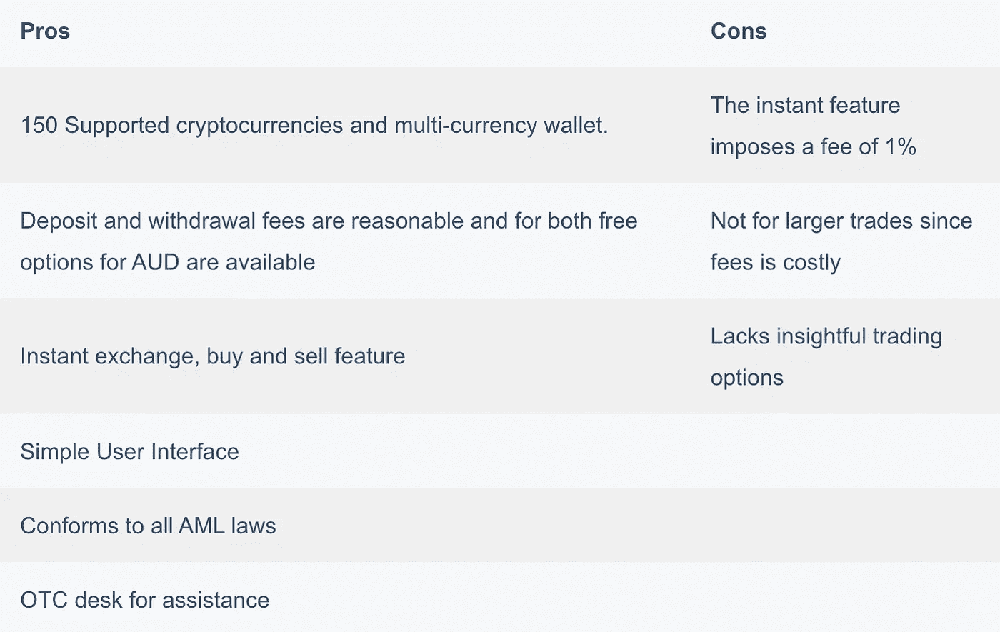**

## **硬币罐:利弊**

**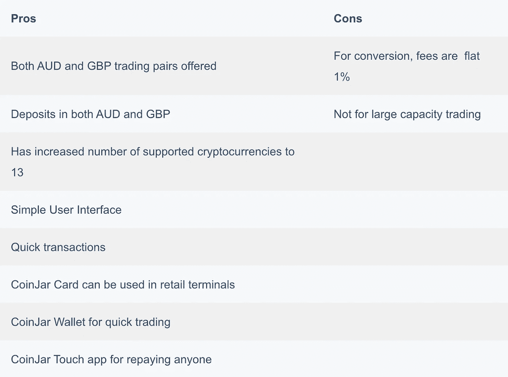**

# **CoinSpot vs CoinJar:结论**

**无论是 [**CoinSpot**](https://blog.coincodecap.com/go/coinspot) 还是 [**CoinJar**](https://blog.coincodecap.com/go/coinjar) 都是久负盛名的密码行业，拥有顶级的保护和可比的客户协助类别。如果你想交换各种各样的代币，那么 CoinSpot 是一个不错的选择，因为它拥有丰富的加密货币。CoinJar 总共支持 13 种加密货币，它们的支付很少令人满意，但它在频谱上无法竞争。**

**对于想进入加密领域的澳大利亚人来说，CoinSpot 被广泛采用和信任。它有大量的货币，最低的费用使它成为冠军。**

**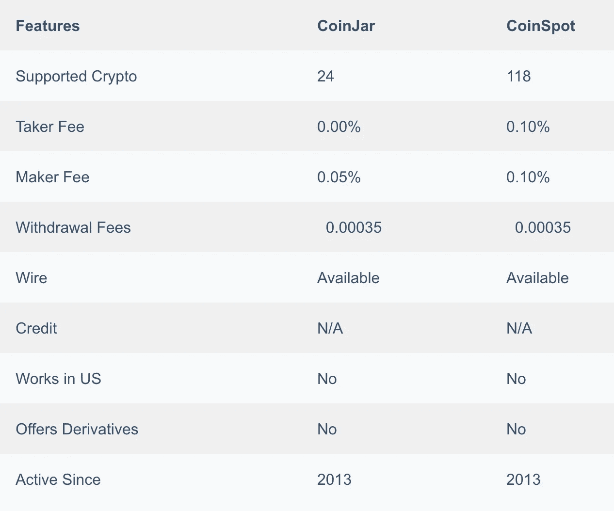**

# **常见问题**

****coin spot 安全吗？****

**该平台提出了一种多加密货币钱包操作以及内置的交易特性。CoinSpot 在其系统内拥有银行级别的保护和豁免权，这表明黑客入侵的可能性极小。您可以不受限制地将您的加密货币传输到其他平台或设备，只要您想，没有任何限制。**

****coin spot 取款需要多长时间？****

**12 个小时。CoinSpot 将在通过电子邮件认可隐私验证后发送大量货币和优惠券。虽然大部分硬币和代币的提取会被立即过滤，但撤退可能需要 12 个小时或更长时间。他们尝试净化一个人的撤回，并尽快在区块链上发表。**

****如何使用 CoinSpot？****

**下面给出了如何正确使用 CoinSpot 的详细步骤。
1。在 CoinSpot 网站上注册一个 CoinSpot 帐户。
2。证实或核实你的说法。
3。将澳元存入您的账户。
4。点击页面右上角的“购买或出售”按钮。
5。如果你想购买比特币，点击“购买 BTC ”;如果你想以澳元卖出比特币，点击“卖出 BTC”。
6。写下或点击您想要兑换 BTC 的澳元金额，然后点击“购买”7。在最后阶段之前调查详细信息，然后相应地点击“确认购买”。**

****coin jar 有多安全？****

**答:为了增强保证，CoinJar 意味着对钱包进行双因素身份验证和密码保护，至少 90%的客户和交易商的数字货币(或加密货币)离线存储在不同的地理冗余和舒适的防御位置。**

**CoinJar 基于哪里？**

**英国。CoinJar 成立于 2013 年，是一个在 AUSTRAC(澳大利亚交易报告和分析中心)注册的加密行业。它也是 CoinJar UK Limited 在英国注册的公司，目前总部设在英国。**

****coin jar 验证需要多长时间？****

**a-验证存款可能需要 1-3 个工作日才会出现在您的银行账户中。CoinJar 不会立即发送验证存款。请等待 3 个工作日。**

*   **[CoinSpot Review 2021 |交易费、转介和提款限额](https://blog.coincodecap.com/coinspot-review)**
*   **[CoinJar 澳洲评论 2021 |安全合法吗？](https://blog.coincodecap.com/coinjar-australia-review)**
*   **[Coinjar 英国评论:在英国购买密码【2021】](https://blog.coincodecap.com/coinjar-uk-review-buy-crypto-in-uk-2021)**
*   **[open node Review——仅支持比特币的支付服务](https://blog.coincodecap.com/opennode-review-a-bitcoin-only-payment-service)**
*   **[Digix 克服黄金数字化的三大挑战](https://blog.coincodecap.com/the-3-challenges-that-digix-overcomes-to-digitize-gold)**

> **加入 coin monks[Telegram group](https://t.me/joinchat/PmKOYQ9NNKZlZGNl)并了解加密交易和投资**

## **另外，阅读**

*   **最好的[加密交易机器人](/coinmonks/crypto-trading-bot-c2ffce8acb2a) | [网格交易机器人](https://blog.coincodecap.com/grid-trading)**
*   **[加密复制交易平台](/coinmonks/top-10-crypto-copy-trading-platforms-for-beginners-d0c37c7d698c) | [如何在 WazirX](/coinmonks/buy-bitcoin-on-wazirx-2d12b7989af1) 上购买比特币**
*   **[CoinLoan 点评](/coinmonks/coinloan-review-18128b9badc4)|[Crypto.com 点评](/coinmonks/crypto-com-review-f143dca1f74c) | [火币保证金交易](/coinmonks/huobi-margin-trading-b3b06cdc1519)**
*   **[尤霍德勒 vs 科恩洛 vs 霍德诺特](/coinmonks/youhodler-vs-coinloan-vs-hodlnaut-b1050acde55a) | [Cryptohopper vs 哈斯博特](https://blog.coincodecap.com/cryptohopper-vs-haasbot)**
*   **[杠杆代币](/coinmonks/leveraged-token-3f5257808b22) | [最佳密码交易所](/coinmonks/crypto-exchange-dd2f9d6f3769) | [Paxful 点评](/coinmonks/paxful-review-4daf2354ab70)**
*   **[加密套利](/coinmonks/crypto-arbitrage-guide-how-to-make-money-as-a-beginner-62bfe5c868f6)指南| [如何做空比特币](/coinmonks/how-to-short-bitcoin-568a2d0b4ae5) | [1xBit 回顾](https://blog.coincodecap.com/1xbit-review)**
*   **[如何在印度购买比特币？](/coinmonks/buy-bitcoin-in-india-feb50ddfef94) | [WazirX 审核](/coinmonks/wazirx-review-5c811b074f5b) | [BitMEX 审核](https://blog.coincodecap.com/bitmex-review)**
*   **[印度比特币交易所](/coinmonks/bitcoin-exchange-in-india-7f1fe79715c9) | [比特币储蓄账户](/coinmonks/bitcoin-savings-account-e65b13f92451)**
*   **[币安收费](/coinmonks/binance-fees-8588ec17965) | [Botcrypto 审查](/coinmonks/botcrypto-review-2021-build-your-own-trading-bot-coincodecap-6b8332d736c7) | [Hotbit 审查](/coinmonks/hotbit-review-cd5bec41dafb) | [KuCoin 审查](https://blog.coincodecap.com/kucoin-review)**
*   **[我的密码交易经验](/coinmonks/my-experience-with-crypto-copy-trading-d6feb2ce3ac5) | [购买硬币评论](https://blog.coincodecap.com/buycoins-review)**
*   **[逐位融资融券交易](/coinmonks/bybit-margin-trading-e5071676244e) | [币安融资融券交易](/coinmonks/binance-margin-trading-c9eb5e9d2116) | [超位审核](/coinmonks/overbit-review-9446ed4f2188)**
*   **[加密货币储蓄账户](/coinmonks/cryptocurrency-savings-accounts-be3bc0feffbf) | [YoBit 审查](/coinmonks/yobit-review-175464162c62) | [Bitbns 审查](/coinmonks/bitbns-review-38256a07e161)**
*   **[Botsfolio vs nap bots vs Mudrex](/coinmonks/botsfolio-vs-napbots-vs-mudrex-c81344970c02)|[gate . io 交流回顾](/coinmonks/gate-io-exchange-review-61bf87b7078f)**
*   **[最佳比特币保证金交易](/coinmonks/bitcoin-margin-trading-exchange-bcbfcbf7b8e3) | [萝莉点评](/coinmonks/lolli-review-e6ddc7895ad8) | [比特币保证金交易](https://blog.coincodecap.com/bityard-margin-trading)**
*   **[创造并出售你的第一个 NFT](https://blog.coincodecap.com/create-nft) | [本地比特币评论](/coinmonks/localbitcoins-review-6cc001c6ed56)**
*   **[加密保证金交易交易所](/coinmonks/crypto-margin-trading-exchanges-428b1f7ad108) | [赚取比特币](/coinmonks/earn-bitcoin-6e8bd3c592d9) | [Mudrex 投资](https://blog.coincodecap.com/mudrex-invest-review-the-best-way-to-invest-in-crypto)**
*   **[如何在印度购买以太坊？](https://blog.coincodecap.com/buy-ethereum-in-india) | [如何在币安购买比特币](https://blog.coincodecap.com/buy-bitcoin-binance)**
*   **[顶级付费加密货币和区块链课程](https://blog.coincodecap.com/blockchain-courses) | [币安评论](/coinmonks/binance-review-ee10d3bf3b6e)**
*   **[MXC 交易所评论](/coinmonks/mxc-exchange-review-3af0ec1cba8c) | [Pionex vs 币安](https://blog.coincodecap.com/pionex-vs-binance) | [Pionex 套利机器人](https://blog.coincodecap.com/pionex-arbitrage-bot)**
*   **[在美国如何使用 BitMEX？](https://blog.coincodecap.com/use-bitmex-in-usa) | [BitMEX 评论](https://blog.coincodecap.com/bitmex-review)**

***原载于 2021 年 4 月 19 日 https://blog.coincodecap.com***。****