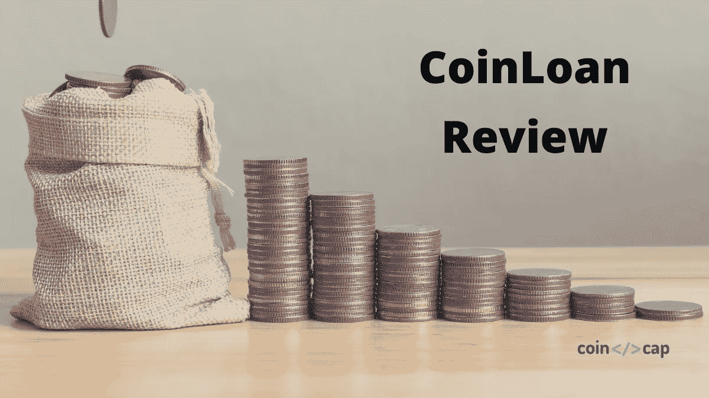
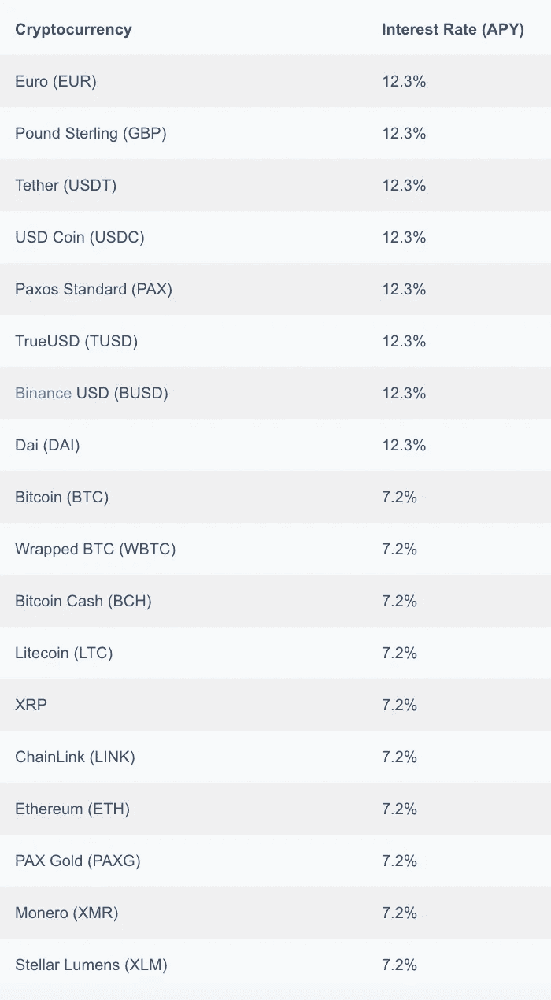
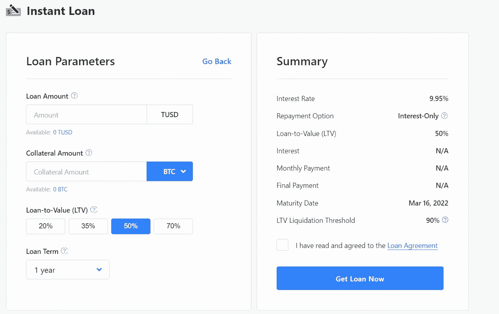
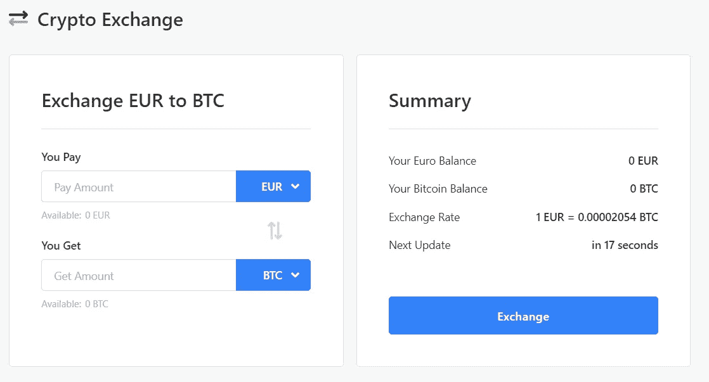

# CoinLoan Review |它对你来说合法和安全吗？

> 原文：<https://medium.com/coinmonks/coinloan-review-18128b9badc4?source=collection_archive---------3----------------------->

在本文中，我们将回顾 [**CoinLoan**](https://blog.coincodecap.com/go/coinloan) ，这是一个成立于 2017 年的加密借贷平台，目前在爱沙尼亚金融管理局的许可下运营。

他们提供即时贷款和高达 12.3%的加密货币、[稳定货币](https://blog.coincodecap.com/stablecoins-a-simple-overview)和法定货币利息。你也可以买卖和交换资产。这个平台非常安全。

*最初发布于*[*CoinCodeCap*](https://blog.coincodecap.com/coinloan-review)*。*

# CoinLoan 复查:摘要

*   [**CoinLoan**](https://blog.coincodecap.com/go/coinloan) 是一个 P2P 欧洲[加密借贷平台](https://blog.coincodecap.com/top-5-crypto-lending-platforms)。
*   它们允许您在 18 种受支持的加密货币、稳定硬币和法币上赚取高达 12.3%的每日复利。
*   CoinLoan 提供加密到法定贷款、加密到加密贷款和法定到加密贷款，具有独特的功能，如无锁定、灵活的还款计划和无信用历史检查。
*   你可以买卖和交换资产。他们还支持通过 SWIFT、SEPA、Visa、MasterCard、电汇和 AdvCash 进行菲亚特转账。
*   CoinLoan 提供了它的原生令牌 CLT。
*   他们提供了一个支持安卓系统和 iOS 系统的用户友好平台。
*   他们使用各种技术来保护他们的平台，并且对他们的安全实践完全透明。

# 共同贷款利息账户

[**CoinLoan**](https://blog.coincodecap.com/go/coinloan) 允许您将资金存入 [Coinloan 利息账户](https://blog.coincodecap.com/go/coinloan)，赚取复利。

## 特征

*   你的资金从来不会被锁定，你可以随时提取。
*   最短存款期限是一天。
*   利息以你存款的货币支付。
*   利息在每天 14:00 UTC 存入。复利将于每月第一天 15:00 UTC 时计入您的账户。
*   您存入的资金用于抵押贷款，这有助于 [**CoinLoan**](https://blog.coincodecap.com/go/coinloan) 向您支付利息。

下表显示了所有支持的加密货币的利率。价格包括 2%的 CLT 赌注奖励。

# 共同贷款借款

[**CoinLoan**](https://blog.coincodecap.com/go/coinloan) 提供针对加密货币、稳定货币和法定货币的贷款。贷款立即得到批准。不需要文书工作或信用历史检查，因为抵押资产是唯一重要的东西。申请贷款前必须完成 KYC 验证。

**LTV 比率**可以是 20%、35%、50%和 70%。LTV 越低，抵押品波动的程度越高。在降低 LTV 的主动贷款期间，担保金额也可以增加。

你的抵押品被安全地保存在保管处。根据 LTV 比率，利率从 4.95%到 11.95%不等。

贷款期限最短一个月，最长三年。所有资产的最低贷款额各不相同。你可以获得无限数量的贷款。所有关于你贷款的信息都在“我的贷款”部分。

你可以通过只支付已用时间的利息来更快地偿还贷款。并不强制要求用您收到贷款时使用的加密货币偿还贷款。没有罚款或锁定。

您将根据您的付款时间表收到通知和电子邮件。 [**CoinLoan**](https://blog.coincodecap.com/go/coinloan) 如果您的 CoinLoan 钱包中有资金，无法支付贷款，CoinLoan 会尝试自动还款。如果没有资金，他们会清算一部分你的抵押物来完成还款。

# 硬币加密交易所

[CoinLoan Crypto Exchange](https://coinloan.io/buy-sell-crypto/) 提供资产的购买、出售和交换。他们提供有竞争力的汇率。

菲亚特转让可以使用以下四个选项中的任何一个来完成

1.  SWIFT(全球可用)
2.  SEPA(针对欧元和欧元区公民)
3.  Visa 和 MasterCard(全球可用)
4.  AdvCash(除美国之外的全球可用)

[**CoinLoan**](https://blog.coincodecap.com/go/coinloan) 在某些[国家](https://help.coinloan.io/en/articles/4965132-supported-countries-for-usd-wire-transfers)还支持美元电汇。

# CoinLoan 令牌和用户体验

**CLT** 是 CoinLoan 的原生令牌，根据 [CoinMarketCap，](https://coinmarketcap.com/currencies/coinloan/)它目前的排名是 3046。 [**CoinLoan**](https://blog.coincodecap.com/go/coinloan) 提供了一个人性化的平台。他们也有一个移动应用程序来帮助你在旅途中管理你的资金。它们同时支持 [Android](https://play.google.com/store/apps/details?id=com.app.coinloan) 和 [iOS](https://apps.apple.com/us/app/coinloan-crypto-asset-wallet/id1506572788) 。

# CoinLoan 评论:安全性

[**CoinLoan**](https://blog.coincodecap.com/go/coinloan) 将大部分资金存放在冰冷的多签名钱包中。私钥不存储在联网设备中**。所有提款都是手动处理的，这可能会造成轻微的延迟，但可以提高安全性。**

所有的交易都是在离线设备上离线签署的，涉及几个人。CoinLoan 执行的所有操作都符合[加密货币安全标准(CCSS](https://cryptoconsortium.github.io/CCSS/Matrix/) )。

所有的资产都存放在 [BitGo](https://www.bitgo.com/) 里，有[劳埃德](https://www.lloydsbank.com/)的 1 亿美元保险。

密钥的加密部分存储在地理上分散的银行保险箱中。这保护了钥匙免受任何自然灾害，如洪水、火灾、地震等。

为了加密所有客户端到服务器的流量，他们使用 [SSL](https://www.ssl.com/faqs/faq-what-is-ssl/) 和 [TLS](https://www.cloudflare.com/learning/ssl/transport-layer-security-tls/) 1.3、 [DNSSEC](https://en.wikipedia.org/wiki/Domain_Name_System_Security_Extensions#:~:text=The%20Domain%20Name%20System%20Security,Internet%20Protocol%20(IP)%20networks.) 、 [HSTS](https://en.wikipedia.org/wiki/HTTP_Strict_Transport_Security) 。

他们使用[基于时间的一次性密码(TOTP)](https://en.wikipedia.org/wiki/Time-based_One-Time_Password) 对每次登录尝试、取款、密码重置和其他重要操作进行双重身份验证。

对基础设施进行全天候监控，以识别异常活动和系统错误。他们的服务器没有直接连接到互联网。此外，Bug Bounty 计划帮助他们分析漏洞或 Bug。

# 共同贷款费用

## 1.存款

加密货币的 CoinLoan 存款是免费的。除了使用 Visa/MasterCard 之外，定期存款也是免费的，收取 2 欧元+ 4.2%(从存款金额中扣除)。

## 2.撤回

法定货币和加密货币的 CoinLoan 提款是免费的。

## 3.清算

[**CoinLoan**](https://blog.coincodecap.com/go/coinloan) 清算费为已清算贷款抵押物的 7%。

## 4.借款费用

CoinLoan 借款费用是本金的 1%。如果您使用 CoinLoan Tokens (CLT)付款，您将获得 50%的借款费用折扣。剩余金额按市值折算成 CLT。

# CoinLoan 评论:客户支持

你可以通过 [support@coinloan.io](mailto:support@coinloan.io) 和 [corporate@coinloan.io](mailto:corporate@coinloan.io) 给他们写信。他们有一个互动的电报社区。

你也可以在推特上和他们联系。

此外，他们还有两个热线电话号码，分别是+372 634 6411 和+1(657)220–1706

# CoinLoan 评论:利弊

## 赞成的意见

1.  高利率
2.  高 LTV 比率
3.  灵活的还款选择
4.  全球可用
5.  支持通过 SWIFT、SEPA、Visa、MasterCard、电汇和 AdvCash 进行菲亚特转账。
6.  使用方便

## 骗局

1.  这是一个相对较新的平台。

# 共贷审查:结论

[**CoinLoan**](https://blog.coincodecap.com/go/coinloan) 是一个受监管的加密借贷平台。特色鲜明的即时贷款吸引用户。他们提供高 LTV 比率和灵活的还款选择。

此外，他们还提供无锁定的高利率资金。CoinLoan 采用各种措施确保平台完全安全。

# 常见问题(FAQ)

**信用贷款合法吗？**

CoinLoan 是爱沙尼亚金融管理局许可的加密借贷平台。他们有劳埃德保险公司 1 亿美元的保险，资产存放在 BitGo。这是一个安全的平台，可以安全使用。

**coin loan 提供什么样的贷款？**

CoinLoan 提供加密到法定贷款、加密到加密贷款和法定到加密贷款。

**在 CoinLoan 中执行任何交易时，是否必须完成 KYC 验证？**

是的，CoinLoan 是一个受监管的平台，需要完成 KYC 验证才能执行任何交易。只需要几分钟就可以完成。

**coin loan 支持菲亚特转账吗？**

是的，CoinLoan 支持通过 SWIFT、SEPA、Visa、MasterCard、电汇和 AdvCash 进行菲亚特转账。

**coin loan 是否为贷款审批执行任何信用历史检查？**

不，CoinLoan 根据抵押品立即批准贷款。不需要信用记录检查或文书工作。

*   [You hodler vs coin loan vs Hodlnaut【投资前阅读】](https://blog.coincodecap.com/youhodler-coinloan-hodlnaut)
*   [block fi vs Celsius vs Hodlnaut |利率、费用、安全和风险](https://blog.coincodecap.com/blockfi-vs-celsius-vs-hodlnaut)
*   [闪贷——无抵押借款](https://blog.coincodecap.com/web-stories/flash-loans-borrow-without-collateral)
*   [YouHodler 评论| 4 种轻松赚钱的方法](https://blog.coincodecap.com/youhodler-earn-crypto-interest)

> 加入 coin monks[Telegram group](https://t.me/joinchat/EPmjKpNYwRMsBI4p)学习加密交易和投资

## 另外，阅读

*   [什么是保证金交易](https://blog.coincodecap.com/margin-trading)
*   最好的[密码交易机器人](/coinmonks/crypto-trading-bot-c2ffce8acb2a) | [网格交易](https://blog.coincodecap.com/grid-trading)
*   [3 商业评论](/coinmonks/3commas-review-an-excellent-crypto-trading-bot-2020-1313a58bec92) | [Pionex 评论](/coinmonks/pionex-review-exchange-with-crypto-trading-bot-1e459d0191ea) | [Coinrule 评论](/coinmonks/coinrule-review-2021-a-beginner-friendly-crypto-trading-bot-daf0504848ba)
*   [AAX 交易所评论](/coinmonks/aax-exchange-review-2021-67c5ea09330c) | [德里比特评论](/coinmonks/deribit-review-options-fees-apis-and-testnet-2ca16c4bbdb2) | [FTX 交易所评论](/coinmonks/ftx-crypto-exchange-review-53664ac1198f)
*   [n 平均零点评审](/coinmonks/ngrave-zero-review-c465cf8307fc) | [Phemex 评审](/coinmonks/phemex-review-4cfba0b49e28) | [PrimeXBT 评审](/coinmonks/primexbt-review-88e0815be858)
*   [by bit Exchange Review](/coinmonks/bybit-exchange-review-dbd570019b71)|[bit yard Review](/coinmonks/bityard-review-7d104239be35)|[coin spot Review](https://blog.coincodecap.com/coinspot-review)
*   [3 commas vs crypto hopper](/coinmonks/3commas-vs-pionex-vs-cryptohopper-best-crypto-bot-6a98d2baa203)|[赚取秘密利息](/coinmonks/earn-crypto-interest-b10b810fdda3)
*   最好的比特币[硬件钱包](/coinmonks/the-best-cryptocurrency-hardware-wallets-of-2020-e28b1c124069?source=friends_link&sk=324dd9ff8556ab578d71e7ad7658ad7c) | [BitBox02 回顾](/coinmonks/bitbox02-review-your-swiss-bitcoin-hardware-wallet-c36c88fff29)
*   [莱杰 vs n rave](/coinmonks/ledger-vs-ngrave-zero-7e40f0c1d694)|[莱杰 nano s vs x](/coinmonks/ledger-nano-s-vs-x-battery-hardware-price-storage-59a6663fe3b0)
*   [密码本交易平台](/coinmonks/top-10-crypto-copy-trading-platforms-for-beginners-d0c37c7d698c)
*   [YouHodler 审查](/coinmonks/youhodler-4-easy-ways-to-make-money-98969b9689f2) | [BlockFi 审查](/coinmonks/blockfi-review-53096053c097)
*   最好的[加密税务软件](/coinmonks/best-crypto-tax-tool-for-my-money-72d4b430816b) | [硬币追踪评论](/coinmonks/cointracking-review-a-reliable-cryptocurrency-tax-software-5114e3eb5737)
*   最佳[加密借贷平台](/coinmonks/top-5-crypto-lending-platforms-in-2020-that-you-need-to-know-a1b675cec3fa) | [杠杆令牌](/coinmonks/leveraged-token-3f5257808b22)
*   [BlockFi vs 摄氏](/coinmonks/blockfi-vs-celsius-vs-hodlnaut-8a1cc8c26630) | [Hodlnaut 回顾](/coinmonks/hodlnaut-review-best-way-to-hodl-is-to-earn-interest-on-your-bitcoin-6658a8c19edf)
*   [Bitsgap 审查](/coinmonks/bitsgap-review-a-crypto-trading-bot-that-makes-easy-money-a5d88a336df2) | [Quadency 审查](/coinmonks/quadency-review-a-crypto-trading-automation-platform-3068eaa374e1) | [Bitbns 审查](/coinmonks/bitbns-review-38256a07e161)
*   [埃利帕尔泰坦评论](/coinmonks/ellipal-titan-review-85e9071dd029) | [赛克斯斯通评论](/coinmonks/secux-stone-hardware-wallet-review-15-discount-coupon-2020-7577032faa6e)
*   [本地比特币评论](/coinmonks/localbitcoins-review-6cc001c6ed56) | [加密货币储蓄账户](https://blog.coincodecap.com/cryptocurrency-savings-accounts)
*   最佳[区块链分析](https://bitquery.io/blog/best-blockchain-analysis-tools-and-software)工具| [赚比特币](/coinmonks/earn-bitcoin-6e8bd3c592d9)
*   [加密套利](/coinmonks/crypto-arbitrage-guide-how-to-make-money-as-a-beginner-62bfe5c868f6)指南| [如何做空比特币](/coinmonks/how-to-short-bitcoin-568a2d0b4ae5)
*   最佳[加密制图工具](/coinmonks/what-are-the-best-charting-platforms-for-cryptocurrency-trading-85aade584d80) | [最佳加密交易所](/coinmonks/crypto-exchange-dd2f9d6f3769)
*   [如何在印度购买比特币？](/coinmonks/buy-bitcoin-in-india-feb50ddfef94) | [瓦济克斯审查](/coinmonks/wazirx-review-5c811b074f5b)
*   [印度比特币交易所](/coinmonks/bitcoin-exchange-in-india-7f1fe79715c9) | [比特币储蓄账户](/coinmonks/bitcoin-savings-account-e65b13f92451)
*   [CoinDCX 评论](/coinmonks/coindcx-review-8444db3621a2) | [加密保证金交易交易所](https://blog.coincodecap.com/crypto-margin-trading-exchanges)

> [在您的收件箱中直接获得最佳软件交易](/coinmonks/newsletters/coinmonks)

*原载于 2021 年 3 月 22 日*[*【https://blog.coincodecap.com】*](https://blog.coincodecap.com/coinloan-review)*。*