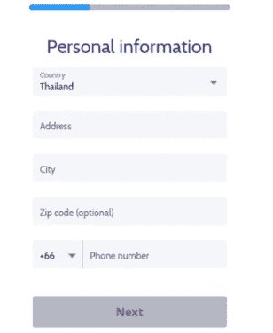

# Coinmama 评论 2021 |买卖比特币和加密货币

> 原文：<https://medium.com/coinmonks/coinmama-review-ace5641bde6e?source=collection_archive---------5----------------------->

在本文中，我们将回顾 [**Coinmama**](https://blog.coincodecap.com/go/coinmama) ，这是一个用于买卖比特币和其他加密货币的[加密交易所](https://blog.coincodecap.com/go/crypto-exchange)。

# Coinmama 是什么？

[**Coinmama**](https://blog.coincodecap.com/go/coinmama) 是一家总部位于以色列的在线[加密货币交易平台](https://blog.coincodecap.com/crypto-exchange)买卖加密货币。这个交流平台从 2013 年就有了。它被创建来构建最简单明了的[加密交换](https://blog.coincodecap.com/go/crypto-exchange)平台。自 2013 年以来，它已在 197 个国家拥有约 220 万活跃用户。

许多用户正在使用它，因为它的快速验证过程，许多支付方式，以及在如此多的国家的可用性。另一个关键的、令人震惊的发现是，美国居民也可以使用它。

虽然这些服务是有限的，但与许多加密交易所不同，它在美国是可用的。

[**Coinmama**](https://blog.coincodecap.com/go/coinmama) 属于最早支持用信用卡和借记卡购买[比特币](https://blog.coincodecap.com/a-candid-explanation-of-bitcoin)的人。尽管 [Coinmama](https://blog.coincodecap.com/go/coinmama) 没有像[保证金交易](https://blog.coincodecap.com/margin-trading)这样的交易选项，但用户发现它很有吸引力，并且更喜欢它。用户更喜欢它的原因之一是因为他们不断添加加密货币和替代支付方式。

# Coinmama 回顾:总结(TL；博士)

*   注册和验证过程非常简单，只需有限的时间即可完成。
*   [**Coinmama**](https://blog.coincodecap.com/go/coinmama) 提供加密市场中最流行、最受人们喜爱的加密货币。
*   它以多种语言提供客户支持，覆盖全球。
*   [Coinmama](https://blog.coincodecap.com/go/coinmama) 可在全球 197 个国家使用，包括美国公民。它服务于美国 43 个州。
*   相对于其他交易平台，[币妈妈](https://blog.coincodecap.com/go/coinmama)涨停最高。
*   用户有多种支付方式进行存取款，包括信用卡和借记卡。
*   它立即将密码发送到用户的密码钱包中。

# 如何入门 Coinmama？

要在 [**Coinmama**](https://blog.coincodecap.com/go/coinmama) 上开立或注册账户，请仔细遵循以下流程。

**第一步:**访问 [Coinmama 主页](https://blog.coincodecap.com/go/coinmama)，点击页面右上角的注册按钮。

**第二步:**将出现一个页面，要求您填写详细信息。输入你的电子邮件 id，设置一个强密码，输入你的国家，然后点击注册按钮浏览详细信息。

# Coinmama 验证流程

一旦用户在 [**Coinmama**](https://blog.coincodecap.com/go/coinmama) 上拥有帐户，他们将提示用户完成他们的个人资料。这个过程就是 **Coinmama 验证**过程。要完成这项工作，你需要以下文件:政府颁发的身份证，和带摄像头的手机。当您满足这两个标准时，请遵循以下步骤:

点击“完成我的个人资料”,如图所示。

现在，他们会要求你输入你的全名，性别和出生日期。填写完毕后，点击“下一步”

下一步，输入居住的国家、地址和电话号码。完成后，点击“下一步”

现在到了 KYC 的部分。首先，您必须从下拉列表中选择您的政府 ID 类型和发行国家。选择后，输入您的身份证号码和有效期。完成后点击“下一步”。

在这一步，你必须上传你的文件。确保

*   拐角是可见的。
*   图像是彩色的，不模糊。
*   文本是可读的。

点击“看起来不错”了解更多步骤。

接下来是自拍时间。点击您的照片，上面有您在上一步上传的身份证。另外，您的图像还应该包含一张写有 COinmama 和今天日期的纸。

**确保**

*   照片中你的整张脸都清晰可见。
*   您的身份证上的图像和文字是可见和可读的。
*   图像上有身份证和纸币。

点击“好看”完成最后一步。

最后一步是邮件验证。转到您的邮件收件箱，打开 Coinmama 验证邮件。点击“确认您的电子邮件”以完成验证过程。

通常情况下， **Coinmama 验证时间为 30 分钟**。这是市场上最快的时间。

# Coinmama 费用

可见的 [**Coinmama**](https://blog.coincodecap.com/go/coinmama) 加密价格基于 TradeBlock XBX 服务。TradeBlock XBX 列出了已知的提供商费率，该平台总计为 2%。它还包括约 3.9%的 Coinmama 佣金。

## 购买费用

购买订单的费用取决于支付方式和用户的忠诚度。总而言之，我们可以说:

*   它对使用信用卡和借记卡收取 5.0%的额外动量费。
*   通过 SEPA 银行转账没有额外的费用。
*   对于通过 SWIFT 银行进行用户转账的 1000 美元以上的订单，它也不收取任何额外费用。如果订单低于 1000 美元，用户需要支付 20 英镑。

## 销售费用

销售还与用户的忠诚度计划级别相关。费率的计算包括 XBX 指数平均值 2%(标准差)和 [**Coinmama**](https://blog.coincodecap.com/go/coinmama) 销售费用之和(介于 0.1%和 0.9%之间)。基于忠诚度计划的费用为:

*   2.9%为好奇级别，即常规账户。
*   对于密码爱好者或 2 级用户为 2.5%。
*   2.1%的加密信徒或 3 级用户。

# Coinmama 评论:支持的加密货币

[**Coinmama**](https://blog.coincodecap.com/go/coinmama) 支持以下加密货币:[比特币](https://blog.coincodecap.com/a-candid-explanation-of-bitcoin) (BTC)、以太坊(ETH)、莱特币(LTC)、比特币现金(BCH)、卡尔达诺(ADA)、Tezos (XTZ)、EOS (EOS)、Qtum (QTUM)、以太坊经典(ETC)。

该交易平台还允许用户购买美元、英镑、欧元、澳元、日元和加元等多种货币。

# Coinmama 评论:付款方式

[**Coinmama**](https://blog.coincodecap.com/go/coinmama) 是首批[加密货币交易所](https://blog.coincodecap.com/go/crypto-exchange)之一，提供信用卡作为购买比特币的支付方式。虽然没有 PayPal 选项，但其他可用的方法有:

*   迅速的
*   欧洲银行
*   更快的支付(英国银行)
*   签证
*   万事达信用卡
*   信用卡
*   银行汇款

您将需要一个可以使用的数字钱包，因为**硬币妈妈钱包**不可用，并且不容纳硬币。

# 硬币妈妈评论:购买限额

[**Coinmama**](https://blog.coincodecap.com/go/coinmama) 交易限额取决于一些因素，如法规、用户的支付方式和验证级别。适用的限制在 24 小时或 30 天后重置，具体取决于帐户。虽然 Coinmama 限制交易，但与其他平台相比，限制值很高。以下是限制的详细信息:

**比特币限额:**比特币最低买入限额为 0.1 BTC。

**账户限额:**账户限额取决于用户的账户验证等级。

*   **验证级别 1:** 该级别的账户限额为 15000 美元。而通过信用卡和银行转账的每日限额分别为 5000 美元和 12000 美元。此外，每月限额为 15，000 美元。
*   **验证级别 2:** 在级别 2，用户的账户有 50，000 美元的限额。而通过信用卡和银行转账的每日限额分别为 5000 美元和 30000 美元。每月限额为 30，000 美元。
*   **验证三级:**在这个级别，对账户没有限制。然而，信用卡和银行转账的限额分别为 7500 美元和 30000 美元。信用卡/借记卡和银行转账的每月限额分别为 40，000 美元和 100，000 美元。

# Coinmama 评论:隐私和安全

[**Coinmama**](https://blog.coincodecap.com/go/coinmama) 以高度的安全性保护客户及其资产。以下是它采取的安全措施:

*   **KYC 过程:**对所有用户的账户进行 KYC 或验证过程，以最大限度地减少欺诈。
*   **信用卡详细信息:** Coinmama 不持有任何用户的信用卡或借记卡或银行详细信息。

由于 Coinmama 既不存储客户详细信息，也不在 exchange 上保存密码，因此不需要双因素身份验证。然而，Coinmama 确实要求其用户在任何钱包应用程序上启用双重认证。

# Coinmama 评论:客户支持

**Coinmama 支持多语言的**客户服务。它有一个专门的帮助中心，在那里你也可以使用搜索选项找到你的问题的答案。另一种选择是提交请求。点击[此处](https://support.coinmama.com/hc/en-us/requests/new?ticket_form_id=190869)提交任何报告。

你也可以发电子邮件给 support@coinmama.com。它们会在 24 小时内归还给您。用户也可以使用 Coinmama 的[脸书](https://www.facebook.com/Coinmama/)页面，通过脸书信使提交查询。Coinmama 的其他社交媒体平台有 [Twitter](https://twitter.com/coinmama) 、 [LinkedIn](https://www.linkedin.com/company/coinmama/) 和 [Instagram](https://www.instagram.com/coinmamaofficial/) 。

# Coinmama 评论:利弊

## 赞成的意见

*   它支持并提供用户最喜欢的各种加密货币。
*   用户无需支付任何额外费用即可从 [**Coinmama**](https://blog.coincodecap.com/go/coinmama) 中提取硬币。
*   KYC 验证过程在几个小时内完成。
*   该平台用户友好，支持新手和高投资者。
*   它提供多种法定货币来购买密码。
*   它能立即交付硬币。
*   Coinmama 非常重视安全性。
*   出色的多语言客户支持。

## 骗局

*   交换平台不可用于交易比特币和加密货币。
*   不支持出售除比特币以外的其他加密货币。
*   KYC 验证是购买和销售密码的强制性要求。
*   高收费。
*   **Coinmama app** 不可用。

# Coinmama 审查:结论

[**Coinmama**](https://blog.coincodecap.com/go/coinmama) 平台自 2013 年就已存在，这使其成为最古老的[加密货币交易所](https://blog.coincodecap.com/go/crypto-exchange)之一。由于其安全性，它已经获得了数百万用户，用户可以快速买卖加密货币。另一个吸引人的特点是快速交付硬币。因此，无需等待数小时或数天就可以开始买卖加密货币。

尽管它接受信用卡和借记卡，但与其他平台相比，费用相对较高。但是，用户可以免费提取任何额外的费用。 [**Coinmama**](https://blog.coincodecap.com/go/coinmama) 是一个简单而安全的平台，这个平台还在继续增长，并且很有竞争力。

# 常见问题

**coin mama 安全吗？**

是的，Coinmama 是一家安全、声誉良好的公司，拥有令人印象深刻的支持。它拥有来自 197 个不同国家的 220 多万活跃用户，其中包括美国公民。这个数据充分说明了 Coinmama 是合法且安全的。

**coin mama 验证需要多长时间？**

验证用户的文档只需要 30 分钟到几个小时。这是任何人从任何其他平台获得的最快的 KYC 验证。

**如何验证 Coinmama？**

Coinmama 的验证过程包括提交您的文件，如政府颁发的身份证。在提交文件时，您还需要上传您的文件照片和包含一些详细信息的页面。

**如何删除 Coinmama 账号？**

Coinmama 的删除过程很简单。登录您的 Coinmama 帐户，点击“我的个人资料”，然后点击“关闭帐户”。这样，你就可以删除它。

*   [如何选购以太坊？【2021 年版】](https://blog.coincodecap.com/how-to-buy-ethereum)
*   [2021 年如何在币安购买比特币？](https://blog.coincodecap.com/buy-bitcoin-binance)
*   [币安保证金交易 2021 |你需要知道的一切](https://blog.coincodecap.com/binance-margin-trading)
*   [币安费用:完整指南(适用于美国币安和币安)](https://blog.coincodecap.com/binance-fees)
*   [CoinDCX 评论 2021 |安全吗？【必读】](https://blog.coincodecap.com/coindcx-review)

> 加入 coin monks[Telegram group](https://t.me/joinchat/EPmjKpNYwRMsBI4p)学习加密交易和投资

## 另外，阅读

*   [什么是融资融券交易](https://blog.coincodecap.com/margin-trading)
*   最好的[密码交易机器人](/coinmonks/crypto-trading-bot-c2ffce8acb2a) | [网格交易](https://blog.coincodecap.com/grid-trading)
*   [3 商业评论](/coinmonks/3commas-review-an-excellent-crypto-trading-bot-2020-1313a58bec92) | [Pionex 评论](/coinmonks/pionex-review-exchange-with-crypto-trading-bot-1e459d0191ea) | [Coinrule 评论](/coinmonks/coinrule-review-2021-a-beginner-friendly-crypto-trading-bot-daf0504848ba)
*   [AAX 交易所评论](/coinmonks/aax-exchange-review-2021-67c5ea09330c) | [德里比特评论](/coinmonks/deribit-review-options-fees-apis-and-testnet-2ca16c4bbdb2) | [FTX 交易所评论](/coinmonks/ftx-crypto-exchange-review-53664ac1198f)
*   [n rave 零点回顾](/coinmonks/ngrave-zero-review-c465cf8307fc) | [Phemex 回顾](/coinmonks/phemex-review-4cfba0b49e28) | [PrimeXBT 回顾](/coinmonks/primexbt-review-88e0815be858)
*   [Bybit Exchange 审查](/coinmonks/bybit-exchange-review-dbd570019b71) | [Bityard 审查](/coinmonks/bityard-review-7d104239be35) | [CoinSpot 审查](https://blog.coincodecap.com/coinspot-review)
*   [3 commas vs crypto hopper](/coinmonks/3commas-vs-pionex-vs-cryptohopper-best-crypto-bot-6a98d2baa203)|[赚取加密利息](/coinmonks/earn-crypto-interest-b10b810fdda3)
*   最好的比特币[硬件钱包](/coinmonks/the-best-cryptocurrency-hardware-wallets-of-2020-e28b1c124069?source=friends_link&sk=324dd9ff8556ab578d71e7ad7658ad7c) | [BitBox02 回顾](/coinmonks/bitbox02-review-your-swiss-bitcoin-hardware-wallet-c36c88fff29)
*   [莱杰 vs n 格拉夫](/coinmonks/ledger-vs-ngrave-zero-7e40f0c1d694) | [莱杰纳米 s vs x](/coinmonks/ledger-nano-s-vs-x-battery-hardware-price-storage-59a6663fe3b0)
*   [密码本交易平台](/coinmonks/top-10-crypto-copy-trading-platforms-for-beginners-d0c37c7d698c)
*   [CoinLoan 评论](/coinmonks/coinloan-review-18128b9badc4) | [YouHodler 评论](/coinmonks/youhodler-4-easy-ways-to-make-money-98969b9689f2) | [BlockFi 评论](/coinmonks/blockfi-review-53096053c097)
*   最好的[加密税务软件](/coinmonks/best-crypto-tax-tool-for-my-money-72d4b430816b) | [硬币追踪评论](/coinmonks/cointracking-review-a-reliable-cryptocurrency-tax-software-5114e3eb5737)
*   最佳[加密借贷平台](/coinmonks/top-5-crypto-lending-platforms-in-2020-that-you-need-to-know-a1b675cec3fa) | [杠杆令牌](/coinmonks/leveraged-token-3f5257808b22)
*   [block fi vs Celsius](/coinmonks/blockfi-vs-celsius-vs-hodlnaut-8a1cc8c26630)|[Hodlnaut 评论](/coinmonks/hodlnaut-review-best-way-to-hodl-is-to-earn-interest-on-your-bitcoin-6658a8c19edf)
*   [Bitsgap 评审](/coinmonks/bitsgap-review-a-crypto-trading-bot-that-makes-easy-money-a5d88a336df2) | [Quadency 评审](/coinmonks/quadency-review-a-crypto-trading-automation-platform-3068eaa374e1) | [Bitbns 评审](/coinmonks/bitbns-review-38256a07e161)
*   [埃利帕尔泰坦评论](/coinmonks/ellipal-titan-review-85e9071dd029) | [赛克斯斯通评论](/coinmonks/secux-stone-hardware-wallet-review-15-discount-coupon-2020-7577032faa6e)
*   [本地比特币评论](/coinmonks/localbitcoins-review-6cc001c6ed56) | [加密货币储蓄账户](https://blog.coincodecap.com/cryptocurrency-savings-accounts)
*   最佳[区块链分析](https://bitquery.io/blog/best-blockchain-analysis-tools-and-software)工具| [赚比特币](/coinmonks/earn-bitcoin-6e8bd3c592d9)
*   [加密套利](/coinmonks/crypto-arbitrage-guide-how-to-make-money-as-a-beginner-62bfe5c868f6)指南| [如何做空比特币](/coinmonks/how-to-short-bitcoin-568a2d0b4ae5)
*   最佳[加密制图工具](/coinmonks/what-are-the-best-charting-platforms-for-cryptocurrency-trading-85aade584d80) | [最佳加密交易所](/coinmonks/crypto-exchange-dd2f9d6f3769)
*   [如何在印度购买比特币？](/coinmonks/buy-bitcoin-in-india-feb50ddfef94) | [瓦济克斯审查](/coinmonks/wazirx-review-5c811b074f5b)
*   [印度比特币交易所](/coinmonks/bitcoin-exchange-in-india-7f1fe79715c9) | [比特币储蓄账户](/coinmonks/bitcoin-savings-account-e65b13f92451)
*   [CoinDCX 评论](/coinmonks/coindcx-review-8444db3621a2) | [加密保证金交易交易所](https://blog.coincodecap.com/crypto-margin-trading-exchanges)

> [直接在您的收件箱中获得最佳软件交易](/coinmonks/newsletters/coinmonks)

*最初发表于 2021 年 4 月 6 日 https://blog.coincodecap.com***。**