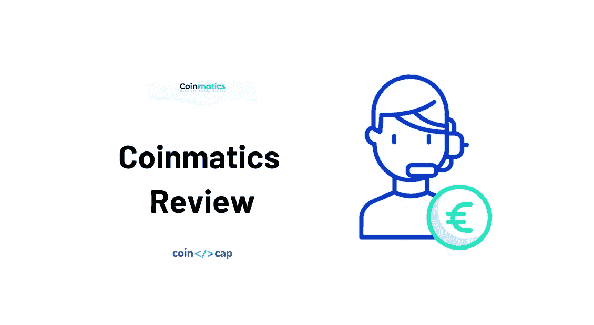
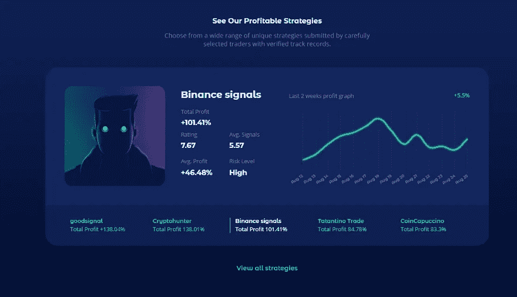
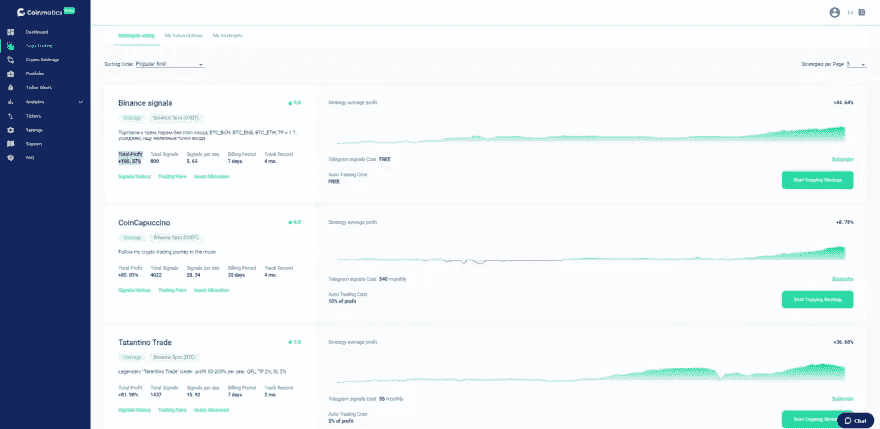
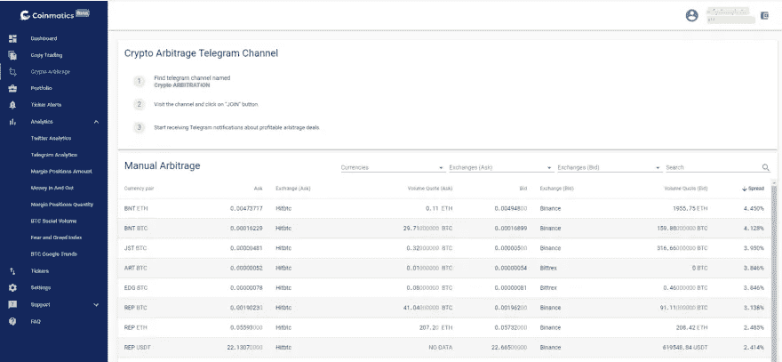
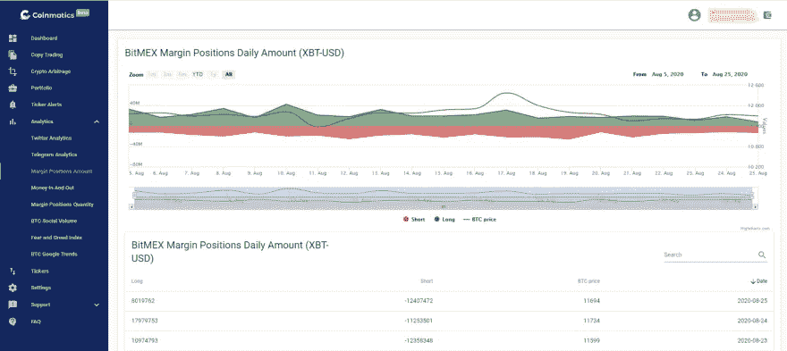
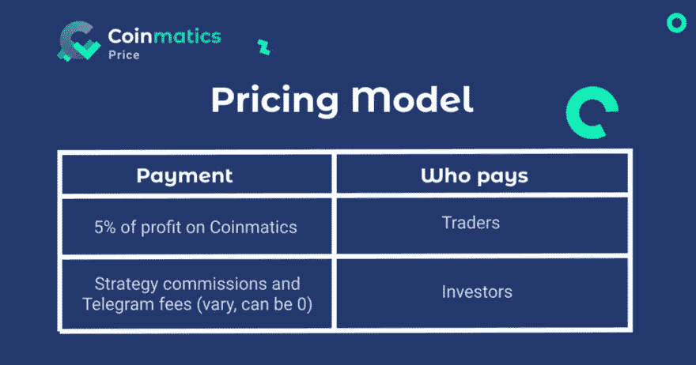

# 硬币评论——一个简单的加密副本交易应用程序

> 原文：<https://medium.com/coinmonks/coinmatics-review-a-simple-crypto-copy-trading-app-for-everyone-35d74ee3272b?source=collection_archive---------0----------------------->

Coinmatics review

我们来回顾一下 2018 年推出的高级复制交易和分析平台 [**Coinmatics**](https://blog.coincodecap.com/go/coinmatics) 。主要的货币产品是复制交易。它们连接交易者和投资者，并促进复制交易策略的自动执行。专业交易者和初学者都可以从这项服务中获利。

# 摘要

*   Coinmatics 是一个加密复制交易和分析平台。
*   目前，只有币安交易所可以进行拷贝交易。但是 Bitfinex、Bitstamp、Poloniex、Bittrex、HitBTC、Exmo 已经包含在其他服务中——投资组合、加密套利、分析等。
*   该平台非常适合初学者和专业人士使用。
*   这项服务现在是测试版，所以你可以免费试用。

# 利弊

## 优点:

*   Coinmatics 不仅提供复制交易服务，还为专业交易者提供一些分析工具。
*   它是一个测试版，你可以免费试用，检查它是否符合你的需求。
*   技术支持效率高，见效快。
*   有 30 多种策略可用于复制交易，而且这个数字还在不断增长。比如其中一个就是币安信号策略，平均利润 46.48%，总利润 101.41%。

## 缺点:

*   主要的缺点是缺少期货和保证金交易(但是，这个功能正在开发中，不久的将来就会推出)。
*   网上用户的评论不多。
*   开始复制交易有一个最低存款额——你必须将 50 美元转入你的交易所账户。

# 特征

硬币的主要特征是复制交易。此外，其他服务对专业交易者也有帮助:股票提示、加密套利和分析。

## 复制交易

**coin matics 的专业交易员**从订阅他们的策略并自动复制它们的投资者那里获利(自动复制交易)，或者从订阅 Telegram alerts 的人那里获得报酬(手动复制交易)。

Coinmatics 的复制交易员/投资者订阅专业人士提交的策略，根据自己的喜好自动或手动复制交易。

## 股票提示

您可以使用自定义参数设置跑马灯提醒，以便在触发时收到即时通知。所有通知都将发送到您的电报帐户。

## 加密套利

Coinmatics 为各种交易所的套利交易提供信息，以找到价差最高的交易。关于最有利可图的交易的手动模式和电报信号都可用。

> ***也可阅读:*** [***密码套利指南:新手如何赚钱***](https://blog.coincodecap.com/crypto-arbitrage-guide-how-to-make-money-as-a-beginner)

## 分析学

您可以跟踪您的交易历史，并通过[多个交易所](https://coincodecap.com/category/multi-exchange-trading)和[钱包](https://coincodecap.com/category/wallets)对您的投资组合状态进行每日报告。

用户可以使用我们的分析仪表板从不同的角度看市场:Twitter 分析图表，保证金头寸金额，保证金头寸数量，恐惧和贪婪指数，BTC 社交量，等等。

> ***也可阅读:*** [***最佳区块链分析软件***](https://blog.coincodecap.com/best-blockchain-analytics-softwares)

# 它是如何工作的

让我们来关注一下 Coinmatics 的复制交易服务。

## 场景 1:你是一个投资者/复制交易者

1.  在 Coinmatics 创建您的帐户。
2.  通过添加 API 密钥连接您的币安 exchange 帐户。
3.  选择要遵循的最佳策略:点击“开始复制策略”。
4.  追踪你的投资组合收益。

这里的是[的详细说明。](/coinmatics/how-to-start-copy-trading-and-get-profit-today-the-guide-youve-been-looking-for-so-long-5d41ff30e48a)

## 场景 2:你是一名专业交易者

1.  在 [Coinmatics](https://blog.coincodecap.com/go/coinmatics) 创建您的账户。
2.  通过添加 API 密钥连接您的币安 exchange 帐户。
3.  注册成为交易者，并为复制你的交易设定佣金和电报信号费。
4.  继续交易，获得额外利润。

这里的是[的详细说明。](/coinmatics/how-to-register-as-a-trader-at-coinmatics-a3424db01b42)

# 性能和安全性

**你没有给你的 API 密钥撤销权限。**因此，Coinmatics 无法从币安余额中提取您的资金。该平台只从你的硬币钱包中收取所有费用。

你只与可信的数据打交道。 Coinmatics 显示信号历史、交易周期、总利润和平均利润等。对于每种策略。因此，您可以估计所选策略的风险水平，并经过深思熟虑后决定是否认购。

**您可以使用双因素认证来保护您的帐户。**确保在 Coinmatics 注册后启用该功能。要启用 TFA，请进入您的帐户设置并检查 [**安全选项卡**](https://ucp.coinmatics.com/settings) **。**

# 定价

Coinmatics 从我们交易者在平台上的利润中抽取 **5%** 。当交易者提交他们的策略时，投资者开始跟随他们，因此赚了钱。如果策略有佣金，投资者在每个结算期结束时支付。我们从这些付款中抽取 5%——这就是我们赚钱的方式。

投资者不会向我们的平台支付任何费用。他们需要支付的唯一费用是拷贝交易的佣金和电报订阅费。这些佣金和费用归交易者所有(我们只收取 5%的费用)。同时，有些策略是可以自由遵循的——在这种情况下，复制交易可以完全免费。所以对于投资者来说，复制交易成本可以低至 0。

# 结论

长话短说， [**Coinmatics**](https://blog.coincodecap.com/go/coinmatics) 对于想开始复制交易的[密码初学者](https://blog.coincodecap.com/bitcoin-for-beginners-common-questions)来说是值得一试的，因为界面很人性化，而且有它的所有必要条件。专业交易者可以通过继续交易增加收入，而不会增加风险或更大的存款。

请在评论区让我们知道你对硬币评论的看法。

# 货币评论

1.  [3commas](https://3commas.io/?c=tc252152) 是一个在线平台，面向对使用自动机器人进行[加密货币交易](https://blog.coincodecap.com/tag/trading/)感兴趣的人。对于没有金融技术背景或没有丰富股市经验的人来说，这尤其具有吸引力。另外，请阅读我们的[3 商业评论](/coinmonks/3commas-review-an-excellent-crypto-trading-bot-2020-1313a58bec92)。
2.  [Bitsgap](https://bitsgap.com/?ref=2cb1231&utm_source=coincodecap&utm_medium=article&utm_campaign=promo) ，满足您所有交易需求的一站式加密交易平台。它允许用户将他们所有的密码交易账户放在同一个屋檐下，通过一个集成的界面进行交易。另外，请阅读我们的 [Bitsgap 评论](/coinmonks/bitsgap-review-a-crypto-trading-bot-that-makes-easy-money-a5d88a336df2)。
3.  [Quadency](https://quadency.com/?r=ea20aa360c45d1f5ad47a19a) ，2018 年推出的密码交易自动化平台。它给你带来了一个更聪明的方式来交易和管理你的密码。另外，请阅读我们的[季度回顾](https://blog.coincodecap.com/quadency-review-a-crypto-trading-automation-platform)。

## 另外，阅读

*   最好的[密码交易机器人](/coinmonks/crypto-trading-bot-c2ffce8acb2a)
*   [密码本交易平台](/coinmonks/top-10-crypto-copy-trading-platforms-for-beginners-d0c37c7d698c)
*   最好的[加密税务软件](/coinmonks/best-crypto-tax-tool-for-my-money-72d4b430816b)
*   [最佳加密交易平台](/coinmonks/the-best-crypto-trading-platforms-in-2020-the-definitive-guide-updated-c72f8b874555)
*   最佳[加密贷款平台](/coinmonks/top-5-crypto-lending-platforms-in-2020-that-you-need-to-know-a1b675cec3fa)
*   [最佳区块链分析工具](https://bitquery.io/blog/best-blockchain-analysis-tools-and-software)
*   [加密套利](/coinmonks/crypto-arbitrage-guide-how-to-make-money-as-a-beginner-62bfe5c868f6)指南:新手如何赚钱
*   最佳[加密制图工具](/coinmonks/what-are-the-best-charting-platforms-for-cryptocurrency-trading-85aade584d80)
*   莱杰 vs 特雷佐
*   了解比特币的[最佳书籍有哪些？](/coinmonks/what-are-the-best-books-to-learn-bitcoin-409aeb9aff4b)
*   [3 商业评论](/coinmonks/3commas-review-an-excellent-crypto-trading-bot-2020-1313a58bec92)
*   [AAX 交易所评论](/coinmonks/aax-exchange-review-2021-67c5ea09330c) |推荐代码、交易费用、利弊
*   [Deribit 审查](/coinmonks/deribit-review-options-fees-apis-and-testnet-2ca16c4bbdb2) |选项、费用、API 和 Testnet
*   [FTX 密码交易所评论](/coinmonks/ftx-crypto-exchange-review-53664ac1198f)
*   [n 零审核](/coinmonks/ngrave-zero-review-c465cf8307fc)
*   [Bybit 交换审查](/coinmonks/bybit-exchange-review-dbd570019b71)
*   [3Commas vs Cryptohopper](/coinmonks/cryptohopper-vs-3commas-vs-shrimpy-a2c16095b8fe)
*   最好的比特币[硬件钱包](/coinmonks/the-best-cryptocurrency-hardware-wallets-of-2020-e28b1c124069?source=friends_link&sk=324dd9ff8556ab578d71e7ad7658ad7c)
*   最佳 [monero 钱包](https://blog.coincodecap.com/best-monero-wallets)
*   [莱杰 nano s vs x](https://blog.coincodecap.com/ledger-nano-s-vs-x)
*   [Bitsgap vs 3 commas vs quad ency](https://blog.coincodecap.com/bitsgap-3commas-quadency)
*   [莱杰 Nano S vs 特雷佐 one vs 特雷佐 T vs 莱杰 Nano X](https://blog.coincodecap.com/ledger-nano-s-vs-trezor-one-ledger-nano-x-trezor-t)
*   [block fi vs Celsius](/coinmonks/blockfi-vs-celsius-vs-hodlnaut-8a1cc8c26630)vs Hodlnaut
*   [bits gap review](/coinmonks/bitsgap-review-a-crypto-trading-bot-that-makes-easy-money-a5d88a336df2)——一个轻松赚钱的加密交易机器人
*   为专业人士设计的加密交易机器人
*   [PrimeXBT 审查](/coinmonks/primexbt-review-88e0815be858) |杠杆交易、费用和交易
*   [埃利帕尔泰坦评论](/coinmonks/ellipal-titan-review-85e9071dd029)
*   [赛克斯·斯通评论](https://blog.coincodecap.com/secux-stone-hardware-wallet-review)
*   [BlockFi 评论](/coinmonks/blockfi-review-53096053c097) |赚取高达 8.6%的加密利息

*原载于 2020 年 8 月 26 日*[*https://blog.coincodecap.com*](https://blog.coincodecap.com/coinmatics-review-copy-trading-app)*。*