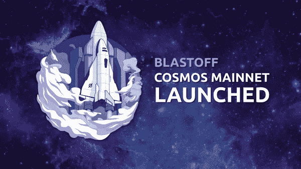

# Coinmonks 字母#30，真正白痴的终极宇宙代表团指南

> 原文：<https://medium.com/coinmonks/coinmonks-letter-30-the-ultimate-cosmos-delegation-guide-for-real-idiots-e112f9a77a33?source=collection_archive---------1----------------------->

## ***找区块链/密码写手？***

我们最近推出了 [**ContentCat**](https://contentcat.me/) 来帮助企业提供丰富的教育内容。如果你是区块链/密码公司，需要丰富的内容，[让我们打电话](https://calendly.com/contentcat/30min/)。

**本周语录-**

> 逻辑会把你从 A 带到 Z；想象力会让你无处不在——阿尔伯特·爱因斯坦

本周故事👇 👇

# 真正白痴的终极宇宙代表团指南

Cosmos 的第一个中心已经启动，这意味着原子现在可以被委托，因为几天甚至是可转移的，这意味着许多人会问自己“我如何委托我新获得的货币来获得一些利息？”。

这篇文章由 3 部分组成，A)我将做一个简短的介绍，并尝试用糟糕的笑话和相关的意象来降低格调。b)我将尝试解释如何为委托选择正确的验证者，C)我将给出一个关于如何委托的明确指导。对于大多数读者来说，这不会是一个有趣的部分，因为它更容易与莱杰纳米和大多数人会走这条路有足够的教程存在。但对于其他一些人来说，学习如何使用 Cosmos 进行离线交易签名是有意义的。… [*阅读更多*](/coinmonks/the-ultimate-cosmos-delegation-guide-for-real-idiots-87ebc6518145)

**由** [**帕特里克·威斯**](https://medium.com/u/8e91a3236ca6?source=post_page-----e112f9a77a33--------------------------------) **，(帕特里克是一名研究员，正在攻读博士)**

> [直接在您的收件箱中获得最佳软件交易](https://coincodecap.com/?utm_source=coinmonks)

给我发微博 [@coinmonks](https://twitter.com/coinmonks) 或者发邮件到 gaurav@coincodecap.com

> “我们是一个非宣传性和非营利性的教育出版物，如果你喜欢阅读《僧侣》，你也可以捐赠给我们”

***暂时就这样，送我❤️，下次再说😄。***