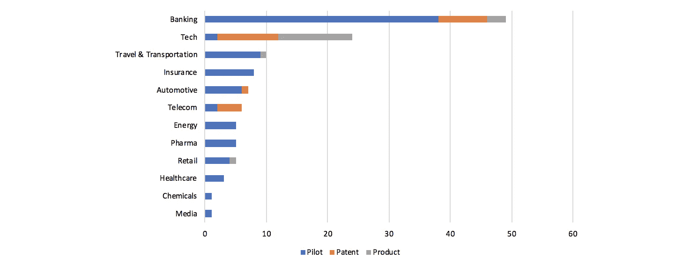

# Coinmonks 每周信#16

> 原文：<https://medium.com/coinmonks/coinmonks-weekly-letter-16-e1260c86e84c?source=collection_archive---------4----------------------->

## 如果你想要新的东西，你必须停止做旧的东西

## 本周的头条新闻。👇

*   允许投资者做空以太坊的加密初创公司 dYdX 已经筹集了 1000 万美元
*   [“Bulletproofs”让 Monero“不公平的便宜”](https://www.ccn.com/monero-transaction-fees-are-down-97-since-the-hard-fork/)
*   [中国互联网审查机构发布区块链初创公司监管草案](https://www.coindesk.com/chinas-internet-censor-releases-draft-regulation-for-blockchain-startups/)
*   [富达的区块链 R & D Lead 刚刚全面加密](https://www.coindesk.com/fidelitys-blockchain-incubator-lead-just-went-full-crypto/)
*   [支付初创公司 Square 正在开源其比特币存储解决方案](https://www.coindesk.com/payments-startup-square-is-open-sourcing-its-bitcoin-cold-storage-solution/)
*   [Gavin Wood 宣布“即将发布”DIY 区块链工具](https://www.coindesk.com/gavin-wood-announces-impending-release-of-diy-blockchain-tool/)
*   [朝鲜黑客组织 Lazarus 窃取了价值 5.71 亿美元的密码:报道](https://www.coindesk.com/north-korean-hacking-group-lazarus-stole-571-million-in-cryptos-report/)

## 本周名言-

> ”“不是你的钥匙，也不是你的比特币。”—安德烈亚斯·安东诺普洛斯

## 播客

[**兔子洞回顾:2018.10.22**](https://talesfromthecrypt.libsyn.com/) 的一周

[**梅萨里播客#9:托尼盛**](https://open.spotify.com/episode/05NFvgUSYsSv5Zibzdb3C5)

现在，让我们深入了解本周的最佳故事。👇

[**块格简介**](/coinmonks/an-introduction-to-the-block-lattice-382071fc34ac)

像 Nano 和 Nollar 这样的下一代支付加密货币做出了一些大胆的承诺，听起来好得令人难以置信。他们提供快速和无感觉的交易，不需要对环境有害的采矿。今天，我们来看看这些下一代支付加密货币的系统架构，即所谓的 **block-lattice…**

***由*** [***号现金***](https://medium.com/u/ee06f2ffd17e?source=post_page-----e1260c86e84c--------------------------------)

[**不祥之兆，比特币与密码分析 2018 年 Q4**](/coinmonks/writings-on-the-wall-bd4f8e5cce5e)

加密和比特币市场远不如过去受欢迎。自 2018 年初熊市开始以来，大多数散户投资者已经逃离。但是 crypto 死了吗，它会归零吗？或者这可能是市场周期的一部分…

***由***[***Mεтα***](https://medium.com/u/e5f9737964ac?source=post_page-----e1260c86e84c--------------------------------)

[**中微子:闪电较轻的一面**](https://blog.lightning.engineering/posts/2018/10/17/neutrino.html)

当今几个顶级的移动比特币钱包都是建立在集中式服务基础上的，这带来了巨大的安全风险。正如智者[不止一次](https://www.youtube.com/watch?v=dnC5mFaIW3Q)所说:“不是你的钥匙，不是你的比特币。”集中式服务也有暴露用户财务信息的风险(即[交易历史](https://www.theguardian.com/technology/2014/mar/10/mtgox-bitcoin-database-leaked-online-as-hackers-crowdsource-clues) )……

***作者布莱恩·武***

[**一场风暴正在最大的比特币交易所**](/@hasufly/a-storm-is-brewing-over-the-largest-bitcoin-exchange-f956324b449f) 酝酿

[BitMEX Research](https://blog.bitmex.com/research/) 发布了一篇新的博客文章，每个人都停下手中的工作去阅读它。但该交易所最近的一系列问题让我相信，一旦它妨碍了他们赚更多的钱，他们将很难做到合乎道德。

***由*** [***哈苏***](https://medium.com/u/90326a938400?source=post_page-----e1260c86e84c--------------------------------)

[**企业区块链实施趋势**](/coinmonks/trends-in-enterprise-blockchain-implementation-314cde67e56a)

[**塞巴斯蒂安·沃斯特**](https://medium.com/u/bc7690fbb441?source=post_page-----e1260c86e84c--------------------------------) 展示了不同行业是如何采用区块链的。他分析了 2014 年至今的 145 家企业区块链相关公告数据…

Enterprise blockchain activity by industry- Image from [Sebastian Wurst](https://medium.com/u/bc7690fbb441?source=post_page-----e1260c86e84c--------------------------------) article

> [直接在您的收件箱中获得最佳软件交易](https://coincodecap.com/?utm_source=coinmonks)

你喜欢这个字幕吗？这是彼得·德鲁克的一句话

给我发微博到 [@coinmonks](https://twitter.com/coinmonks) 或者发邮件到 gaurav@coincodecap.com

如果你喜欢阅读 Coinmonks，你也可以[捐助](/coinmonks/monks-need-your-help-7440418d67ec)我们。

***暂时就这样吧，送我❤️，下次再说😄。***

**~高拉夫**