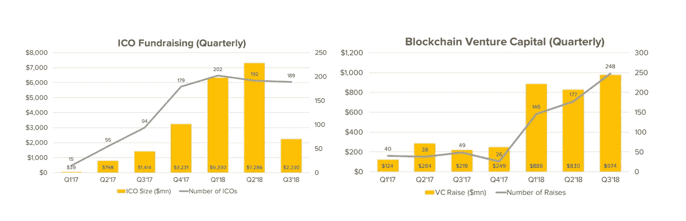

# Coinmonks 每周信#20

> 原文：<https://medium.com/coinmonks/coinmonks-weekly-letter-20-5f977978557f?source=collection_archive---------2----------------------->

## 每个艺术家最初都是业余爱好者

## [加入 Coinmonks 乔布斯电报频道](https://t.me/joinchat/FyuZERD5oyp6LWbwLASOKQ)

[Coinmonks 岗位](https://coinmonks.com)在增长，更多的区块链岗位和更多的申请者。为了与社区互动，我们为想在密码行业工作的人创建了一个电报频道。[你可以使用此链接](https://t.me/joinchat/FyuZERD5oyp6LWbwLASOKQ)加入我们。

**本周头条新闻-👇**

*   【2019 年 1 月 16 日，以太坊网络升级，区块奖励从 3 个 eth 升级到 2 个 eth
*   [ErisX(一个新的加密交易所)在 B 轮融资中筹集了 2750 万美元](https://www.financemagnates.com/cryptocurrency/exchange/erisx-raises-27-5-million-in-series-b-funding-round/)
*   [Sirin Labs，一家价值 1.58 亿美元的 ICO 公司从基于硬件的商业模式转向为手机制造商提供软件。](https://www.ccn.com/does-the-fall-of-158m-crypto-ico-show-necessity-of-strict-regulation/)

## 本周推特-

*   [俄罗斯中央银行致函至少 5 家银行，建议它们寻找替代合作伙伴，以防与 SWIFT 断开联系](https://twitter.com/olgaNYC1211/status/1071040833963610112)

## 本周名言-

> “最复杂的技巧就是简单。”— **斯托扬诺维奇**

## **有趣的发现**

*   [**esplora**](https://github.com/Blockstream/esplora) —一款开源的 block explorer。
*   [求各种密码 51%攻击成本(理论上)。](https://www.crypto51.app/)
*   ICO 资金出去，VC 资金进来。[找到更多](https://www.coindesk.com/research/state-of-blockchain-q3-2018)

[Coindesk research](https://www.coindesk.com/research/state-of-blockchain-q3-2018)

## 本周播客-

*   [玛蒂本特与丹举行](https://talesfromthecrypt.libsyn.com/tales-from-the-crypt-52-dan-held)

现在，让我们深入了解本周的最佳故事。👇

## **在 MimbleWimble 后面**

crypto 内部很少有想法像 MimbleWimble 提案一样获得如此多的关注。它的名字来源于《哈利·波特》宇宙中的[系舌头咒](https://pottermore.fandom.com/wiki/Tongue-Tying_Spell)，这是一个用来阻止谈论某个话题的咒语。MimbleWimble 是一种新颖的协议，它致力于[提高其用户的隐私性](https://hackernoon.com/privacy-on-the-blockchain-7549b50160ec)和可扩展性。[阅读更多](/@jcliff/behind-mimblewimble-cd9da78a00e9?sk=689b5f55fa575e150ca5eae685fc321d)

乔丹·克利福德

## **同行评审:CBC Casper**

活性和安全性是一致性协议的两个不可分割的属性。活性是一种保证，即使在失败的情况下，协议也能做一些有用的事情。CBC Casper，一个共识协议家族，从他们的分析中排除了活性。治疗 2 个中的 1 个并不能让你达到完整方案的 50%;它让你几乎一无所有。[阅读更多](/@muneeb/peer-review-cbc-casper-30840a98c89a)

由[穆尼布·阿里](https://medium.com/u/8dd3ab013f82?source=post_page-----5f977978557f--------------------------------)

## **度过熊市的小贴士**

BTC 的熊市已经持续了近一年，这是一个艰难的地方。在资产下跌时持有资产是一件困难的事情，在这个市场中度过难关需要很强的个性。[阅读更多](/@jimmysong/tips-on-getting-through-a-bear-market-e6b4e8425e4b)。

由[吉米·宋](https://medium.com/u/4acb12744ff8?source=post_page-----5f977978557f--------------------------------)

## Vertcoin (VTC)被成功攻击了 51%

在 4 次不同的事件中，最近一次发生在 12 月 2 日，Vertcoin (VTC)经历了 22 次深度链重组，其中 15 次包括 VTC 的双重支出。我们估计这些攻击可能导致超过 100，000 美元的盗窃。最大的重组深度超过 300 个街区。[阅读更多](/coinmonks/vertcoin-vtc-is-currently-being-51-attacked-53ab633c08a4)

> [直接在您的收件箱中获得最佳软件交易](https://coincodecap.com/?utm_source=coinmonks)

你喜欢这个字幕吗？这是拉尔夫·沃尔多·爱默生的名言

给我发微博 [@coinmonks](https://twitter.com/coinmonks) 或者发邮件到 gaurav@coincodecap.com

> “我们是一个非宣传性和非营利性的教育出版物，如果你喜欢阅读《创造僧侣》，[你也可以捐助我们](/coinmonks/monks-need-your-help-7440418d67ec)”

***暂时就这样了，送我❤️，下次见😄。***

**~高拉夫**