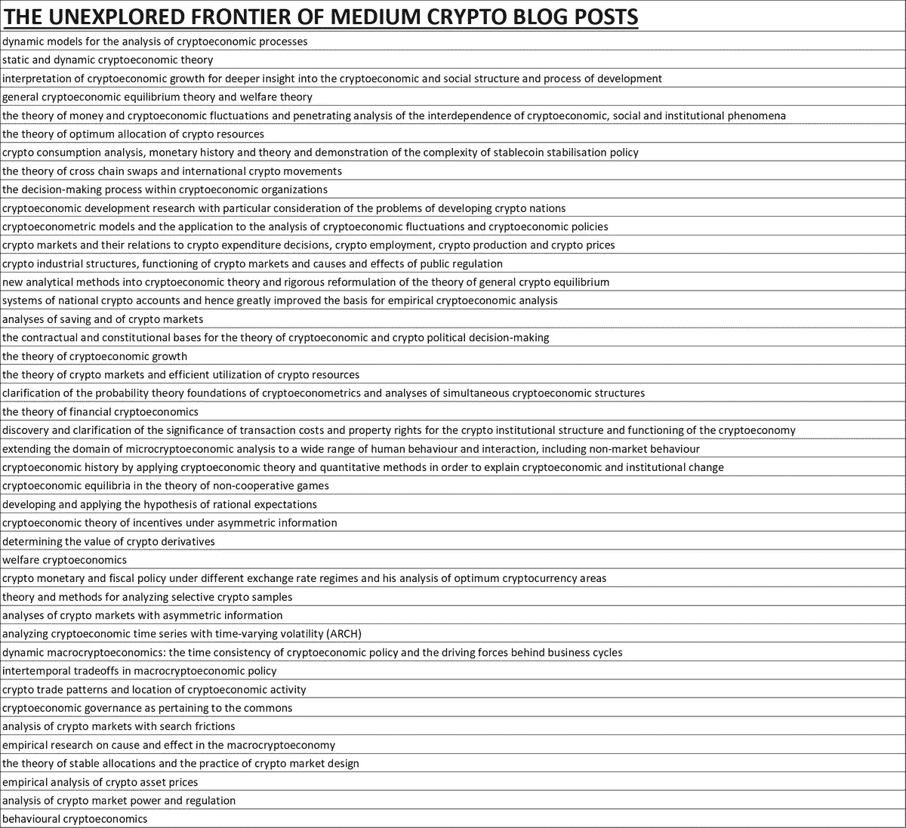

# Coinnmonks 密码作者电报组

> 原文：<https://medium.com/coinmonks/coinnmonks-crypto-writers-telegram-group-f56b4621af0a?source=collection_archive---------3----------------------->


Image by [John Schnobrich](https://unsplash.com/@johnschno) on unsplash

> “在 Coinmonks 的世界里，一切都必须是教育性的”

[**使用 Coinmonks 作业门户**查找加密作业](https://coinmonks.com/)

[***捐于造币僧侣***](/coinmonks/monks-need-your-help-7440418d67ec)

** *本帖将持续更新，如果你是 Coinmonks 的投稿人并想访问 telegram，请在 twitter 上联系我*[*@ coin monks*](https://twitter.com/coinmonks)** **

```
*Coinmonks publication is non-profit and non-promotional, If you are project in crypto field, we strongly believe that adding educational content will help grow ecosystem. So if you create educational content, we are happy to publish it. (You can swiftly plug you brand at the end). We don't charge anyone to publish on Coinmonks. It's from the community and for the community.* For sustainability, we created [Coinmonks jobs portal](https://coinmonks.com) to help people find Jobs in crypto and of course your donations are welcome.
```

Coinmonks 的 **crypto writer group 严格地只对 coinmonks 贡献者**(作者)开放。你可以邀请任何准备好他/她的文章并想在 Coinmonks 上投稿的投稿人。(Ping 我添加一些会有所帮助)

**需要记住的几件事——**

*   当你加入这个团体时，介绍你自己😃
*   当你加入群时，如果你已经是一个贡献者，并且想在 Twitter 上访问 telegram group message me(coin monks ),请 Ping 我你的媒体档案名称
*   不要发垃圾邮件(即使是你的文章)
*   在小组中分享你的草稿，征求其他作者的评论和意见。

## 为什么是 Coinmonks 的密码作者小组？

1-当我们每天发表大量文章时，我们看到一个缺口，很多时候作者在同一个主题上写文章，而这个主题上已经有一篇令人敬畏的文章了。尤其是在编码教程的情况下。我们可以共同帮助提出更好的主题，这有助于了解更多和更深入地了解技术或密码经济学。

2-通过分享对文章的观点和评论，在内容和思考过程中互相帮助。所以先分享草稿，然后在小组中征求意见。

## 小组的目的是什么？

*   共享文章主题
*   写作技巧
*   查看来自其他作者的帮助
*   定制艺术品(如果需要的话)
*   与其他作家合作
*   帮助作家获得自由职业者或完整的编码项目(可能在未来)

**在群里分享什么？**

*   教育推特主题(我们爱他们)
*   播客，文章推荐
*   你正在做的任何你认为对社区有帮助的教育工作
*   有趣的学习资源
*   您正在从事的任何开源项目

## 如果你想写自由职业者教程，平我，我可能有东西给你😃

总的来说，我们希望帮助作家创作人们想读的内容。

> “这都是关于你的，你在 Coinmonks 上做出了贡献”

## 如何分享您的主题，以列入以下列表？

要么评论帖子，要么给这个草稿留个私信。"双击任意位置，弹出时点击最右边的符号"。

> “当你从列表中选择一个话题，在电报上给我留言或在这里留下私人信息时，我会将它们标记为正在进行，这样其他人就不会选择它们，默认情况下，如果话题前面没有写任何内容，它们就会被取消选择”。

**拜托！求你了。求你了。建议主题和类别** ❤️

## **要写的主题列表-**

# 经济学

**比特币**

*   比特币作为抵押品
*   比特币和黄金作为价值储存手段的比较
*   密码经济学模型
*   资产评估
*   共识协议经济学
*   部分准备金银行问题与稳健货币
*   债务经济中的比特币
*   比特币的未来银行业
*   法定货币的起源



[Source](https://twitter.com/cryptorae/status/1047205132016934912)

建议更多加密/令牌经济主题

**其他话题**

*   关于分散交换，它们与集中交换相比如何工作
*   区块链如何改变不同的业务(深度观察或第一手经验)

# 技术

**比特币**

*   我们可以使用一些比特币开发教程(请建议主题)
*   如何建立一个比特币钱包(教程系列)
*   如何分叉比特币并在本地运行
*   总体比特币编程资源(非常需要)
*   程序 merkle 树

**闪电网**

请建议主题

**以太坊发展**

*   Vyper 语言教程
*   最新的 ERC 及其实现
*   如何在你的代币合约中支付股息
*   如何建立一个有上限的众筹合同
*   如何建立一个智能合同库
*   embark 框架教程
*   如何建立一个可燃烧的令牌合同
*   不同类型的令牌及其实现和深入比较
*   如何在 Solidity IDE 中创建自己的 Multisig 契约(支持令牌！)
*   如何在 Solidity IDE 中创建自己的时间敏感型众筹合同
*   Merkle 证明在一个可靠性契约中，以最小化存储在链上的数据量。

**EOS**

建议主题…

**卡尔达诺**

建议主题…

**尼奥**

建议主题…

**恒星**

建议主题…

**智能合同语言**

坚固性(以太坊)

以太坊

流动性(Tezos)

建议主题…

**Web3**

web3 的新兴图景

建议主题…..

## IPFS

建议主题…

**列兵区块链**

建议主题…

**总账**

建议主题…

**科达**

建议主题…

**泰佐斯**

建议主题…

**嫩薄荷**

建议主题…

**技术教程**

1.  自动工具 vs CMake
2.  2)对于键值 dbs，Berkeley DB vs LMDB & level DB vs RocksDB。

> [直接在您的收件箱中获得最佳软件交易](https://coincodecap.com/?utm_source=coinmonks)

[](https://coincodecap.com/?utm_source=coinmonks)