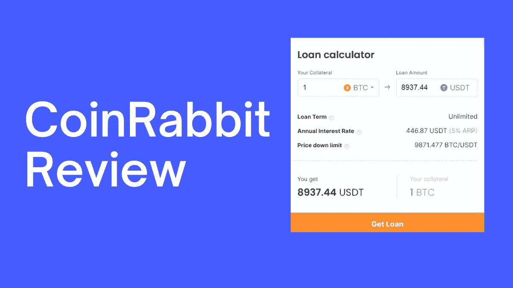
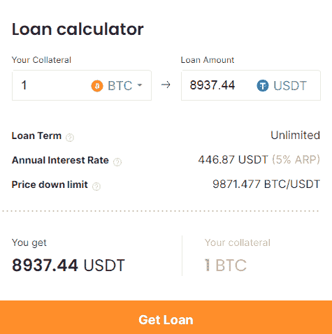

# 硬币兔评论|借用 USDT 为您的比特币和以太坊

> 原文：<https://medium.com/coinmonks/coinrabbit-review-74efe740262e?source=collection_archive---------4----------------------->

CoinRabbit Review

在本文中，我们将回顾 [CoinRabbit](https://blog.coincodecap.com/go/coinrabbit) ，一种新的即时[加密借贷](/coinmonks/top-5-crypto-lending-platforms-in-2020-that-you-need-to-know-a1b675cec3fa)产品。

如果你有一些 BTC 或 ETH，这里有一个方法可以让你做到——不用卖掉你辛苦赚来的密码。

假设你有一个价值 18000 美元的 BTC。你不想卖掉它，因为它可能会在未来给你带来巨大的利润，但这是一大笔钱，现在用它会很酷。

比方说，你拿 1 BTC，在 USDT 得到 9000 美元的加密贷款。你可以用它做任何你想做的事情——去旅行、买车或投资房地产。

当你完成你的梦想时，你用同样的 9000 美元和每年 5%的利息偿还[加密贷款](/coinmonks/top-5-crypto-lending-platforms-in-2020-that-you-need-to-know-a1b675cec3fa)。那时，BTC 已经涨到了 3 万美元。现在，你像以前一样拥有 1 个比特币，外加一辆汽车或一次难忘的旅行经历，并减去 450 USDT 支付的利息。

这正是 [**CoinRabbit**](https://blog.coincodecap.com/go/coinrabbit) **提供的** — **即时** [**加密货币借贷服务**](https://blog.coincodecap.com/top-5-crypto-lending-platforms) **没有信用检查、月供和最大贷款规模。**拿起你的 BTC 或瑞士联邦理工学院，在 10 分钟内获得一些 USDT——享受新的机会！另外，我们的地域相当大，我们支持的国家有..全球！

我们的合作伙伴——一家名为 [ChangeNOW](https://blog.coincodecap.com/changenow-review-a-secure-crypto-exchange) 的高度可信的服务机构——保证所有担保品的安全。此外，由 ChangeNOW 执行的 KYC 程序也让我们检查每笔交易的合法性。

# 为什么是 CoinRabbit？

*   **无限期贷款。为什么给一周、一个月或一年作为我们的竞争对手？慢慢来，想什么时候还贷款就什么时候还！**
*   **低利率。与其他服务的 8-10%相比，我们每年只收取 5%的利息。此外，根据网络负载情况，交易会收取少量佣金(3-10 美元)。**
*   **最低贷款金额低。开始用 30 USDT 作抵押，用 80 USDT 作抵押。**
*   **贷款规模没有限制。**我们的一些竞争对手提供高达 4-5k 美元的比特币贷款，而我们允许您享受任何您希望的金额。
*   **没有月供。我们不麻烦你每月收取利息——你只需在偿还贷款时支付每年 5%的利息。你可以在你的账户上查到这笔钱。**
*   **10 分钟拿到你的贷款。**没有烦人的信用检查——马上来贷款吧！
*   **抵押品按初始利率偿还。**要归还您的 BTC 或瑞士联邦储蓄银行，您需要支付初始贷款规模+利息，无论当前的 BTC 或瑞士联邦储蓄银行利率如何。
*   **安全的抵押品存储和即时返还。我们会小心地将您的密码保存在我们这边。无论你什么时候想要回它，我们都会马上还给你。**

# CoinRabbit 如何工作

下面是使用 [CoinRabbit](https://blog.coincodecap.com/go/coinrabbit) 出借[比特币](https://blog.coincodecap.com/a-candid-explanation-of-bitcoin)或者以太坊的步骤。

1.  跳转到 [CoinRabbit](https://coinrabbit.io/) ，选择您的抵押品的货币和金额。

1.  确认您的电话号码，并设置您希望贷款落地的 USDT 地址。
2.  发送您选择的担保金额。
3.  在我们处理完你的抵押品并且一切正常后，我们会马上把贷款发给你。

就是这样！您可以在同一个选项卡上在线跟踪整个过程。

现在你有了你的 USDT，想做什么就做什么吧！ [CoinRabbit](https://blog.coincodecap.com/go/coinrabbit) 将全天候提供任何支持和帮助。

# 下一步是什么

*   通过偿还贷款，你可以随时取回抵押品。这是你贷款的初始金额+ 5%的年息+少量手续费。
*   如果你愿意，可以增加你的贷款额度。在这种情况下，你的平仓价格会降低(在下面进一步了解)。

# 有什么风险吗？

加密货币的价格不时大幅波动。作为热情的加密货币借贷平台之一，我们希望 BTC 和 ETH 的价格只会上涨，但不会完全安全地下跌。如果你的抵押货币利率开始大幅下降，我们会多次警告你。我们借出 crypto，希望利率可以接受，但不幸的是，如果价格跌至我们所说的清算价格以下，我们将不得不出售你的抵押品——但在这种情况下，你的 USDT 将与你同在。

在 [CoinRabbit](https://blog.coincodecap.com/go/coinrabbit) 加密贷款平台，你以 **50%的贷款价值比**获得贷款:在 USDT，如果你带来 1 个 BTC，你会得到 0.5 个 BTC。对我们的客户来说，这要舒服得多，因为众所周知，加密市场具有很高的波动性。因此，拥有 50%的 LTV 带来的清算风险要小得多。这使得我们可以保持低清算价格:即使 BTC 价格下跌 30%，我们仍然是安全的。一些[的其他加密贷款平台](/coinmonks/top-5-crypto-lending-platforms-in-2020-that-you-need-to-know-a1b675cec3fa)提供 90%的 LTV 比率，并在价格仅下降 10%时出售你的抵押品。

# 为什么只有 USDT 可以贷款，而 BTC/联邦理工学院可以抵押？

USDT 是一种可靠的货币，作为一种稳定的货币，它非常接近于法币，允许许多很好的交易选择。然而，我们现在正致力于增加更多的硬币作为贷款和抵押选择，甚至是前者的法定货币。

以下是一些如何使用 USDT 的例子:

*   在币安或火币等各种加密交易所或 ChangeNOW 等加密交易服务上与其他加密货币进行交易；
*   在各种市场、在线商店和 Mt Pelerin 等网站上支付商品和服务费用；
*   通过 Aave、Chaineum、Polkadot 等服务在 [DeFi](https://blog.coincodecap.com/the-ultimate-guide-to-defi-decentralized-finance) 生态系统中进行交易；
*   向全世界人民进行即时、廉价的跨境支付；
*   或者把它放在你的[加密钱包](https://blog.coincodecap.com/tag/crypto-wallet)里，比如 Guarda、Atomic、 [Ledger](https://blog.coincodecap.com/go/5491-2) 等等。

# 硬币兔计划

很快会有很多选择出现:

*   更多的加密货币作为抵押品。
*   获得许可的机会，给一个密码贷款的法令；
*   整合第三方资金保险，进一步保护每一笔贷款。

# CoinRabbit 综述:结论

CoinRabbit 是一个新平台，在 USDT 提供即时加密贷款。它和 ChangeNOW(我亲自验证过)等平台都有合作。然而，它缺乏监管，一旦出现问题，任何法律追索都有问题。此外， [CoinRabbit](https://blog.coincodecap.com/go/coinrabbit) 不使用任何第三方托管如 BitGo。因此，我建议从少量开始，测试服务一段时间，让它在市场上立足。无论如何，永远记住，不是你的钥匙，不是你的比特币。

您可以在 [Twitter](https://twitter.com/CoinRabbit_io) 上关注 [CoinRabbit](https://blog.coincodecap.com/go/coinrabbit) ，如有任何问题，请随时联系他们的[支持](https://blog.coincodecap.com/cdn-cgi/l/email-protection#a5d6d0d5d5cad7d1e5c6cacccbd7c4c7c7ccd18bccca)。尝试一下[最好的加密贷款平台](/coinmonks/top-5-crypto-lending-platforms-in-2020-that-you-need-to-know-a1b675cec3fa)，在评论区告诉我们你对 CoinRabbit 的看法。

使用 [CoinRabbit](https://blog.coincodecap.com/go/coinrabbit) 充分利用您的密码！

# 另外，阅读

*   最好的[密码交易机器人](/coinmonks/crypto-trading-bot-c2ffce8acb2a)
*   [Deribit 审查](/coinmonks/deribit-review-options-fees-apis-and-testnet-2ca16c4bbdb2) |选项、费用、API 和 Testnet
*   [FTX 密码交易所评论](/coinmonks/ftx-crypto-exchange-review-53664ac1198f)
*   最好的比特币[硬件钱包](/coinmonks/the-best-cryptocurrency-hardware-wallets-of-2020-e28b1c124069?source=friends_link&sk=324dd9ff8556ab578d71e7ad7658ad7c)
*   [密码本交易平台](/coinmonks/top-10-crypto-copy-trading-platforms-for-beginners-d0c37c7d698c)
*   最好的[加密税务软件](/coinmonks/best-crypto-tax-tool-for-my-money-72d4b430816b)
*   [最佳加密交易平台](/coinmonks/the-best-crypto-trading-platforms-in-2020-the-definitive-guide-updated-c72f8b874555)
*   最佳[加密贷款平台](/coinmonks/top-5-crypto-lending-platforms-in-2020-that-you-need-to-know-a1b675cec3fa)
*   [莱杰 vs 特雷佐](/coinmonks/ledger-vs-trezor-best-hardware-wallet-to-secure-cryptocurrency-22c7a3fd391e)
*   [block fi vs Celsius](/coinmonks/blockfi-vs-celsius-vs-hodlnaut-8a1cc8c26630)vs Hodlnaut
*   [Bitsgap 评论](/coinmonks/bitsgap-review-a-crypto-trading-bot-that-makes-easy-money-a5d88a336df2)——一个轻松赚钱的加密交易机器人
*   为专业人士设计的加密交易机器人
*   [PrimeXBT 审查](/coinmonks/primexbt-review-88e0815be858) |杠杆交易、费用和交易
*   [HaasOnline 评论](/coinmonks/haasonline-review-d8d1a3400419)享受九折优惠
*   Bitmex 上的[保证金交易的白痴指南](/coinmonks/the-idiots-guide-to-margin-trading-on-bitmex-dbbd7742c6fc?source=friends_link&sk=7bfa99d2a181142510c8442c8ddb0786)
*   [eToro 评论](/coinmonks/etoro-review-78807ddeb33c) |交易股票、密码、交易所交易基金、差价合约和商品
*   [Bitmex 高级保证金交易指南](/coinmonks/bitmex-advanced-margin-trading-guide-2270c195ce25?source=friends_link&sk=1d986cca731f5084b9a2db4a4bc4a7ad)
*   [开发人员的最佳加密 API](/coinmonks/best-crypto-apis-for-developers-5efe3a597a9f)
*   加密套利指南:新手如何赚钱
*   顶级[比特币节点](https://blog.coincodecap.com/bitcoin-node-solutions)提供商
*   最佳[加密制图工具](/coinmonks/what-are-the-best-charting-platforms-for-cryptocurrency-trading-85aade584d80)
*   了解比特币的[最佳书籍有哪些？](/coinmonks/what-are-the-best-books-to-learn-bitcoin-409aeb9aff4b)

> [直接在您的收件箱中获得最佳软件交易](https://coincodecap.com?utm_source=coinmonks)

*原载于 2020 年 11 月 23 日 https://blog.coincodecap.com***。**