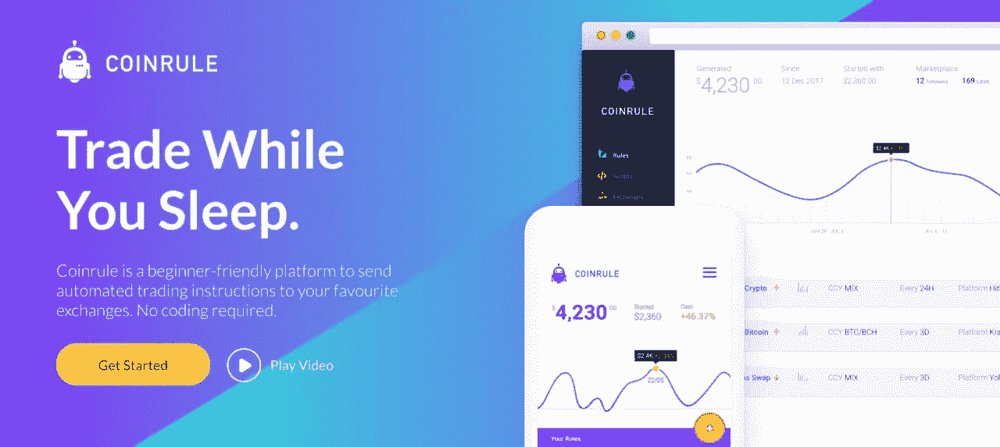
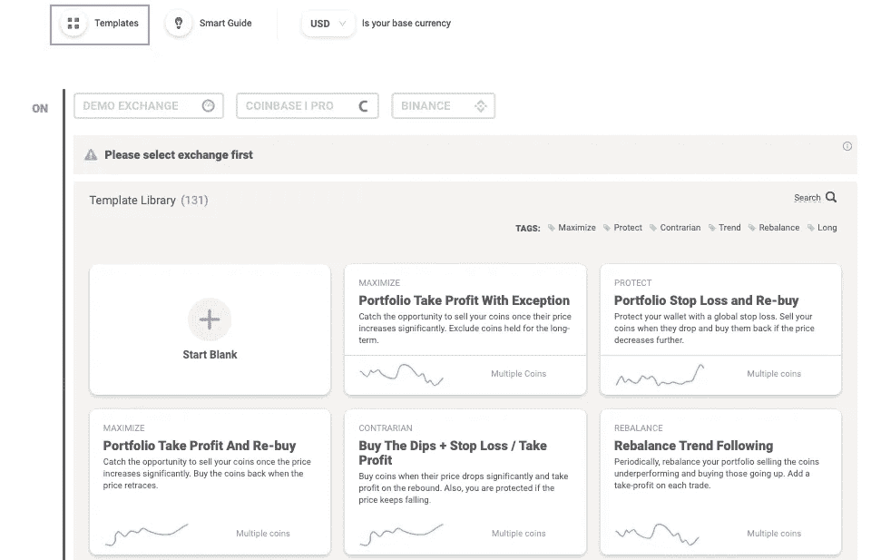
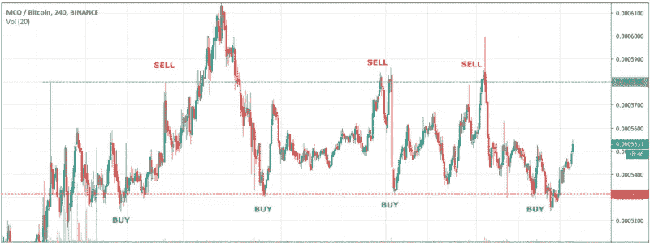
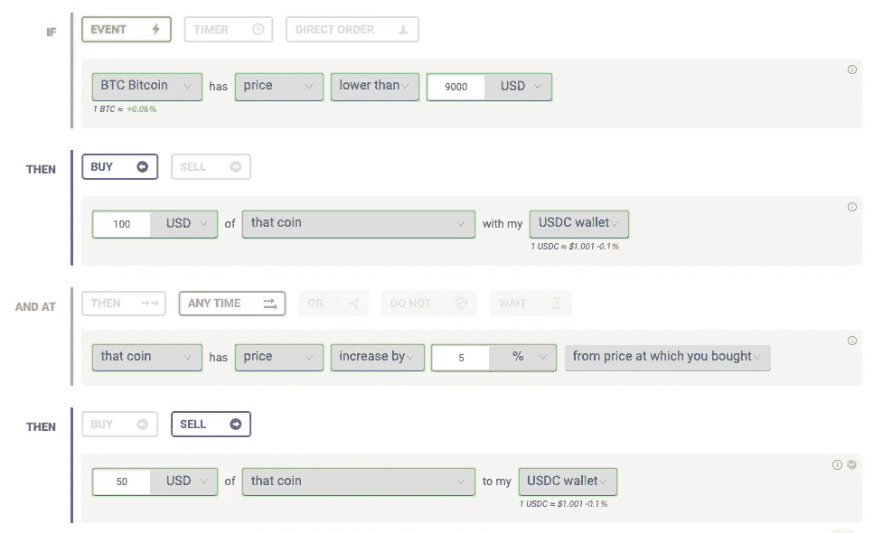
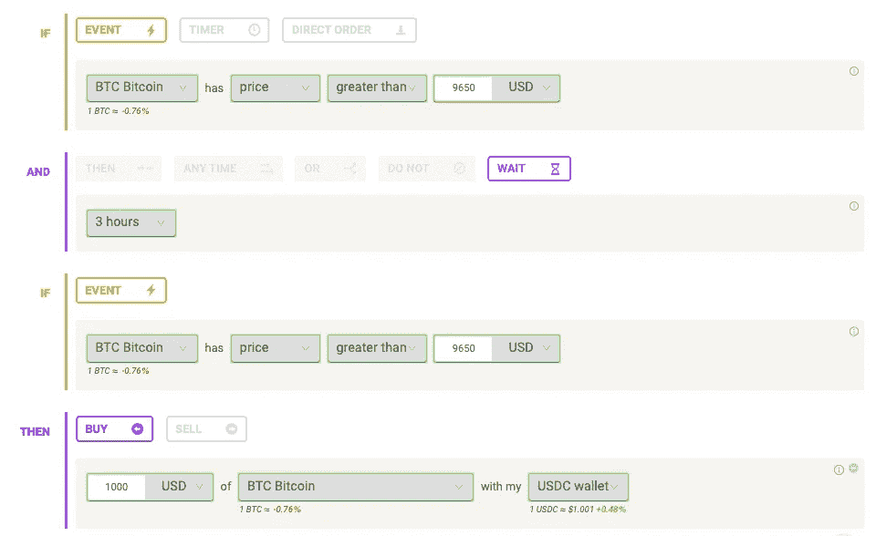
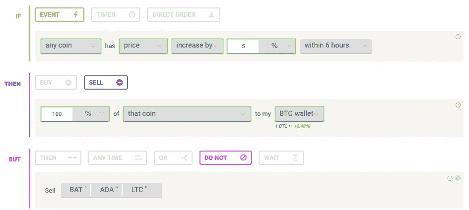
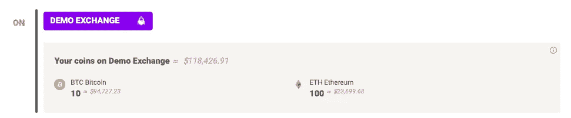
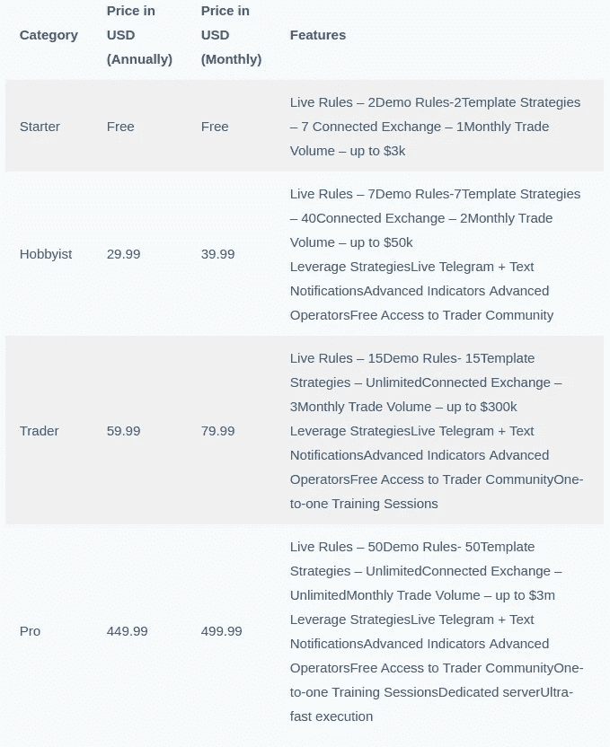

# 一个初学者友好的加密交易机器人

> 原文：<https://medium.com/coinmonks/coinrule-review-2021-a-beginner-friendly-crypto-trading-bot-daf0504848ba?source=collection_archive---------1----------------------->

在本文中，我们将回顾 2018 年创立的加密货币交易智能助手 [Coinrule](https://blog.coincodecap.com/go/coinrule) 。该交易平台是在英国开发的，根据英国的金融和商业法律运作。

在反击对冲基金和自动化机器人的同时，你可以完全控制自己的交易。您可以建立自己的规则，也可以从 150 多个规则中选择。他们分析市场，自动化你的交易策略。

# 关键要点

*   初学者友好的界面
*   一流的用户体验
*   基于“如果这个那么那个”逻辑的灵活策略
*   提供超过 130 种交易策略模板
*   不支持回溯测试(将在 2020 年发布该功能)
*   卓越的实时客户服务和丰富的入门指南
*   根据不同需求，提供免费计划和多种保费计划

# Coinrule 复查:订单类型

## 市场秩序

这些指令一到达交易所的指令簿就被立即执行。它们还取决于市场的流动性和订单的大小。他们不保证具体的价格。

## 限价订单

这些订单允许你设置买卖的最低和最高价格。因此，您必须等待订单被执行。它们不会立即被填充。可以设置保证金来增加或减少交易执行的可能性。

 [## 最佳免费加密交易机器人——前 16 名比特币交易机器人[2021]

### 2021 年币安、比特币基地、库币和其他密码交易所的最佳密码交易机器人。四进制，位间隙…

medium.com](/coinmonks/crypto-trading-bot-c2ffce8acb2a) 

# Coinrule 评论:如何创建规则？

这些规则遵循“如果这个，那么那个”的方法。

1.  选择一个你想交易的交易所。
2.  如果你不想从头开始制定交易策略，你可以从模板中选择。模板中的参数是可定制的。

3.选择执行订单的条件。它可以在特定的时间间隔设置，也可以在特定事件发生后设置。

4.选择您希望在订单执行后立即触发的操作。

5.可以通过添加运算符来创建高级规则。现在你只需要启动你的规则。你应该完全控制你的规则，以防止任何不良情况，如过度交易。

# Coinrule 复查:条件/触发器

在创建你的[交易机器人](/coinmonks/whats-the-best-crypto-trading-bot-in-2020-top-8-bitcoin-trading-bot-c16adeb13317)时，你必须设置条件/触发器来执行一个动作。它们大致分为三类——

1.  定期订单以特定的时间间隔发送。
2.  检查特定的条件，只有满足条件，才会发送订单。使用“添加条件”可以添加附加条件
3.  使用“启动”按钮发送直接订单。

# 经营者

运算符表示同一规则的不同块之间的逻辑连接。有四种不同类型的运算符。

## 1.THEN 运算符

它允许您设置激活策略的条件，并定义至少一个在规则执行时要执行的操作。你可以建立一个多重交易策略，包括初始条件、行动、连续条件和行动。它以买-卖-买-卖等方式运行。设置这些规则时，您可以自定义参数。

## 2.任何时间操作员

任何时间操作符允许您在同一个规则中创建多个策略。这在建立积累策略时很有用。你可以积累，然后设置止损来减少你的时间敞口。

规则的第一和第二部分同时执行。一旦第一个动作完成，就检查第二个条件，第一个条件不会等待第二个动作再次运行。

## 3.等待操作员

等待运算符用于避免假突破。加密货币交易波动性很大。买卖时，你可能在等待突破时间，如果趋势逆转，你可能会亏损。为了避免这种情况，您可以设置一个价格条件来激活规则，然后等待确认该移动。这有助于你检查市场条件是如何演变的，并防止损失。

## 4.请勿操作

用于长期评估的硬币与剩余资产和机器人的交易活动分开。Coinrule 通过向你不想交易的硬币提供一个 DO NOT 操作符来拯救你。在这个运算符下，您最多可以选择三个硬币。

此外，您可以使用 DO NOT 运算符来避免在任何情况下都不想购买的硬币。这给你的自动交易策略增加了更高程度的控制。

# Coinrule 审查:技术指标

技术指标是数学公式，为您提供有关应用资产的市场趋势或状况的信息。它们用于评估特定场景的可能性。您也可以调整参数以提供有效的结果。例如，指标可用于计算某一资产在某一时期的收盘价。

一个流行的技术指标是[相对强弱指数(RSI)](https://en.wikipedia.org/wiki/Relative_strength_index) 。它衡量一段时间内价格趋势的强度。这个数学公式考虑了价格上涨与下跌的百分比。上涨幅度越大，价格越下跌，资产价格就越处于稳定的上涨趋势中。

> 另请阅读: [3Commas vs Coinrule](https://blog.coincodecap.com/3commas-vs-coinrule) |新手交易机器人

# Coinrule 演示交换

Coinrule 提供了一个演示平台，允许其用户在实时交易所实施交易策略之前对其进行实验。这是一个真正的加密交易模拟器。它为你提供了改变规则以获得更好利润的机会。

你在演示平台上设定的所有规则都将在币安的纸上交易中运行。因此，币安上所有可用的硬币都可以用于策略测试。

所有用户都被虚拟地分配了 10 个 BTC 和 100 个以太网。

# Coinrule 交易模板

[Coinrule](https://blog.coincodecap.com/go/coinrule) 提供了预建的交易策略模板，您可以根据您选择的计划解锁。每个策略的模板都有内置参数。

这些模板包括投资组合获利回吐和重新买入，买入下跌带止损和获利回吐，趋势跟踪，累积带获利回吐，区间交易，黄金交叉交易和基于 RSI 的策略。设置这些策略不需要编码。模板没有详细的解释。

# 战略

用户可以使用 [Coinrule](https://blog.coincodecap.com/go/coinrule) 创建无限的交易策略选项。从平均成本到趋势跟踪和反向原则，唯一的限制是交易者的创造力。

交易者可以在每个策略中连接不同的块，以在满足设定的条件时，用止损或卖出获利来保护每个订单。

另一个有趣的选择是同时在多个硬币上运行规则。例如，交易者可以在一个规则中包含市场上交易的所有硬币，或者只包含他放在钱包中的硬币。多亏了这个选项，才有可能创造出像*全球投资组合止损*或*全球买入-下跌这样的策略。它显著增加了 bot 可以随时抓住的市场机会。*

# Coinrule 审查:安全性

Coinrule 使用以下安全措施来保护其平台和用户-

*   Coinrule 使用 TLS 1.2 或更高版本来加密应用程序、数据库、缓存节点和后端之间的所有通信。
*   API 密钥使用高级安全协议加密。
*   每个用户都有一个专用的私钥。所有私钥都存储在分离的数据存储中。此外，它们用 AES-256 加密。
*   为了抵御 DDoS 和其他网络攻击，它们已经与 Cloudflare 相关联。
*   您可以通过您的 [Coinrule](https://blog.coincodecap.com/go/coinrule) 帐户连接到 exchange wallet，但只能使用没有任何提款权限的 API 密钥。
*   他们不在数据库中存储密码，而是使用 Ukey1 作为安全认证网关伙伴。Ukey1 使用高级算法加密所有个人信息和密码。
*   您的所有购买都使用 [Stripe](https://stripe.com/en-in) 处理，并由 Stripe 标记为[商户发起交易(MIT)](https://support.stripe.com/questions/merchant-initiated-transactions-mits-when-to-categorize-a-transaction-as-mit) 。您的所有支付数据都是保密的，无论是 Coinrule 还是 Stripe 都无法访问。

# 支持的交换

*   币安
*   比特币基地专业
*   Okex
*   HitBTC
*   位戳
*   Bitpanda pro
*   北海巨妖
*   Bitfinex
*   液体
*   [Bitmex](https://blog.coincodecap.com/go/bitmex)

# 用户体验

Coinrule 提供了一个简单易用的界面。他们不用复杂的行话，让新手轻松开始交易。仪表板显示您所有已连接交换机上的余额。

它列出了你所有的规则。要暂停实时规则，您必须单击绿色按钮。要重新启动它，再次点击它。你所有规则的表现将与你投资组合的总回报一起显示。

# Coinrule 审查:回溯测试

回溯测试使用历史数据来测试交易策略。它可以帮助你验证这些策略在特定市场条件下的表现。虽然没有必要，但它们会像过去一样再次出现。实际结果取决于永远无法预测的执行价格。

# 定价

# Coinrule 评论:利弊

## 赞成的意见

1.  免费的每日交易策略邮件。
2.  他们向新用户提供专业水平的交易。
3.  用户友好的界面。
4.  军用级安全和加密。
5.  快速订单执行。它们需要大约 500 毫秒才能到达市场。状况检查的频率为 40 秒。

## 骗局

1.  它们提供了有限的基本和技术指标。
2.  这是一个相对较新的平台。

# 客户支持

[帮助](https://coinrule.io/help/)中心包含如何使用平台的指南和教程。该平台还提供实时聊天功能。您可以通过 [support@coinrule.io](mailto:support@coinrule.io) 给他们写信。

他们还运营着一个 [Youtube 频道](https://www.youtube.com/channel/UCCSylQq7Biq9xDEWR4QI1Mg)，里面有很多有用的资源。你也可以通过[推特](https://twitter.com/coinrulehq)和他们联系。

# 共规审查:结论

[Coinrule](https://blog.coincodecap.com/go/coinrule) 允许你通过设置或选择规则来自动化交易策略。他们遵循“如果这个，那么那个”的交易策略。他们提供了一个演示平台，在你的交易策略在 live exchange 中实施之前，可以先试用一下。他们还提供了一个免费的帐户来开始和习惯这个平台。交易模板帮助初学者使用加密机器人。

 [## 最佳 6 个加密交易信号电报通道

### 这是乏味的找到正确的加密交易信号提供商。因此，在本文中，我们将讨论最好的…

medium.com](/coinmonks/best-crypto-signals-telegram-5785cdbc4b2b) 

# 常见问题

**coin rule 安全吗？**

[Coinrule](https://blog.coincodecap.com/go/coinrule) 使用 TLS 1.2 或更高版本加密所有通信。API 密钥使用高级安全协议加密。为了抵御 DDoS 和其他网络攻击，它们已经与 Cloudflare 相关联。他们不在数据库中存储密码，而是使用 Ukey1 作为安全认证网关伙伴。

**为什么要使用 CoinRule？**

[CoinRule](https://blog.coincodecap.com/go/coinrule) 提供内置的交易模板来自动化您的交易策略。您可以自定义模板，无需任何编码。他们遵循“如果-这个-那么-那个”原则。他们提供了一个演示交换来测试您的编码策略，然后在 live exchange 中实现它们。回溯测试使用历史数据来测试交易策略。此外，该平台高度安全。

> 加入 Coinmonks [电报频道](https://t.me/coincodecap)和 [Youtube 频道](https://www.youtube.com/c/coinmonks/videos)获取每日[加密新闻](http://coincodecap.com/)

## 另外，阅读

*   [复制交易](/coinmonks/top-10-crypto-copy-trading-platforms-for-beginners-d0c37c7d698c) | [加密税务软件](/coinmonks/crypto-tax-software-ed4b4810e338)
*   [电网交易](https://coincodecap.com/grid-trading) | [加密硬件钱包](/coinmonks/the-best-cryptocurrency-hardware-wallets-of-2020-e28b1c124069)
*   [密码电报信号](http://Top 4 Telegram Channels for Crypto Traders) | [密码交易机器人](/coinmonks/crypto-trading-bot-c2ffce8acb2a)
*   [最佳加密交易所](/coinmonks/crypto-exchange-dd2f9d6f3769) | [印度最佳加密交易所](/coinmonks/bitcoin-exchange-in-india-7f1fe79715c9)
*   [面向开发人员的最佳加密 API](/coinmonks/best-crypto-apis-for-developers-5efe3a597a9f)
*   最佳[密码借贷平台](/coinmonks/top-5-crypto-lending-platforms-in-2020-that-you-need-to-know-a1b675cec3fa)
*   [SmithBot 评论](https://coincodecap.com/smithbot-review) | [4 款最佳免费开源交易机器人](https://coincodecap.com/free-open-source-trading-bots)
*   [比特币基地僵尸程序](/coinmonks/coinbase-bots-ac6359e897f3) | [AscendEX 审查](/coinmonks/ascendex-review-53e829cf75fa) | [OKEx 交易僵尸程序](/coinmonks/okex-trading-bots-234920f61e60)
*   [如何在印度购买比特币？](/coinmonks/buy-bitcoin-in-india-feb50ddfef94) | [瓦济克斯审查](/coinmonks/wazirx-review-5c811b074f5b)
*   [加密交易机器人](/coinmonks/crypto-trading-bot-c2ffce8acb2a) | [概率评估](https://coincodecap.com/probit-review)
*   [隐料斗替代品](/coinmonks/cryptohopper-alternatives-d67287b16d27) | [HitBTC 审查](/coinmonks/hitbtc-review-c5143c5d53c2)
*   [CBET 评论](https://coincodecap.com/cbet-casino-review) | [库科恩 vs 比特币基地](https://coincodecap.com/kucoin-vs-coinbase)
*   [折叠 App 回顾](https://coincodecap.com/fold-app-review) | [Kucoin 交易机器人](/coinmonks/kucoin-trading-bot-automate-your-trades-8cf0ca2138e0)
*   [免费加密信号](/coinmonks/free-crypto-signals-48b25e61a8da) | [加密交易机器人](/coinmonks/crypto-trading-bot-c2ffce8acb2a)
*   [杠杆代币的终极指南](/coinmonks/leveraged-token-3f5257808b22)