# CoinSpot Review 2021 |交易费、推荐费和提款限额

> 原文：<https://medium.com/coinmonks/coinspot-review-52c777006a80?source=collection_archive---------0----------------------->

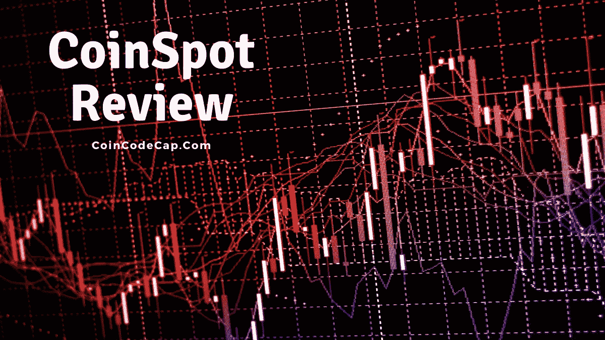

# 什么是 CoinSpot？

在本文中，我们将回顾由 Russell Wilson 于 2013 年创立的澳洲领先的加密货币交易所 [**CoinSpot exchange**](http://blog.coincodecap.com/go/coinspot) 。

[**coin spot**](http://blog.coincodecap.com/go/coinspot)exchange 已经获得 ISO 信息安全认证，旨在提供轻松舒适的 250 多种加密货币体验。

# CoinSpot 评论:摘要

1.  超过 250 种加密货币可供选择
2.  澳大利亚受管制的金融部门监管着[**coin spot exchange**](http://blog.coincodecap.com/go/coinspot)
3.  通过澳大利亚各地的 BlueShyft 站点，您可以使用澳元、里坡、BPAY、PayID 和现金进行各种存款。
4.  任何加密货币都没有提款或存款限制
5.  即时“买/卖”和互换是可用的
6.  通过捆绑使您的投资组合多样化，无需支付多项费用
7.  提供多硬币钱包
8.  [**CoinSpot**](http://blog.coincodecap.com/go/coinspot) 在 Andriod 和 iOS 上都有手机 app
9.  易于理解的用户界面

# 如何使用 CoinSpot？

以下是开始使用 CoinSpot 的步骤。

## **创建账户并登录**

1.  访问 [**CoinSpot**](http://blog.coincodecap.com/go/coinspot) ，点击顶部的“注册”。输入您的所有详细信息，然后单击“创建帐户”当您在电子邮件地址上收到验证链接时，请单击它。您的 CoinSpot 帐户在验证您的电子邮件地址后创建。以后就可以第一次登录 CoinSpot 了。

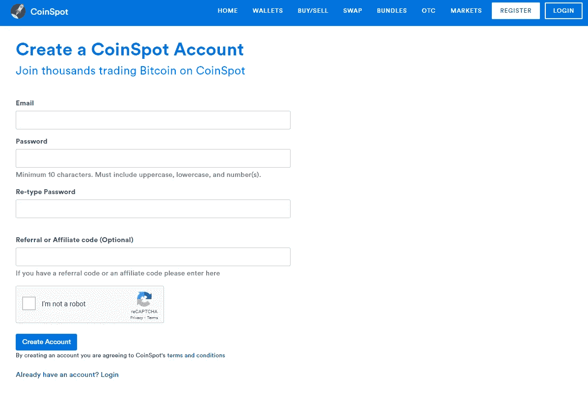

## **CoinSpot 验证**

您刚刚创建的基本 [**CoinSpot**](http://blog.coincodecap.com/go/coinspot) 帐户只会让您探索平台。您需要 CoinSpot 验证来存取资金。您必须证明您的身份文件，以完成验证过程。完成这一步后，您每天最多可以存入 2000 澳元，也可以提取资金。这些是你需要的文件:

*   全名
*   出生日期
*   电话号码
*   居住地址
*   附有住址证明的有效身份证或护照复印件
*   举着身份证件的自拍照片

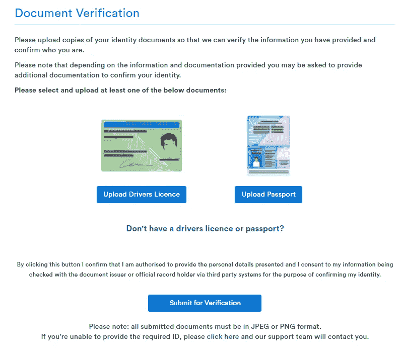

## **将资金存入 CoinSpot**

有多种支付方式将资金存入账户。最常见的选择是通过银行转账，使用直接存款，里坡，PayID。并非每种支付方式都会产生交易费用。通常不建议使用现金支付和现金存款，因为要收费。

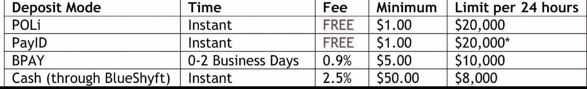

# 交易日 [**现货日**](http://blog.coincodecap.com/go/coinspot)

## 在 Coinspot 上下单

你可以点击任何硬币市场来访问当前价格和其他数据点。之后，你可以利用这些信息进行投机，并从硬币的短期价格变动中获利。

有一个订单文本框可以出售或购买对澳元的加密货币。手动填写订单。界面简单易懂。

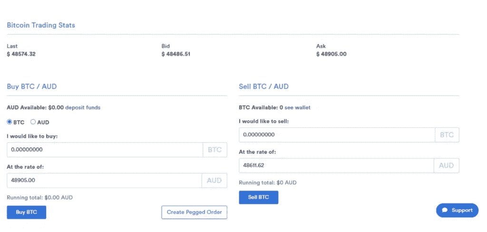

# CoinSpot 评论:即时买卖加密货币

可以在 [**CoinSpot**](http://blog.coincodecap.com/go/coinspot) 上即时买卖比特币等加密货币。只需点击顶部的“购买/出售”链接。你可以从 200 多种硬币中选择，用澳元进行买卖。

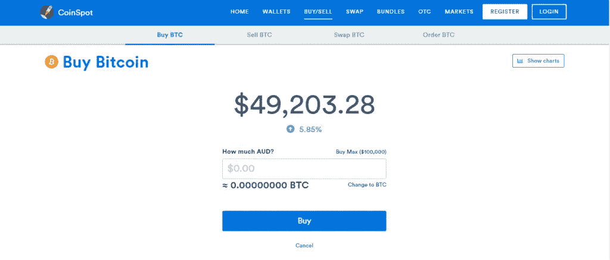

# 如何在 CoinSpot 上购买比特币

CoinSpot 提供了一种简单易行的购买比特币的方法。要在 [CoinSpot](https://blog.coincodecap.com/go/coinspot) 上购买比特币，请遵循以下步骤:

*   你会看到一个输入框，需要填写购买比特币的澳元金额。
*   等量的比特币会以目前的市场汇率出现。
*   点击“购买”购买。

虽然这种选择很方便，但为了方便起见，它收取 1%的交易费。费用相对高于澳洲其他加密货币交易所。

# CoinSpot 评论:互换加密货币

在 [**CoinSpot**](http://blog.coincodecap.com/go/coinspot) 上用超过 200 种可用的加密货币交换现有的加密货币。您可以在不使用 KYC 的情况下使用此选项，也可以在不提供任何身份信息的情况下交换货币。

# CoinSpot 包

该功能为您提供了同时购买一篮子不同加密货币的机会。你可以轻松地分散投资组合，而无需支付多项费用。

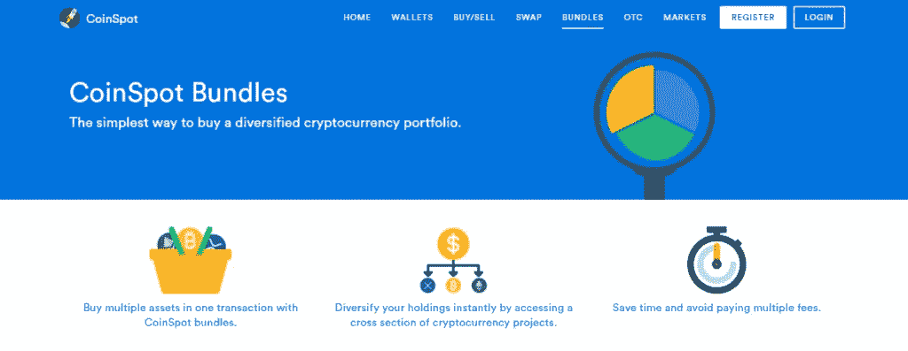

# CoinSpot 安全吗？

[**CoinSpot**](http://blog.coincodecap.com/go/coinspot) 将大部分资产存放在极其安全的离线钱包中。此外，CoinSpot 一生中从未被黑过一次。

此外，CoinSpot 获得了国际公认的 ISO 27001 高级信息安全认证。 [CoinSpot](http://blog.coincodecap.com/go/coinspot) 官网声明，

> “这些严格的政策旨在消除未经授权的访问、使用、破坏、修改或关闭组织的信息管理系统。”
> 
> *CoinSpot 网站*

此外，该平台还为您的帐户提供了一套可定制的安全设置。自定义取款限制、[双因素认证](https://en.wikipedia.org/wiki/Multi-factor_authentication)和会话超时限制设置可以保护帐户。

综上所述， [**CoinSpot**](http://blog.coincodecap.com/go/coinspot) 既安全又可信。

# CoinSpot 受监管吗？

澳大利亚受监管的金融部门监管硬币现货交易。澳大利亚政府金融机构 AUSTRAC 密切关注所有的金融交易。该机构识别洗钱、恐怖主义、逃税、福利欺诈、有组织犯罪。

# CoinSpot 评论:支持的加密货币

您可以选择购买、交换或出售 250 多种加密货币。支持的加密货币有以太坊、[比特币](https://blog.coincodecap.com/a-candid-explanation-of-bitcoin)、莱特币、Ripple、NEO、EOS、Stellar、Tron 等。 [**CoinSpot**](http://blog.coincodecap.com/go/coinspot) 也支持知名的 [DeFi](https://blog.coincodecap.com/the-ultimate-guide-to-defi-decentralized-finance) 硬币和代币。Uniswap、Compound、Aave 就是其中的几个例子。

# 硬币现货费

[**CoinSpot**](http://blog.coincodecap.com/go/coinspot) 主要有 3 种费用。

1.  存取费
2.  交易费用

# 存款/取款费

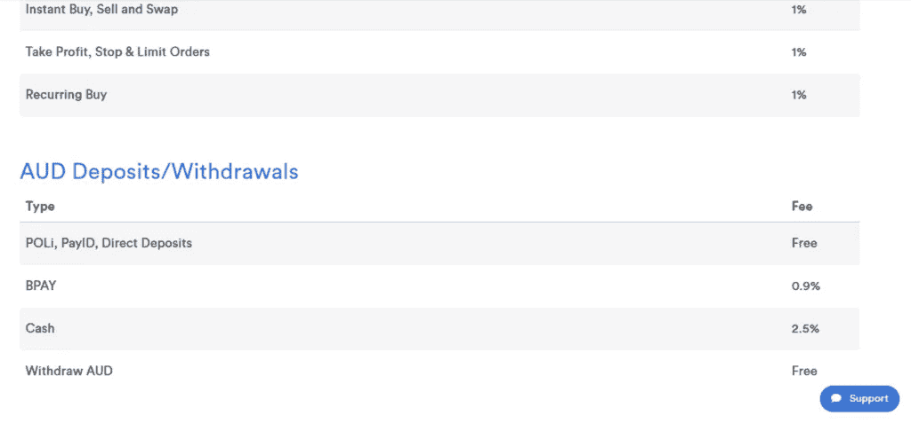

# 硬币现货交易费

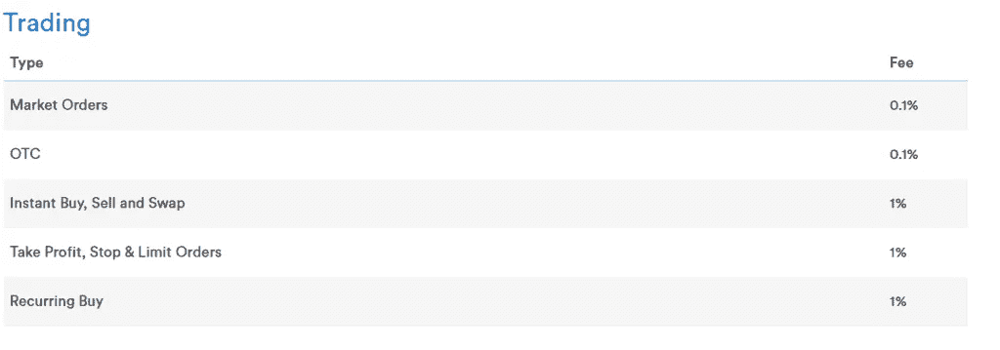

[**CoinSpot**](http://blog.coincodecap.com/go/coinspot) 当你向外部钱包发送硬币时，会向你收取标准的交易费。每枚硬币的费用不同，因为费用取决于特定的区块链。钱包页面总是显示当前费用。

# CoinSpot 钱包评论

硬币兑换包括一个 T2 多硬币钱包。您可以在 Coinspot Wallet 上存入任何可用的加密货币。此外，提取任何代币和硬币都不会产生额外的费用。你仍然需要支付标准的交易/采矿费用。此外，它还能让你跟踪你最近的所有交易和你个人的硬币余额。

除此之外，它还提供帐户范围内的提款禁令和双重认证，以确保您的资产安全。因此，我们可以说 CoinSpot 钱包对于新手和中级交易者来说是一个高效安全的解决方案。

# CoinSpot 评论:用户界面

[**CoinSpot 的**](http://blog.coincodecap.com/go/coinspot) 界面非常直白清晰。仪表板上的交易功能允许您在一个位置检查多个钱包。每个资源旁边都有一个按钮。您可以使用这些按钮快速买卖订单或查看价格图表。你可以看到投资组合的直观图表，上面有硬币持有量的分布及其百分比。同样，您可以跟踪整体绩效。

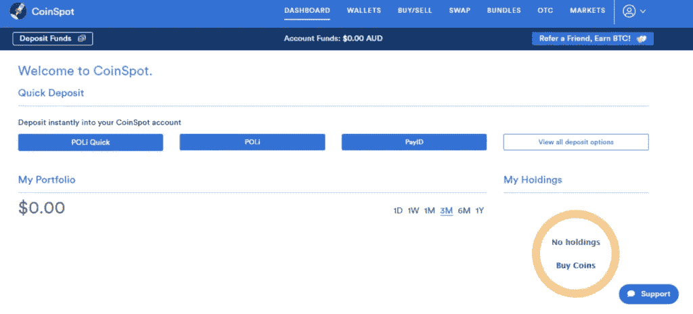

中级和高级交易者有交易工具，如指标、趋势线和技术模式。

[Coinspot 的](http://blog.coincodecap.com/go/coinspot)布局与 [TradingView](https://blog.coincodecap.com/go/tradingview) 整合。这为交易者提供了流畅的体验。

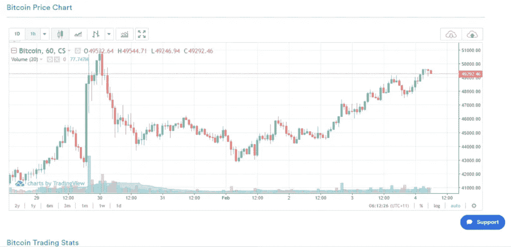

# CoinSpot 应用程序

[**CoinSpot**](http://blog.coincodecap.com/go/coinspot) 在 Andriod 和 iOS 上也有手机应用。您可以在一个地方查看价格图表、出售、交易、购买、从钱包转账、跟踪您的加密货币投资组合。

*   [点击此处下载 Android 版 CoinSpot！](https://play.google.com/store/apps/details?id=com.coinspot.app)
*   [点击此处下载 iOS 版 CoinSpot！](https://apps.apple.com/au/app/coinspot-buy-sell-bitcoin/id1541949985)

# CoinSpot 推荐计划

与朋友分享推荐代码。在你的朋友存入第一笔澳元后，你们两人都会收到价值***【10】美元的比特币*** 。

# 客户支持

通过他们的[服务台](https://www.coinspot.com.au/contact)联系 [**CoinSpot 的**](http://blog.coincodecap.com/go/coinspot) 支持团队 24/7！您还可以在整个实时聊天操作时间内与他们即时通话！

# Coinspot 评论:利弊

# 赞成的意见

1.  有超过 250 种加密货币可供选择
2.  简单易懂的基本界面
3.  福利丰厚的推荐计划
4.  信息安全受到高度重视
5.  通过电子邮件或聊天全天候联系

# 骗局

1.  即时买卖等功能的费用相对较高
2.  仅限于加密货币
3.  只能用澳元交易加密货币
4.  只有澳大利亚居民可以访问该平台

# CoinSpot 审查:结论

[**CoinSpot**](http://blog.coincodecap.com/go/coinspot) 是一个安全的加密交换，具有类似银行的安全性。作为 250 多种可用货币的结果，这种交换可以提供流动性和简单的用户界面。新手和中级交易者可以享受这个平台的不同方面。

# 常见问题(FAQ)

**coin spot 验证需要多长时间？**

你必须完成三个步骤。您的 CoinSpot 帐户验证将立即进行，您每天最多可以存款 2000 美元。
1。首先验证您的电话号码和电子邮件地址。
2。填写您的个人详细信息。
3。最后一步是上传你的护照或驾照的照片。

**我该如何销售 CoinSpot 捆绑包？**

你有完全的灵活性，因为你可以单独或单独出售一捆硬币。例如，你买了一个有五枚硬币的包裹。如果你只想卖掉一捆硬币中的一个，你可以继续。如果你想卖掉所有的硬币，你必须一个一个地卖掉。

**coin spot 接受哪些银行的里坡存款？**

当您开始里坡存款过程时，会出现一个显示所有受支持银行的列表。

谁拥有 CoinSpot？

CoinSpot 是由 Casey Block Services Pty Ltd .拥有和控制的澳大利亚加密交易所。

> 加入 T21 电报集团，学习加密交易和投资

## 另外，阅读

*   什么是[闪贷](https://blog.coincodecap.com/what-are-flash-loans-on-ethereum)？
*   最好的[密码交易机器人](/coinmonks/crypto-trading-bot-c2ffce8acb2a) | [网格交易](https://blog.coincodecap.com/grid-trading)
*   [3 商业评论](/coinmonks/3commas-review-an-excellent-crypto-trading-bot-2020-1313a58bec92) | [Pionex 评论](/coinmonks/pionex-review-exchange-with-crypto-trading-bot-1e459d0191ea) | [Coinrule 评论](https://blog.coincodecap.com/coinrule-review-a-perfect-trading-bot)
*   [AAX 交易所评论](/coinmonks/aax-exchange-review-2021-67c5ea09330c) | [德里比特评论](/coinmonks/deribit-review-options-fees-apis-and-testnet-2ca16c4bbdb2) | [FTX 密码交易所评论](/coinmonks/ftx-crypto-exchange-review-53664ac1198f)
*   [n 零审核](/coinmonks/ngrave-zero-review-c465cf8307fc)
*   [按位交换审查](/coinmonks/bybit-exchange-review-dbd570019b71) | [位码审查](https://blog.coincodecap.com/bityard-reivew)
*   [3Commas vs Cryptohopper](/coinmonks/3commas-vs-pionex-vs-cryptohopper-best-crypto-bot-6a98d2baa203)
*   最好的比特币[硬件钱包](/coinmonks/the-best-cryptocurrency-hardware-wallets-of-2020-e28b1c124069?source=friends_link&sk=324dd9ff8556ab578d71e7ad7658ad7c) | [BitBox02 回顾](/coinmonks/bitbox02-review-your-swiss-bitcoin-hardware-wallet-c36c88fff29)
*   [莱杰 vs n rave](https://blog.coincodecap.com/ngrave-vs-ledger)|[莱杰 nano s vs x](https://blog.coincodecap.com/ledger-nano-s-vs-x)
*   [密码拷贝交易平台](/coinmonks/top-10-crypto-copy-trading-platforms-for-beginners-d0c37c7d698c) | [比特码拷贝交易](https://blog.coincodecap.com/bityard-copy-trading)
*   [Vauld 审查](https://blog.coincodecap.com/vauld-review) | [YouHodler 审查](/coinmonks/youhodler-4-easy-ways-to-make-money-98969b9689f2) | [BlockFi 审查](/coinmonks/blockfi-review-53096053c097)
*   最好的[加密税务软件](/coinmonks/best-crypto-tax-tool-for-my-money-72d4b430816b) | [硬币追踪评论](/coinmonks/cointracking-review-a-reliable-cryptocurrency-tax-software-5114e3eb5737)
*   最佳[密码借贷平台](/coinmonks/top-5-crypto-lending-platforms-in-2020-that-you-need-to-know-a1b675cec3fa)
*   [莱杰纳米 S vs 特雷佐 one vs 特雷佐 T vs 莱杰纳米 X](https://blog.coincodecap.com/ledger-nano-s-vs-trezor-one-ledger-nano-x-trezor-t)
*   [BlockFi vs 摄氏](/coinmonks/blockfi-vs-celsius-vs-hodlnaut-8a1cc8c26630) | [霍德瑙特评论](https://blog.coincodecap.com/hodlnaut-review)
*   [Bitsgap 审查](/coinmonks/bitsgap-review-a-crypto-trading-bot-that-makes-easy-money-a5d88a336df2) | [Quadency 审查](/coinmonks/quadency-review-a-crypto-trading-automation-platform-3068eaa374e1)
*   [埃利帕尔泰坦评论](/coinmonks/ellipal-titan-review-85e9071dd029) | [赛克斯斯通评论](https://blog.coincodecap.com/secux-stone-hardware-wallet-review)
*   [DEX Explorer](https://explorer.bitquery.io/ethereum/dex) 和[区块链 API](https://explorer.bitquery.io/graphql)
*   [最佳区块链分析工具](https://bitquery.io/blog/best-blockchain-analysis-tools-and-software)
*   加密套利指南:新手如何赚钱
*   最佳[加密制图工具](/coinmonks/what-are-the-best-charting-platforms-for-cryptocurrency-trading-85aade584d80) | [最佳加密交易所](https://blog.coincodecap.com/crypto-exchange)
*   了解比特币的[最佳书籍有哪些？](/coinmonks/what-are-the-best-books-to-learn-bitcoin-409aeb9aff4b)

> [直接在您的收件箱中获得最佳软件交易](/coinmonks/newsletters/coinmonks)

*原载于 2021 年 2 月 4 日 https://blog.coincodecap.com***。**