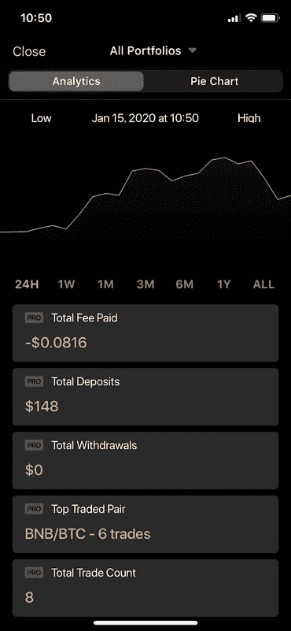

# Blockfolio vs CoinStats:跟踪您的加密组合的最佳方式是什么？

> 原文：<https://medium.com/coinmonks/coinstats-vs-blockfolio-e698938c6f9e?source=collection_archive---------3----------------------->

加密跟踪工具通过给你实时的价格更新，通知，加密相关的新闻和更多，让你在你的财产之上。在这篇文章中，你可以看到我最喜欢的两个应用的对比: *CoinStats* 和 *Blockfolio*

让我们一步步探索这两款应用，看看它们如何满足我们的需求**章节**

*   定价
*   项目组合:创建和管理
*   硬币:交易，交换可用性
*   通知细节
*   新闻和社区
*   用户界面/UX 和图形差异

## **定价**

Blockfolio 是免费使用的，CoinStats 有一个 PRO 选项，每月(4.99 美元)和每年(39.99 美元)订阅。然而，Blockfolio 中所有免费的选项在 CoinStats 中也是免费的。在这里，您只需为 Blockfolio 中找不到的高级功能付费。

# **投资组合:创建和管理**

[投资组合管理软件](https://coincodecap.com/category/portfolio-management)帮助规划、跟踪、分析和构建加密投资组合，管理资产分配和加密货币投资策略。

**钱包作为投资组合连接机会**

加密货币投资组合应用程序允许您在一个地方持有、交易、管理和分析您的加密资产。CoinStats 可以让你将钱包连接到应用程序，而 Blockfolio 则不能。

这个功能使整个过程更容易，因为你可以从一个平台上管理所有的硬币。没必要一直检查你的钱包。随时连接创，波，莱杰，尼奥，IOST，XRP 和许多其他人。

此外，如果您在 CoinStats 中找不到钱包，请随时[申请钱包](https://feedback.coinstats.app/)。对于 Blockfolio，您只能连接和跟踪您的 exchange 帐户

CoinStats

## **投资组合创建简单性**

你是加密货币领域的新手吗？不知道如何创建投资组合，添加交易所/钱包？找不到跟踪您在 CoinStats/Blockfolio 上的余额所需的 API？别担心，CoinStats 为您提供了最佳解决方案:**指南** —此选项让您节省时间并简化流程。Blockfolio 漏掉了这一部分。当你点击“添加作品集”时，它只会显示你需要下载所有东西的地方

CoinStats

## **投资组合分析机会**

CoinStats 为您提供投资组合分析机会，帮助您及时了解您的总支付额、总存款额、总提款额、最高交易对、总交易数，并查看您投资组合硬币的饼状图。Blockfolio 缺少此选项

CoinStats

# **硬币:交易、兑换可用性**

## **硬币可用性**

Blockfolio 提供 8000 多枚硬币，而 CoinStats 提供近 6700 枚硬币。尽管有这样的差异，你仍然可以在 CoinStats 中找到最受欢迎的硬币。所以根据你的目标来选择应用。

## **交换连接可用性**

我们做交易需要什么？交换。Blockfolio 和 CoinStats 都为您提供交换选择机会，但 Blockfolio 将您与 10 和 CoinStats 7 联系起来。然而，CoinStats 有一个非常有用的 Apple Pay 机会

CoinStats

## **硬币配对差异**

Blockfolio 和 CoinStats 的配对策略不同。在 Blockfolio 中，你不能用你拥有的硬币购买任何其他硬币。你必须配对。在 CoinStats 的例子中，你可以自由地买卖每一枚硬币，而不用担心配对问题

Blockfolio

## **最喜欢的硬币 vs 观看列表**

CoinStats 和 Blockfolio 都有硬币偏好机会来跟踪特定硬币的变化。应用程序之间的区别如下:

Blockfolio 会自动将投资组合硬币添加到观察列表中，并且在您决定将其从观察列表中移除时，会通知您“与此硬币相关的任何持有物也将被移除”。

CoinStats 将这些选项分开保存，因此，如果您从收藏列表中删除一枚硬币，什么也不会发生

Blockfolio

# **通知细节**

## **警报和通知差异**

CoinStats 有更多种类的警报和通知。您可以选择重大变化，泵，新对，团队更新，投资组合价值，甚至自定义通知您想要的时间，而 Blockfolio 只允许信号和价格变化通知

Blockfolio

CoinStats

关于加密的一些矛盾的想法是，一方面，我们希望得到每一个变化的更新，另一方面，不要花一天的时间每分钟检查手机。为了解决这个问题，需要一些真正精确和有用的通知系统

# **新闻和社区**

## **一般 vs 分类新闻**

Blockfolio 提供一般新闻。看起来这个团队并不是那么专注于新闻部分。相反，CoinStats 有各种各样的新闻阅读选项(精选、趋势、最新)。您可以为新闻投票，并将其添加到看跌和看涨部分，此外，CoinStats 还让您有机会选择您的来源并将其添加到新闻来源中。您可以在这个应用程序中自由创建您的一体化加密新闻阅读平台

Blockfolio vs Coinstats

## **block folio Signals VS coin stats 团队更新**

在 crypto with Blockfolio Signals (BS)上获取您的第一手信息，这是一个专门为 token 团队构建的首款通信平台，用于连接和参与他们的社区。作为一个选择，CoinStats 有它的团队更新，你可以找到每个加密的更新，同时探索那个加密。在这种情况下，信息比 Blockfolio 中的信息更具体，在 Blockfolio 中，信号没有分类，而是出现在通用信号页面中，但 block folio 与令牌团队有更多联系，因此您可以在那里获得更多信息

Blockfolio vs Coinstats

# **用户界面/UX 和图形差异**

**UI/UX 差异**

花一整天去发现可能有用的特性是令人疲惫的。我们需要什么来获得所需的经验？我们需要选择一个易于使用的应用程序。如果我们从可用性的角度考虑，最好的解决方案是 CoinStats，当考虑颜色、渐变、UI 选项时，我们肯定会选择 Blockfolio。我在 CoinStats 中看重的是“直奔主题”的方法。你需要检查你的投资组合吗？就在主页上。你搜索一些新闻吗？当然，接受它，评估它，让它看涨或看跌，添加你的来源，享受你的时间

Blockfolio 的 UI 比 CoinStats 更自定义:很多颜色，组合颜色很漂亮但是影响了可用性。这里你需要在 Blockfolio UI 和 CoinStats 简单性之间做出选择

## **图表中的差异**

我们可以用两个标准来讨论图形差异:UI 和图形更新时间

UI:你可以在 Blockfolio 和 CoinStats 上看到 lightlike 和普通图形。在这种情况下，CoinStats UI 更具交互性，因为它不是向您显示一个静态的图形，而是一个灵活的图形。你可以用手指在图上滑动，获得精确的数量/时间信息。CoinStats 的另一个 UI 细节是，它将图形颜色更改为最流行硬币的标志颜色

硬币的更新时间:更新时间图也各不相同。在 CoinStats 中是 24 小时、1 周、1 米、3 米、6 米和一年。Blockfolio 让您有机会看到一个小时，12H，1D，三维，1，3，6 米和 1，2，3 年的更新。此外，两者都有持续更新，所以你可以随时看到发生了什么

Blockfolio vs Coinstats

# 你应该选择哪一个？

您的投资组合选择取决于您的目的和目标，因为很容易找到每个解决方案的利弊。设定你的目标，选择标准，获得最佳选择:CoinStats 或 Blockfolio

对 CoinStats 感兴趣？以下是[网站](https://coinstats.app/)、 [iOS](https://apps.apple.com/us/app/coin-stats-crypto-portfolio/id1247849330) 和 [Android](https://play.google.com/store/apps/details?id=com.coinstats.crypto.portfolio&hl=en_US) 应用、 [Chrome](https://chrome.google.com/webstore/detail/coinstats-crypto-portfoli/fbbckponafgkennhnmgfoikfmbkiplgp) 和 [Firefox](https://addons.mozilla.org/en-US/firefox/addon/coinstats/) 扩展的链接

对 Blockfolio 感兴趣？通过提到的链接查看 Blockfolio [网站](https://blockfolio.com/)、 [iOS](https://apps.apple.com/us/app/blockfolio-crypto-tracker/id1095564685) 和 [Android](https://play.google.com/store/apps/details?id=com.blockfolio.blockfolio&hl=en) 。

> [直接在您的收件箱中获得最佳软件交易](https://coincodecap.com/?utm_source=coinmonks)

