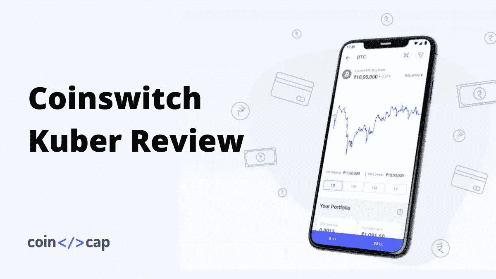
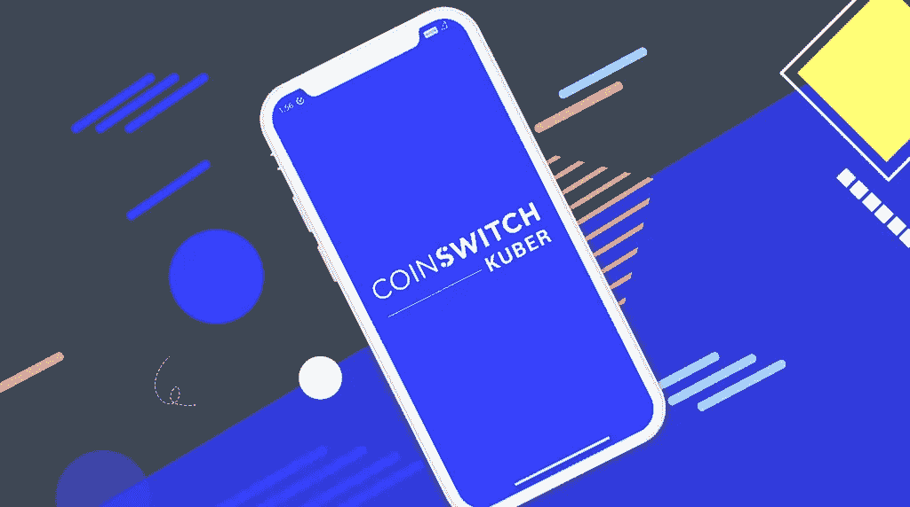
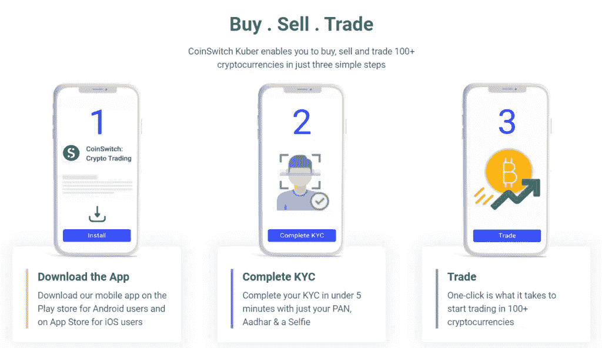
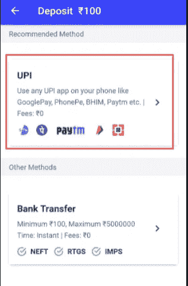
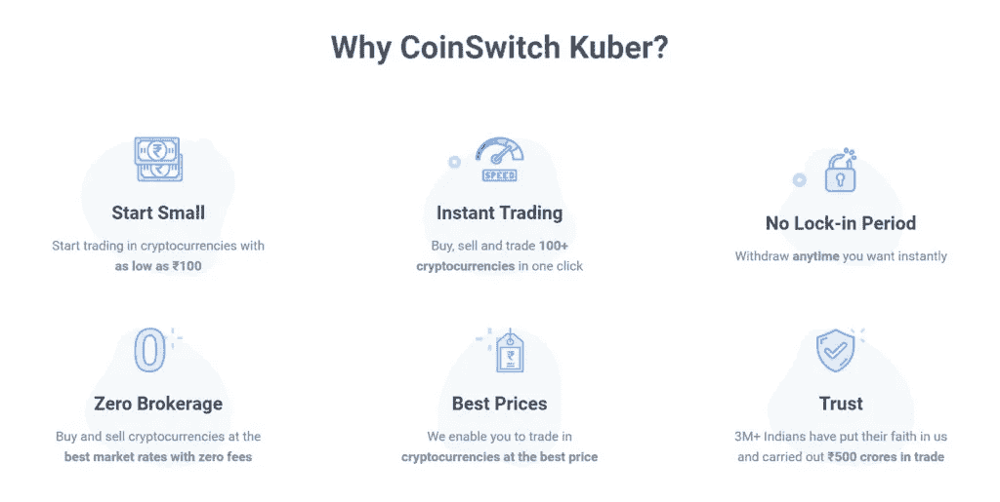

# 俱吠罗评论 2021:印度最好的交易所？

> 原文：<https://medium.com/coinmonks/coinswitch-kuber-review-1a8dc5c7a739?source=collection_archive---------5----------------------->

Coinswitch Review

在本次 [**Coinswitch 俱吠罗**](https://blog.coincodecap.com/go/coinswitch) 回顾中，我们将介绍数字资产交易的所有相关步骤。此外，我们还将了解平台的费用、安全性以及最重要的利弊。平台稳定，保证你的钱安全。但是，在投资您的血汗钱之前，总是建议您浏览平台的工作并获得知识。

# 总结(TL；博士)

*   [**Coinswitch 俱吠罗**](https://blog.coincodecap.com/go/coinswitch) 拥有超过 400 万印度人的庞大用户群，支持 100 多种加密货币。
*   用户只需 100 印度卢比就可以开始投资。
*   无存取款手续费。
*   KYC 和注册过程既快又简单。
*   该平台甚至不收取买卖密码的费用。
*   这是一个初学者友好和安全的应用程序。
*   他们支持合众国际社支付以及 NEFT 和 IMPS 银行存款。
*   [Coinswitch](https://blog.coincodecap.com/go/coinswitch) 还有一个专用的简化支持系统，提供支持票和实时聊天选项来提交问题。
*   [Coinswitch](https://blog.coincodecap.com/go/coinswitch) 是印度[最著名的密码交易所](https://blog.coincodecap.com/bitcoin-exchange-in-india)之一。

> 使用代码 **Rd8P** 获得交易费折扣。

# 什么是 Coinswitch 俱吠罗？

[Coinswitch 俱吠罗](https://blog.coincodecap.com/go/coinswitch)是一家[印度加密货币交易所](https://blog.coincodecap.com/bitcoin-exchange-in-india)。平台 [Coinswitch](https://blog.coincodecap.com/go/coinswitch) 由 Ashish Singhal、Govind Soni 和 Vimal Sagar Tiwari 于 2017 年创立。此外，该平台于 2020 年 6 月推出了其印度专用版本，现名为 Coinswitch 俱吠罗。截至 2021 年 6 月，该平台为超过 500 万用户提供服务。

Coinswitch 是最安全和用户友好的平台之一，有 100 多种加密货币可供用户使用。此外，与其他产生流动性的传统交易所不同，Coinswitch 不产生流动性。相反，这个平台连接到多个交易所，为用户找到最佳汇率。该平台还宣布其 medium 博客将推出 Coinswitch Pro，但它似乎不会很快推出。

# Coinswitch 俱吠罗评论:对印度密码市场的影响

该平台成功地为加密市场的印度用户带来了简单易用的体验。我们知道用户友好平台的重要性，Coinswitch 俱吠罗 也在为您提供同样的服务。Coinswitch 消除了所有的复杂性。

它所呈现的只是 cryptomarket 新手的用户友好体验。随着印度 crypto 的出现，这种基于应用程序的平台是最高效、最容易使用的。

如果你是加密交易的新手，请阅读我们的[加密货币投资终极指南](https://blog.coincodecap.com/crypto-investing-guide)，以更好地了解印度的加密交易。

# Coinswitch 应用程序

交易交易所完全以移动用户为中心，旨在使交易成为一个远程过程。该平台仅向其交易员提供 Coinswitch 应用程序，该平台没有桌面版。

使用代码 **Rd8P** 获得交易费折扣。

# 如何在俱吠罗交易？

要开始在 [Coinswitch 俱吠罗](https://blog.coincodecap.com/go/coinswitch)上交易，你首先必须注册自己，完成你的 KYC，存款或加密货币，然后你就可以开始交易了。

## 在俱吠罗 Coinswitch 注册

CoinSwitch 俱吠罗应用程序适用于 Android 和 iOS 用户。要注册自己，首先，下载 Coinswitch 应用程序。此外，CoinSwitch 只要求您的电话号码来注册他们的应用程序。输入您的号码后，请等待 OTP，验证它，并为您的应用程序设置 pin。

## 如何完成你的 KYC？

为了存入任何金额或者买卖加密资产，用户必须完成他们的 KYC。此外，KYC 流程相对简单，有了正确的文件，只需 10-15 分钟即可完成和验证。此外，您将需要以下文档来完成该过程:

*   PAN 卡
*   身份证、护照和选民证(任何人)。

[Coinswitch 俱吠罗](https://blog.coincodecap.com/go/coinswitch) KYC 流程分为初级验证、Pan 卡验证和身份证验证。

要进入验证过程，请打开应用程序，进入“设置”，点击“用户验证”，然后点击“基本验证”

## 基本验证

在这一关，你必须填写自己的基本信息，包括全名、出生日期和你的电子邮件 id。然后，你会在你的电子邮件 id 上收到一个动态口令，复制并粘贴它。一旦完成，你就完成了第一关。

## Pan 卡验证

点击“Pan 卡验证”开始你的下一关。允许应用程序访问您的相机，并点按您的 Pan 卡的照片。然后，点击提交。4-5 分钟后，它将得到验证。

## 身份证验证

要完成 KYC 的这一部分，您必须提交您的身份证图像、护照图像或选民 Id:

1.  选择您有文档的那个。
2.  单击图像并提交。
3.  等待几分钟，它将被验证。

# Coinswitch 俱吠罗评论:转账限额

[Coinswitch 俱吠罗](https://blog.coincodecap.com/go/coinswitch)不限制其用户的最大或最小交易量。但是，金额不应该是微薄的，用户应该记住，金额涵盖了整个网络费用。

## 在 coinswitch 俱吠罗存款的步骤

按照以下步骤将印度卢比存入您的 [Coinswitch 俱吠罗](https://blog.coincodecap.com/go/coinswitch)账户:

*   打开应用程序，点击“存款印度卢比”
*   输入您要存入的金额。请注意，您可以存款的最低金额是卢比。100.
*   点击“存款”
*   用户可以通过 UPI 或直接银行存款(通过 NEFT、IMPS 或 RTGS)存入资金。
*   如果您想通过 UPI 存款，请点击“UPI”选项。
*   选择您喜欢的 UPI 应用程序。之后，您将被重定向到 UPI 应用程序，在这里您需要填写资金。
*   但是，如果您选择直接银行存款，您需要将资金发送到将提供详细信息的帐户。

请注意，您首先需要在 [Coinswitch 俱吠罗](https://blog.coincodecap.com/go/coinswitch)应用程序中填写您的银行详细信息。这是使用直接银行存款方法存款 INR(如果您之前没有这样做)。

> 使用代码 **Rd8P** 获得交易费折扣。

# 俱吠罗评论:限价单

[硬币开关俱吠罗](https://blog.coincodecap.com/go/coinswitch)限价单让你对你的交易下限价单。要下限价单，用户可以填写他们希望购买或出售密码的价格和数量。所以，如果市价达到你的限价，平台就会执行交易。

## 在俱吠罗 Coinswitch 购买密码的步骤

*   点击 [Coinswitch 俱吠罗](https://blog.coincodecap.com/go/coinswitch)移动应用程序底部导航菜单中的“市场”部分。
*   你会在那里找到所有可用的加密货币。
*   搜索您喜欢的加密货币的名称并点击它。
*   你会在左下角看到“购买”按钮。点击它。
*   输入你想购买的数量，然后点击“预览购买”
*   检查你将收到的硬币数量，最后点击“购买”
*   资产将被购买，它们将在您的投资组合中可用。

# 硬币转换费

[Coinswitch 俱吠罗](https://blog.coincodecap.com/go/coinswitch)既不收存款费，也不收取款费。该平台还声称，前 100 天没有 Coinswitch 费用。但是一旦这个期限结束，平台会根据你选择的交易所收取 0%到 0.5%的交易费用。

# 支持的加密货币

[俱吠罗 coin switch](https://blog.coincodecap.com/go/coinswitch)向用户提供 500 多种加密货币，用户可以买卖。这些加密货币包括:-

1.  破折号
2.  新的
3.  涟漪
4.  比特币
5.  边缘

# Coinswitch 俱吠罗评论:推荐系统

Coinswitch 俱吠罗推荐程序是用户喜欢的少数功能之一。在这个项目下，用户每成功推荐一次，就有机会获得价值 50 印度卢比的 BTC。每个注册用户都有资格赢得这项奖励。但是，要获得补偿，请记住以下几点:

*   推荐人应该使用推荐链接下载申请并完成他们的 KYC。
*   KYC 是强制性的裁判，这样你就可以赢得奖励。
*   此外，确保推荐人必须在链接过期前下载它。

# 俱吠罗 Coinswitch 的奖励系统

Coinswitch 俱吠罗公司的奖励系统是基于优惠券的。为了获得它们，用户必须完成一些里程碑。例如，当用户验证他们的账户时，Coinswitch 会发放奖励券。您可以从礼品部分访问奖励优惠券，该部分显示为一个浮动按钮。

# Coinswitch 俱吠罗评论:客户支持

[Coinswitch 俱吠罗](https://blog.coincodecap.com/go/coinswitch)客户支持有简短和专门的常见问题解答部分，供用户澄清他们的疑问。此外，他们甚至为仍有任何疑问的用户提供票证支持。您也可以选择他们的实时聊天选项，时间是早上 7:00 到晚上 10:00。另一个联系支持团队的方法是给 support@coinswitch.co 发电子邮件。典型地；他们会在 12 小时内回复。

# 俱吠罗评论:安全性

Coinswitch 俱吠罗(T1)是最稳定和最负盛名的 T2 密码交易所之一(T3)，它有充足的资金来保护用户的资产安全。他们让用户完成他们的 KYC，以保持透明度。此外，Coinswitch 服务符合 [ISO 27001](https://www.iso.org/isoiec-27001-information-security.html) 和 [SOC2 Type II](https://en.wikipedia.org/wiki/System_and_Organization_Controls) 认证。此外，他们声称他们非常重视用户的安全，因此相应地维护应用程序。

# 为什么 Coinswitch 俱吠罗是印度最好的交易平台？

[CoinSwitch 俱吠罗](https://blog.coincodecap.com/go/coinswitch)可以被称为[最佳比特币交易所](https://blog.coincodecap.com/bitcoin-exchange-in-india)，因为它维护着超过 100 万个账户，牢记每个用户的诚信，并为他们提供最好的功能。即时转账在用户中建立了信任，因为钱是每个人的优先事项。

Coinswitch 俱吠罗应用程序最适合缺乏经验的初学者。在印度，对投资加密货币感兴趣的人数正在迅速增加。他们找不到比 Coinswitch 俱吠罗更好的平台了。

# 硬币开关俱吠罗评论:利弊

## 赞成的意见

*   [Coinswitch 俱吠罗](https://blog.coincodecap.com/go/coinswitch)提供了一个对初学者友好且直观的界面。
*   它提供即时的印度卢比存款和提款。
*   无存取款手续费。
*   KYC 又快又矮。
*   没有交易限制(个别交易所强制实施的限制除外)。
*   支持合众国际社，NEFT，和 IMPS 银行存款。
*   良好的支持系统。
*   它在 Playstore 上获得了令人满意的评级。

## 骗局

*   不支持信用卡和借记卡。
*   不允许法定存款(仅印度卢比)
*   只对印度居民开放。
*   你不能在没有完成 KYC 的情况下使用这个基于应用的平台。
*   它不适合日间交易，因为平台缺乏工具。

使用代码 **Rd8P** 获得交易费折扣。

# 俱吠罗评论:结论

俱吠罗是印度人民中一个新兴的名字。这是一个安全的平台，是[加密货币交易所](https://blog.coincodecap.com/crypto-exchange)初学者的最佳选择。它提供 100 多种加密货币。同时，用户只需 100 印度卢比就可以开始交易。它不断将新的加密货币添加到其列表中并增强其安全性的方式将继续成为最可靠的平台之一。

该平台也很少遇到挫折，比如没有 KYC 就无法运行。此外，你不能管理密码之间的传输。该平台甚至不向用户收取一分钱的交易费。我给你的唯一建议是利用一个硬件钱包来存储你的大量加密资产。

# 常见问题

**如何在 Coinswitch 上购买比特币？**

首先，你需要访问俱吠罗官方网站。然后从下拉框中选择“印度卢比”和“BTC”。您可以在“查看所有优惠”部分查看所有优惠。其次，选择所需的选项。第三，填写 BTC 钱包的详细信息。最后，用印度卢比付款。

**coin switch 安全吗？**

是的， [Coinswitch 俱吠罗](https://blog.coincodecap.com/go/coinswitch)既合法又安全。直到现在，它从来没有被黑过。而且是非托管交易所，因此不托管用户资金。该平台非常重视用户的数据和资产，因此总是试图采用最新的安全实践。

**coin switch 的可靠性如何？**

在查看了用户无需任何忙乱的过程就能实现的所有特性之后，我们可以得出结论，它确实是有充分基础的。此外，超过 500 万人使用这个应用程序，这表明他们对 [Coinswitch 俱吠罗](https://blog.coincodecap.com/go/coinswitch)的信任。

**coin switch 俱吠罗客户服务号码是多少？**

根据 [Coinswitch](https://blog.coincodecap.com/go/coinswitch) 的说法，他们不提供任何客户服务号码。用户与他们联系的唯一方式是通过门票和实时聊天。

CoinSwitch 位于哪里？

该公司成立于 2017 年，位于卡纳塔克邦班加罗尔。 [Coinswitch 俱吠罗](https://blog.coincodecap.com/go/coinswitch)是在印度购买比特币的[最佳应用之一。](https://blog.coincodecap.com/buy-bitcoin-app-india)

*   [印度购买比特币的 7 大最佳应用【2021 手机版】](/coinmonks/buy-bitcoin-in-india-feb50ddfef94)
*   [2021 年如何在币安购买比特币？](https://blog.coincodecap.com/buy-bitcoin-binance)
*   [如何在印度购买以太坊？【手机和网站 2021】](https://blog.coincodecap.com/buy-ethereum-in-india)
*   币安卡评论:这是最好的加密卡吗？【2021】
*   [如何在 WazirX 2021 上购买比特币？【也适用于手机】](https://blog.coincodecap.com/buy-bitcoin-on-wazirx)

**披露:包含附属链接**

> 加入 [Coinmonks 电报频道](https://t.me/coincodecap)，了解加密交易和投资

## 另外，阅读

*   [尤霍德勒 vs 考尼洛 vs 霍德诺特](/coinmonks/youhodler-vs-coinloan-vs-hodlnaut-b1050acde55a) | [Cryptohopper vs 哈斯博特](https://blog.coincodecap.com/cryptohopper-vs-haasbot)
*   [币安 vs 北海巨妖](https://blog.coincodecap.com/binance-vs-kraken) | [美元成本平均交易机器人](https://blog.coincodecap.com/pionex-dca-bot)
*   [如何在印度购买比特币？](/coinmonks/buy-bitcoin-in-india-feb50ddfef94) | [WazirX 评论](/coinmonks/wazirx-review-5c811b074f5b) | [BitMEX 评论](https://blog.coincodecap.com/bitmex-review)
*   [比特币主根](https://blog.coincodecap.com/bitcoin-taproot) | [Bitso 评论](https://blog.coincodecap.com/bitso-review) | [排名前 6 的比特币信用卡](/coinmonks/bitcoin-credit-card-bc8ab6f377c6)
*   [双子座 vs 比特币基地](https://blog.coincodecap.com/gemini-vs-coinbase) | [比特币基地 vs 北海巨妖](https://blog.coincodecap.com/kraken-vs-coinbase) | [硬币罐 vs 硬币点](https://blog.coincodecap.com/coinspot-vs-coinjar)
*   [印度加密交易所](/coinmonks/bitcoin-exchange-in-india-7f1fe79715c9) | [比特币储蓄账户](/coinmonks/bitcoin-savings-account-e65b13f92451) | [Paxful 审核](/coinmonks/paxful-review-4daf2354ab70)
*   [杠杆令牌](/coinmonks/leveraged-token-3f5257808b22) | [最佳密码交易所](/coinmonks/crypto-exchange-dd2f9d6f3769) | [密码交易机器人](/coinmonks/crypto-trading-bot-c2ffce8acb2a)
*   [Godex.io 审核](/coinmonks/godex-io-review-7366086519fb) | [邀请审核](/coinmonks/invity-review-70f3030c0502) | [BitForex 审核](/coinmonks/bitforex-review-c4bb28d9e271) | [HitBTC 审核](/coinmonks/hitbtc-review-c5143c5d53c2)
*   [Crypto.com 费用](/coinmonks/binance-fees-8588ec17965) | [僵尸密码审查](/coinmonks/botcrypto-review-2021-build-your-own-trading-bot-coincodecap-6b8332d736c7) | [替代品](https://blog.coincodecap.com/crypto-com-alternatives)
*   [MXC 交易所评论](/coinmonks/mxc-exchange-review-3af0ec1cba8c) | [Pionex vs 币安](https://blog.coincodecap.com/pionex-vs-binance) | [Pionex 套利机器人](https://blog.coincodecap.com/pionex-arbitrage-bot)
*   [我的密码交易经验](/coinmonks/my-experience-with-crypto-copy-trading-d6feb2ce3ac5) | [比特币基地评论](/coinmonks/coinbase-review-6ef4e0f56064)
*   [加密货币储蓄账户](/coinmonks/cryptocurrency-savings-accounts-be3bc0feffbf) | [跑马圈地](https://blog.coincodecap.com/staking-crypto) | [盗 x 评论](/coinmonks/stealthex-review-396c67309988)
*   [BigONE 交易所评论](/coinmonks/bigone-exchange-review-64705d85a1d4) | [CEX。IO 审查](https://blog.coincodecap.com/cex-io-review) | [Swapzone 审查](/coinmonks/swapzone-review-crypto-exchange-data-aggregator-e0ad78e55ed7)
*   [最佳比特币保证金交易](/coinmonks/bitcoin-margin-trading-exchange-bcbfcbf7b8e3) | [Bityard 保证金交易](https://blog.coincodecap.com/bityard-margin-trading) | [Prokey 审核](/coinmonks/prokey-review-26611173c13c)
*   [加密保证金交易交易所](/coinmonks/crypto-margin-trading-exchanges-428b1f7ad108) | [赚取比特币](/coinmonks/earn-bitcoin-6e8bd3c592d9) | [Mudrex 投资](https://blog.coincodecap.com/mudrex-invest-review-the-best-way-to-invest-in-crypto)
*   [WazirX vs coin dcx vs bit bns](/coinmonks/wazirx-vs-coindcx-vs-bitbns-149f4f19a2f1)|[block fi vs coin loan vs Nexo](/coinmonks/blockfi-vs-coinloan-vs-nexo-cb624635230d)
*   [BlockFi 信用卡](https://blog.coincodecap.com/blockfi-credit-card) | [如何在币安购买比特币](https://blog.coincodecap.com/buy-bitcoin-binance) | [网格交易机器人](https://blog.coincodecap.com/grid-trading)
*   [加密副本交易平台](/coinmonks/top-10-crypto-copy-trading-platforms-for-beginners-d0c37c7d698c) | [五大 BlockFi 替代方案](https://blog.coincodecap.com/blockfi-alternatives)
*   [信用贷款审核](/coinmonks/coinloan-review-18128b9badc4)|[Crypto.com 审核](/coinmonks/crypto-com-review-f143dca1f74c) | [货币融资融券交易](/coinmonks/huobi-margin-trading-b3b06cdc1519)
*   [顶级付费加密货币和区块链课程](https://blog.coincodecap.com/blockchain-courses) | [币安评论](/coinmonks/binance-review-ee10d3bf3b6e)
*   [在美国如何使用 BitMEX？](https://blog.coincodecap.com/use-bitmex-in-usa) | [BitMEX 点评](https://blog.coincodecap.com/bitmex-review) | [币安 vs Bittrex](https://blog.coincodecap.com/binance-vs-bittrex)
*   [最佳免费加密信号](https://blog.coincodecap.com/free-crypto-signals) | [YoBit 评论](/coinmonks/yobit-review-175464162c62) | [Bitbns 评论](/coinmonks/bitbns-review-38256a07e161)
*   [OKEx 回顾](/coinmonks/okex-review-6b369304110f) | [Kucoin 交易机器人](/coinmonks/kucoin-trading-bot-automate-your-trades-8cf0ca2138e0) | [期货交易机器人](/coinmonks/futures-trading-bots-5a282ccee3f5)
*   [比特币基地跑马圈地](https://blog.coincodecap.com/coinbase-staking) | [Hotbit 评论](/coinmonks/hotbit-review-cd5bec41dafb) | [KuCoin 评论](https://blog.coincodecap.com/kucoin-review)
*   [最佳加密交易信号电报](/coinmonks/best-crypto-signals-telegram-5785cdbc4b2b) | [MoonXBT 评论](/coinmonks/moonxbt-review-6e4ab26d037)

*原载于 2021 年 7 月 1 日 https://blog.coincodecap.com**[*。*](https://blog.coincodecap.com/coinswitch-kuber-review)*