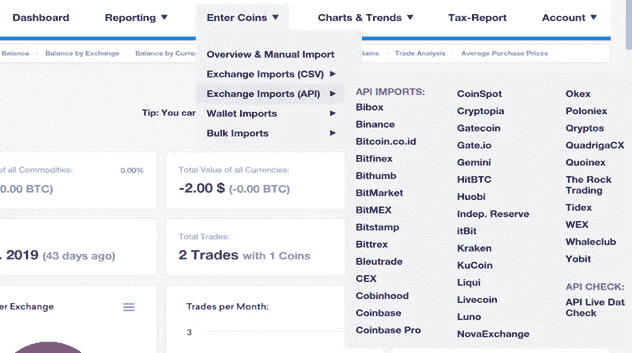
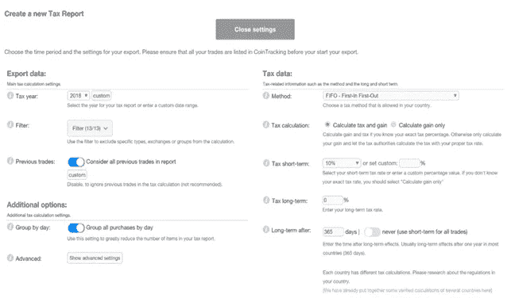
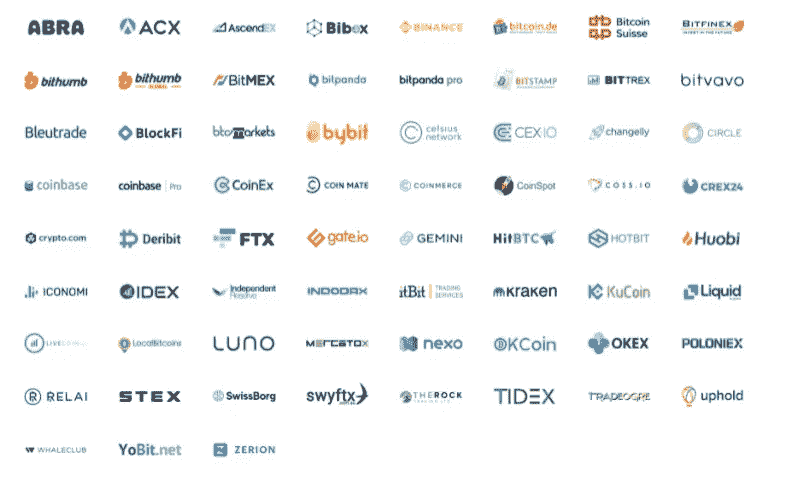
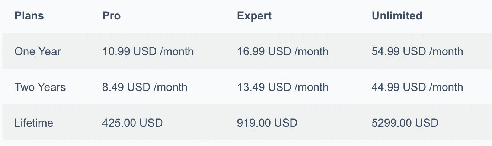
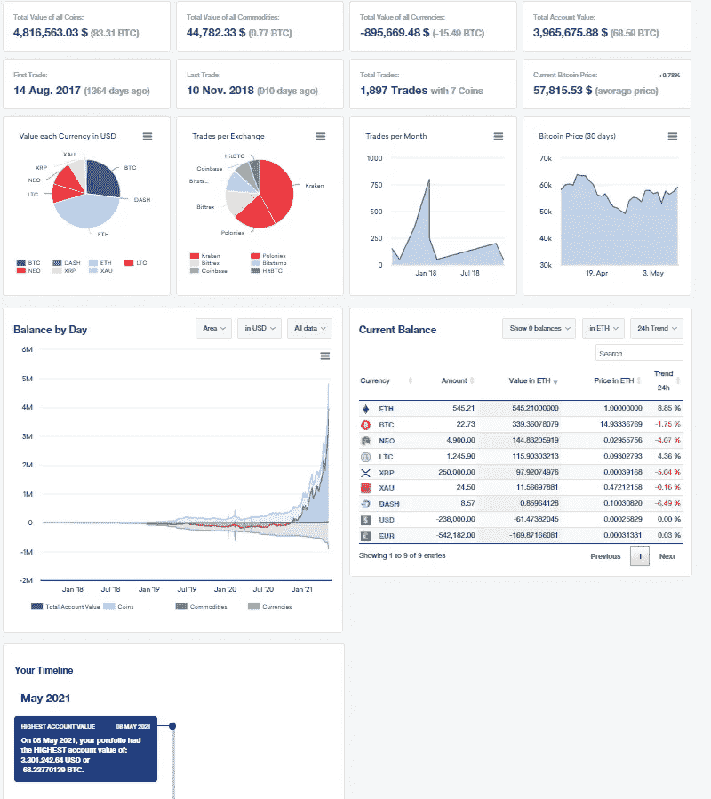
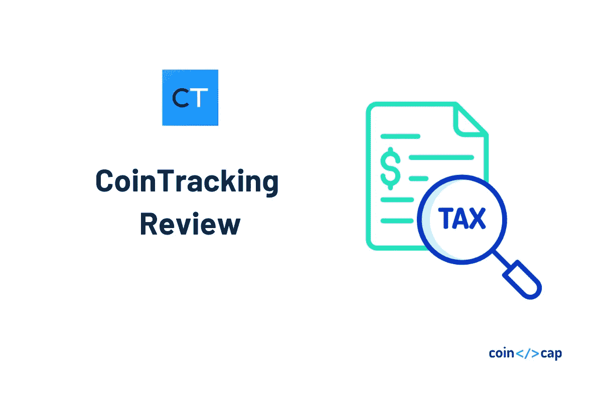

# 硬币追踪审查-加密税务软件

> 原文：<https://medium.com/coinmonks/cointracking-review-a-reliable-cryptocurrency-tax-software-5114e3eb5737?source=collection_archive---------0----------------------->

在本文中，我们将回顾**，它使您能够检查您的交易，并帮助您生成实时税务报告。它计算您的硬币的总价值，实现和未实现的收益，利润和损失，并生成税务报告。**

**他们拥有超过 840，000 的活跃用户群，以及大约 1250 名注册会计师和公司客户。有了 12 年的历史数据，可以获得 10273 枚硬币的硬币走势。所有投资组合的估计总价值为 247 亿美元**

**无论你是刚刚开始投资加密货币，还是已经像专业人士一样交易了很长时间，CoinTracking 都可以帮助你实时跟踪你的所有交易。**

**以前，如果加密交易员希望跟上他们的税收，他们必须使用定制的电子表格来跟踪他们的交易。这是在 2013 年[硬币追踪](https://cointracking.info?ref=T987862)上线之前。**

**他们通过自动化最大限度地减少了文书工作的负担。**

**[税务软件](/coinmonks/best-crypto-tax-tool-for-my-money-72d4b430816b)自动从各自的交易所下载交易者的交易。然后，它会生成易于阅读、简明扼要的税务报告，解释欠税金额。**

**该软件的另一个关键用例是投资组合管理。使用众多[加密交易所](https://blog.coincodecap.com/go/crypto-exchange)的专业交易者依靠[硬币追踪](https://blog.coincodecap.com/go/cointracking)来可视化他们所有账户的资金状态。此外，税务专业人士和基金经理用它来为他们的每个客户建立档案。**

> **使用此 [**链接**](https://cointracking.info?ref=T987862) 在您的 CoinTracking 购买上获得 10%的折扣。**

# **CoinTracking 审查:摘要**

*   **[**CoinTracking**](https://cointracking.info?ref=T987862) 是一款加密货币追踪和报税软件。**
*   **你可以从超过 75 个交易所导入交易作为 CSV 上传或 API 传输。**
*   **CoinTracking 支持 100 多个国家。**
*   **他们提供 25 个可定制的加密报告，以及交易和硬币的交互式图表。**
*   **你也可以在遇到复杂的税务问题时寻求专业帮助，或者只是想在你的税务报告提交给税务局之前让专家检查一下。**
*   **CoinTracking Corporate 为处理多个交易的加密公司提供了一个统一的界面。它消除了在不同加密货币组合之间切换的不便。**
*   **它们提供完整的数据和 API 加密以及双因素身份验证。数据安全地存储在他们的服务器上。**
*   **他们提供四种计划——免费、专业、专家和无限，并接受九种支付方式。**
*   **CoinTracking 应用程序在 [Android](https://play.google.com/store/apps/details?id=info.cointracking.cointracking) 和 [iOS](https://apps.apple.com/us/app/cointracking/id1263133106) 中均可使用，并支持多种语言。**
*   **他们还提供广泛的客户支持。**

# **硬币追踪评论:功能**

## **1.贸易进口**

**[**CoinTracking**](https://cointracking.info?ref=T987862) 允许你从超过 75 个交易所和超过 20 个钱包导入你的数据。它们还为封闭式交易所提供遗留支持。**

**您可以使用两种主要方法将数据从您的[加密货币交易所](/coinmonks/crypto-exchange-dd2f9d6f3769)账户复制到平台，即 CSV 上传和 API 传输。**

**免费计划包括手动 CSV 上传，而所有升级的用户可以通过 API 连接他们的交换。这样，他们的数据每天都会自动更新。**

**CoinTracking 使您能够将每份报告导出为 PDF、CSV、Excel 等格式。您还可以下载 SVG、PNG、PDF 或 JPG 格式的所有图表。他们提供许多税收出口，如 TaxACT、WISO、8949 表格、Drake 和 TurboTax。**

**此外，**、**您可以直接从您的加密货币钱包导入数据，而不是链接一个兑换账户。**

## **2.生成税务报告**

**它为 100 多个国家生成税务报告。还可以获得资本利得、收入挖掘等。除此之外，它还为 CPS 和税务局提供出口服务。**

**一些加密货币交易商可以很容易地使用硬币追踪来完成他们的税务。这是因为即使你不是专业会计师，这个界面也很容易理解。**

**自 2013 年以来，他们通过鼓励初学者免费创建税务报告来支持加密货币社区。如果一个人一整年做了 100 笔或更少的交易，他/她可以创建任意多的税务报告。**

**因为对你能做的报告的数量没有任何特别的限制，它的结论是你能根据需要多次重新计算你的加密税。这可以让你试验我们的软件，并了解它是如何工作的。**

**您可以做各种其他事情，例如尝试几种不同的会计方法，并向您的税务报表添加额外的数据。如果出现任何类型的错误，您可以简单地从备份中恢复数据。**

## **3.个人分析**

**随着你获得加密货币的交易经验，你会发现自己使用了三个或更多的[加密交易所](/coinmonks/crypto-exchange-dd2f9d6f3769)。新发行的硬币通常先出现在较小的交易所，然后再由较大的交易所上市。你使用的交易所数量越多，你就需要做更多的工作来获取正确报税所需的信息。**

****CoinTracking** 简化了所有这一切，并帮助你在一个地方保存你的全部交易数据。有 25 个可定制的加密报告以及交易和硬币的交互式图表。您还可以获得利润/损失和审计报告以及已实现和未实现的收益。**

## **4.硬币图表和趋势**

**[**硬币追踪**](https://cointracking.info?ref=T987862) 包括超过 10，298 枚硬币的图表历史。它总是按交易和交易量提供所有硬币以及顶级硬币的最新价格。你可以获得硬币趋势统计和分析。**

**它们允许您快速识别需要注释的所有事务。您可以使用过滤器来确定您的所有采矿收入存款。例如，一旦过滤掉所有其他事务，您就可以适当地标记剩余的事务。**

## **5.专业帮助**

**无论您何时需要帮助解决复杂的税务问题，或者只是希望在您的税务报告提交给税务局之前让专家检查一下，我们的专业团队都会为您提供所需的帮助。您可以与加密税务顾问分享您的数据，并从全方位服务团队获得税务审查。**

**由于所有与我们合作的会计师都有足够的操作我们软件的经验，他们还可以帮助你从交易所和其他类似的技术任务中导入数据。**

**只需点击几下鼠标，您就可以与订阅了[**coin tracking**](https://blog.coincodecap.com/go/cointracking)Corporate 的税务专业人士共享您的账户。这将为您和您的会计师节省大量的数据传输时间。**

**除了税务专业人士，还有各种其他公司，如基金管理公司，你可以与他们分享你的账户，以便更好地合作。**

**我们的国际加密税务顾问数据库帮助您找到世界各地的税务专家。该列表易于浏览，并链接到超过 75 个不同国家的税法。这些信息免费提供给任何需要的人。如果你只需要查找税法和访问数据库，你不需要注册硬币追踪。**

# **加密公司的硬币追踪**

**为了让参与加密货币的企业和公司的生活更轻松，我们的团队创建了 CoinTracking Corporate。**

**在 CoinTracking Corporate 的帮助下，您可以为您的每个客户设置帐户，并在一个相对易于使用的界面中管理他们的加密税务数据。使用此 CoinTracking 帐户，您的员工也可以创建和配置。**

**[**CoinTracking**](https://cointracking.info?ref=T987862) 是您扩展服务菜单并开始为加密货币交易商服务所需的唯一软件工具。加密货币[注册会计师](https://en.wikipedia.org/wiki/Certified_Public_Accountant)更喜欢硬币跟踪公司，因为它使用起来毫不费力，对许多人来说是负担得起的，并且可以在所有主要的加密货币交易所操作。**

**与注册会计师一样，加密基金经理经常同时与多个加密货币客户打交道。CoinTracking Corporate 提供了一个统一的界面，消除了在不同加密货币组合之间切换的不便。**

**税收特征有助于确定税收对不同类型的交易策略的影响。**

**专门从事加密货币的各种税务公司可以从硬币追踪中受益。您在购买 CoinTracking Corporate 时获得的任何帐户都可以分配给员工个人。这使您的整个税务公司能够安全、快速、有效和高效地共享数据。**

# **如何使用 CoinTracking 征税？**

**以下是使用硬币追踪征税的步骤。**

## **帐户创建**

**一旦您的帐户被创建，您将自动注册免费 CoinTracking。之后，您需要输入用户名、密码和电子邮件地址。[**coin tracking**](https://cointracking.info?ref=T987862)Free 的限额为 200 笔交易。您可以选择根据您的要求升级到专业版、专家版或无限制的其他高级功能，包括更多的 API 导入和事务。**

****

## ****导入您的交易数据****

**导入数据的两种方式是:通过 CSV 文件手动导入或使用 API 同步自动导入。请参考 CoinTracking 网站顶部的下拉菜单了解更多步骤。**

*   ****CSV 文件**。CSV 代表逗号分隔值。大量的加密交换提供了某种类型的 CSV 导出选项。**
*   ****API 同步**。付费用户可以通过设置 API 连接将他们的交易所连接到他们的 CoinTracking 账户。链接后，每天自动同步一次交易数据。根据不同的交换，创建 API 链接的过程会有所不同。**

****

## ****创建您的税务报告****

**导入所有数据后，您可以创建税务报告。选择税务报告，然后单击主菜单中红色的打开设置以创建新的税务报告按钮。这将打开“创建新的税务报告”页面。**

**纳税年度字段使您能够根据需要创建以前纳税年度的纳税报告。过滤功能有助于在您得到意外结果的情况下进行故障排除，因为它允许您过滤掉各种类型的交易。**

**使用高级设置，您可以计算保证金交易并修改转换的分组方式。你也可以选择不同的成本基础会计方法。**

****

# **如何将 CSV 文件导入 CoinTracking？**

**该 CSV 导入旨在导入几笔交易或在您的 PC 上本地手动编辑您的 [**CoinTracking**](https://cointracking.info?ref=T987862) 交易。如果您选择支持您的 CoinTracking 交易，您可以选择使用交易备份功能，因为它要快得多。**

**否则，您需要将导出的文件导入另一个 CoinTracking 帐户，两个帐户必须使用相同的语言。要将 CSV 文件上传至 CoinTracking，您必须完成以下七个步骤**

1.  **从钱包或 exchange 下载 CSV 文件。**
2.  **使用任何电子表格编辑器打开 CSV 文件，例如 Google Sheets。**
3.  **请参考 CoinTracker CSV 格式。**
4.  **删除格式不再需要的列。**
5.  **将剩余的列转换为 CoinTracker CSV 格式。**
6.  **导出重新格式化的 CSV 文件。**
7.  **将重新格式化的 CSV 文件上传到 CoinTracker。**

# **如何删除 CoinTracking 的所有持仓？**

**您可以选择在输入硬币页面删除您的交易。选择一个交易，然后点击删除选项。这样做，你就可以取消这项交易。**

**使用 SHIFT +单击或 CTRL +单击可以一次选择多行，也可以跨多个页面选择多行。在交易表的旁边，有一个从一个交易所一次性删除所有交易的选项。**

**在这里，你也可以删除你在一段时间内的所有交易或删除你的全部交易。**

**您也可以在设置页面的右侧框中删除整个帐户。点击删除该账户，删除包含所有数据和交易的账户。您无法恢复已删除的帐户。**

# **硬币追踪评论:支持的交易所和钱包**

****CoinTracking** 允许你从超过 75 个交易所和 20 多个钱包中复制你的数据。它们还为封闭式交易所提供遗留支持。**

****

**它们支持以下钱包——**

*   **BitcoinCore**
*   **[总账](https://blog.coincodecap.com/go/5491-2)**
*   **[特雷佐](https://blog.coincodecap.com/go/trezor)**
*   **银金矿**
*   **网关集线器**
*   **《出埃及记》**
*   **比特币核心客户端**
*   **Blockchain.info**
*   **菌丝体**

# **硬币追踪评论:安全性**

**[**CoinTracking**](https://cointracking.info?ref=T987862) 的历史可以追溯到 2013 年，当时比特币的交易价格仍为 100 美元。这个软件还没有以任何方式妥协或被黑。可以匿名注册。**

**它们提供完整的数据和 API 加密以及[双因素身份验证。](https://en.wikipedia.org/?title=Two-factor_authentication&redirect=no)您可以创建和恢复交易备份，而无需访问您的交易所。**

**他们为交易所开发了安全的交易导入流程，如 [Gate.io](https://blog.coincodecap.com/go/gate) 和 itBit，它们不提供为用户创建只读 API 密钥的能力。**

**所有用户统计数据都是在不使用个人信息的情况下计算的。数据安全地存储在他们的服务器上。**

# **硬币追踪审查:定价**

**[**CoinTracking**](https://blog.coincodecap.com/go/cointracking) 提供四种计划——免费、专业、专家和无限。四个计划的详细比较如下所示。**

****

> **使用此 [**链接**](https://cointracking.info?ref=T987862) 在您的 CoinTracking 购买上获得 10%的折扣。**

****接受的支付方式****

*   **比特币**
*   **贝宝**
*   **非洲科学教育方案**
*   **[Crypto.com](https://blog.coincodecap.com/crypto-com-review)**
*   **硬币支付**
*   **签证**
*   **万事达信用卡**
*   **美国运通**
*   **GPay**

# **硬币追踪评论:用户体验**

**[**CoinTracking**](https://blog.coincodecap.com/go/cointracking) 应用程序在 [Android](https://play.google.com/store/apps/details?id=info.cointracking.cointracking) 和 [iOS](https://apps.apple.com/us/app/cointracking/id1263133106) 中均可使用，帮助您随时随地管理您的账户。**

**该网站支持四种不同类型的模式——亮、暗、暗和经典。此外，它支持十种不同的语言。**

**您可以根据不同的模板定制您的仪表板。**

****

# **CoinTracking 评论:客户支持**

****在他们的平台上提供实时聊天支持。你也可以在[推特](https://twitter.com/Coin_Tracking)上与他们联系。****

****要开始使用他们的平台，你可以通过他们的 [Youtube](https://www.youtube.com/channel/UCaCaTC7W9JeuFW34T_OC-wQ) 频道。他们网站上的 [FAQ](https://cointracking.freshdesk.com/en/support/solutions) 部分有用户常见问题的答案。您可以在[硬币跟踪支持台](https://cointracking.freshdesk.com/en/support/solutions)创建支持票，并跟踪其状态。****

****此外，他们在四个平台上拥有社区——****

*   ****[Bitcointalk(英语)](https://bitcointalk.org/index.php?topic=220238)****
*   ****[Bitcointalk(德语)](https://bitcointalk.org/index.php?topic=208506)****
*   ****[CoinForum.de(德语)](https://www.coinforum.de/topic/492-cointracking-gewinnverlust-portfolio-und-steuer-reporting)****
*   ****[电报(德语)](https://t.me/cointrackinggerman)****

# ****硬币追踪评论:与其他产品的比较****

****[**之一 CoinTracking**](https://cointracking.info/?ref=T987862) 相对于其他[加密税务软件](https://blog.coincodecap.com/crypto-tax-software)最大的优势就是它的可靠性。其他基于软件的加密税务产品不会定期更新，这就是为什么它们经常产生错误或不能按预期工作。****

****Exchange 兼容性是另一个优势。一些加密货币税收计算器根本不与交易所 API 集成，而那些只支持 10-15 个交易所的计算器。目前，CoinTracking 支持 36 种交换 API。****

****CoinTracking 的新分析功能也是一个不错的奖励。IntoTheBlock 支持的图表让你在评估硬币时寻找 altcoin 骗局的迹象，而 Google sheets 插件让 CoinTracking 用户在 Google Sheets 或 Excel 中创建自己的定制图表。****

****选择用于加密货币跟踪和生成税务报告的软件时，一个关键点是其交换兼容性。****

****一些加密税务计算器没有与 exchange APIs 集成，即使集成了，也不支持更多的交换。目前，CoinTracking 支持的交换 API 数量是 36 个。新的分析功能是一个优势。****

# ****硬币追踪综述:利弊****

## ****赞成的意见****

*   ****CoinTracking 是最可靠的跟踪和生成税务报告的软件之一。****
*   ****交易所不断增加新的功能，修改他们的费用结构，改变他们的 API。关于由[加密交换](https://blog.coincodecap.com/go/crypto-exchange)实现的所有改变，CoinTracking 总是保持当前和最新的。****
*   ****[CoinTracking](https://cointracking.info?ref=T987862) 是唯一一款提供如此卓越的投资组合管理功能的加密税务软件。****
*   ****交易所的兼容性、易用性、交易图表功能、CoinTracking 的性能是无与伦比的。****
*   ****另一个好处是，对于初学加密交易的人来说，CoinTracking 是免费的。****

## ****骗局****

*   ****您需要一个付费帐户才能使用 API 导入功能。这意味着，如果你正在使用一个没有 CSV 导出功能的交易所，比如说 [Bithumb](https://en.bithumb.com/) ，你需要进行升级来完成你的税务。****

# ****硬币追踪涡轮税****

******CoinTracking** 已经与 [TurboTax](https://turbotax.intuit.com/) 集成，让您的报税体验，包括加密货币，无缝衔接。您可以提交无限的交易。也可以详细检查[步骤](https://help.cointracker.io/en/articles/2653799-using-cointracker-to-file-with-turbotax)。****

# ****共追踪审查:结论****

****如果你使用具有强大出口功能的交易所，你将很难找到比 [**CoinTracking**](https://cointracking.info?ref=T987862) 更好的[加密税计算器](/coinmonks/best-crypto-tax-tool-for-my-money-72d4b430816b)。然而，在你注册之前，你应该知道一个事实，不是所有的[加密货币交易所](https://blog.coincodecap.com/go/crypto-exchange)都有良好的数据导出功能。使用新交易所或利基交易所的交易员可能会遇到挫折。例如，一些加密货币交易所不提供 API 服务。其他人不提供任何方法来导出超过 30 天的数据。****

# ****常见问题(FAQ)****

****硬币追踪安全吗？****

****是的，硬币追踪是完全安全的。它于 2013 年上线，自那以来没有受到任何损害或黑客攻击。数据安全地存储在他们的服务器上，并提供完整的数据和 API 加密以及双因素身份验证。您的详细信息不会用于计算用户统计数据。****

****硬币追踪要花多少钱？****

****CoinTracking 提供四种计划——免费、专业、专家和无限。所有四个计划的交易数量、CSV 文件上传大小、个人交易备份数量和自动区块链导入都有所不同。****

****【CoinTracking 有应用程序吗？****

****是的，CoinTracking 同时支持 [Android](https://play.google.com/store/apps/details?id=info.cointracking.cointracking) 和 [iOS](https://apps.apple.com/us/app/cointracking/id1263133106) 来轻松监控你的交易。****

*   ****[最佳比特币会计和加密税务软件](https://coincodecap.com/crypto-tax-bitcoin-accounting-softwares)****
*   ****[会计审查-完整的加密税务解决方案](https://coincodecap.com/accointing-review-a-complete-crypto-tax-solution)****
*   ****[加密货币税——你需要问的 5 个问题【比特币税】](https://coincodecap.com/five-questions-about-cryptocurrency-tax-and-bitcoin-tax)****
*   ****[令牌税务审查:加密税务软件和会计服务](https://coincodecap.com/tokentax-review-bitcoin-tax-software-and-accounting)****

> *****加入 Coinmonks* [*电报频道*](https://t.me/coincodecap)*[*Youtube 频道*](https://www.youtube.com/c/coinmonks/videos) *获取每日* [*加密新闻*](http://coincodecap.com/)*****

# *****另外，阅读*****

*   *****[复制交易](/coinmonks/top-10-crypto-copy-trading-platforms-for-beginners-d0c37c7d698c) | [加密税务软件](/coinmonks/crypto-tax-software-ed4b4810e338)*****
*   *****[网格交易](https://coincodecap.com/grid-trading) | [加密硬件钱包](/coinmonks/the-best-cryptocurrency-hardware-wallets-of-2020-e28b1c124069)*****
*   *****[密码电报信号](http://top%204%20telegram%20channels%20for%20crypto%20traders/) | [密码交易机器人](/coinmonks/crypto-trading-bot-c2ffce8acb2a)*****
*   *****[最佳加密交易所](/coinmonks/crypto-exchange-dd2f9d6f3769) | [印度最佳加密交易所](/coinmonks/bitcoin-exchange-in-india-7f1fe79715c9)*****
*   *****[印度的加密交易所](/coinmonks/bitcoin-exchange-in-india-7f1fe79715c9) | [比特币储蓄账户](/coinmonks/bitcoin-savings-account-e65b13f92451)*****
*   *****[OKEx vs KuCoin](https://coincodecap.com/okex-kucoin) | [摄氏替代品](https://coincodecap.com/celsius-alternatives) | [如何购买 VeChain](https://coincodecap.com/buy-vechain)*****
*   *****[币安期货交易](https://coincodecap.com/binance-futures-trading)|[3 comas vs Mudrex vs eToro](https://coincodecap.com/mudrex-3commas-etoro)*****
*   *****[如何购买 Monero](https://coincodecap.com/buy-monero) | [IDEX 评论](https://coincodecap.com/idex-review) | [BitKan 交易机器人](https://coincodecap.com/bitkan-trading-bot)*****
*   *****[CoinDCX 评论](/coinmonks/coindcx-review-8444db3621a2) | [加密保证金交易交易所](https://coincodecap.com/crypto-margin-trading-exchanges)*****
*   *****[红狗赌场评论](https://coincodecap.com/red-dog-casino-review) | [Swyftx 评论](https://coincodecap.com/swyftx-review) | [CoinGate 评论](https://coincodecap.com/coingate-review)*****
*   *****[面向开发者的最佳加密 API](/coinmonks/best-crypto-apis-for-developers-5efe3a597a9f)*****
*   *****最佳[密码借贷平台](/coinmonks/top-5-crypto-lending-platforms-in-2020-that-you-need-to-know-a1b675cec3fa)*****
*   *****[免费加密信号](/coinmonks/free-crypto-signals-48b25e61a8da) | [加密交易机器人](/coinmonks/crypto-trading-bot-c2ffce8acb2a)*****
*   *****杠杆代币的终极指南*****

**********

*****CoinTracking Review*****