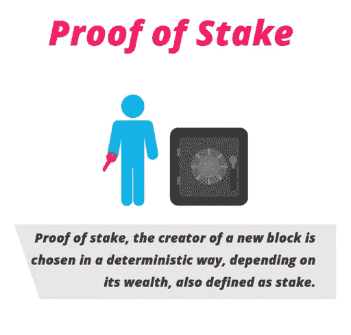
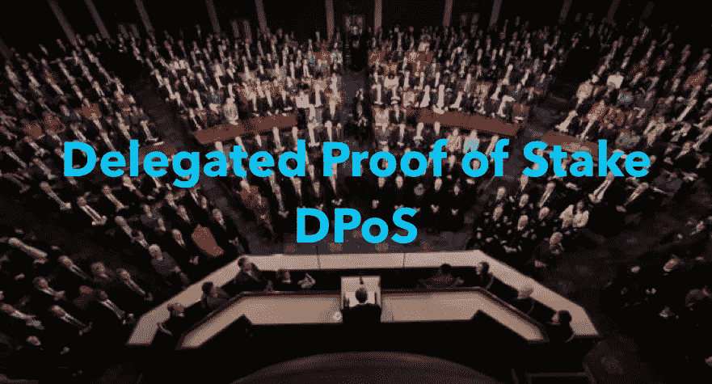

# 合作达成共识:2018 年达成共识

> 原文：<https://medium.com/coinmonks/collaborating-to-agree-consensus-in-2018-9d79334164e6?source=collection_archive---------10----------------------->

# 简介:

2008 年发表的比特币论文为我们提供了一种在互联网上分散转移价值的实用方法。比特币协议具有创新性，因为它试图模拟贪婪人类背后的基本原理，并调整适当的激励措施，以确保在开放的全球分布式网络中抵御不当行为。中本聪试图通过提出一个由三部分组成的解决方案来解决通过互联网(通过一个分散的网络)转移价值的问题:

1.  维护一个全球公共账本，网络中的任何人都可以看到并保留一份副本(T2 区块链)
2.  共识协议定义了在有效区块链上达成全局、分散共识的规则集(使用**工作证明算法**
3.  调整适当的**激励结构**来激励节点维持网络的活性和一致性。

任何一种去中心化货币体系的稳定性在很大程度上取决于共识协议的稳定性。共识不是一个新问题。它已经被研究了几十年，人们已经能够为**封闭**网络开发健壮且实用的协议。中本聪提议的独特之处在于，比特币协议能够在一个开放、分散的网络中达成共识。在这篇文章中，我将调查(并简要地写一些)一些真正酷的共识协议，这些协议有望取代 PoW 算法。因此，在我们讨论这些新协议之前，让我们先简要了解一下 PoW 的一些问题

## PoW 的问题:

1.  大量的计算资源被浪费了。这导致大量的电力被浪费，从而破坏了我们的环境。
2.  比特币的开采变得高度集中。矿工们以矿池的形式组成卡特尔，以减少他们在块报酬上的差异。
3.  该协议的当前设计不是高度可扩展的，这意味着它还没有完全准备好在全球范围内执行交易以满足全球需求。如果这种情况持续下去，更多的人加入网络并进行交易，交易费用将迅速增加，这将使比特币网络上的微支付成为不可能。

请注意，即使比特币网络使用大量的电力，这也是保持网络安全的原因。这是网络为去中心化付出的代价。矿工必须使用“外部资源”，即他们需要付费的资源来保持网络运行，这一事实使他们欺骗网络变得不切实际。如果他们这样做，他们将遭受损失，因为任何恶意活动只会使货币贬值。有鉴于此，我们找到一种更好的方式来发展这一伟大的创新仍然很重要。下一代共识协议需要更节能，并允许区块链更具可扩展性，以便能够满足全球需求。这里有几个可能替代 power 的候选产品。

# Casper-一个实用的 PoS 实现:

Hostage your money

Casper(一种风险证明实现)被视为 PoW 的一种非常实用的替代方案。以太坊现在使用 PoW 作为它的共识算法。然而，该团队希望最终转向 Casper，这是一种更节能、据称更安全的共识算法。在 PoS 中，不存在所谓的**矿工**，因为向区块链添加区块不需要任何计算工作量。相反，有**验证器。**概括地说，这是 Casper 协议的实施方式:

1.  验证者必须锁定至少 1000 个他们拥有的 ETH，作为网络中的股份。
2.  之后，他们将开始验证块。也就是说，当他们发现一个他们认为可以添加到链中的区块时，他们会通过下注来验证它。
3.  如果他们下注的特定区块被添加到区块链，他们将获得与他们的赌注成比例的奖励。
4.  然而，如果一个节点试图以恶意的方式行动，它的股份会被**削减/烧毁**，因此它不能再作为验证者。

验证者因维护有效的区块链而获得奖励，但他们的股份充当人质，如果节点被发现恶意行为，就会被烧掉。Casper 协议的总体设计原则如下:

*   利用恐惧，害怕失去股份，来阻止坏演员。这种系统增加了攻击的成本，从而使网络经济安全。
*   拥有一个不会导致批量生产集中化的系统。我们在比特币案例中看到的是，矿商们以矿池的形式形成了一个卡特尔，以降低他们在大宗报酬上的差异。这只是导致了块状生产的集中化。就卡斯帕而言，把他们的股份集中起来指望更好的回报是没有好处的。
*   尽可能将错误归咎于坏演员的设计。Casper 依赖于削减归因于拜占庭行为(*即不遵守协议的行为*)的能力。

PoS 还将在一定程度上有助于提高区块链的可伸缩性。这无疑更节能，因为不需要花费浪费的计算资源。尽管 PoS 也有自己的问题，但看看以太坊如何实现它还是很有趣的。

# 委托利益证明(dpo):

DPoS 是一种有趣的 PoS 形式。像 EOS、Lisk、Bitshares 等，它被区块链用来实现巨大的可伸缩性。EOS 承诺使用 DPoS 在它的网络上每秒可以处理多达 100 万个事务.只是给你一个比较，比特币以每秒 7 笔交易的速度结算交易，以太坊以每秒 15 笔交易的速度结算交易，而像 Visa 和 PayPal 这样的公司以几千甚至几万的速度结算交易，这仍然比 EOS 所说的可以实现的交易少 100 倍。以下是对其工作原理的高度描述:

1.  网络中的节点投票选举代表来保护网络。
2.  节点的投票根据它们在网络中的利害关系而具有权重。因此，在网络中具有更大利益的节点具有更大的投票权。
3.  被选中的前几名代表通过合作(而不是竞争)来决定要附加到区块链的下一个块

Vitalik Buterin(以太坊的创始人)对这种类型的共识协议确实有所保留，只有时间才能证明 EOS 是否能够完美地将 dpo 实施到他们的网络中。

# 重要性证明:

重要性证明(PoI)是 NEM 网络使用的共识算法。该网络使用自己的加密货币 XEM。NEM 的重要性证明(PoI)共识算法用于确定将在区块链上计算大宗交易的用户。用户的重要性取决于许多因素，包括:用户拥有的硬币数量、用户进行的交易数量以及与谁进行交易。在计算用户的重要性时考虑交易是为了鼓励用户使用 NEM 硬币进行交易，而不是简单地持有它们。用户的重要性越高，用户被选中计算和获取块内费用的可能性就越大。PoI 一致性算法可以与不考虑用户交易量的 PoW 和 PoS 一致性算法形成对比。

# 身份老化:

该一致性算法的核心思想是建立可靠的长期**身份**，并在每轮中选择最早的一个作为挖掘者。它使用两个系统来实现这一点。第一个 SCIFER ( **S** emi - **C** 将 **I** 赋予了**F**air**E**effective**R**es lient consensus)，它利用英特尔的 SGX 认证在部分分散的环境中实现身份引导，而区块链在这种环境中几乎不受许可。第二种机制是 DIFER(分散激励公平有效弹性共识)，它通过一种新颖的挖掘机制创造新的身份，并在完全分散的环境中提供共识，类似于比特币。这是 2018 年 4 月作为研究论文提交的一个相对较新的算法。这是一篇非常详细而且写得很好的论文，它谈到了算法的每一个方面，包括作者所做的一些初始测试结果。我强烈建议读者在这里通读一下[这篇论文，看一看:)](https://arxiv.org/abs/1804.07391)

# 行使证明:

proof of practice 旨在将计算能力导向现实世界的科学问题。PoX [白皮书](http://haslab.uminho.pt/ashoker/files/pid5070841.pdf)描述了一种系统，在该系统中，矿工将被给予由系统中的所谓“雇主”提供的基于矩阵的问题。使用矩阵的理由有两个方面:矩阵是可组合的，允许更容易地调整网络难度，而矩阵是许多科学计算问题的原则抽象。[白皮书](http://haslab.uminho.pt/ashoker/files/pid5070841.pdf)提供了以下问题作为示例:DNA 和 RNA 测序、蛋白质结构分析、数据挖掘、人脸检测等等。

为了避免挖掘者、雇主和验证者之间潜在的串通，矩阵问题的解决方案通过洗牌服务发送。这分两部分完成:直接在雇主发布矩阵数据之后，以及直接在矿工发送数据以进行验证之后。此外，如果多个挖掘者赢得了解决相同问题的投标，则解决方案的硬币奖励将在他们之间共享。

# 结论:

**共识协议**是区块链技术领域最重要的开放研究挑战之一。中本聪的解决方案确实经受住了时间的考验(至少到目前为止)，尽管它有一些低效之处。有人说，比特币是一种罕见的发明，它在实践中很有效，但在理论上却不行。那么我们的理论一定有问题。比特币在实践中如此有效的原因之一是，它没有回答“对手如何攻击一个开放的、去中心化的网络，以及保护它的可能解决方案是什么？”。不。相反，它考虑了一个更重要的问题:**为什么**首先会有一个对手想要攻击系统。比特币依赖于一系列未知的社会经济因素，这些因素无法精确建模，因此无法从理论上为该系统的稳健性提供令人信服的论据。比特币的前提是，贪婪者的理性可以被建模，激励措施可以被调整以确保网络安全，这不仅是比特币的中心主题，也是当今每一种加密货币的中心主题。在一个开放的分散式网络中的“共识”领域，或者甚至一般的区块链技术领域，位于许多研究领域的交叉点，如计算机科学、密码学、博弈论、经济学等。生活在激动人心的时代；)

*我叫米拉杰，是一名来自印度的学生。非常感谢您阅读帖子。我打算写更多的技术材料，并希望听到你们的任何反馈。我也在 Patreon 上，如果你想做贡献，请随时查看我的 Patreon 页面* [***这里***](https://www.patreon.com/mirajshah) ***。***[https://www.patreon.com/mirajshah](https://www.patreon.com/mirajshah)
谢谢。