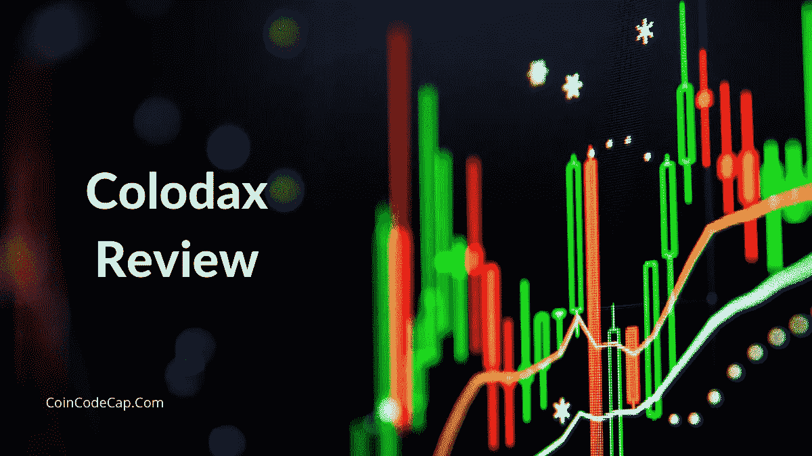
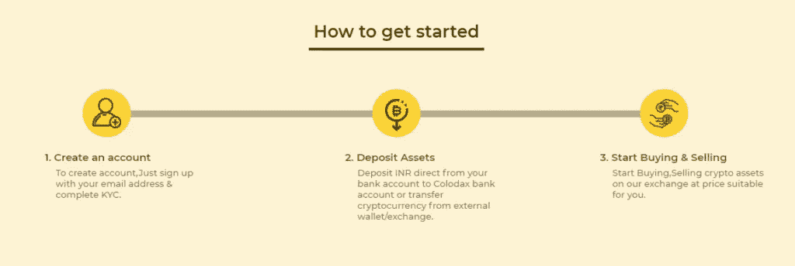
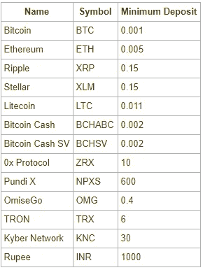
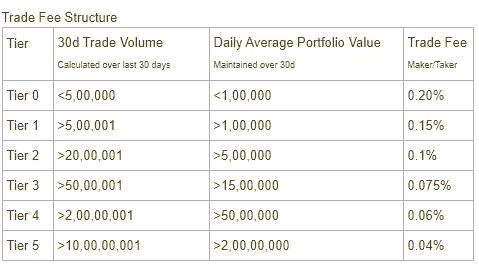
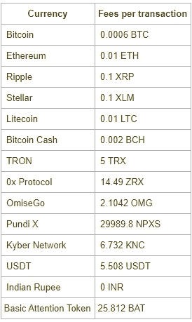
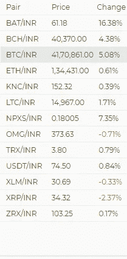
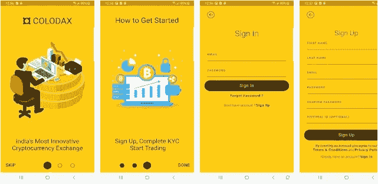
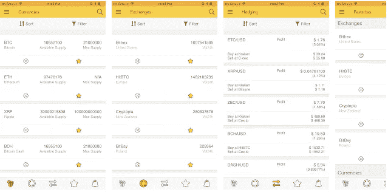

# Colodax 评论 2021 |骗局还是合法？

> 原文：<https://medium.com/coinmonks/colodax-review-1a8805080e52?source=collection_archive---------6----------------------->

在本文中，我们将回顾一下 CrypDates 团队于 2017 年创立的印度交易所[**Colodax**](https://blog.coincodecap.com/go/colodax) 。它是主要的[印度加密交易平台](https://blog.coincodecap.com/bitcoin-exchange-in-india)，提供最快的交易执行以及可靠的数字钱包。该交易所提供快速和直接的印度卢比存款和提款。此外，它还提供了业界领先的安全实践。该交易所旨在通过创新技术改善区块链工业。Nitesh Agarwal 是该公司的首席执行官。

# Colodax 审查:摘要

*   Colodax 是印度首屈一指的加密交易平台，提供最快的交易执行和可靠的数字钱包。
*   该交易所提供快速和直接的印度卢比存款和提款。
*   没有 KYC 的验证，你不能开始在 Colodax 上交易。
*   在 [Colodax](https://blog.coincodecap.com/go/colodax) 上轻松存取印度卢比。
*   限价单在 [Colodax](https://blog.coincodecap.com/go/colodax) 上提供。在这种订单中，你必须设定一个限价。
*   每笔交易都是根据你的等级收费的。
*   Colodax 对存款不收取任何费用，但会对某些硬币收取标准交易费。
*   Colodax 确实收取提现费，这是有竞争力的。
*   印度卢比的存款和取款是免费的。
*   列出的硬币和代币如下:英美烟草、BTC、瑞士联邦理工学院、XRP、LTC、BCH、NPXS、XLM、USDT、ZRX、TRX、OMG 和 KNC。
*   您可以使用 Colodax 的移动应用程序优化您的交易体验。
*   CrypDates 可以轻松地在多个交易所记录你的整个投资组合。它还可以让你比较加密货币的价格。
*   [**Colodax**](https://blog.coincodecap.com/go/colodax) 利用灵活的多阶段钱包策略，确保大部分资金存放在冷库中。
*   通过在 support@colodax.com 给他们发电子邮件或在他们的[支持](https://colodax.freshdesk.com/support/tickets/new)提交一张票来联系 Colodax。

# 如何在 Colodax 上入门？

## 步骤 1:在 Colodax 上创建一个帐户

1.  访问 [Colodax 网站](https://blog.coincodecap.com/go/colodax)。
2.  按下“注册”按钮。
3.  输入您的电子邮件地址并设置一个强密码。
4.  此后，您将收到一封包含验证码的电子邮件。输入此验证码以验证您的电子邮件地址。
5.  您可以利用这些新凭证登录 [**科洛达斯**](https://blog.coincodecap.com/go/colodax) 。

## 第二步:科洛达斯上的 KYC

没有 KYC 的验证，你不能开始交易。您需要提交以下材料:

1.  电话号码
2.  PAN 卡详细信息
3.  阿德哈尔卡详细信息
4.  银行证明
5.  一张写有“科洛达斯·KYC”字样的自拍照

## Colodax:印度卢比存款(使用 IMPS/NEFT/RTGS)

1.  登录后，请访问“存款”页面。在那里，您可以找到 Colodax 银行的详细信息。
2.  在此之后，您必须使用 [**Colodax 的**](https://blog.coincodecap.com/go/colodax) 银行账户详细信息将受益人添加到您的银行账户中。
3.  下一步是从您的银行应用程序或门户网站向 Colodax 的银行账户转账。同时，您还必须在转账时在备注中输入您的手机号码。
4.  转账完成后，您必须记下从银行收到的付款参考 ID 或交易 ID。
5.  IMPS 的参考 ID 以 0 开头，是一个 12 位数字。
6.  NEFT/RTGS 的参考 ID 是一个类似<5 character bankinitials> <11 digits>的 16 位字母数字。
7.  最后，您必须使用付款参考 ID 和金额在 Colodax 上创建存款 INR 请求。您必须输入正确的付款参考 ID 和金额。
8.  这就是一切。在这之后，你应该有印度卢比存款到你的钱包。

# Colodax 的最低存款(加密和 INR)

# Colodax INR 退出

要从 [Colodax](https://blog.coincodecap.com/go/colodax) 中提取 INR，请遵循以下步骤:

1.  首先登录您的 Colodax 帐户
2.  进入“撤回”页面。
3.  之后，选择 INR 选项卡。
4.  填写您打算提取的金额，然后点击“提取”按钮。
5.  你的钱在路上了。

# Colodax 费用

下图显示了 Colodax 费用结构。

## Colodax 交易费

[Colodax](https://blog.coincodecap.com/go/colodax) 按层级收取交易费用。所有用户的默认层是层 0。费用仅适用于已完成的交易。费用的计算方式如下:交易金额*交易价格* <基于第>层的费用百分比。

## Colodax 押金费用

Colodax 不收取任何存款费用。但是，您需要支付标准的区块链交易费。

## Colodax 取款费

[Colodax](https://blog.coincodecap.com/go/colodax) 旨在提供最低的取款费用和最快的交易。尽管如此，每枚硬币都有内置的网络转让费。有时，由于网络拥塞，这些费用会非常高。因此，Colodax 必须收取费用，这样你的交易才不会在[区块链](https://blog.coincodecap.com/what-is-blockchain-a-simple-guide-for-dummies)等待处理。查看下表，了解每笔交易的取款费用。

上述费用会根据网络拥塞情况定期调整。

## Colodax Fiat 存款和取款费

印度卢比的存款和取款是免费的。您必须与您的银行核实，因为它可能会收取发送 IMPS/UPI 的费用。

# Colodax 评论:支持的加密货币

Colodax 只有印度卢比市场。这意味着 Colodax 上列出的每枚硬币都与印度卢比进行交易。列出的硬币和代币如下:英美烟草、BTC、瑞士联邦理工学院、XRP、LTC、BCH、NPXS、XLM、USDT、ZRX、TRX、OMG 和 KNC。

# Colodax 移动应用程序

您可以使用 Colodax 的移动应用程序优化您的交易体验。它提供了大量的交易工具和功能，帮助你在手机上进行交易。您可以点击下面的链接下载该应用程序:

*   [**Colodax 安卓应用**](https://play.google.com/store/apps/details?id=com.colodax.colodax&hl=en_US)
*   [**Colodax iOs 应用**](https://apps.apple.com/us/app/colodax-india-crypto-exchange/id1497362345)

使用 **IFO102589090270** 推荐代码获得费用折扣。

# 加密移动应用程序

不要再错过你的价格，不要因为没有在正确的时间交易而失望。现在，在一个地方得到所有的数据。cryp dates(Colodax 的母公司)可以轻松地在多个交易所记录你的整个投资组合。它还可以让你比较加密货币的价格。

你可以在这里比较 1000+加密货币的价格。CrypDates 让你与 120 多家顶级加密货币交易所建立联系。每 30 秒，实时货币数据就会更新一次。

点击以下链接下载 CrypDates 移动应用程序:

*   [**加密安卓 app**](https://play.google.com/store/apps/details?id=crpt.crypdates.com)
*   [**CrypDates iOS app**](https://apps.apple.com/us/app/crypdates-unified-cryptocurrency-notifier/id1265524356?ls=1)

# Colodax 评论:安全性

[Colodax exchange](https://blog.coincodecap.com/go/colodax) 采用最有效、最可靠的安全技术。Colodax 利用灵活的多阶段钱包策略来确保大部分资金存储在冷库中。此外，它还支持双因素身份认证，并提供大量安全功能。Colodax 打算在每一步保护用户。

# Colodax 评论:客户支持

通过发邮件到 support@colodax.com 与科洛达克斯联系。此外，您还可以在他们的[支持](https://colodax.freshdesk.com/support/tickets/new)提交一张票。

# Colodax 审查:结论

[**Colodax**](https://blog.coincodecap.com/go/colodax) 是一个具有银行般安全性的安全平台。这里的收费相对较低。Colodax 提供流动性和简单的用户界面。新的和中级贸易能够沉迷和享受这个平台的几个方面。

# 常见问题

**Colodax 接受哪些法定货币？**

截至目前，Colodax 仅接受印度卢比。将来它可能会接受其他法定货币。

Colodax 上是否允许未经 KYC 注册的交易？

不，没有 KYC 的验证，你不能在 Colodax 上开始交易。您必须提供相关信息来完成基本的 KYC 验证。

**Colodax 支持哪些加密货币？**

列出的硬币和代币如下:英美烟草、BTC、瑞士联邦理工学院、XRP、LTC、BCH、NPXS、XLM、USDT、ZRX、TRX、OMG 和 KNC。此交易所没有加密对加密市场。Colodax 上列出的每枚硬币都是用印度卢比交易的。

*   [印度购买比特币的 7 款最佳应用【2021 手机版】](https://blog.coincodecap.com/buy-bitcoin-app-india)
*   [如何在印度购买以太坊？【手机和网站 2021】](https://blog.coincodecap.com/buy-ethereum-in-india)
*   [如何在印度购买比特币 2021？【先看这个】](https://blog.coincodecap.com/buy-bitcoin-india)
*   [CoinDCX 评论 2021 |安全吗？【必读】](https://blog.coincodecap.com/coindcx-review)
*   [如何在 WazirX 2021 上购买比特币？【也适用于手机】](https://blog.coincodecap.com/buy-bitcoin-on-wazirx)

*原载于 2021 年 3 月 11 日 https://blog.coincodecap.com**的* [*。*](https://blog.coincodecap.com/colodax-review)