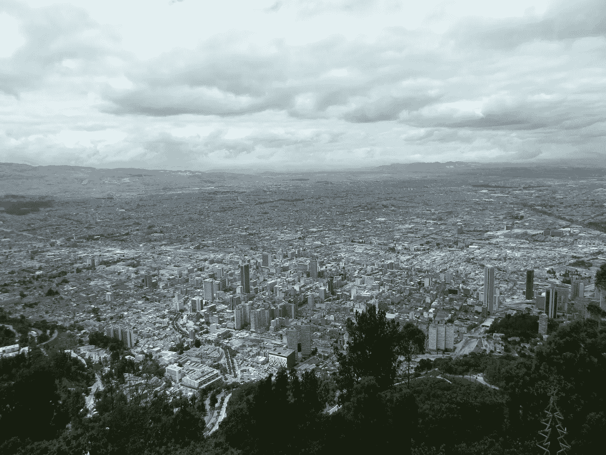
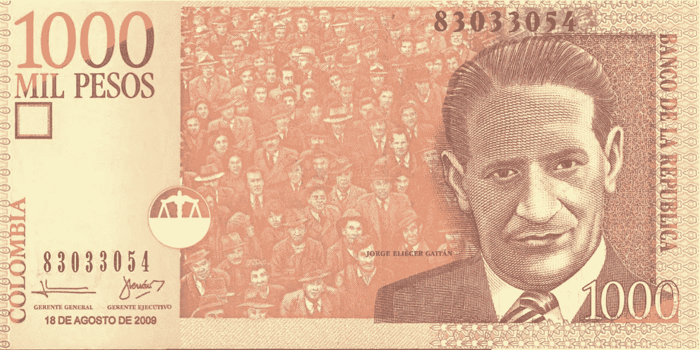
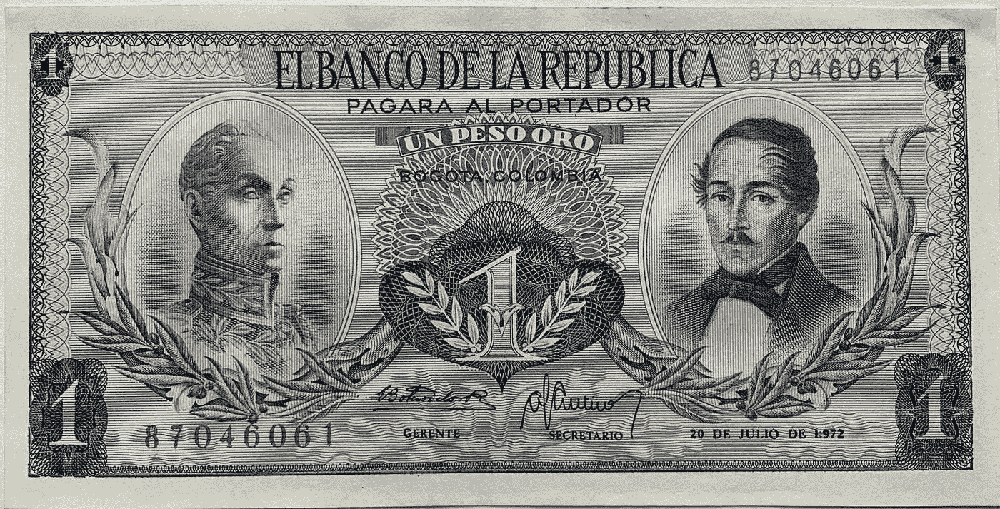

# 哥伦比亚、博尔赫斯和比特币

> 原文：<https://medium.com/coinmonks/colombia-borges-and-bitcoin-9df0ae369105?source=collection_archive---------8----------------------->

## 比特币和当前发现的新世界 2.0

Bogotá, Colombia

想象一下生活在公元 1492 年:印刷机只有几十年的历史，事物在变化，一个“新世界”现在与旧世界相连。以前不存在的机会比比皆是，世界即将经历彻底的转变。

现在想象生活在公元 2021 年。哦，等等，我们有:数字印刷机只有几十年的历史，事情正在发生变化，数字“新世界”正在连接旧世界。对于那些有眼睛可以看到的人来说，以前不存在的机会比比皆是，世界即将经历彻底的转变。

而这就是*精彩的*。让我举例说明。

## 南美和钱的问题

上面这张照片是我住在“新世界”哥伦比亚波哥大时拍的——在那里我(出于需要)学会了用西班牙语数 1000 个数字。

当时(2010 年)，哥伦比亚比索对美元的汇率约为 2，000 比 1，即 1，000 比索兑 0 . 50 比索。今天(2021 年 8 月)，这一比率为 3967/1(并在攀升)，或每 1000 比索钞票约 0 . 25(见下图)。这意味着在 2010 年，一张 1000 比索的钞票可以从任何一家 *panadería.* 买到大约 4 个小面包卷，而现在，同样的价格，你可以买到 2 个。

(From [Colombia Reports](https://colombiareports.com/colombia-peso-plunges-to-record-low-against-us-dollar/))

仅在 35 年前(在这种情况下是 1972 年，见下图)，你可以用最低面值的钞票购买同样的纸卷:1 比索。所以，如果你在 1975 年存了 1000 比索，希望在 2010 年给你的孩子或孙子，现在只能买几卷，而不是一学期的大学学费。跳得不错。

(used with permission by [Centauric](https://www.etsy.com/shop/Centauric))

这些数字对美国(或英国/年轻的欧洲)公民来说很难理解。但是想象一下，一张一美元的钞票绝版了，变得一文不值，可以在 Etsy 上出售(也许就在不远的将来，我们*正在经历美国的“硬币短缺”)。然而，这是世界大部分地区的现实，尤其是在南美洲。曾经充满黄金和机遇的新世界，现在掌握在中央集权的腐败手中，让穷人的选择更少，对美好未来的希望更小。*

但是今天，在互联网时代，我们正在发现一个新世界:一个由分散的区块链技术驱动的新世界 2.0，在这个新世界中，商业不再需要受到物理障碍或边界的束缚；一个新的世界，人们可以在全球范围内交易，不受语言限制或地方法规的约束(至少目前如此)。这就是比特币的新世界 2.0。

## Crypto 和美国

在现代历史的大部分时间里，中央集权控制了货币的供应和流动，也就是哥伦比亚。少数人的集权允许(现在仍然允许)为了他们的短期利益做出重大、有影响力的决定，而从长期来看却损害了大多数人的利益(比如哥伦比亚的货币供应)。现代美国作为新大陆的历史(从北到南)直接源于中央集权的多数人和少数人之间的紧张关系。美国是建立在将总督权力(制衡)从英国王室和任何想要自封为王的人的集中控制中分散开来的理念之上的。在金钱和税收方面尤其如此。至少在理论上，其意图是允许人民选择如何纳税。有人可能会说，美国革命的血腥冲突大多源于高税收和以自由的名义想要保护自己的财富。对摆脱中央税收/金钱控制的渴望超过了生活成本。因为没有自由，就没有生命或生活。

这种从旧世界到新世界的变化在中南美洲也采取了类似的形式。当时的许多伟大思想家，包括塞万提斯，都认为美洲是一个远离西班牙君主集权统治的新发现的机会之地(也许是现代史上最强大的君主之一，西班牙语的统治地位就是证据)。Roberto González Echevarría 写道，“新世界是一种逃避，因为它给了新生事物以尚未编纂的自由”( [57](https://www.amazon.com/Myth-Archive-Narrative-Cambridge-Literature/dp/0521306825/ref=sr_1_1?dchild=1&keywords=myth+and+archive&qid=1627655527&sr=8-1) )。许多人愿意离开西班牙和葡萄牙，去追求甚至是自由的理念，在这个体系中，血统和少数当权者并不能定义一个人在社会中的地位。

现在，在数字时代，随着在线商务的边界不断缩小，我们正在成为新世界 2.0 的全球公民——只有极少数人意识到这一点。在这个比特币 2.0 的新世界里，我们和我们的祖先一样，追求同样的东西:自由。我们想要摆脱少数人的中央集权，摆脱中央银行，摆脱腐败，自由选择我们储存价值的地方，自由生活。哥伦比亚人、委内瑞拉人、萨尔瓦多人等。他们希望从一个让他们的货币贬值、摧毁他们一生积蓄(我们称之为储蓄并不是没有意义的，我们的大部分生命或生活能力都储存在储蓄中)的政府那里获得自由。南美洲的人民正在寻找一种新的生活，一个“尚未编纂”的地方，在那里可以真正地追求幸福。他们总是有；每个人都有。而且，在这种情况下，比特币的新世界 2.0 给了我们这个。

## tln 和真正的新世界

南美人一直在寻求一个更好的世界，一个远离政府腐败的更好的选择。在他的短篇小说《tln，Uqbar，Orbis Tertius》(1941)中，有远见卓识的豪尔赫·路易斯·博尔赫斯以他自己独特的方式写下了南美人对“尚未编纂成文的自由”的渴望。他写了一个虚构的秘密社会，存在于一个被称为 tln 的虚构宇宙(想想互联网)，映射到现实中，超越了世界上的中央集权王国。本质上，这个社会在博爱的秘密中发现了“尚未共同定义”的地方，并以理想为目标，似乎已经在中央集权的治理之外找到了它。博尔赫斯还写了一个类似的分散化社会，称为“Phoneix 教派”(1952)，在这个社会中，成员之间的知识(一种财富储存)存在了数千年，并在一种仪式中通过世代相传延续至今。在某种程度上，这两个故事都显示了南美人对超越政府权力的生活的偏好，以及当他们管理自己时，从人民身上迸发出的美。在某种程度上，博尔赫斯预示了新世界 2.0 的到来:在这个世界里，人们可以根据一套将他们联系在一起的合理原则，自由地为自己行动。

当然，博尔赫斯并不是唯一一个表达南美人渴望变革的人。卡蜜拉·鲁索在她令人愉快的书《无限机器 *中写道。在书中，她讲述了 2001 年阿根廷恶性通货膨胀的故事，当时阿根廷比索一夜之间贬值了 40%。简单来说，这意味着某个晚上你持有 1000 美元，第二天晚上你持有(本质上)600 美元，对此你无能为力。最重要的是贬值，没有人能在银行获得他们的资金，所以，在现实中，你是否有钱并不重要。这一场景中隐含的问题(不仅阿根廷如此，整个南美也是如此)数不胜数，但我们不会深入探讨。*

关键是，现在，在这个新世界 2.0 的时代，有其他经济参与的途径。在缺乏值得信赖的价值储存手段的世界里，有一种更好的生活方式:加密。我说的更好是指明显更好——但那也是另一篇文章的内容。

## 结论

在哥伦比亚期间，我住在卡萨纳雷的约帕尔。在城市的中心坐落着一个街区大小的瓦砾堆，仿佛来自另一个生命；在自然的重压下，有些建筑杂草丛生，被遗弃了。我问那里的一个女人这个地区发生了什么，因为我经常被吸引到这个地方。她转述说，仅在 10 年前，该街区还包括哥伦比亚世界级水上公园的初期阶段。政治家们承诺建造它，并开始了，预言着大量的工作机会，经济刺激和增长。当资金到位时，它立即随着那些带着钱消失并使项目未完成的政客的满是灰尘的足迹而干涸。

虽然我并不幻想 crypto 会直接解决这些问题，但我希望它能间接有所帮助。金钱和所有经济事物的分散化将让小人物在面对政治的道德腐败时获得某种程度的体面，并开始从那些不值得拥有权力的人手中消除权力的过程。

如果你回到标题图片，你只会看到哥伦比亚首都波哥大的一半，这里有将近 720 万人口。他们每个人都应该有机会过上自由的生活。这需要稳健的货币。在撰写本文时，仅在南美洲就有近 4.225 亿人——这些人理应得到同样的待遇。生活在美洲(从北到南)的近 10 亿人中的每一个人都应该过上这样的生活:金钱激励长期建设、长期规划和长期生活:新世界 2.0 中的生活。

如果你喜欢这个，订阅我的子栈(免费):[posttenebras.substack.com](https://posttenebras.substack.com/)